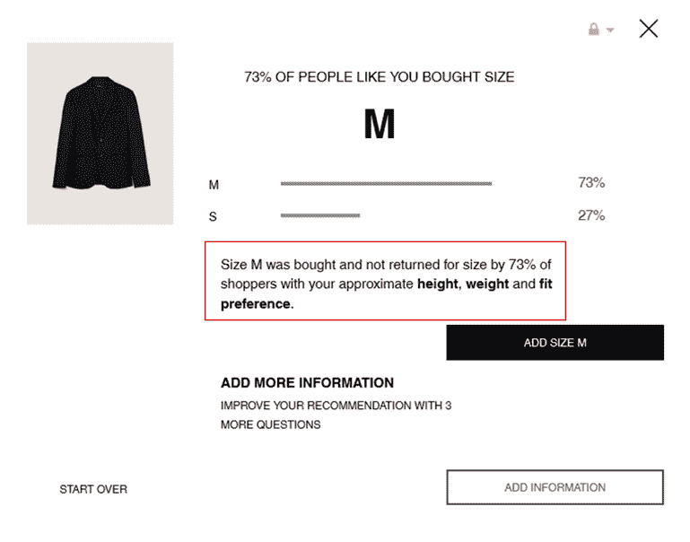

# 零售商可以从物联网和人工智能技术中受益的 6 种方式

> 原文：<https://medium.datadriveninvestor.com/6-ways-retailers-can-benefit-from-iot-ai-technologies-bc2aa297899?source=collection_archive---------10----------------------->

Pic Credit: Artem Bali on Pexels

如今，零售商与电子零售商展开了激烈的竞争。由于客流量不断减少，消费者对技术的意识增强，千禧一代和 Z 世代的独特行为，几乎每个零售商都在寻求帮助。好消息是，今天有技术来应对许多挑战。坏消息是，有人猜测电子商务将彻底摧毁线下零售，后者的业务减少在一定程度上支持了这一事实。

# 独特的情况

线上零售商向线下零售转移，线下零售商向线上零售转移。亚马逊最近在西雅图开设了基于人工智能的无收银员零售店，他们称之为 Amazon Go。据报道，到 2021 年底，他们将开设 3000 家类似的商店。因此，这种独特的情况使许多决策者感到困惑。在我与一些业内资深决策者交流的经历中，我记下了技术如何解决零售商最棘手的问题。

# 1.更好的销售转化

通过了解他们的客户，零售商有很好的机会与他们进行有意义的对话。更好的参与意味着更好的转化。借助物联网和人工智能，零售商有机会获得更深入的客户洞察:他们的人口统计数据、停留时间、购物模式、高峰时间、客流量，所有这些数据都可以在一个仪表盘上提供给数百家商店。基于传感器的数据显示了温度、光线或停留时间与转化的相关性，可帮助零售商在正确的时间做出正确的决策。很快。他们可以优化产品定位、营销活动，并相应地指导销售团队，从而提高销售转化率。

# 2.提高人员效率

零售业的员工流失率可能高达 60%,而且商店里总是有新的销售代表。战略性地在非高峰时段安排新员工，而在高峰时段安排表现最佳的员工可以扭转局面。如今，所有这些数据都可以通过技术获得。优化员工与客户比率的实时轮班管理可以降低工作负荷，最终提高员工绩效。

# 3.改善客户体验

空的计费柜台、长的排队时间、无人照看的顾客、不一致的员工行为等。是困扰商业领袖的众多挑战中的几个。问题不在于没有解决这些问题的方法，而是看不到店内发生了什么。零售商不得不遵循传统方式，依靠神秘购物，要么一个月一次，要么一个季度一次。对于大多数零售商来说，这似乎不足以推动业务目标。由于神秘购物通常是一件昂贵的事情，零售商无法承受更频繁的神秘购物。据了解，技术可能无法检查神秘购物者可以做到的所有参数，但它仍然可以覆盖其中的很大一部分，并且它在本质上是可扩展的。数据的实时可见性会立即为品牌带来改善。

# 4.收益减少

人工智能在重新定义品牌如何使用可用数据方面发挥着重要作用。其中一个跨国品牌在他们的网站上使用人工智能。当顾客下订单时，会询问身高和体重，并询问适合的类型:紧身、完美还是宽松。一旦顾客这样做了，正如你将在下面看到的，它会告诉他们，“像你这样的人有 x%买了 M 码的，并且没有因为尺寸而退货。”虽然它减少了退货，但也让顾客对网上购物更有信心，这对收入有直接影响。这种情报完全来自历史客户数据，从而节省了大量成本。

# 5.存货管理

据麦肯锡(McKinsey)称，全球零售商因库存过剩、缺货和萎缩而遭受超过 1 万亿美元的损失。在零售业中实施物联网系统可以让每个利益相关者随时了解库存短缺或库存过剩的情况。根据麦肯锡的报告，到 2025 年，物联网对全球零售业的影响将从 4100 亿美元到 1 万亿美元不等。

# 6.节能

借助智能物联网设备，品牌可以节省高达 30%的能源支出，同时保持客户体验。避免非高峰时段不必要的能源泄漏，并了解哪些设备需要维护，零售商今天有很好的机会为环境做出贡献，同时大幅降低能源费用。

我在与行业领导者交流时还观察到，他们当然希望提高业务效率和客户体验指标，但不确定他们现在是否想投资技术。他们的部分抵制也是下意识引发的，因为几乎每个公司都承诺提供可操作的分析，但仅仅是提供数据。知道如何处理数据与拥有数据同等重要。

暂且不论，技术是不可避免的。领导人承担风险只是时间问题。我会用我在参加的一个研讨会上看到的一句美丽的话来总结。

> “有的人见了光就改邪归正；其他人当他们感到热的时候”