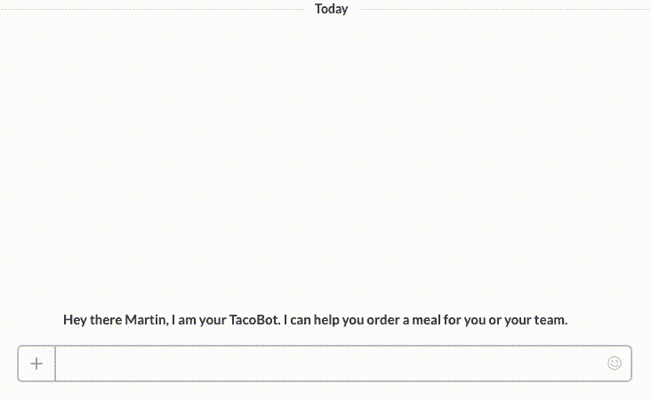
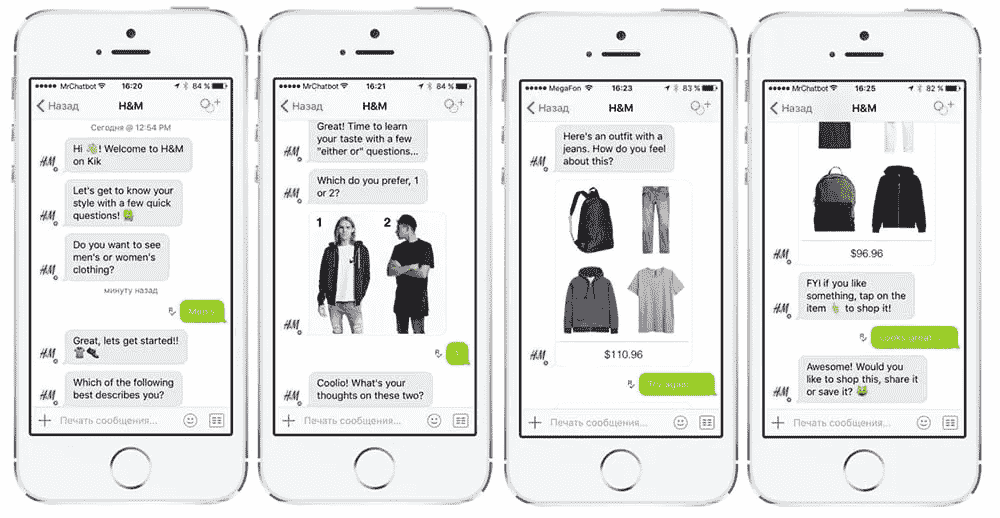
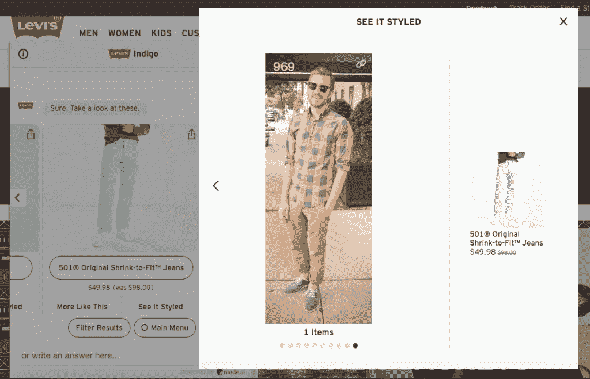

# 使用聊天机器人提高电子商务销售额的 6 种方法

> 原文：<https://medium.datadriveninvestor.com/6-ways-to-boost-your-e-commerce-sales-with-a-chatbot-c1d2ad544cd2?source=collection_archive---------10----------------------->

我的电子商务网站需要集成 [**AI 和机器学习**](https://www.signitysolutions.com/ai-machine-learning) **聊天机器人**吗？我的企业会从中受益吗？这些是我们从客户那里得到的问题。我们的答案一直是，“是的。”不是因为我们在这个行业。但是，因为我们相信人工智能机器人技术。

增加电子商务销售并不容易，在这种类型的市场竞争中，大约有 110，000 个电子商务网站，其中甚至不到 50%在互联网上产生有意义规模的收入。因此，为了让你自己从走下坡路的人群中脱颖而出，你必须在你的产品和服务方面出类拔萃。

 [## 2019 年值得关注的 20 种数字营销趋势和技术|数据驱动的投资者

### Faisal 在加拿大工作，拥有金融/经济和计算机方面的背景。他一直积极从事外汇交易…

www.datadriveninvestor.com](https://www.datadriveninvestor.com/2019/02/04/20-digital-marketing-trends-techniques-to-watch-out-for-in-2019/) 

电子商务市场目前正在冲击最新的技术——聊天机器人。你想知道为什么吗？

因为聊天机器人正在为购物者提供轻松的购物体验，电子商务网站可以有效地利用这项技术提供比以往任何时候都更令人满意的购物体验。

在你的电子商务解决方案中使用聊天机器人有多种方式——在此列出 6 种最聪明有效的方式。

# 1.让订购变得简单

每三个智能手机用户中就有一个使用消息应用。但聊天时切换应用程序来下单并不总是很方便。但是现在这个问题已经解决了。

Taco Bell 在 2016 年推出了名为 Tacobot 的 Slack 集成聊天机器人，客户可以在工作时使用该应用程序点餐。

[*来源*](https://lookwhatwedid.co/tacobot/images/tacobot.gif)

该机器人允许客户在不离开他们最喜欢的应用程序的情况下购买。这为他们节省了时间。与此同时，商店也变得越来越容易进入。

# 2.产品推荐

向客户推荐产品会影响整体客户体验。用大量的产品推荐轰炸你的客户会让你的网站令人不快。

H&M 的 Kik bot 提供服务来避免这个问题。Kik 根据顾客之前的购买量来组合服装。Kik 不像一个咄咄逼人的推销员，而是像一个个人时尚顾问。它为客户提供个性化的体验，同时向他们介绍更新的产品。

*资料来源:H & M*

# 3.获取、交付和发送消息

网上商店的顾客在购买前和购买后都有许多关于产品交付和运输的问题。销售前出现的问题包括交货时间、包装质量、运输费用和日程安排等。找不到这些问题的答案可能会阻止潜在买家在网站上花钱。

*同样，购买了产品的客户会寻找货物的跟踪信息，并要求定期更新货物的位置和预计交付日期。*

聊天机器人允许网上商店向他们的潜在客户和现有客户提供关于送货和运输的信息和更新。关于运输的常见问题可以很容易地输入到脚本中，并且可以为需要信息的客户提供即时答案。

# 4.追加销售和交叉销售

当用户在电子商店网站上搜索特定类别的产品时，机器人可以通过增强的特性和功能进行追加销售。

*机器人还可以交叉销售产品，影响顾客购买高价商品。*这些建议可以根据规格从预设的产品匹配中提取出来。

来源:李维斯

# 5.防止购物车被丢弃

每个电子商务企业都要处理大量的购物车废弃。这是客户选择产品并将其添加到购物车中，但不购买产品的地方。有多种因素会影响这些客户付款——页面加载缓慢、没有发货或交付信息、较高的交付费用或对产品购买的困惑。

考虑一下这个场景，假设你的网站每月有 50，000 访问者，平均交易成本是 35 美元。你的转化率是 1%或者 500 个客户。如果你把转换率提高 0.25%，你的生意每月可以赚到 5000 美元。这些数字可以通过简单地在你的网站上集成一个聊天机器人来实现。

*已经看到，聊天机器人发送的提醒消息回收 13%到 20%，产生 4 倍到 10 倍以上的收入*。总的来说，聊天机器人可以

*   获得比电子邮件更高的打开率。
*   更多人可能会在不离开 Messenger 的情况下点击。
*   给客户一个个性化的与你的品牌沟通的渠道。另外，也许你能找到他们放弃手推车的原因，然后修好它。
*   不会出现在垃圾邮件或推广文件夹中。
*   聊天机器人的消息直接发送到收件箱，并且总是被客户看到。

通过让聊天机器人快速回答客户最常问的问题，节省您的业务时间，并使网上购物更容易。

# 6.聊天机器人提供产品指南

聊天机器人可以成为优秀的产品向导。最棒的是，他们可以在短时间内从几种产品中学习，并且永远不会对他们的工作感到厌倦。

当顾客想了解他们想购买的产品的详细信息时，他们通常不知道应该去哪里找。当他们需要帮助时，他们给你机会和他们交谈。这有助于推动更多的销售。

超过 83%的在线购物者在完成订单时需要帮助。超过 70%的人希望在一分钟内得到帮助。如果客户没有得到所需的帮助，他们就会转向你的竞争对手。

通过提供聊天机器人帮助指南，即使它是解释产品的好处或描述它，或回答任何问题，您可以立即向客户提供他们需要的洞察力。这必将推动更大的销售额、客户忠诚度和满意度。

# 结论

人们更喜欢与聊天机器人互动，而不是浏览电子商务网站。网上购物者现在希望他们喜欢购物的网站上有聊天机器人。在您的网站上集成聊天机器人，为您的客户提供熟悉的购物体验，让他们可以查找产品信息、进行产品比较和阅读商店政策，而无需花费数小时进行研究或等待支持代表找到他们需要的东西，这可以显著提高您的销售额。它不仅会推动更多的销售，而且还会增加客户忠诚度和体验，而无需任何巨额投资。

原刊[此处](https://datafloq.com/read/6-smart-ways-boost-e-commerce-sales-chatbot/6430)