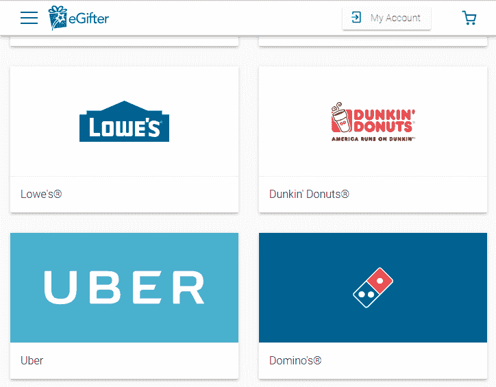

# 用加密货币连接业务的 6 种方式

> 原文：<https://medium.datadriveninvestor.com/6-ways-to-connect-business-with-cryptocurrency-e1dba55dde50?source=collection_archive---------8----------------------->

*满足您的业务需求…*

*信任地与你的客户交流。因为区块链正在解决信仰问题*

Photo credit: <a href=”https://www.flickr.com/photos/30478819@N08/25981444797/">wuestenigel</a> on <a href=”https://visualhunt.com/photos/business/">Visual hunt</a> / <a href=”http://creativecommons.org/licenses/by/2.0/"> CC BY</a>

如今，区块链技术和加密货币已经变得更加接近传统商业。在某些情况下，商人们能够找到一种有价值的将传统商业与新技术相结合的方式。事实上，进入加密货币市场有许多选择，本文将讨论主要的 6 种合作类型。

创建加密货币平台是为了改善和促进业务的引入，创建加密货币的计划之一是为了绕过国家机构，促进用货币进行交易。但如今，国家已经改变了对加密货币的态度，并在从事加密货币的商人关系中提供了一种柔软舒适的政策，这变得对投资者更感兴趣。

商业与加密货币的合作肯定取决于商业模式。在您的企业中实现加密货币的最简单方法是使用加密货币接收付款。

以下是在您的企业中使用加密货币并成为全球系统一部分的最著名方式:

1.  *接受付款。*
2.  *营销和公关*
3.  *签订合同。*
4.  *慈善。*
5.  *卖票。*
6.  *贷款和小额信贷。*

**接受付款。**

现在，我们将依次更详细地介绍其中的每一项，以及您在实施此服务时可能遇到的利弊。当然，现实生活中的例子，谁已经使用了区块链技术，加密货币，同时赚得很好，以及那些使用加密货币绝对不成功的人。

今天，世界上有超过 1500 种不同的硬币。他们的数量每天都在增加。这样做的原因和我们的第一个原因一样，使用加密货币作为支付手段。

每枚新硬币都是为解决任何问题而设计的，比如速度、比例和其他参数。所以市面上有很多硬币可以作为支付。

目前，传统企业可能会面临与银行在财务问题上合作有限的问题，如费用、制裁、税收和其他问题。这将企业置于风险之中，并减少了与潜在客户的接触。

作为回应，可以使用加密货币作为这些问题的解决方案。市场上有大量的硬币，可以用来支付或创造自己的。

例如，交付领域的一个这样的企业是伏特技术公司，它创造了它的 ACDC altcoin。
Volt Technology 为所有类型的货物提供全天当天送达服务。该公司是利用最新的技术创新创建的，包括区块链和加密货币。今天，Volt Technology 已经成功地将其硬币引入业务，并成功地向他们销售其服务。在这种情况下，公司在许多方面都赢了，而且是以低成本、低税收和增加顾客数量的价格赢的。这家公司是他们推行硬币的成功范例。但是当公司使用现存的硬币时，有成功的例子。

例如，LTC (Litecoin)的创建者最初为交易创建了更易访问和更快的 LTC。例如，eGifter 公司允许 LTC 在许多商店购买礼券，并使硬币对企业家具有吸引力。
例如，使用从 eGifter 购买的证书，可以在提供服务的顶级制造商或公司上消费(见图)。

**营销和公关。**

另一个可以在业务中使用加密货币的例子是营销公司和公共关系。新一代对新技术非常感兴趣，对他们来说，像区块链和加密货币这样的词在电影世界里并不稀奇。他们处理这些问题，因此看到了一个有用的视角。例如，据《福布斯》报道，如今，三分之一的员工是自由职业者。猜猜他们的服务是以什么方式支付的？正确的加密货币。

大多数年轻人从事市场营销、广告和公共关系。年轻人非常清楚这个或那个工具是如何工作的，所以他们可以比其他人更快地推广来自地穴和区块链的产品。

用加密货币连接按需市场创造了分散的劳动力，这无法通过为世界各地甚至处于危机中的国家的人民创造就业机会来阻止。

**签订合同。**

如果你想吸引新客户，我们建议你使用加密货币。为什么？因为你会给钱的安全和完全透明的充分保证。

如今，年轻人希望处理合法和透明的业务。建立对资金所有权的信任也是区块链技术的一大部分。因此，它们经常与加密货币交织在一起。

**慈善。**

通常，当你想向慈善机构或非政府组织捐款时，首先，你想确定所有程序背后的透明度。最大的争论是模糊的信任。

这些组织筹集的大量资金用于支持行动和行动。现在，我并不打算排除慈善组织，但如果有一种方法可以安全和有保证地从一方捐赠给一个团体，而不需要中介，会怎么样呢？另一方面，慈善组织可以肯定地知道他们的资金是合法的。

**卖票。**

骗子可以在大厅门外向绝望的歌迷出售演唱会门票，赚很多钱。

看看在哪里可以使用加密货币足不出户地买到票:电影院、体育和音乐活动、剧院、博物馆、卡巴莱、喜剧俱乐部等。

如果一个音乐会场地可以通过一个非常特殊的钥匙链钥匙出售当地分配的门票——并且提供一种确认钥匙购物的方法——它可以摧毁骗子的天堂，享受愤怒的游客。

它还会给出这一领域更清晰的画面，今天没有准确的统计数据，世界上售出了多少张门票，花了多少钱，如果有一个包含大数据的数据库，你可以使用这些数据来改善客户服务。

**贷款和小额信贷。**

最后但并非最不重要的选择是贷款。所有的信息，包括金额，关于接收者的完整信息，以及特定贷款的确切归还日期，都可以保存在区块链，永远不会被删除或编辑。

双方都会非常清楚当前的形势，他们不需要忽视最初的协议。

有许多不同的项目，如 SALT、ETHLend、Ripio 信贷网络和 Celsius。但是，不幸的是，今天还没有这种服务的成功例子，因为有很多人想获得贷款，而公司在考虑是否提供贷款以及通过什么样的测试才能提供贷款时陷入困境。但在未来，这种想法似乎是真实的，有利可图的。

综上所述，你可以得出一些结论，合法交易是加密货币和你的产品或服务的交换点——你知道，就像真钱一样。

一些加密爱好者甚至说，在你最喜欢的地区咖啡店使用加密货币，无论是给另一个国家的亲戚汇款，还是给另一个国家的亲爱的人买礼物，都将成为常见的事情，使用加密货币将像装配货币一样简单和容易。世界上这个金融领域将如何发展，我们只能拭目以待。