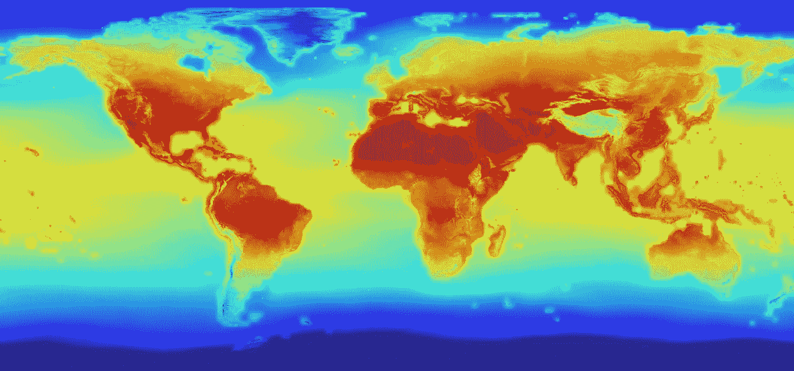

# 60 个真实的美国紧急事件

> 原文：<https://medium.datadriveninvestor.com/60-real-american-emergencies-5df4316e659?source=collection_archive---------3----------------------->

尽管特朗普总统宣布全国进入紧急状态，以帮助建立他的虚荣项目边境墙，但美国仍有几个正在发生的真实的国家紧急状态。

今天早些时候，特朗普总统宣布全国进入紧急状态。自 1979 年以来，美国只宣布了 58 次国家紧急状态。1979 年，卡特总统颁布了第 12170 号 [**行政命令**](https://www.archives.gov/federal-register/codification/executive-order/12170.html)****导致禁止伊朗政府财产进入美国。这场国家紧急事件紧随真正的国家紧急事件之后，即伊朗人质危机。根据[布伦南中心](https://www.brennancenter.org/sites/default/files/analysis/NEA%20Declarations.pdf)的说法，卡特的行政命令只是至今仍然有效的 31 个国家紧急状态之一。****

****根据[布伦南中心](https://www.brennancenter.org/sites/default/files/analysis/NEA%20Declarations.pdf)，唐纳德·特朗普已经根据[国家紧急状态法案](http://uscode.house.gov/view.xhtml?path=/prelim@title50/chapter34&edition=prelim)宣布了三项国家紧急状态。****

****特朗普第一次宣布国家紧急状态是在 2017 年 12 月，当时他制裁了 13 名侵犯人权和腐败的人。该行政命令主要针对被指控下令大规模屠杀的将军和国家元首。这包括对缅甸罗辛亚穆斯林少数民族的种族清洗。****

****特朗普的第二个订单是在 2018 年 9 月。这项[行政命令的重点是](https://www.federalregister.gov/documents/2018/09/14/2018-20203/imposing-certain-sanctions-in-the-event-of-foreign-interference-in-a-united-states-election)制裁那些参与黑客攻击选举和社交媒体活动的人，这些活动的[目的是影响选举](https://www.politico.com/story/2018/09/12/trump-sanctions-election-interference-782457)。****

****唐纳德·川普的[第三次国家紧急状态](https://www.federalregister.gov/documents/2018/11/29/2018-26156/blocking-property-of-certain-persons-contributing-to-the-situation-in-nicaragua)于 2018 年 11 月到来。尼加拉瓜总统丹尼尔·奥尔特加及其政权宣布进入全国紧急状态。宣布这一紧急状态是因为“对平民使用不分青红皂白的暴力和镇压手段”****

****随着特朗普今天宣布全国进入紧急状态，修建南部边境墙，民主党人现在[发誓要挑战这一声明，理由是它不符合宪法](https://www.reuters.com/article/us-usa-shutdown-emergency/trump-declares-u-s-mexico-border-emergency-democrats-object-idUSKCN1Q420N)。****

****暂时忘记法律依据。人们不得不质疑特朗普决定实施这一紧急状态的时间和地点。大约一年前，参议院拒绝为特朗普的隔离墙提供 250 亿美元的边境资金。在特朗普总统任期的头两年，共和党控制了众议院、参议院和白宫。然而，从未有过修建隔离墙的协议。正如彭博作家乔纳森·伯恩斯坦在去年 12 月所说，“事实证明，修建隔离墙背后的政治对总统来说太难了。”****

****修建南部边境墙是特朗普的重大竞选承诺之一。然而，事实证明这对他来说是糟糕的政治。特朗普的支持率[下降了近 3 个点](https://projects.fivethirtyeight.com/trump-approval-ratings/)，从 12 月 21 日的 42.2%降至 1 月 26 日的 39.3%，即关闭开始前一天和关闭结束后一天。特朗普的支持率下降与关于修建隔离墙的民意调查一致。根据哈佛大学 CAPS/Harris 民意调查，[56%的美国人不支持川普修建边境墙](https://thehill.com/homenews/administration/423099-poll-majorities-oppose-trumps-wall-funding-demand-call-for-compromise)。****

****历史上最长的部分政府关闭对特朗普来说是个问题。这可能是他选择发布国家紧急状态，而不是再次关闭政府的原因。只有[36%的美国人](https://www.huffingtonpost.com/entry/government-shutdown-poll-trump-congress_us_5c23cb85e4b05c88b6fd267e)赞同川普总统处理政府关闭的方式。虽然 80%的共和党人赞同特朗普对政府关闭的处理，但 90%的民主党人和 57%的无党派人士不赞同他对政府关闭的处理。****

****了解实际情况的人明白，南部边境墙是一座多么不紧急的建筑。美国无证移民[在 2018 年](http://www.pewhispanic.org/2018/11/27/u-s-unauthorized-immigrant-total-dips-to-lowest-level-in-a-decade/)达到 12 年低点。2017 年，[因非法越境被捕人数创下 46 年新低](https://www.npr.org/2017/12/05/568546381/arrests-for-illegal-border-crossings-hit-46-year-low)。除此之外，移民研究中心发现，在美国非法居留的人中，将近一半是签证过期的结果。最近，在 2008 年至 2015 年间，65%的非法移民是那些签证过期的人。****

# ****真正的国家紧急情况****

********

****在唐纳德·特朗普(Donald Trump)宣布隔离墙进入紧急状态之际，美国正面临众多真正的紧急情况。主流媒体对这些突发事件的关注相对较少。因此，两党的普通美国人都不知道这个国家真正的紧急状态。****

****下面，我列出了 60 个可能构成真正紧急状态的问题。****

# ****经济学****

********

*   ****4000 万美国人，或者说 12.3%的美国人，目前生活在贫困线以下。****
*   ****在过去的 40 年里，美国工人的平均工资几乎没有增长。虽然大多数美国人的薪水比 40 年前高，但是他们的购买力并没有增加。****
*   ****据麦肯锡称，到 2030 年，三分之一的美国工人[将因自动化而失业。](https://www.mckinsey.com/featured-insights/future-of-work/jobs-lost-jobs-gained-what-the-future-of-work-will-mean-for-jobs-skills-and-wages)****
*   ****只有 39%的美国人负担得起 1000 美元的紧急费用。****
*   ****80%的美国人靠薪水过活。****
*   ****美国[的劳动参与率为 62.7%](https://tradingeconomics.com/united-states/labor-force-participation-rate) 。美国的劳动参与率更接近于像[萨尔瓦多(61.9%)](https://tradingeconomics.com/el-salvador/labor-force-participation-rate) 和[哥伦比亚(62.4%)](https://tradingeconomics.com/colombia/labor-force-participation-rate) 这样的国家，然后是像[英国(79.3%)](https://tradingeconomics.com/united-kingdom/labor-force-participation-rate) ，[法国(72.4%)](https://tradingeconomics.com/france/labor-force-participation-rate) ，[荷兰(69.7%)](https://tradingeconomics.com/netherlands/labor-force-participation-rate) ，[瑞士(67.8%)](https://tradingeconomics.com/switzerland/labor-force-participation-rate) 。****
*   ****在过去的十年中，94%的净就业增长都是临时的、零工、承包商的工作，没有真正的前进道路。****
*   ****在过去的 40 年里，美国的企业家精神一直在衰退。****
*   ****40%的美国人难以支付房租或食物等基本需求。****
*   ****最富有的 0.1%的美国家庭拥有的财富和最底层的 90%的 T21 家庭拥有的财富一样多。****

# ****美国健康****

********

*   ****2017 年有 70237 名美国人[死于药物过量](https://www.cdc.gov/nchs/products/databriefs/db329.htm)。****
*   ****[处方阿片类药物导致](https://www.cdc.gov/drugoverdose/data/prescribing.html?CDC_AA_refVal=https%3A%2F%2Fwww.cdc.gov%2Fdrugoverdose%2Fdata%2Foverdose.html)40%的美国阿片类药物过量死亡。****
*   ****死于意外阿片类药物过量的几率[大于死于车祸的几率](https://www.cnn.com/2019/01/14/health/opioid-deaths-united-states-surpass-road-accidents/index.html)。****
*   ****估计有 553742 名美国人[无家可归](https://endhomelessness.org/homelessness-in-america/homelessness-statistics/state-of-homelessness-report/)。****
*   ****今天将有 96 名美国人[死于枪支暴力](https://everytownresearch.org/gun-violence-america/)。****
*   ****每 12 个美国成年人中就有 1 人[报告患有抑郁症](https://www.aafp.org/news/health-of-the-public/20180219nchsdepression.html)****
*   ****129 名美国人今天将结束自己的生命****
*   ****美国的自杀率正在上升。****
*   ****美国的预期寿命正在下降。****
*   ****9300 万美国成年人肥胖。****

# ****美国医疗保健****

********

*   ****每年有 45000 名美国人因没有健康保险而死亡。****
*   ****至少有 2900 万美国人没有医疗保障。****
*   ****在川普总统治下，700 万美国人失去了医疗保险。****
*   ****美国在医疗保健上的花费是其他高度发达国家的两倍，然而其医疗保健系统却比其他发达国家更差。****
*   ****美国医疗保健系统[在 11 个高度发达国家中排名第 11 位](https://www.internationalinsurance.com/news/ranking-top-eleven-healthcare-systems-country.php),排名依据是护理有效性、护理安全性、护理协调性、以患者为中心的护理、成本相关问题、护理及时性、效率、公平性和公民健康状况。****
*   ****[美国在药物上的花费是其他高度发达国家的三倍。](https://www.scientificamerican.com/article/how-the-u-s-pays-3-times-more-for-drugs/)****

# ****外交政策****

********

*   ****美国违反宪法[帮助也门进行种族灭绝。](https://www.amnesty.org/en/latest/news/2015/09/yemen-the-forgotten-war/)****
*   ****在国际社会中，美国被视为世界和平的最大威胁。****
*   ****美国已经在阿富汗打了将近 18 年的战争。****
*   ****到 2018 年底，后 9/11 战争预计将花费美国纳税人近 5.6 万亿美元。****
*   ****美国在 7 个国家处于战争状态:阿富汗、伊拉克、叙利亚、也门、索马里、利比亚和尼日尔。****
*   ****美国向世界上 73%的独裁政权提供军事援助。****

# ****教育****

********

*   ****44%的大学毕业生未充分就业。****
*   ****4400 万美国人欠下总计 1.5 万亿美元的学生贷款。****
*   ****的平均学生贷款余额约为 34000 美元。****
*   ****预计到 2023 年，将近 40%的学生贷款借款人会拖欠贷款。****
*   ****[从 1980 年到 2014 年，平均每年的大学学费上涨了 260%，而同期其他消费项目的成本上涨了 120%。](https://www.businessinsider.com/this-chart-shows-how-quickly-college-tuition-has-skyrocketed-since-1980-2015-7)****
*   ****大学学费的增长跟不上毕业生收入的增长。近 1/2 的毕业生[最终未充分就业](https://studentloanhero.com/featured/college-grads-underemployed/)。****
*   ****大学毕业生为之准备的许多入门级工作将被自动化取代。****
*   ****从 2008 年到 2014 年，31 个州的学生人均资助减少了。****
*   ****53%的美国学校需要改进[才能提升到“良好”状态](https://www.infrastructurereportcard.org/wp-content/uploads/2017/01/Schools-Final.pdf)。****

# ****基础设施****

********

*   ****美国基础设施获得了美国土木工程师协会的 D+评级。****
*   ****由于管道泄漏，每天有 60 亿加仑的饮用水流失。****
*   ****在美国，每天有 1.88 亿人次通过有结构缺陷的桥梁。****
*   ****15498 座美国大坝被确定为高潜在危险。****
*   ****美国电网已经满负荷运转，资金缺口高达 1770 亿美元。****
*   ****交通拥堵浪费了美国人 69 亿小时的出行时间，耗费了近 31 亿加仑的燃料。****
*   ****6300 万美国人暴露在不安全的饮用水中。****

# ****刑事司法****

********

*   ****128063 名美国人被关押在营利性监狱[。](https://www.sentencingproject.org/publications/private-prisons-united-states/)****
*   ****美国是世界上监禁率最高的国家。****
*   ****大约有 20，000 名美国人被错误地监禁。****
*   ****美国人口仅占世界人口的 5%,却有世界监狱人口的 25%****
*   ****非裔美国人被监禁的比率是白人的 5 倍多。****
*   ****尽管使用率相似，但非裔美国人的入狱率是白人的 6 倍。****
*   ****在过去的三十年里，监狱和拘留所的开支增长速度是幼儿园至 12 年级公共教育开支增长速度的三倍。****

# ****气候****

********

*   ****到 2100 年，全球气温将上升 7 度。****
*   ****97%积极发表文章的气候科学家同意气候变暖正在发生，过去一个世纪的趋势极有可能是人类活动造成的。****
*   ****[有记录以来最热的 5 个年份](https://www.climatecentral.org/gallery/graphics/the-10-hottest-global-years-on-record)分别是:2014、2018、2017、2015、2016。****
*   ****在本世纪末之前，全球平均海平面预计将上升 7-23 英寸。****
*   ****[美国东海岸的海平面上升速度是全球平均水平的 3 到 4 倍。](http://www.msnbc.com/msnbc/7-scary-facts-about-climate-change)****