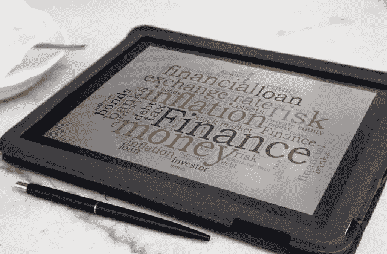

# 7 个基本的个人理财术语:值得学习

> 原文：<https://medium.datadriveninvestor.com/7-basic-personal-finance-terms-worth-learning-766520511e6b?source=collection_archive---------14----------------------->

人们总是认为个人理财是火箭科学。他们对理财规划师在博客、电视采访或直接互动中使用的不同术语感到困惑。但实际上，这没什么大不了的。人们可以很容易地学会这些概念。**如果我们很好地理解了这些概念，我们就能为我们光明的未来做出明智的财务决策。**

***我们来看看个人理财中广泛使用的术语***

*   **复利**

你一定听说过“**复利的威力”**这个名词。这个概念是基于数学术语复利。简单来说，复利就是利息上的利息。

 [## 算法交易的机器学习-数据驱动的投资者

### 当你的一个朋友在脸书上传你的新海滩照，平台建议给你的脸加上标签，这是…

www.datadriveninvestor.com](https://www.datadriveninvestor.com/2019/01/30/machine-learning-for-stock-market-investing/) 

例如，10，000 卢比以 8%的复利投资于银行 2 年期定期存款。那么第一年的本金是 10000 卢比，利息是 800 卢比。第二年，本金为 10800 卢比，利息为 864 卢比。因此，在第二年末，投资者收到的总金额更多的是赚取的利息，而不是取出来再投资。**当投资者对金融产品进行长期投资时，复利的力量有助于积累财富。**

*   **通胀**

这是一个投资者在规划他/她的财务时应该理解的重要概念之一。很多时候，投资者在计算特定目标所需的本金时会忘记**考虑通货膨胀。由于这个错误，他的文集被遗漏了。**

*什么是通货膨胀。？*

商品和服务价格总水平的持续增长被称为通货膨胀。

你有没有注意到去年你能用 1000 卢比买到的食品数量今年已经减少了？为什么这样原因是一年内食品价格上涨，1000 卢比的购买力下降。如果以现金或银行储蓄账户的形式闲置，通货膨胀会降低货币的购买力，因为这些钱无法获得任何回报。因此，投资者应该将自己的储蓄投资于那些能够产生高于现行利率回报的金融产品。

*   **净资产**

这个术语描述了投资者的财务状况。

如何才能算出净值？

**净资产=个人总资产—总负债。**

负债包括个人的债务和各种贷款，资产包括现金、共同基金、股票、债券、房地产和黄金等。**高净值表明个人财务状况良好。**

*   **资产配置**

这个术语被金融专家广泛使用。它在最大化投资组合回报方面发挥着重要作用。

*什么是资产配置？*

资产配置是决定如何在几个资产类别中分配投资的过程。股票、债券、共同基金、其他债务工具以及现金或现金替代品是资产配置策略中最常见的组成部分。资产配置意味着分散你的投资组合。

简而言之，把你的钱投资在不同类型的投资产品上，以使你的风险最小化，回报最大化。资产类别可以是股权、债务、房地产和黄金。资产配置取决于你的年龄、冒险能力和特定目标的时间范围..

最著名的一句话**‘永远不要把所有的鸡蛋放在一个篮子里’**用来简化术语资产配置。

*   **再平衡**

**再平衡是在一段时间内买卖投资以维持资产配置的过程。**这是通过将从一些表现突出的投资中提取的利润再投资到表现不佳的资产中来实现的。重新平衡让你的投资组合回到理想的资产组合。

**随着年龄、收入、考虑目标的时间框架以及生活目标的临近，您应该通过重新平衡投资组合，对您的资产配置组合进行必要的调整。**

鉴于市场波动，短期内也要进行再平衡。

*   净收入/可支配收入:

可支配收入是我们可以用来消费或储蓄的收入。

*如何计算可支配收入？*

这是从应缴纳的所得税总额中得出的。

这是手头的现金。可支配收入也有经济意义。它不仅是消费者支出的主要决定因素之一，也是需求的五个决定因素之一。

关于可支配收入的经验法则是，根据 50/30/20 法则，我们应该至少把可支配收入的 30%存起来，20%用于购买奢侈品，剩下的 50%用于购买必需品。

*   **债务分类**

债务是所欠或到期的一笔钱。当我们不能用手头的钱买东西时，我们需要借钱。在个人理财中，债务有两种类型。

**好债和坏账。**

好债是我们借给**的贷款，用来建立我们将来会升值的资产**，比如房屋贷款、商业地产或土地贷款等。从长远来看，这笔贷款有助于我们创造资产。

而坏账是我们借钱购买贬值资产的债务，比如汽车贷款、电子产品或旅游的个人贷款。这些贷款增加了还款负担，减少了可用于储蓄的金额。

**经验法则是，各类债务不应超过我们可支配收入的 30%。**

这些是投资者应该知道的一些重要术语。

**理解这些术语有助于投资者更好地规划自己的财务。**