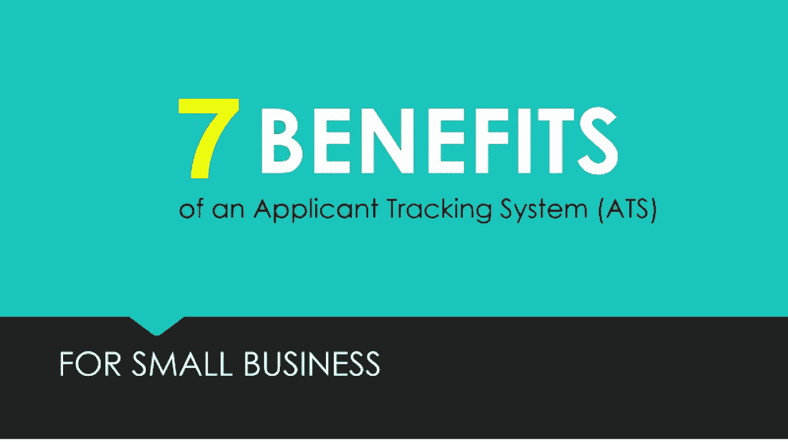

# 申请人跟踪系统的 7 个好处。

> 原文：<https://medium.datadriveninvestor.com/7-benefits-of-an-applicant-tracking-system-2c69fe5b715c?source=collection_archive---------11----------------------->

7 Benefits of An Applicant Tracking System

# 你知道吗？

*A RESEARCH SAYS, HIRING A SMART CANDIDATE COSTS $4,129 PER HIRE.*

***根据一项研究，几乎 75%的老牌公司使用申请人跟踪系统。***

因此，问题来了，为什么申请人跟踪系统对公司的发展如此重要，它如何帮助公司建立伟大的团队？

让我们来看看**求职者跟踪系统** (ATS)或俗称的**求职者跟踪系统**的这 7 个好处。

## 1.简化和自动化招聘流程。

一个**求职者跟踪系统**，因为它在自动化任何公司的招聘过程中起着至关重要的作用，因为它简化了招聘流程，使**人力资源部**的工作更加容易。不管是为小公司还是大企业招聘，每个人力资源部门都会爱上 ATS 的简单性。

## 2.一键发布到各种工作公告板。

通过一个求职公告板获得的曝光率永远不足以吸引最优秀人才的注意。考虑到有很多受欢迎的求职网站都有巨大的个人人才库。因此，人力资源人员需要将一个职位发布到多个职位公告板上，以获得更多职位空缺的可见性&这有助于获得更多相关的申请。在自动化招聘之前，招聘人员不得不在每个热门的职位板上单独发布他们的职位空缺，这绝对是一项非常繁忙的工作。但是有了自动化招聘，通过一个**求职者跟踪系统**，现在招聘人员可以一次性在各种工作平台上发布职位空缺。

## 3.扔掉塞满邮箱的简历。

早些时候，招聘人员不得不在成堆的信件和邮件中查看申请。随着通信技术的进步，信件和帖子被转换成电子邮件，现在招聘人员不得不查看每一封电子邮件。自动化招聘也解决了这个问题。有了 [**求职者追踪系统**](https://recooty.com) ，招聘人员再也不需要像处理任何事情一样经常查看他们的电子邮件。申请人跟踪软件挖掘你收到的简历，并以一种快速简单的方式呈现候选人数据。

## 4.给你公司的网站一个品牌的职业页面

你的求职网站是商店的橱窗，通过它，潜在客户可以看到你的空缺职位，并了解为你的公司工作是什么样的。当三分之二的求职者有兴趣为你工作时，他们会直接进入你的求职页面。拥有一个最新的、有吸引力的职业页面有很好的商业意义，这也是你雇主品牌的基础。并非所有公司都可以在内部建立和维护一个有效的职业页面。而且获得开发资源可能会让人望而生畏。一个巨大的申请人跟踪系统的好处是，它很容易创建一个品牌的职业页面，不需要编码。通过提供真实的工作环境和团队感觉来吸引合适的候选人。不要只是把你公司的标志贴在上面，用办公室的照片或者你团队的视频。

## 5.让应用程序的跟踪和管理变得前所未有的简单

当谈到招聘过程的复杂性时，招聘人员最忙碌的任务是从大量的简历和申请中筛选出合适的候选人。设计申请人跟踪系统的主要动机是为招聘人员提供一个极其简单的工具，该工具可以自动化各种流程，如筛选、发送电子邮件和跟踪候选人。ATS 的主动式仪表板有助于招聘人员了解最新动态并跟踪候选人。

## 6.面试时间表，并排查看所有面试官的时间表

面试安排是任何招聘过程中最重要的一步。面试至关重要，因为这是入围候选人和招聘人员在最终招聘前第一次也是唯一一次面对面的交流。

从人力资源的角度来看，告知入围候选人面试的基本细节是一项比准备面试计划更令人兴奋的任务。手动邮寄每一位入围候选人是一项非常繁琐且极其耗时的任务，人力资源人员的生活变得轻松多了。他们不再需要为安排面试和通知每个候选人以下内容而烦恼。所有这些都是由智能 ATS 自动完成的。

## 7.经济高效，并提高了每次雇用的成本

## 当我们问他谁应该使用求职者跟踪系统时，世界上最受尊敬的招聘专家之一 Tim Sackett 说:

> “在我们的历史上，招聘技术从未如此经济实惠，这意味着组织不再有理由不拥有它。伟大的技术现在是如此便宜，如果你没有它，你就是在做一个个人选择，留在招聘的黑暗时代。对于中小企业来说，这是前所未有的现实。中小型企业现在可以拥有比他们的企业同行更好的招聘技术。当企业员工获得大型的、基于香草的招聘技术时，中小型企业可以更快地整合市场上最新、最棒的技术。这是一个激动人心的人才招聘时代，世界级技术的可用性正在改变我们日常的招聘方式。”

要了解更多关于申请人跟踪系统的信息，请访问:【https://recooty.com】