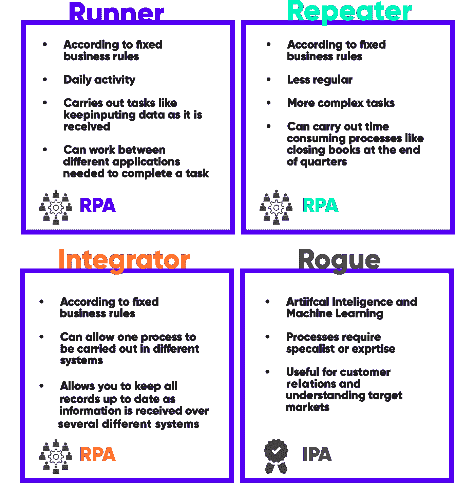
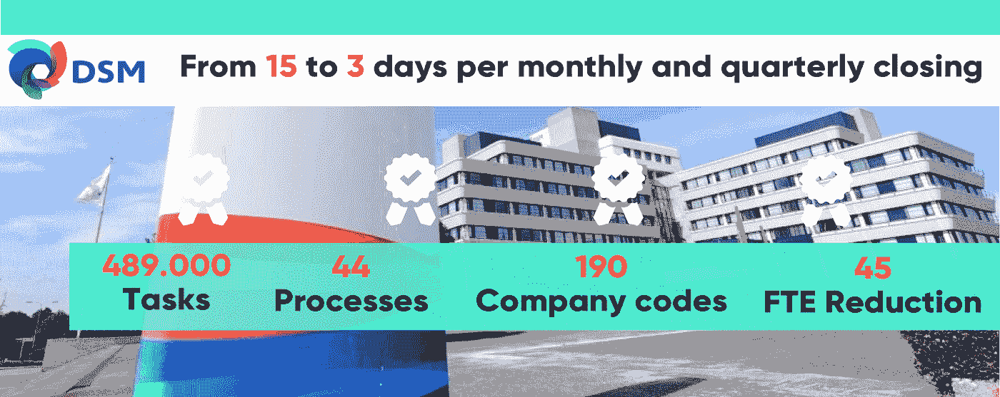
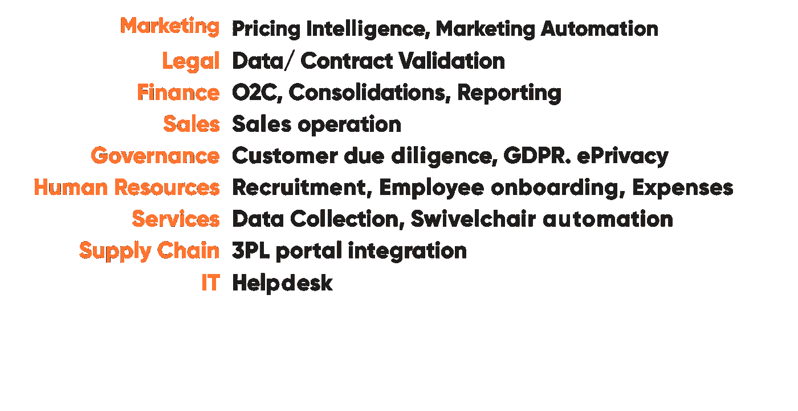
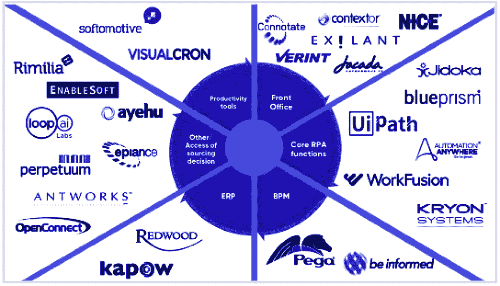
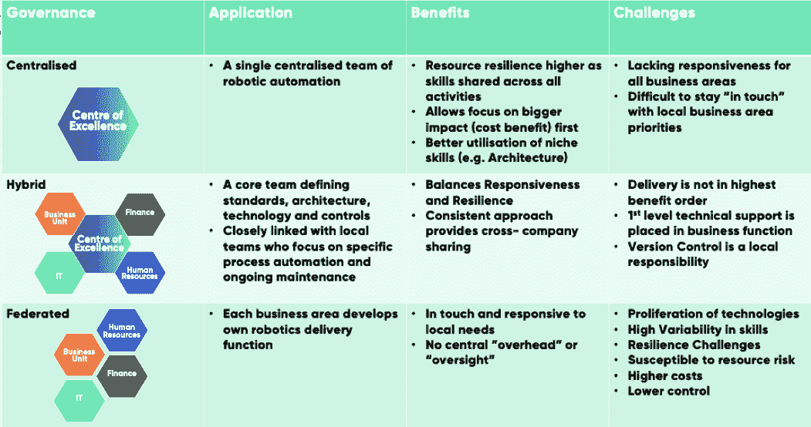

# 关于成功实施 RPA 的 7 个专家提示

> 原文：<https://medium.datadriveninvestor.com/7-expert-tips-on-successful-rpa-implementation-118b81542ac2?source=collection_archive---------3----------------------->

机器人流程自动化(RPA)正在引起业务流程管理的一场革命。据 Gartner 称，到 2020 年，RPA 市场将超过 10 亿美元，40%的大型企业将采用 RPA 软件工具，而目前市场上这一比例不到 10%。Hadoop 的研究人员估计，到 2025 年，公司将通过 RPA 节省 5 万亿至 7 万亿美元，执行的任务相当于 1.4 亿全职员工的产出。 [Statista](https://www.statista.com/statistics/647202/worldwide-robotic-process-automation-market-revenues/) 认为，到 2019 年，RPA 行业的价值将达到 31 亿美元，到 2020 年将达到 49 亿美元。据 [Forrester](https://www.forrester.com/report/The+RPA+Market+Will+Reach+29+Billion+By+2021/-/E-RES137229) 称，到 2021 年，这一数字更有可能达到 29 亿美元左右。将 RPA 实施到其业务流程中的大公司的数量正在迅速增加，这进一步证明自动化时代正在到来。

你的企业呢？您的组织是否已经开始采用 RPA，或者正在考虑开始节约成本和提高效率之旅？以下是我们的专家提供的 7 个提示，让您更好地了解存在哪些类型的 RPA，以及如何将其成功实施到您的业务流程中。

**提示 1:了解 RPA 类型，以便解决您的问题**

在选择供应商之前，需要考虑 RPA 的多种变化。要从 RPA 中获得价值，了解哪种变体最适合您的自动化需求非常重要。一些项目失败仅仅是因为选择的 RPA 解决方案不适合要完成的工作，或者被期望解决它无法首先解决的问题。因此，很好地理解有哪些类型是很重要的。让我们看一下 RPA 的四种使用情形类型——跑步者、中继器、集成商和流氓:

**用于简单和重复任务的跑步者和重复者**

RPA“跑步者”和“重复者”使用情形采用固定的业务规则。跑步者意味着自动化日常活动，包括简单的任务，比如以某种方式处理输入数据。例如，根据基于规则的标准对申请人的简历进行预先分类，以支持人力资源。当您的流程不太规则，并且在完成任务所需的信息方面有点复杂时，重复是您最好的朋友。复读生可以完成更大更耗时的任务，比如月底结账。跑步者和复读者都有助于节省您的后台全职员工，以达到更有价值和更有效的目的。对于组织来说，Runner RPAs 通常是一个很好的起点，因为它相对容易实现，并且在协助或替代员工活动方面非常有策略。降低成本是这样做的主要原因之一，但不要低估提高质量和缩短交付时间的价值。

**中继器示例:** DSM 营养健康和可持续生活公司

DSM 想要一种更快的方式来完成月度和季度结算。因此，他们实施了“中继器”RPA 类型。通过使用 44 个流程和 190 个公司代码自动化 489，000 个任务，RPA 将员工完成的 15 天工作变成了不需要人工干预的 **3 天**的工作。

**奔跑者示例:** Aegon 人寿保险

Aegon 需要一种更快的方式来实施客户保险计划的变更(如结婚、离婚、买房)，并实施了 Runner type RPA 来完成这一功能。从在 195 个不同的屏幕上使用 17 个应用程序，这个过程从 141 分钟简化到 **21 分钟**的工作。

**集成商取代人工作为解决 IT 差距的方案**

虽然这个概念很简单——保持系统之间的输入数据相似——但实际上，这可以节省很多组织中仍在发生的手工劳动。许多业务流程通常没有与支持 IT 解决方案无缝匹配。员工通常不得不充当“集成者”来填补系统之间的空白，手动将信息从一个系统复制到另一个系统以继续这一过程。一个积分器立即解决这个问题，没有错误。它还允许您保持所有记录的更新，因为信息是通过几个不同的系统接收的，并允许所有相关部门保持一致。

**用于智能和自学习自动化的 Rouge RPA**

更高级的 RPA 类型是“胭脂”解决方案。当流程需要多变量输入和决策考虑时，人工智能和机器学习可以与自动化相结合。AI 和 RPA 的结合可能会导致一些混淆，但总的来说，这意味着自动化软件从历史数据和人类交互中学习。通常，这种类型的 RPA 对客户关系非常有用，例如，通过提供跟进行动、定价、折扣和其他保留策略的建议。正如您在成本节约旁边看到的，这意味着 RPA 还有许多创收机会。

既然您已经熟悉了 RPA 的功能及其各种形式，现在我们将分享一些专家提示，以确保成功实施 RPA，从而完善您的业务流程。

**提示 2:从拥有大量标准流程的部门开始**

一般来说，我们建议在通常涉及大量使用固定业务规则的标准流程的部门和职能中开始 RPA。通常，这已经允许高达 60%的后台流程实现自动化。这些机会应该构成您的企业自动化路线图的基础。它还为自动化提供了一个相对非侵入性的开端，这带来了最大的成功机会。首先获取速赢并为 RPA(治理、经验)建立组织基础，然后再进入更高级的 RPA/IRA 类型。

我们经常看到使用 RPA 的地方:

**提示 3:检查自动化机会的经济可行性，并根据**进行优先排序

下一步是研究这些部门内具体机会的经济可行性。这将使我们能够更详细地确定实施的可行性和生存能力；以及从组织的角度来看可取性。付出和投入相对于回报是什么？投资 RPA 和重新设计流程是否有经济意义？在确定 RPA 可以满足的一般需求后，RPA 实施计划的第一阶段应始终包括与相关利益相关方一起进行流程和机会扫描。这样做是为了创建更具体的业务案例；在进入设计和实施阶段之前，检查确定的机会和解决方案是否仍然有意义。

**提示 4:获得管理层和利益相关者的认同**

如果利益相关方不了解 RPA 是什么以及它将如何给业务带来好处，就很难运行有效的项目。为了使其真正发挥作用并实现收益，负责受影响流程的部门应该参与进来并进行咨询。您公司的领导层应该帮助人们理解 RPA 如何为他们带来好处、提供机会并使生活变得更轻松。这不仅建立了对 RPA 实施的信心，还防止了组织免疫系统的激活。

**提示 5:调整 RPA 扩展速度以适应业务采用速度**

由于 RPA 所需的实施时间可能非常短，从方案和技术角度来看，很容易进展过快。换句话说，增加更多的机器人很容易，但如果组织不能处理这些影响，将弊大于利。从小处着手，让组织习惯这一流程，并在你认为合适的时候增加更多。成功的实施通常包括一个实施后采用流程来帮助管理这一点。

**提示 6:从一开始就参与进来**

RPA 通常被组织视为一项业务计划，而不是额外的软件。因此，高管们可能会错误地认为它不需要成为实施过程的一部分。但是，通常需要专业技术来解决 RPA 导致的不可预见的问题。它还有助于 RPA 供应商选择流程，确保组织不会为工作选择错误的 RPA 或解决方案。除此之外，通常已经有现成的工具和解决方案，这些工具和解决方案可能包含所需的大部分功能。它可以帮助评估这一点以及 RPA 工具，以获得最佳解决方案。最后但同样重要的是，它甚至可以分享一些与 RPA 世界相关的可重用性最佳实践。

与能力焦点相对应的供应商解决方案:

**提示 7:为实施和 BAU 建立清晰的治理模式**

明确治理模式。有几种模式可用于不同的含义—集中式、混合式、联合式—但始终确保明确谁在管理什么、RPA 将处理的材料和流程，以及每个员工在实施之前、期间和之后将如何参与 RPA。缺乏沟通和意识会造成重大损害。例如，在一种情况下，当一名员工更改了公司的密码策略，但没有人对机器人进行编程调整，这导致了重大的数据丢失。保持机器人高效运行需要所有人员充分意识到哪些变化会影响编程的业务逻辑，并相应地进行调整。维护是保持 RPA 流程高效运行的关键。

RPA 治理模式类型的高级视图:

**关闭思路**

RPA 作为业务流程管理的最新创新备受瞩目。在您的组织中实施 RPA 为节约成本和增加收入提供了巨大的机会，有助于使用机器智能将劳动力数字化。仔细选择符合您的流程要求的 RPA 类型至关重要。但真正的成功在于其背后的业务采用和治理模式。确保 RPA 得到正确使用和维护—允许持续提供 RPA 旨在带来的价值。

想了解更多关于我们的经验，或者寻求对您的 RPA 计划的支持？请联系我们的爱国军领导人 Mathieu Jonker 了解更多信息:[mathieu.jonker@riverflex.com](mailto:Mathieu.jonker@riverflex.com)。

有兴趣阅读更多关于？除了我们专家的建议之外，这里还有一些精选的文章和报告文档，进一步讨论了 RPA 的后勤工作:

*   CIO，2018，《什么是 RPA？业务流程自动化的革命”来源:[https://www . CIO . com/article/3236451/business-process-management/what-is-RPA-robotic-process-automation-explained . html](https://www.cio.com/article/3236451/business-process-management/what-is-rpa-robotic-process-automation-explained.html)
*   来自 IDG 的计算机世界，2018，RPA 是什么？业务流程自动化的革命”来源:[https://www . computer world . com . au/article/641674/what-RPA-revolution-business-process-automation/](https://www.computerworld.com.au/article/641674/what-rpa-revolution-business-process-automation/)
*   Forrester，2017，“到 2021 年，RPA 市场将达到 29 亿美元”来源:[https://www . Forrester . com/report/到 2021 年，RPA+市场+将达到+290 亿美元/-/E-RES137229](https://www.forrester.com/report/The+RPA+Market+Will+Reach+29+Billion+By+2021/-/E-RES137229)
*   过程卓越网，2018，“软件机器人正在崛起:这里是你的机器人过程自动化(RPA)完全指南”来源:[https://www . processexcellencenetwork . com/RPA-artificial-intelligence/articles/a-guide-to-Robotic-Process-Automation-RPA](https://www.processexcellencenetwork.com/rpa-artificial-intelligence/articles/a-guide-to-robotic-process-automation-rpa)
*   Statista，2018，“2012 年至 2020 年全球信息技术(IT)机器人过程自动化(RPA)市场规模(百万美元)”来源:[https://www . statista . com/statistics/647202/world wide-robotic-process-automation-market-incomes/](https://www.statista.com/statistics/647202/worldwide-robotic-process-automation-market-revenues/)
*   走向数据科学，2018，“你需要知道的所有机器人过程自动化(RPA)统计数据”来源:[https://towardsdatascience . com/All-the-Robotic-Process-Automation-RPA-Stats-You-Need-to-Know-bcec 22 eaaad 9](https://towardsdatascience.com/all-the-robotic-process-automation-rpa-stats-you-need-to-know-bcec22eaaad9)