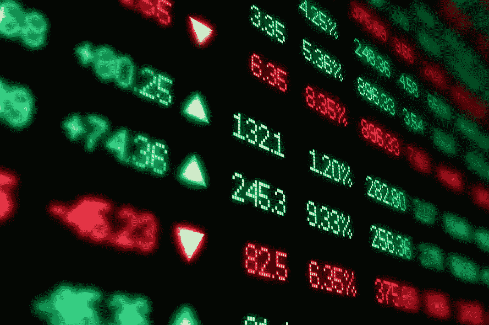
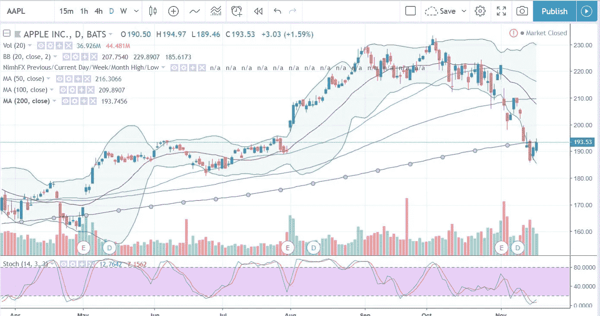
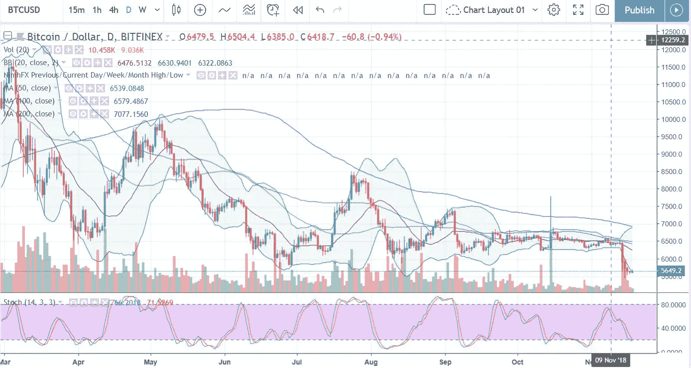

# 开始用股票和加密货币赚钱的 7 条黄金法则

> 原文：<https://medium.datadriveninvestor.com/7-golden-rules-to-start-earning-money-with-stocks-and-cryptocurrencies-21b397e1867c?source=collection_archive---------3----------------------->

## 要想交易成功，我们需要理解指导所有交易者的一套规则的重要性。

我一直对交易充满热情。我记得我在 2000 年左右的第一次交易。那时，我是一个一文不名的大学生，但我向父亲借了一些钱。我对交易一无所知，但很多人都在发财，所以我迫不及待地开始了我的旅程。

“航空公司很快就要起飞了”——我的财务顾问对我说。所以，我把所有的股份都投资到了一家小型私人航空公司。

然后是 911。我买的那家公司的股票在一个月内下跌了近 80%。我失去了我的资本，这感觉就像是我职业生涯的终结。幸运的是，这不是一大笔钱，但我父亲告诉我，下次我应该用我自己的钱。

几年后我也是这么做的。我停止投资有一段时间了，直到我开始工作。那是 2007 年，我的钱相对较少。“吸取教训”——我对自己说。我读了几本关于技术分析的书，开了一个交易账户。“这一次我不会只投资一只股票，但我会分散投资，把风险降到最低”。我以为我有足够的知识重新开始交易。我买了 3 种不同类型的股票:银行、科技和工业部门。你可以想象接下来发生了什么。2007 年是自大萧条以来最严重的金融危机的开端。道琼斯指数在一年内暴跌了 50%,我的资本也因此缩水。我觉得很不走运。"怎么可能每当我决定开始交易时，市场就会崩盘？"

我放弃了成为交易员的想法，决定投资一些低风险的资产，如债券。直到几年后我遇到了一个人。他是一个兼职交易者，他一直在赚钱。不管是否有金融危机。于是，我们开始交谈，我发现我们使用了或多或少相同的技术。我真的不明白，当我是一个亏损的交易者时，他是如何持续赚钱的。“如果有人以前做过，你也能做好”——他说。“了解股票分析的基本原理是不够的，你需要正确的心态”

答对了。那句话让我打开了一个新的视角。我意识到我没有正确的交易方法。我回到家，开始研究成功的交易者。自助餐，拉里·威廉姆斯，保罗·都铎·琼斯…我想知道更多他们成功的原因。虽然他们有不同的投资技巧，但他们有一些共同的特征:他们有一个计划，他们不会根据情绪做决定。

所以，我开始制定我的个人计划，现在我每次交易都用这个计划。这是一个简单的 7 步过程，最终使我成为一个成功的交易者。这是:

1.**成为专家**。开始之前，你需要了解一些基本知识。你可以在网上找到很多免费的资源来提高你的市场知识。如果你是从外汇市场开始，你可以使用 babypips.com 的 T2，那里有很多教育工具。在你掌握所有不同的概念之前，不要开始交易。你应该熟悉烛台，支持和阻力，指标，止损等东西。

Apple chart on [TradingView](https://tradingview.go2cloud.org/aff_c?offer_id=2&aff_id=14201)

Bitcoin chart on [TradingView](https://tradingview.go2cloud.org/aff_c?offer_id=2&aff_id=14201)

2.**使用正确的工具。**一些经纪人收取很高的佣金，并且没有适合活跃交易者的分析工具。如果你没有合适的可视化平台，你将永远无法进行股票分析。我个人使用不同的经纪人，但为了分析数据，我使用 [TradingView](https://tradingview.go2cloud.org/aff_c?offer_id=2&aff_id=14201) 。他们有一个先进但易于使用的平台。你可以获得所有数据:期货、外汇、股票、加密货币和债券。他们有一个包含一些实时数据的免费版本，并提供包含所有数据的 1 个月免费试用。

**3。** **管理你的交易。**除非你有设置、进场点、止损和目标，否则不要开始交易。不了解他们就不要投资。交易就像驾驶你的汽车。当你开车的时候，你总是知道你有什么类型的车，你在哪里，你要去哪里**。不要仅仅因为你的朋友告诉你就交易资产。要成为成功的交易者，你只需要熟悉一两种资产。无论是股票、外汇、期货还是加密货币，选择你有信心交易的资产。**

**4。** **管理风险**。交易是唯一一个可以一边工作一边赔钱的工作。交易不是为了利润，而是为了管理风险。有时候，我遇到一些交易者，他们在 6 个月内获得了丰厚的利润，但在一次糟糕的交易中却损失殆尽。风险控制是每一个成功交易计划的最终目标。你不应该拿超过 3%的资金去冒险。如果你的账户里有 10000 美元，你不应该冒险每笔交易超过 300 美元。

5.设定你的目标。交易并不意味着一夜暴富。正如我之前在[的一篇帖子](https://medium.com/datadriveninvestor/how-to-avoid-losing-money-trading-with-bitcoin-and-cryptos-77bf75aef4ae)中分享的那样，你必须努力工作才能获得这份工作的成功。坚持小利润。小利可以发财。例如，如果你在外汇市场交易，设定你的初始目标为每周 20 点。一个月后，如果你成功了，增加到 40，一个月后到 60。不要强迫自己去打猎，相信你需要每天或每周制定目标。不要这么死板。把每周和每月的结果平均一下，你就会达到最终目标。

6.**有一本日记。**在一段时间内，该杂志将提供一个历史视角。它成为你的个人表现数据库，让你有机会回到过去，确定你交易的频率，每次交易的成功程度，哪种资产对你来说表现更好。我开发了一个电子表格，其中包含了日志中最重要的数据。[请放心使用](https://drive.google.com/file/d/1e6ixqbYTxRpRvR521B6YVCssRmvxhjrw/view?usp=sharing)。

7.**不要有自我。**时刻质疑自己，质疑自己的能力。“永远不要觉得自己很优秀。一旦你这么做了，你就死定了。”这是约翰·保罗·都铎最重要的建议之一。大多数人认为他们在逆市场而动，但市场并不在乎。我们永远不会给“市场上一堂该死的好课”。如果你感到过度兴奋或压力过大，那么停止交易，深呼吸，出去走走。市场永远都在。

如今是加密货币的时代。相同类型的规则可以应用于比特币、以太坊和替代币的交易。每种市场的游戏规则都是一样的。交易是艰苦的工作，有纪律和耐心遵循这些规则的交易者可以在竞争激烈的舞台上增加成功的几率。