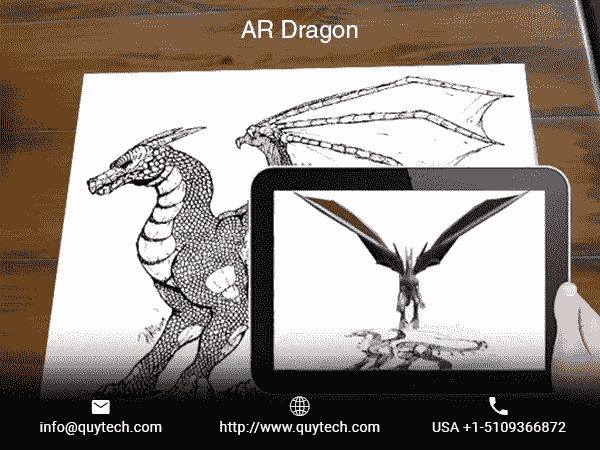
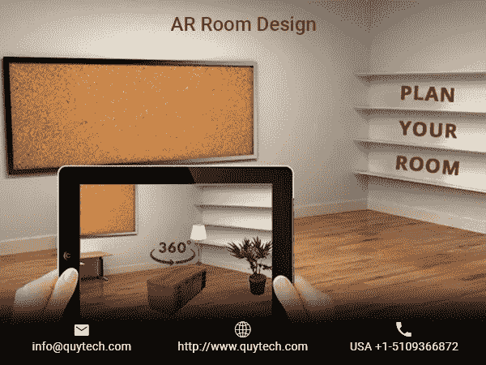

# 增强现实将在 2018 年接管的 7 个行业

> 原文：<https://medium.datadriveninvestor.com/7-industries-that-augmented-reality-will-take-over-in-2018-2ef16e022f1e?source=collection_archive---------29----------------------->

这个世界正在奔向一个人工环境，而不是生活在一个物理世界。我们无法想象我们的生活中没有数字技术和小玩意。想象力没有界限，技术也是如此。这方面的一个可引用的例子是增强现实(AR)的发展。“增强现实”这个词本身是在 1990 年创造的，并归功于前波音公司研究员托马斯·p·考德尔。

AR 有可能将我们的数字世界叠加在现实世界上，预示着一个数字化的新时代。利用 AR 的应用和技术取得了巨大的成功，其影响可以在各种行业中看到。

# 娱乐

2016 年，Pokemon Go 在第一周就赚了 200 万美元，引爆了游戏行业。这被标记为 AR 应用程序开发的非凡飞跃之一。Snapchat 中的“Bitmoji”和“Sky filters”是我们日常生活中最常见的 AR 体验之一。此外，苹果的 Animoji 就是一个这样的例子，说明我们可以如何使用手机的前置摄像头来有趣地使用 AR。与其他需要特定仪器的技术相比，AR 发展迅速，并迅速扎根于娱乐行业。

# 卫生保健

AR 为医疗保健和医疗行业开辟了一个新的应用领域。将数字图像叠加在实际工具上，可以帮助外科医生更加精确地工作，并且节省时间。通过它可以更详细地了解血管和器官系统，这有助于提高治疗的准确性。通过“Viipar ”,在不同位置的更有经验的外科医生能够通过投射到患者身上的增强的手来引导佩戴者一步一步地进行手术。

# 教育

将数字世界呈现在纸上，并在视觉表现中涉及 3D 或多视图，AR 可以使学生的学习过程更有趣。在课程中使用基于 AR 的应用程序；提高学习标准会容易得多。“Holonize”是一款基于 AR 的应用程序，它与学校合作创建了一个门户网站，建筑和图形学生可以在这里显示和查看 3D 模型。

# 零售和营销

在这个行业中，AR 的唯一目的是改善用户体验，减少客户支持费用。使用这项技术，零售商可以实时展示他们产品的适用性。随着 AR 在营销领域的爆发，它正在迅速取代目录系统。通过引入虚拟的“试穿”体验，消费者可以在房间里或自己身上看到产品的外观。

# 军队

提高作战方法和加强国家的安全，这项技术是显而易见的军事训练计划。对于信息处理和情况感知，AR 应用程序可以参与训练士兵。“GunnAR 头盔”是一种使用 AR 来跟踪、识别和射击目标的工具。

# 制造业

AR 可以用来以高效的方式组织制造过程，这种方式耗时更少，并且优化了工业中的资源消耗。该技术有利于提高质量控制的显著能力。它还可以为技术人员的工作环境提供简化的机制。

# 房地产

增强现实可以在巡视房屋之前向客户提供信息。这项技术具有将数字视图叠加到物理世界上的能力，有望成为行业的游戏规则改变者。房地产公司可以基于其物业的 AR 表现赚取巨额利润，这些应用程序可以帮助客户在瞬间做出决定。

作者简介:Colleen Jansen 是 Quy Technologies 的数字营销专家，Quy Technologies 是一家领先的[增强现实应用开发公司](http://www.quytech.com/augmented-reality.php)，为全球的教育、房地产、医疗保健和电子商务行业提供增强现实应用。她喜欢写最新的移动趋势、移动技术、创业公司和企业。

【www.pixelstech.net】最初发表于**。**