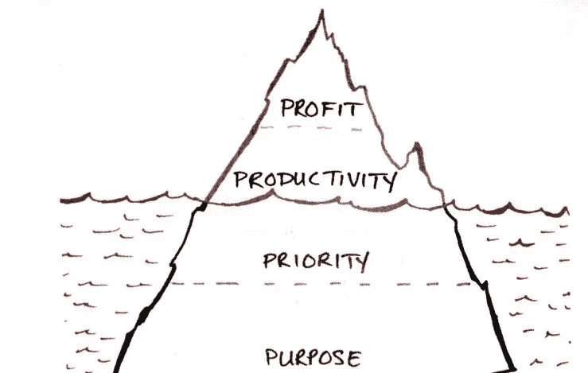

# 从加里·凯勒的书《一件事》中学到的 7 个教训

> 原文：<https://medium.datadriveninvestor.com/7-lessons-learned-from-gary-kellers-book-the-one-thing-6cd8bbfc86ca?source=collection_archive---------3----------------------->

你是否有时会觉得自己被这么多工作淹没了？

到了一定程度，你会觉得有太多的工作要做，而实际去做的想法最终会让你意志消沉，最终，你几乎一事无成？

我最近读了加里·凯勒的书《一件事》，这本书为这个困扰许多企业主的问题提供了一个切实可行的解决方案。

加里·凯勒是世界上最大的房地产公司之一凯勒·威廉姆斯房地产公司的董事会主席和联合创始人。

在他的书《一件事》中，加里解释了简单的巨大力量，做一件事可以让其他事情变得简单或不必要。

当我把他的想法和概念和我自己的事业联系起来的时候，真的很有道理。

你看，我管理着 5 家价值数百万美元的企业，同时管理着一个规模相当大的团队，有时事情会变得超级疯狂。

这只会变得更糟，因为我计划在未来几年内将我的业务规模扩大到 1 亿美元…所以我现在正在大肆招聘和实施新项目。

无论如何…

我真的需要一些东西来管理我的情况，我必须说，阅读这本书给了我如何前进的深刻清晰。

在今天的帖子中，我将与你分享我学到的最重要的经验。

在我开始之前，我想让你知道，这些课程不仅仅是为那些已经成功创业的人准备的。

这些教训是给每个人的，因为坦率地说，即使是一个正在创业的新手也会有很多事情要做，这可能会令人不知所措。

所以继续前进…

**第一课——如果你想成功，就不要做大。取而代之的是变小。**

你需要有远大的人生梦想。

但是当谈到实现你的梦想时，你需要开始把每件事缩小到最基本的部分。

**一件事。**

问自己一个问题，认真思考一下:

你能做的一件事是什么，能让其他事情看起来更容易？

最好的例子是比尔·盖茨的生平。

1.  比尔在学校热衷于一件事——电脑。
2.  他开发的一项技能是计算机编程。
3.  他接着创建了一家名为微软的公司。
4.  微软最初专注于一件事——为 Altair 8000 开发和销售基本解释器
5.  后来，微软开发了一个让比尔·盖茨家喻户晓的操作系统——Windows
6.  后来，比尔和他的妻子梅林达创立了一个基金会，目标只有一个——拯救贫穷国家人民的生命
7.  他们发现了贫穷国家死亡的一个主要原因——传染病
8.  这让他们想到了一个解决办法——接种疫苗

看看一切是如何归结为确定最重要的一件事。

这里要注意的一点是，虽然一件事情是最重要的事情，但它不是唯一重要的事情。

找到一样东西的全部意义在于创造多米诺骨牌效应。

当你推一个拇指大小的小多米诺骨牌时，它可以推倒旁边一个稍大一点的多米诺骨牌，这又可以推一个稍大一点的多米诺骨牌，这个过程可以一直持续下去。

从理论上讲，如果你把所有的多米诺骨牌按大小递增的顺序一个接一个堆叠起来，你甚至可以通过从一端轻弹一个拇指大小的多米诺骨牌来推倒一个帝国大厦大小的多米诺骨牌。

看看这个视频:

这就是多米诺效应的力量。

如果你知道该关注什么，小行动会带来大结果。

这就是为什么如果你想成功，你需要缩小范围，变小。

找到最小的多米诺骨牌。

这个**可以触发一切的**一样东西。

当你做了那一件事，接下来的步骤自然会发生，因为你已经启动了事情。

**第二课——不要列“要做的事情”清单。相反，列出成功清单。**

你一定听说过 80-20 原则。

80-20 原则指出，80%的结果来自 20%的努力。

关键是你的大部分成果将来自一些高收入的生产活动。

我每天挣 20，000 多美元，但这并不意味着我的每一个工作小时都是一样的。

当我做了一个 3 小时的网上研讨会，并以一个报价结束时，我会在接下来的几天里获得一连串的销售额(从 5 万美元到 20 万美元不等)。

这 3 个小时的工作比 20 个小时的正常工作多给我带来 10 倍的收入。

简而言之，这就是 80-20 原则。

**所以你需要做的是:**

列出你在工作中需要做的所有活动。

现在剔除低收入生产活动(80%)，保留高收入生产活动(20%)。

现在，在高收入活动清单上再次应用 80-20 法则，缩小你的清单。

不断重复这个循环，直到你的清单上只有几样东西。

现在，这被称为你的成功清单。

一旦你确定了你的一件事和你的成功清单，你就可以继续专注于去做它们，以获得你想要的结果。

*我举一个我自己创业的例子:*

为了实现未来几年 1 亿美元的目标，我需要关注的一件事是什么？

现场活动。

我需要协调更多的现场活动，在这些活动中，我可以提供巨大的价值，并提供我的培训和指导计划。

除了一件事，我的成功清单上还有哪些活动？

1.  每天通过电子邮件发送我的清单(我发送的每封电子邮件价值 10，000 美元以上)
2.  做现场网络研讨会(我做的每个网络研讨会至少值 50，000 美元)
3.  启动我的加盟计划

就是这样。

其他一切都可以委托给我团队中的其他人。

现在你可能没有能力拥有自己的员工团队，但你可以理解我在这里提出的观点。

关注高收入生产活动。

扔掉剩下的或者外包出去(freelancer，odesk，fiverr 等)。

**第 3 课——建立时间段，专注于只做一件事**

许多人对能够同时处理多项任务感到无比自豪。

当然，能够同时做多件事情很酷，但是仅仅因为它酷并不意味着它有效。

你可以一边看电视上的比赛，一边和别人聊天，但是你不能像单独做这些事情那样集中注意力。

*当我们专注于一件事时，我们的大脑工作得最好。*

它导致更好的工作质量，更好的生产力和更好的进步。

有些人认为，由于我们的身体可以在没有意识的情况下通过呼吸、心脏跳动等活动来运作。我们本质上都是一心多用的。

不完全是。

大脑协调它们的部分不同于专注于一项任务的部分。

所以，如果你想取得真正的进步，那就专注于一次做一件事，并把它做好。

为每项任务分配特定的时间段，这样你的大脑就会自动调整，在这段时间内只做那项任务。

**这里有一个最好的例子:**

当你去看电影时…

你把手机调到静音模式了吗？

是的。

你事先排空你的膀胱吗？

是的。

你带爆米花和可乐了吗？

是的。

你为什么做这一切？

因为当你去电影院看电影时，你的注意力只集中在看电影上，为了获得最佳体验，你要确保其他一切都处于待命状态。

如果你想获得最好的结果，你也需要这样做。

**第四课——早上做创造者，下午做管理者**

作为企业主，你有两份工作:

1.  进行高收入的生产活动
2.  委托他人并与其他人协调剩余的活动

当你从睡眠中醒来时，你的大脑功能最好。

这时候你就需要专注于执行你收入最高的活动。

例如，写一封电子邮件或创建一封销售信函或销售视频或网上研讨会演示文稿…所有这些都是高收入的生产活动。

先把它们做完。

然后，随着一天的进展，你可以专注于协调其余的活动。

早上做一个创造者，下午做一个管理者，看着你的成绩飙升。

**第五课——养成能带来实际效果的日常习惯**

大多数人为了得到结果，会努力遵守纪律。

但是这种方法有一个很大的问题。

如果你的 DNA 中没有高度自律的特质，那么你就很难在相当长的一段时间内保持高度自律。

别管纪律了。

世界上所有的成功人士都不是最自律的人。

但是他们有一个共同的特点，那就是他们都养成了强大的习惯，在他们的领域里给他们带来了真正的成果。

这完全取决于针对你的情况培养什么习惯。

如果你正在建立一个在线业务，每天去健身房不是一个会直接影响你结果的习惯(尽管这是一个好习惯)。

但是如果你每天给你的清单写一封电子邮件，现在这是一个可以帮助你增加销售和发展业务的习惯。

所以开始一个一个养成强大的习惯吧。

找出对你的结果影响最大的习惯，并坚持下去。

你会取得很大的进步。

**第 6 课——成功的秘诀是开始行动**

这听起来很简单，但却是千真万确的。

成功的一半在于开始。

你曾经有过这样的情况吗？你整天都觉得想完成某件事，但是当你开始做那件事的时候，你真的很投入并且完成了它。

哈哈。

那只是我们的大脑和我们开的一个玩笑。

当我们要开始做任何事情时，我们都会在某个时候遇到阻力。

有时候，当我们将要做一些真正重要的事情时，我们也可能会面临恐惧。

这是自然的。

但是你永远需要知道，这些都是暂时的感觉，没有任何意义。

一旦你无视它们，勇往直前，你会发现自己沉浸在工作中，把事情做好。

考虑开始新的业务？去做吧。

想开始新的活动吗？去做吧。

你不需要知道一切来开始。

你可以一路想出办法。

但重要的是你坚持下去，把事情做好。

这就是成功者和梦想家的区别。

**第 7 课——连接目的、优先级&生产力将决定你的业务增长&多少**

如果你想拥有一个每年都经历巨大增长的超级稳定的企业，那么你需要具备以下三样东西:

1.  目的

我知道网上有很多只想赚钱的营销人员。

虽然赚钱很重要，但如果你没有一个更大的目标，那么你很难建立一个吸引优质客户的繁荣企业。

没有目标，你将永远追逐最新最棒的技巧来赚更多的钱。

目标能让你看到全局，规划未来，并以一种持久的方式建立你的企业。

1.  优先

当你专注于采取正确的行动时，成长就会发生。

成功的人无情地优先考虑他们的行动，并开始按顺序执行最重要的行动。

你也需要这样做。

1.  生产力

你企业的成功取决于你如何执行企业中的重要任务。

提高你在重要任务上的生产力将会对你的结果产生巨大的影响。

简而言之:

目标帮助你找到全局。

优先级有助于您确定要执行的正确任务。

生产力帮助你以最佳水平完成这些任务。

当你把目标、优先权和生产力融合在一起时，你只会在你的事业中体验到非凡的结果。

以上是我从加里·凯勒的《同一件事》中学到的 7 条经验。

走出去，开始专注于你的业务中重要的事情，你会取得很大成就。

**喜欢这个吗？**

## **请在下面留下你的评论，你觉得哪些经验可以应用到你的企业中**

或者直接联系我们，参加[30 分钟的免费 Kickstarter 战略会议——点击此处。](https://incomekickstarter.com/yes)

# 准备好成长了吗？

如果你喜欢这篇文章，请点击拍手按钮👏加入我们的[脸书小组](https://www.facebook.com/groups/shaqirhussyin/announcements/)或者在[财富学院](https://wealthacademy.com/)查看更多关于我们的信息

**。。。**

*由*[*Wealthacademy.com*](https://wealthacademy.com/joseph-sugarman-copywriting-lessons/)发布数据驱动投资者