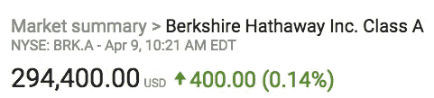
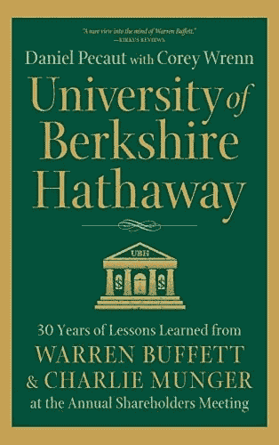

# “伯克希尔·哈撒韦大学”的 7 堂人生课

> 原文：<https://medium.datadriveninvestor.com/7-life-lessons-from-the-university-of-berkshire-hathaway-9a8b19320a05?source=collection_archive---------3----------------------->

每年，成千上万的人聚集在内布拉斯加州的奥马哈参加一个活动:伯克希尔·哈撒韦公司的年度股东大会。

八十年代初只有十几个人，现在整个体育场都挤满了人来听这位“奥马哈先知”和他的得力助手查理·芒格说些什么。

当然，市场、经济和伯克希尔自身的整体表现都在意料之中。这在任何金融事件中都是意料之中的。

但对许多人来说，无论是投资者还是非投资者，最突出的是你可以从这些会议中获得的人生智慧。

如果你不够幸运，没有持有伯克希尔·哈撒韦公司的股票，在撰写本文时，该公司股票的交易价格约为 294，400 美元，你必须依靠其他人的经验来分享他们从这些马拉松式的会议中学到的东西。

这也是我最近拿起 [***伯克希尔哈撒韦大学:沃伦巴菲特和查理芒格 30 年的经验教训作为年度股东大会的原因之一。***](https://www.amazon.com/University-Berkshire-Hathaway-Lessons-Shareholders-ebook/dp/B06XT89563/)

这本书很好地介绍了巴菲特和芒格的思想，不仅是关于投资，也是关于生活。

让我吃惊的是，我记下了多少与金融无关但却引起共鸣的笔记。

这就是我今天想要分享的，我从伯克希尔哈撒韦大学学到的最重要的人生经验。

# 第一课:投资自己

巴菲特和芒格都是终身学习的大力支持者。书中有许多小妙语突出了这一点，但有一个让我印象深刻:

“心理复利。”

芒格谈到他是如何出卖自己一天中最好的时光来改善自己的思维的。然后他把剩下的时间交给外界(家庭、事业等。).

# 第二课:阅读

这和第一课有关系，但是因为我认为阅读很重要，所以我把它作为一门独立的课。巴菲特和芒格热爱阅读，每天花几个小时阅读。

巴菲特声称，当他还是个孩子的时候，他在奥马哈公共图书馆阅读了所有关于投资的书籍，并且几乎住在那里。

这里有几本书值得推荐:

*   罗伯特·恰尔迪尼的《影响心理学》和《是的》
*   乔治·克拉森的《巴比伦最富有的人》
*   本杰明·格拉哈姆的《证券分析与聪明的投资者》
*   约翰·肯尼思·加尔布雷思的《1929 年大崩盘》
*   核恐怖主义:最终可预防的灾难

他们还提到阅读大量传记。

# 第三课:做一个独立的思考者

这个问题反复出现，适用于投资和生活。巴菲特和芒格都强调，花时间去思考和开放思维是他们成功的关键原因。

有时这意味着避开或忽略人群和他们的投射。努力独立思考，不要陷入盲目追随流行观点的陷阱。这可能会让人感觉与众不同，但从长远来看是有回报的。

# 第四课:了解你的能力范围

“能力圈”这个短语在整本书中反复出现。这是很好的建议，但很难坚持下去。

一部分与自我反省有关，你必须知道你的能力范围在哪里，不要忘记你的滑雪板，因为那是人们陷入麻烦和犯错误的地方。

巴菲特谈到他在投资中犯的最大错误有多少是因为他超出了自己的能力范围。现在他呆在里面。

# 第五课:等待“脂肪沥青”

巴菲特和芒格在投资和生活中给出的许多建议可以归结为两点:纪律和耐心。这两点都不具备，甚至会导致最聪明的人或最优秀的商人做出灾难性的决定。

耐心是巴菲特和芒格都有的一种技能，他们不愿意为了一点小小的收益而在一个有潜在风险的提议上达成共识(部分原因是不要听从大众的建议),而是等到确定无疑的事情“肥水不流外人田”再来一个本垒打。

# 第六课:向他人学习

这节课有两部分。首先是找到在你想做的事情上真正成功的人，研究他们，跟随他们的步伐。巴菲特称之为“尾随”,他在职业生涯早期就这么做了，并认为这非常适合他。

等式的另一半是从别人的错误中学习。巴菲特和芒格都列举了人们没有从历史中吸取教训，一次又一次犯同样错误的例子。通过研究出了什么问题及其原因来避免这种情况。

你可以从别人的错误中学到和成功一样多的东西，甚至更多。

# 第七课:务实

巴菲特和芒格喜欢吹嘘他们有良好的老式价值观，这种价值观在过去的五十多年里一直为他们服务。其中很大一部分来自于务实和理解自己。

两者都建议花时间了解自己的气质，自己擅长什么，不擅长什么。专注于适合你的事情，在那里你可以建立你的技能水平并重复成功。

只关注那些你可以通过正确的信息学习和理解的事情，不要在其他事情上浪费时间。

当然，还有更多的教训，但是要学习它们，你可能得自己读这本书！

*在*[*【lizfroment.com】*](http://lizfroment.com/)*了解更多。*