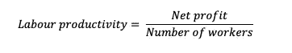
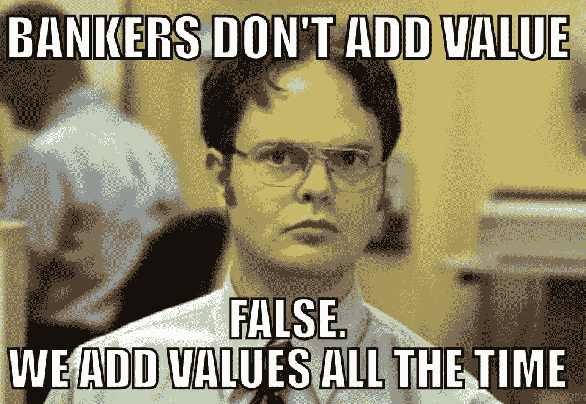

# 项目规划的 7 个人生窍门

> 原文：<https://medium.datadriveninvestor.com/7-lifehacks-for-projects-planning-fbc4fa4d45f?source=collection_archive---------21----------------------->

创业公司中的硬财务顾问对任何团队来说都是天赐之物。但是如果你没有，保存这篇文章，使用给定的建议！

1.  **绘制财务地图**

首先，创建一个 Excel 文档，在这里你可以计划和确定所有公司的现金流。本文档的设计并不重要，但必须包含以下所有要点:

***目标* :** 准确记录你认为可行的金额(可以是收入或利润)。在下一步中，预测您在一个计费周期内能够销售的商品和服务的数量。

***时间范围* :** 创建长期(5-7 年)、中期(1-5 年)和短期(不到 1 年)预算。

***收入和支出:*** 描述收入和计划成本的所有来源。预算是一个很好的纪律工具，它可以让你清楚地看到公司每个月赚了多少，花了多少。这个方法帮助你找到公司业绩的瓶颈，改变战略。

**2。** **永远削减成本！**

为什么最小化成本很重要？答案是，在收入减少的困难时期，你无法支付公司的成本，只能破产。因此，所有员工的 KPI 应该包括成本最小化策略。

**3。** **记录一个团队的工作时间**

在德勤工作期间，我观察了公司对员工时间的态度。每个员工都必须记录他/她花在任务和项目上的时间。你可以问我:为了什么？重点是，这种方法允许团队了解在重复的情况下，这个项目(或任务)平均会花费他们多少。此外，它刺激工人更快地工作。

**4。** **分析“成本与效果”的关系**

用每个月的表格创建一个 Excel 文件，其中包括所有主要的支出和收入项目(在没有收入的情况下，可以使用另一种效果，例如，用户基数的增长)。确定了绝对差异和相对差异之后，就有可能理解什么决策是最有效的。

**5。** **工人效率表**

管理者最有效的决策之一是组织条件，这提高了劳动生产率。使用这个系统来记录工人的效率是非常重要的。试着从最简单的公式开始:

**6。** **使用规则“x-1”，其中 x 是必要的工人数量**

当你确定了这个项目所需的工人数量时，就少雇一个工人。这个生活窍门让团队更有效率，因为他们…和更高的生产力。在这种情况下，好的建议是纳入效率评级系统，并鼓励最优秀的员工。

7 .**。** **在一家初创公司的财务知名度**

使用以下模板创建我们之前考虑过的文档([这里是下载链接](https://yadi.sk/i/mUza7WwSiZ6fN))。公司财务秩序是正确决策的警示，同时也是良好的控制工具。

健康公司的秘诀是健康的经济和金融！

