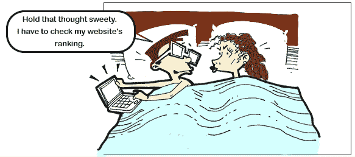
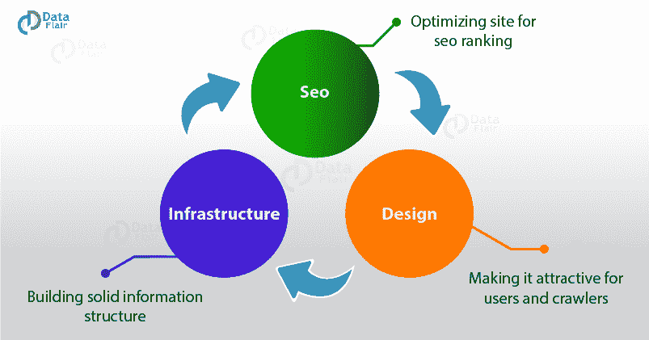

# 7 种在 SEO 中提高网页流量的有效方法。

> 原文：<https://medium.datadriveninvestor.com/7-proven-ways-to-boost-web-page-traffic-in-seo-e7d3e5232787?source=collection_archive---------5----------------------->

你有没有想过，当我们在谷歌上搜索某些东西时，一个页面或一个网站怎么会出现在搜索结果的第一位？这正是我们在 SEO 中学到的。但是，什么是 SEO 呢？

像往常一样，维基百科在解释:**搜索引擎优化** ( **SEO** )是影响网站或网页在网络搜索引擎中的在线可见性的过程——通常被称为“自然的”、“有机的”或“获得的”结果。

啊！

我想要一个我能理解和记住的定义！这里有一个:

[搜索引擎优化](https://data-flair.training/blogs/seo-tutorial/)指的是对网站/网页进行优化，使其首先出现在搜索引擎的结果页面上。优化可以在图像建设，链接共享，关键字研究等形式。

在 SEO 中，有很多优化的实践可以遵循，但是，这些实践应该符合搜索引擎的排名算法。(在我们的例子中是谷歌，因为我们都经常使用它)

今天，我将从 SEO 的角度分享一些真正有影响力的增加网页流量的方法。

 [## 2019 年需要关注的 20 个数字营销趋势和技术——数据驱动的投资者

### Faisal 在加拿大工作，拥有金融/经济和计算机方面的背景。他一直积极从事外汇交易…

www.datadriveninvestor.com](https://www.datadriveninvestor.com/2019/02/04/20-digital-marketing-trends-techniques-to-watch-out-for-in-2019/) 

**1。优质内容:**

开始把自己当成用户，而不是营销人员。你希望你的内容是什么样的？一些不必要的转移废话或良好的质量，用户友好的内容满足您的搜索查询？显然是后者。对吗？

这是每个营销人员应该追求的目标。他应该设身处地为用户着想，并相应地设计内容**。**[*内容应该非常吸引人*](https://data-flair.training/blogs/seo-content/)*，这样才能在用户的脑海中留下长久的印象。以下是一些构建高质量内容的有用策略:*

*写一些人们关心的事情。*

*添加个性化和相关的例子，以便于理解。*

*尽量使用简单的语言。*

*以创新的方式写作。*

***2。关键词研究:***

*关键词是定义你的内容的词，即你的内容是关于什么的。关键词在优化过程中起主要作用。这更像是一种决一死战的局面。*

*无论用户搜索什么，都应该与你的页面标题完全匹配，这样至少有机会展示你的内容。你一定在想这怎么可能？我想说一切皆有可能，尤其是在谈论这个世纪的时候。有各种各样的工具可以帮助你得到一个完美的关键词，比如谷歌关键词规划，关键词趋势，优步建议等等。这些工具做了一项惊人的工作，提供了人们使用什么词进行搜索的统计数据，特定关键字的搜索量等，并帮助选择博客的关键词。*

***3。图片:***

*当小心使用时，图像比文本更快地增强整体观点和对内容的理解。*

*让我们举一个例子:这张图片正在解释一个[好的网站设计策略的过程。](https://data-flair.training/blogs/website-design-seo/)*

**

*现在来比较一下:“网站设计遵循三个主要步骤。这些步骤包括优化搜索引擎优化排名的目的，优化之后是设计部分。它的设计应该能够吸引爬虫和用户的注意，然后是构建一个坚实的基础设施部分，以创建一个持久的印象。”*

*图片是否吸引人，是否易于理解？图像。*

*然而，需要注意的是，为了填充图像而填充图像也是行不通的，因为这会导致内容的质量下降。因此，应该在高质量的内容和高质量的图像之间取得平衡。*

***4。活跃于社交媒体平台:***

*只是保持活跃，经常分享相关话题的博客也有助于增加流量，但是你考虑分享的平台应该是权威的。一些值得使用的平台有 Quora、SlideShare、bloggers 等*

***5。嘉宾发帖:***

*客座博文基本上是将你的帖子分享到另一个网站，从而建立关系、曝光、权威和链接。客座博文有助于与发布你的博文的博主建立关系，挖掘他们的受众以增加曝光率，并帮助你为你的网站增加流量*

***6。着眼长远:***

*事情需要时间来运作。为了增加流量，你不应该为了暂时满足用户只访问你的网站一次左右而绘制网站地图。我们的目标应该是建立一个受众群，这个受众群会不时地增加，而且永远不会消失。*

***7。构建移动友好网站:***

*如果你只针对一部分人——那些使用桌面的人，以上几点是没用的。对于大众传播来说，你必须有远大的目标。今天有 63.4%的人通过手机浏览。所以，这就像没有瞄准一半以上的观众。*

*要获得大规模的覆盖，你需要考虑所有的用户，因此，[建立一个移动友好的网站](https://data-flair.training/blogs/mobile-friendly-website/)在这个意义上是必须的。*

*除了这些方法，经常回顾你的和你的竞争对手的博客/网站，并相应地更新，会有很大的帮助。最终，研究用户的需求和要求，并提供他们所需要的是吸引流量和提高排名的关键。*