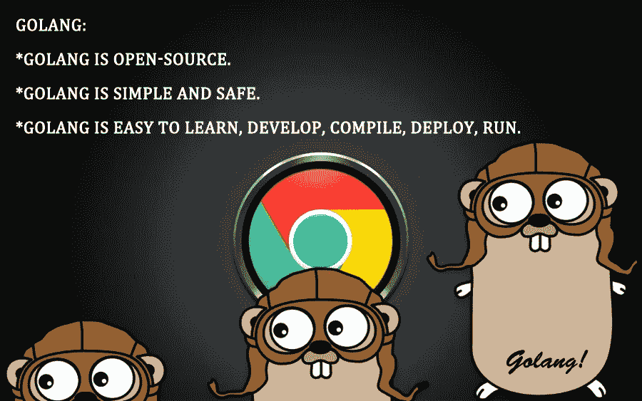
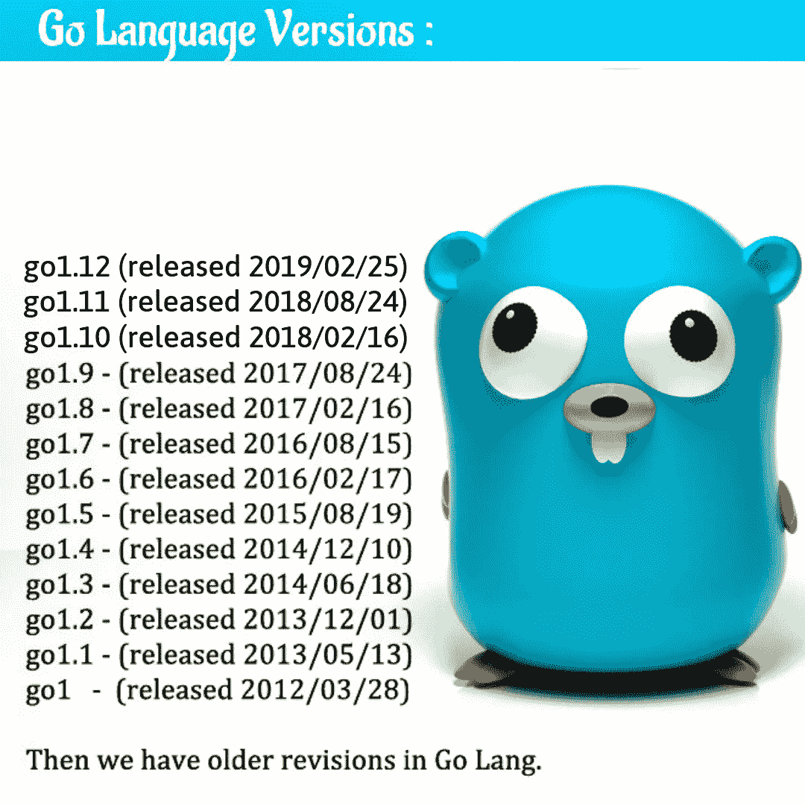

# 学习围棋语言的 7 个理由

> 原文：<https://medium.datadriveninvestor.com/7-reasons-to-learn-go-language-403686fe6859?source=collection_archive---------12----------------------->

Go Language

在了解为什么要学习 Go 编程语言之前，我们需要知道什么是 Go 编程语言..？

以下是 Go 编程语言的不同名称:

 [## 2019 年最值得学习的编码语言|数据驱动的投资者

### 在我读大学的那几年，我跳过了很多次夜游去学习 Java，希望有一天它能帮助我在…

www.datadriveninvestor.com](https://www.datadriveninvestor.com/2019/02/21/best-coding-languages-to-learn-in-2019/) 

“Go”、“Go 编程语言”、“GoLang”、“Google Go”。

**前言:**

GoLang 是由 Robert Griesemer、Rob Pike 和 Ken Thompson 于 2007 年在 Google 设计和支持的:支持可伸缩性和有效性，因为他们拥有最大的云基础设施。该语言于 2009 年 11 月发布。

“Go”或“GoLang”是一种编程语言，具有 Python 等动态语言的开发速度和 C 或 C++等编译语言的性能和安全性优势

Go 编程语言是一种快速的、静态类型的语言；编译程序语言。这感觉像动态类型的解释语言。

Go 编程语言是开源的(源代码免费提供，可以重新分发和修改。)、表达性(有效传达思想)、简洁(简短但全面)、干净(通用的纯功能性)、高效(用最少的努力获得最大的产出)。Go 可以快速编译成机器码，同时具有垃圾收集的便利和运行时反射的能力。

Go 语言的版本如下:从 2012 年首次公开发布 1.0 到现在，Go 语言已经证明了它的稳定性。

学习 Go 编程语言的 7 个主要原因是:

**1。Go 语言编程代码非常容易处理和维护:**

Go 拥有非常简洁明了的编程语法，易于理解。与其他语言相比，Go 非常不同。Go 和 C/C++一样高效，写代码和 Ruby/Python 一样简单

以下是 GoLang 不包含的一些功能:

*   没有类:所有的东西都被分成包。Go 只有结构，没有类。
*   它不支持继承。这将使代码易于修改。在像 Java/Python 这样的其他语言中，如果 ABC 类继承了 XYZ 类，而你在 XYZ 类中做了一些改变，那么这可能会在继承 XYZ 的其他类中产生一些副作用。通过移除继承，Go 也使得理解代码变得容易*(因为在查看一段代码时没有要查看的超类)。*

**2。Go 编程语言功能强大:**

为了工作并利用现在和未来的多处理器，同时执行程序是每个现代应用程序面临的最大挑战。

Go 编程语言采用了 Erlang 成功使用的通信顺序进程(CSP)模型(又名 Actor 模型)。Go 将轻量级绿色线程(称为 *goroutines)* 与称为*通道*的通信管道结合起来，形成一个简单、强大的并发模型。这使得一个应用程序可以与数千个参与者一起运行，而没有试图保持共享内存不被破坏的负担。

作为一名程序员，你应该知道

硬件是什么？

什么是软件？

什么是编程、编码、脚本？

什么是线程？

要理解 goroutines 的概念，你应该知道以上所有内容。

由于硬件的限制，工作速度总是受到影响，以克服这种 go had goroutines。Go 是在多核处理器已经出现的时候开发的。Go 有 goroutines 而不是 threads

*   Goroutines 有可增长的分段堆栈，它们只在需要的时候使用更多的内存。
*   Goroutines 的启动时间比线程快。
*   Goroutines 带有内置的原语，可以在通道之间安全地通信。
*   Goroutines 允许您在共享数据结构时不必求助于互斥锁。
*   goroutines 和 OS 线程没有 1:1 的映射。单个 goroutine 可以在多个线程上运行。Goroutines 被复用到少量的 OS 线程中。

**3。围棋编程语言有重点词汇:**

许多语言都有许多开发人员必须记住的关键字。这些关键字中有几个是为了支持已经存在了几十年的编程概念而设计的。使用 Go，这些概念中的许多都被尽可能地压缩，以减少所需的关键字数量。因此，Go 目前有大约 25 个关键字，而 Java 和 C#等语言有 50 个或更多。

4. **Go 编程语言有简单的作用域规则:**

许多语言为开发人员提供了很大的灵活性，以确保变量和函数可以对代码库的其他部分隐藏。Go 只有三个层次的范围，非常简单

确定范围的惯例:

1.  局部变量(在函数中声明)的作用域是当前块。
2.  如果包级变量以小写字母开头，则它们的范围是包。
3.  如果包级变量以大写字母开头，则它们的作用域是公开的。

正如您可能预料的那样，没有“私有”范围，这足以让一些开发人员感到不舒服。但实际上，这带来了很多机会。

5. **Go 编程语言内置了垃圾收集:**

垃圾收集是一个很难解决的问题。然而，手动内存管理通常会给开发人员带来相当高的成本，并且使得编写无错代码更加困难。这就是为什么 Go 的开发者要求在语言中包含它。最初，垃圾收集器可能会严重影响应用程序的性能。然而，由于坚定的努力，垃圾收集的成本正在迅速下降。

6.**围棋编程语言有一流的功能:**

当面向对象语言主导软件开发领域时，低级功能在很大程度上被降级为在类的上下文中定义。随着发现一级函数是 JavaScript 的优点之一，许多语言都致力于将函数恢复到一级状态。Go 吸取了这一教训，允许在应用程序中创建和传递函数。这并不意味着它已经放弃了面向对象；相反，它融合了函数式编程和面向对象风格的最佳方面，以尽可能少的仪式提供更大的灵活性。

7. **Go 编程语言包含电池:**

要创建现代应用程序，你需要的不仅仅是一门优秀的语言。现代应用程序依靠测试来确保正确性，依靠文档生成器来交流应用程序如何工作，依靠 linter 来确保遵守编码标准。Go 将这些问题中的每一个都作为语言的核心关注点，而不仅仅是由另一个团队处理的附加组件。因此，安装 Go 开发工具可以提供对所有这些功能的即时访问，并保证它们可以协同工作，而不必为了让一切正常工作而争吵。

像印度、美国、英国、澳大利亚、亚洲、非洲、巴西、孟加拉国、加拿大、中国、哥伦比亚、丹麦、法国、德国、香港、印度尼西亚、伊朗、岛国、意大利、日本、韩国、马来西亚、墨西哥、中东、波兰、葡萄牙、俄罗斯、瑞典、西班牙、土耳其、泰国等更多的国家都在使用 Go 编程语言。

谷歌、Dropbox、Soundcloud、Docker、BBC、戴尔、易贝、脸书、IBM、Mozilla、Twitter、雅虎、Yandex 等知名公司已经在使用 Go lang/GoLang。

**结论:**

在这里我们明白了什么是 Go 语言编程？Go 编程语言有哪些版本？还有学 Go 编程语言的理由？

Go 编程语言像 C/C++一样提供高性能，像 Java 一样提供超高效的并发处理，像 Python/Perl 一样提供编码乐趣。

作为一名软件开发人员，你总会遇到硬件限制给你带来的压力。理解硬件的局限性并相应地优化我们的代码一直是一个重要的问题。

Go 是一门有着美好未来的新语言，不要忘记它是由谷歌开发的。

*最初发表于*[T5【https://www.mytectra.com】](https://www.mytectra.com/blog/reasons-to-learn-go-language/)*。*