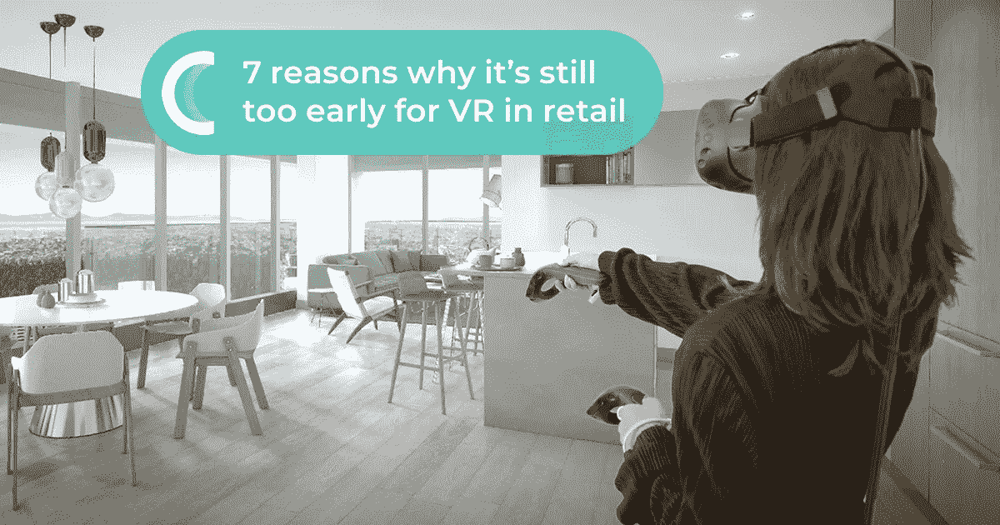
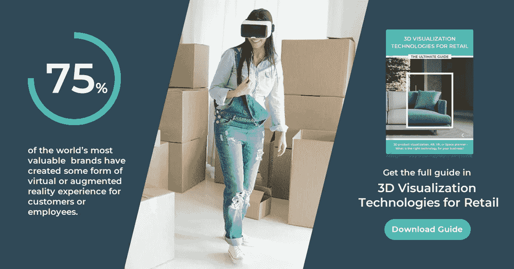
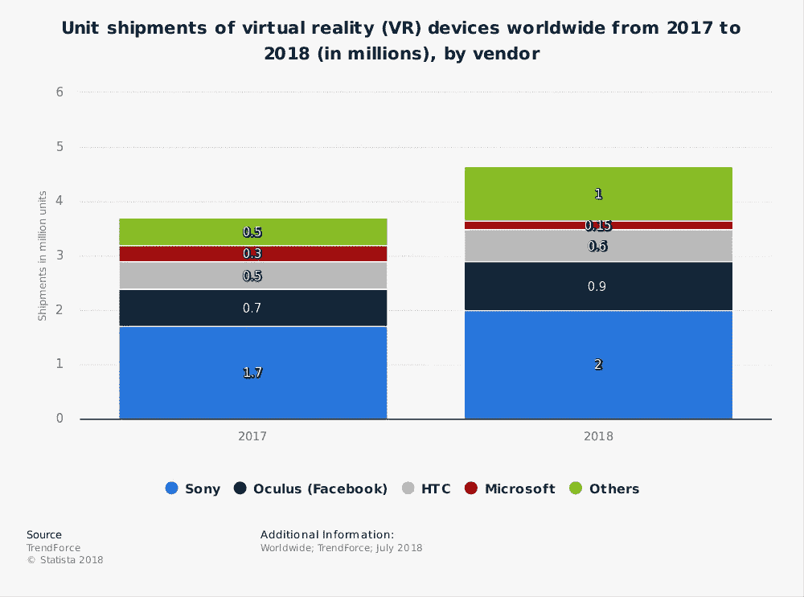
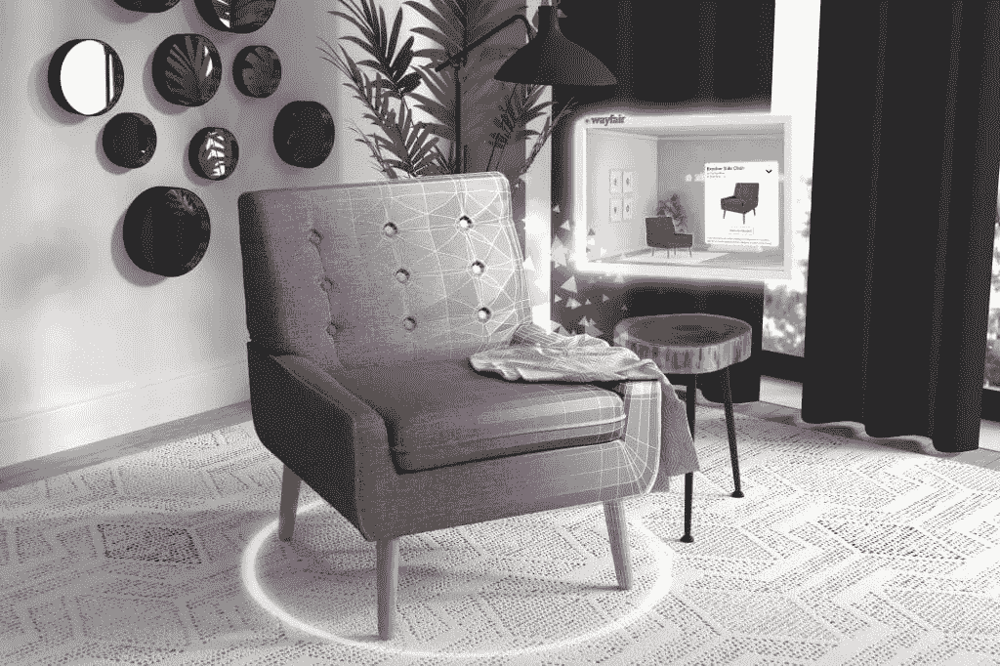

# 为什么 VR 在零售业还为时过早的 7 个理由

> 原文：<https://medium.datadriveninvestor.com/7-reasons-why-its-still-too-early-for-vr-in-retail-d40c112f14bb?source=collection_archive---------31----------------------->

零售业正在进行一场重大的技术革命。总是保持联系的客户在购物时渴望获得全渠道体验。随着零售商专注于创建以购物者和体验为中心的商店，他们尝试沉浸式技术来引入未来体验。

## 在我们开始之前

虚拟现实是一个 3D 的，计算机生成的环境，人们可以探索。这项技术创造了一个完全人工的世界，人们可以操纵物体或执行一系列其他动作。

虚拟现实是最具沉浸感的体验，因为它屏蔽了真实世界，使用户意识不到他们周围的环境。对于这种虚拟体验，客户必须有特殊的耳机，但仍然相当昂贵。

## VR 是零售业的下一件大事吗？

我们不断被关于虚拟现实是零售业的下一件大事以及它将如何很快改变购物体验的新闻和文章轰炸。

但是“很快”是什么意思呢？事实真的是这样吗？

我们不能否认虚拟现实已经到来，我们正在目睹一些最大的公司为他们的客户试验和引入沉浸式体验。根据 Spiceworks 的数据，世界上 75%最有价值的品牌已经为客户或员工创造了某种形式的虚拟或增强现实体验。

[https://www.cylindo.com/guide/ultimate-guide-for-product-visualization-technologies/](https://www.cylindo.com/guide/ultimate-guide-for-product-visualization-technologies/)

然而，我们仍处于旅程的起点。这一领域需要更多的发展。这项技术没有达到客户的期望，而且还不足以成为主流。根据来自 Perkins Coie 的[研究，受访者认为用户体验是大规模采用虚拟现实的最大障碍(41%)，反映了对技术限制和性能问题以及庞大硬件的持续担忧。](https://www.perkinscoie.com/en/21626/2018-augmented-and-virtual-reality-survey-results.html)

我们仍然无法想象购物者在家里，坐在沙发上，戴上耳机去购物，这就是为什么 VR 目前不具有可扩展性。然而，许多品牌和零售商试验这种技术，以吸引更多的店内顾客，并最终创造出物理空间有限，但具有独特的沉浸式体验的未来商店。

然而，我们仍处于旅程的起点。这一领域需要更多的发展。这项技术没有达到客户的期望，而且还不足以成为主流。根据 Perkins Coie 的研究，受访者认为用户体验是大规模采用 VR 的最大障碍(41%)，反映了对技术限制和性能问题以及庞大硬件的持续担忧。

早在 2016 年，宜家就推出了[虚拟现实厨房体验](https://www.ikea.com/ms/en_US/this-is-ikea/ikea-highlights/Virtual-reality/index.html),让顾客能够在真实尺寸周围走动，虚拟 3D 厨房并与物品互动。顾客们配备了两根魔杖，可以自由导航，改变橱柜或抽屉的颜色，甚至可以虚拟烹饪。当他们收集人们关于他们想做更多的反馈时，他们最想做的是——肉丸。这并不奇怪，在这一点上，客户将虚拟现实视为娱乐，而不是产品可视化技术，原因有很多。

今天，我们希望揭开虚拟现实在零售业中的神秘面纱，并帮助您减轻与这项新的尖端技术相关的一些风险因素。

下面就来追根究底，阐述一下为什么 VR 在零售领域还为时过早。

**1。昂贵的设备**

虚拟现实最明显的缺点是它需要硬件，所以它不容易扩展，直到大多数客户在家里没有这样的设备，由于用户体验(技术限制和性能问题)，内容提供和设备的[价格](https://www.perkinscoie.com/en/21626/2018-augmented-and-virtual-reality-survey-results.html)，这不太可能很快发生。IDC 的全球季度增强和虚拟现实耳机跟踪报告发现，AR 和 VR 耳机的出货量比去年有所下降。该报告显示，VR 和 AR 耳机的出货量同比下降 30.5%，2018 年第一季度共计 120 万台。根据 IDC 的说法，这主要是因为耳机制造商不再免费赠送他们的产品(三星连续两年在其智能手机中提供免费的 VR 耳机就是这种情况)。然而，专家预测，到 2022 年，VR 头戴设备的出货量将从 2018 年的 24%增长到 44.6%。

根据 Statista 的数据，2018 年 VR 设备的出货量为 465 万台(2017 年为 370 万台)。索尼拿走了最大一块蛋糕，有 200 万台 VR 设备。

**2。缺少相关内容**

根据 Perkins Coie 的说法，大规模采用虚拟现实技术的第三大障碍(仅次于用户体验/庞大的硬件和成本)是内容提供(例如，缺乏优质内容、可用内容的数量)。必须有足够引人注目的虚拟现实内容，这样客户才能看到硬件投资的价值。对高质量而不仅仅是视觉愉悦的内容的需求将比以往任何时候都更加重要。

**3。低与高保利资产**

让我们把事情搞清楚——低多边形资源是一个 3D 多边形网格，它有少量的多边形，所以它经常看起来是块状的，缺少细节，但它仍然展示了基本的形状。另一方面,“高多边形”资源具有大量的多边形，这些多边形与基于物理的材质结合在一起可以生成照片般逼真的外观。在这个阶段，虚拟现实技术大多利用中低保利资产。谈到零售，尤其是家具行业等严重依赖视觉感官的行业，如果你想转移在线购买之旅，高保利，逼真的视觉效果是必不可少的。低保利资产不能灌输购买决策的信心。

**4。全频道虚拟现实——说起来容易做起来难**

未来的商店将是数字世界和物理世界的融合，结合了电子商务的便利优势和实体商店的产品开发优势。传统零售商已经意识到数字销售的重要性和第一数字印象的力量，而 pure-plays 发现，即使是一个小型的画廊式商店也可以对业务产生重大影响(例如，今年早些时候，La-Z boy 收购了 Joybird，Interior Define 开设了第一家实体店)。
今天的企业需要意识到多渠道并不等于全渠道。如今，许多公司面临的全渠道挑战是在所有渠道中保持一致和相关的内容。

如上所述，虚拟现实面临的主要商业挑战是，在可预见的未来，用户不会广泛采用虚拟现实。这里的一个主要障碍是昂贵的耳机设备。我们都同意，购物者可以在家，坐在沙发上，戴上耳机去购物的场景仍然是我们无法想象的。即使公司投入巨资来实现这一点，这个过程也需要一些时间。目前，公司正在店内试验由 VR 技术驱动的沉浸式体验，以创造未来的商店。

**5。顾客不会被无意义的互动所打动**

忘记“哇”的因素。顾客在寻找相关的购物体验。如果你使用 VR 来创造无意义的互动，你会损害你的品牌，你会失去客户。首先关注基础知识，然后尝试沉浸式技术。如果你准备推出一个虚拟现实体验，确保它是相关的，值得的。如果你想使用虚拟现实来销售更多产品并使产品可视化，你必须创造相关的、引人入胜的体验来简化客户的决策过程。否则，客户使用你的 VR 只是为了好玩，对你销售更多没有帮助。

**6。你的目标受众准备好 VR 了吗？**

Z 世代是对 VR 最有热情的一代。但问题是:他们是你的目标受众吗，他们有你所在行业所需的购买力吗？如果你是一家家具零售商，那么 Z 世代离你的目标还很远，因为他们不是家具的决策者。久而久之认为，像千禧一代和 Z 世代这样在技术飞速发展的时代成长起来的消费者，将会成为具有最高购买力的主导决策的一代。那将是提供沉浸式购物体验来吸引顾客注意力的时候了。

7 .**。品牌形象与投资回报率**

VR 还处于实验阶段(尤其是零售)，所以更适合做品牌形象的节目，而不是可衡量的结果和 ROI。目前，它更多的是以品牌为中心，而不是以客户为中心。看事情将来如何发展将会很有趣。在这个阶段，从技术投资回报率的角度来看，虚拟现实更适合以创造嗡嗡声为中心的品牌倡议和营销计划。

两年前，世界上最大的家具、家居用品和装饰电子商务公司之一 Wayfair 开设了一个创新实验室 Wayfair Next，以开发和完善交互式 3D 体验。他们的第一个虚拟现实实验是 Patio Playground，这是一个应用程序，让客户通过使用它来增强户外设置，获得家具的虚拟视图。他们的第二个虚拟现实应用程序 IdeaSpace 使客户能够探索各种独特的空间，并在互动环境中购物。由于他们在新技术上的不断投资，Wayfair 被 Fast Company 评为 AR/VR 领域十大最具创新性的公司之一。几天前，他们宣布在[推出 Wayfair Spaces](https://venturebeat.com/2018/10/11/wayfair-spaces-uses-magic-leap-augmented-reality-for-interior-design/) ，这是一款室内设计和房间规划应用，邀请消费者探索专业设计的房间，并通过混合现实在家中大规模可视化产品。首先，有数百种产品可供选择，并计划在未来增加更多。目前，它只是一个可视化应用程序，没有电子商务组件。除了不断的技术创新，今年他们终于接受了全渠道的力量，几个月前开设了第一家实体店。

Source: Wayfair Technology Blog

底线是——VR 正处于炒作阶段。大公司尝试这项技术，小公司紧随其后。我们不能否认 VR 在零售领域有巨大的潜力。然而，需要更多的相关内容、更多的使用案例和更好的资产质量，才能让客户购买 VR 耳机，从而为 VR 成为主流铺平道路。

喜欢你正在读的东西吗？太棒了，这只是我们免费零售 3D 可视化技术指南的一小部分。[点击此处下载完整指南](https://www.cylindo.com/guide/ultimate-guide-for-product-visualization-technologies/)。

*原载于 2018 年 10 月 18 日【www.cylindo.com】**。***