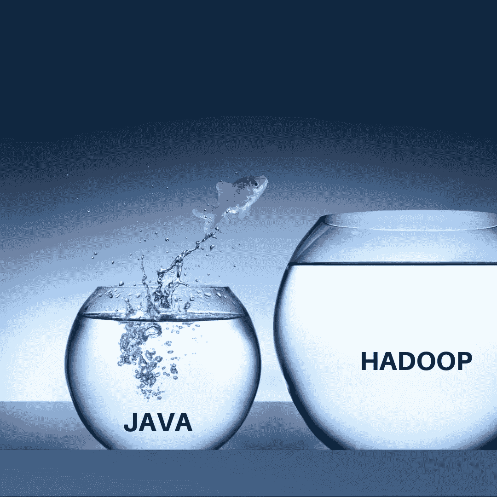

# Java 开发人员应该学习 Hadoop 的 7 个理由

> 原文：<https://medium.datadriveninvestor.com/7-reasons-why-java-developers-should-learn-hadoop-96b7607469f2?source=collection_archive---------13----------------------->

想象一下，两个女孩站在你面前——第一个女孩可爱、漂亮、有趣，脸上的笑容让任何男人都想为她而死。另一个女孩长相一般，不爱说话，不太引人注目……和你通常在餐馆收银台看到的女孩没什么不同。你会约哪个女孩出去？如果你像我一样，你会选择有魅力的女孩。你看，生活充满了选择，做出正确的选择是最重要的。

如果你是一名 Java 开发人员，那么你可能会有更多的选择——比如从 Java 转换到 Hadoop。

 [## 为什么数据将改变投资管理|数据驱动的投资者

### 有人称之为“新石油”虽然它与黑金没有什么相似之处，但它的不断商品化…

www.datadriveninvestor.com](https://www.datadriveninvestor.com/2019/01/25/why-data-will-transform-investment-management/) 

大数据和 Hadoop 是业界最流行的两个流行语。您可能在 Java payscale 论坛上遇到过这两个术语，或者看到过您的资深同事为了获得更高的薪水而做出改变。我要告诉你的是，从 Java 到 Hadoop 的升级不仅仅是保持最新技术的更新或获得评估，而是要有能力并把你的职业生涯放在第五档。

对于所有有抱负的 Hadoop 开发人员来说，好消息是大数据行业已经突破了 500 亿美元大关，全球排名前 720 位的公司中有超过 64%有兴趣投资这项前瞻性技术，这是 Gartner 在 2013 年披露的。

如果这还不能令人信服，那么看看这些数据:

1.根据 IDC 的一份报告，大数据产业正以每年 31.7%的速度增长。
2。Forrester 说，Java 开发人员被视为 Hadoop 开发人员的最佳替代选择。
3。一份分析行业报告称，Hadoop 开发人员的工资比 Java 开发人员高出 250%。

**Hadoop 有什么特别之处？**

与无法处理大量数据的传统数据库不同，Hadoop 提供了存储和处理海量数据的最快、最便宜和最智能的方式，这也是它在大公司、政府机构、医院、大学、金融服务、在线营销机构等中如此受欢迎的原因。熟悉这种语言的最好方法是在线查看初学者的大数据 Hadoop 课程。

好了，现在让我们来看一些 Java 开发人员应该转向 Hadoop 的理由。

## 1.Java 开发人员易于学习

像拉斐尔·纳达尔这样的网球运动员喜欢红土场地，因为那里的场地非常适合他，这也是他最成功的地方。同样，任何 Java 开发人员都会喜欢 Hadoop，因为它完全是用 Java 编写的——一种您已经非常熟悉的语言。对于像您这样的专业人士来说，从 Java 切换到 Hadoop 是小菜一碟，因为 Hadoop 中使用的 MapReduce 脚本是用 Java 本身编写的。太棒了，不是吗？

当调试 Hadoop 应用程序和使用 Pig(编程工具)拉丁语命令时，您的 Java 技能将会派上用场。

## 2.帮助您在竞争中保持领先

如果你是 Java 专业人士，你只是被看成是人群中的一个人。但是，如果你是一名 Hadoop 开发者，你会被视为人群中的潜在领导者。大数据和 Hadoop 工作是市场上的热门交易，拥有所需技能的 Java 专业人员很容易被大公司选中，获得高薪待遇。你所要做的就是参加大数据 Hadoop 在线培训计划，从专家那里学习概念。

## 3.进入更大领域的空间

幸运的是，这条路并没有在 Hadoop 和 MapReduce 上结束。使用您的 Hadoop 技能和专业知识进入更高层次(如人工智能、数据科学、传感器网络数据和机器学习)的黄金机会总是存在的。这些都是新兴市场，你会看到他们在未来 4-5 年内主导这个行业。在大数据和 Hadoop 方面的良好知识可以增加你进入一些依赖大数据的大型公司的机会，如亚马逊、雅虎、脸书、Twitter、IBM 和易贝。

## 4.面向 Hadoop 专业人员的利润丰厚的软件包

通过从 Java 转换到 Hadoop，你可以期待更高的薪水和更好的职业前景——这种薪水和头衔是你妻子喜欢的。根据 Indeed 的数据，在美国，拥有 1-2 年经验的大数据 Hadoop 开发人员的平均年薪约为 14 万美元。然而，随着你获得经验并成为一名高级 Hadoop 开发人员，你将能够获得 40 万美元以上的高薪。

## 5.工作质量的提高

学习大数据 Hadoop 非常有益，因为它将帮助您更轻松地处理更大、更复杂的项目，并提供比您的同事更好的输出。要被评估，你需要成为一个能在团队中有所作为的人，这就是 Hadoop 让你成为的人。

## 6.与行业一起成长

IDC 预测，大数据和 Hadoop 用户群(大公司和政府机构)可能会以每年 27%的速度增长，因此您有很好的机会提升自己的知识和技能，与行业一起成长。

大数据和 Hadoop 广泛用于 IT 日志分析、欺诈检测、社交媒体分析和呼叫中心分析等应用中，在线学习大数据 Hadoop 教程可能是立即开始 Hadoop 职业生涯的方式。一旦你做到了这一点，你会发现与最新技术保持同步会变得容易得多，进入顶级组织将不再是“仅仅是一个梦想”——它将成为现实。

就这样了，伙计们！这些是为什么学习 Hadoop 很重要以及它如何帮助您的职业生涯更上一层楼的一些坚如磐石的原因。如果您对此不熟悉，那么学习基础知识和了解 Hadoop 的一个简单方法是在 Google 上搜索“如何在线学习 Hadoop”这样的短语。当你这样做的时候，请不要忘记回来和我们的读者分享一些有用的信息。

*最初发表于*[*【https://www.mytectra.com】*](https://www.mytectra.com/blog/7-reasons-why-java-developers-should-learn-hadoop/)*。*