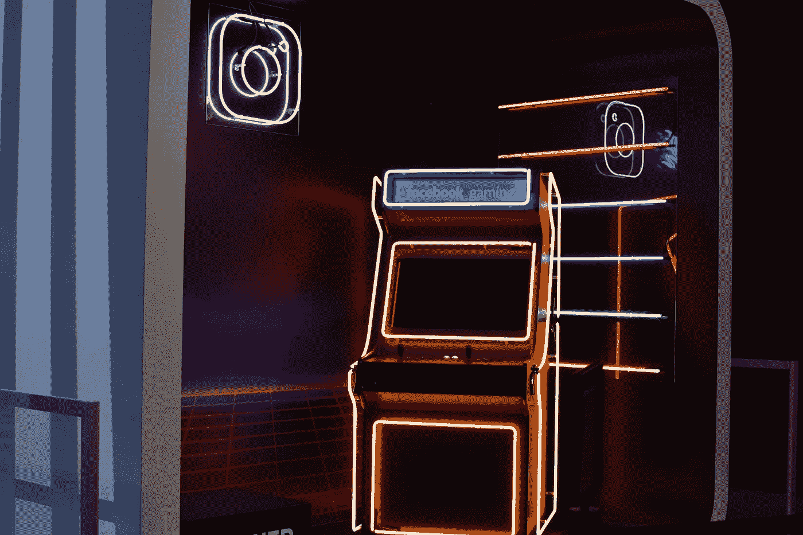
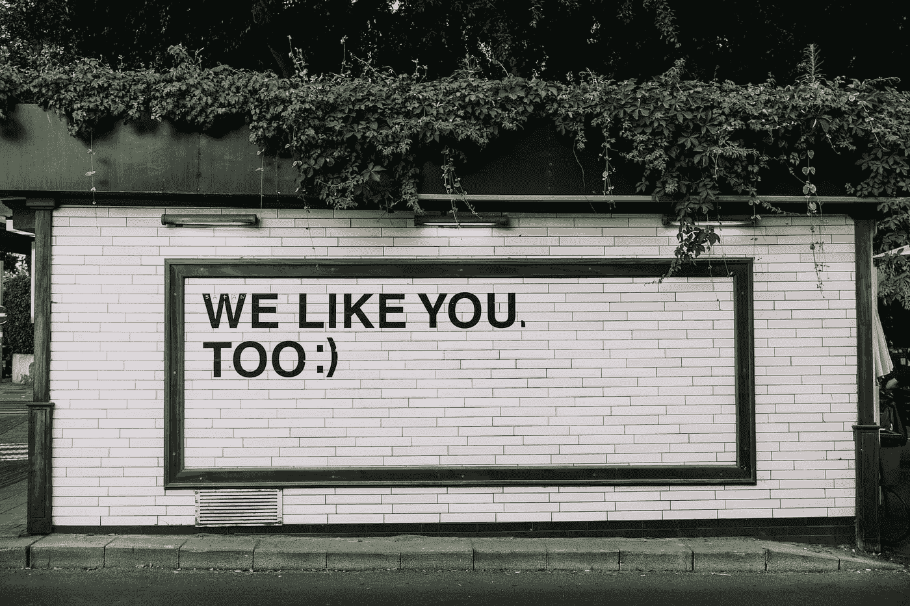

# 你应该出现在社交媒体上的 7 个理由

> 原文：<https://medium.datadriveninvestor.com/7-reasons-why-you-should-be-on-social-media-fc243332378f?source=collection_archive---------7----------------------->

## 留在社交媒体上有真正的好处

Photo by [Pete Pedroza](https://unsplash.com/@peet818) on Unsplash

我知道，我知道。

就在上个月，我给了你 7 个理由去做社交媒体排毒，我仍然坚持我在那里说的每一个字。

就像任何东西一样，你不应该吃太多。

 [## 你应该进行社交媒体排毒的 7 个理由

### 自从 2004 年我在 Friendster 上注册了我的第一个社交媒体页面，我就被吸引住了！正在连接…

medium.com](https://medium.com/datadriveninvestor/7-reasons-why-you-should-do-a-social-media-detox-3eb5cdaec346) 

但是，话虽如此，尽管近年来社交媒体上的东西变得相当有害，但仍然有很多好处，这是我对我写的排毒文章的反驳文章。

 [## 社交媒体收听让您随时了解|数据驱动型投资者

### 虽然社交媒体倾听是一种顶级趋势，但它应该是每个现代营销策略的一部分。保持和谐…

www.datadriveninvestor.com](https://www.datadriveninvestor.com/2019/02/26/social-media-listening-keeps-you-plugged-in/) 

让我告诉你社交媒体的 7 个好处，以及为什么你仍然应该保留至少一个社交媒体账户，并保持相对活跃。

开始了。

# 跟上最新的新闻和趋势

不管你喜不喜欢，很多最新的新闻和趋势都在社交媒体上。无论是在脸书、Twitter、Instagram 还是 LinkedIn 上，它都会首先出现在其中一个平台上。

服装公司会把他们最新的时装设计放在他们的 Instagram 页面或 Insta Stories 上。名人或有影响力的人会将它上传到他们的社交媒体账户，以推广他们所代表的任何品牌。时尚博客或网站上的新闻报道可能会稍微晚一点。即使是著名的新闻频道也有自己的社交媒体账户，大多数时候，你会先在那里看到最新的新闻，然后才上他们的官方网站。

所以，如果你想了解所有最新的新闻、八卦、时尚、流行话题等，社交媒体仍然是一个可以去的地方。

# 发展您的业务

让我们面对它，如果你想发展你的业务，你需要营销它，你需要做广告。如果不是在社交媒体上，还有什么地方更好呢？脸书页面非常适合这类事情。Instagram 也正成为一个更好的地方。如果你的账户有大量的追随者，那就更是如此。

当你发布某个东西的时候，你的追随者会自动得到通知，你会立刻得到关注和关注。最棒的是，你可以给它们添加#标签，让那些专门寻找你卖的东西的人找到你的产品。

这也是一个认识其他企业主、同行甚至竞争对手的好地方。你可以看到其他人在做什么，他们如何营销和销售他们的产品。你可以向别人学习，或者获得如何做得更好的想法。

# 与他人保持联系

是的，你有像 WhatsApp、Telegram 和 iMessage 这样的消息应用程序来做这一切，但出于某种原因，人们仍然在 Facebook Messenger 和 Instagram 上发送私人消息。具体为什么，我不知道，但人们仍然这样做。或者也许你没有对方的号码，你只是通过社交媒体与他们联系，所以你通过那些平台给他们发消息。

老实说，有时候你只是不想让它变得太私人化(尽管这是你和接收者之间的私人信息)，所以在社交媒体上发一条信息就可以了。

我想我们就是喜欢变化，不是吗？我们的选择越多越好。我知道有些人在几个不同的聊天群中，在几个不同的平台上，但是这些群里的所有参与者都是同一批人！人类只是复杂的人。

这就是为什么我的这篇文章与我的另一篇略有不同。

# 一个很好的逃生空间

我谈到了从社交媒体中排毒如何帮助我们与现实世界重新联系，这仍然是非常正确的。然而，现实世界有时会变得相当可怕，我们只是想要一个地方来逃避这一切。一个逃避一切的地方，哪怕只是一小会儿。

有些人通过阅读来做，有些人通过假期来做，但你能有多长时间去度假，有时你就是不想看书。另外，那些东西需要你花钱。

浏览你的社交媒体源不需要你花一分钱。完全免费！当你只是漫无目的地浏览图片或看你最喜欢的名人或朋友的故事时，你会忘记那一刻你周围发生的一切。有那么一秒钟，什么都不重要，你可以放松一下。

只是提醒一句，你要控制好自己的节奏，确保自己不会落入上瘾的陷阱。

# 一个好的论坛空间

是的，实际上是。尤其是在推特上。

有人会在推特上发布一个话题，让它成为一条线索，人们会直接跳到它上面，开始一场关于它的适当的对话/辩论。有时，来回的回复和对话会持续几个小时。就像任何论坛一样，你有好的也有坏的。你有文明的，也有真正不文明的。

你需要记住的是，当在网上讨论时，尤其是和陌生人讨论时，你不应该把每件事都看得太重。在一天结束时，它是一个表达我们对事物的看法和观点的空间。

那些东西很主观。

如果有人不同意你看待事物的方式，那没关系。网上讨论要文明。如果事情变得有点激烈，那么是时候暂时退出了。

# 在线相册

谁会认为是对的呢？但真的是。我有两个 Instagram 账户。一个帐户是严格为家人和非常亲密的朋友。在这个账户上，我可以随意分享我家人的个人照片，比如我的儿子。

另一个账户是我的公共账户，在那里我主要分享我的健身旅程和其他事情，但从不分享个人照片。我从未在我的公众号上发布过我妻子或儿子或任何其他家庭成员的照片。

不管怎样，我在 Instagram 账户上总共有大约 13000 张照片，在我的脸书上还有更多。只要这些平台还在，那些图就一直在。我在社交媒体上发布的大部分照片，我都存在我的外置硬盘上。一个在线相册上有一千多张照片，用我的指尖就能轻松访问。

只要确保备份那些你真的真的想保留的文件。

# 进度检查器

这在某种程度上与上述观点有联系。正如我所说的，我的公众 Instagram 账户是我发布我的健身旅程和其他事情的地方。我也用它作为我进步的参考点。

就我的健康目标而言，我可以看到我是否正朝着正确的方向前进，或者我是否正朝着别的地方前进。这也有助于我让人们评论我的照片。当一个陌生人告诉你你正在做一件正确的事情时，你几乎可以相信。不管怎样，来自他人的肯定有时是件好事，尤其是当你需要一点激励的火花时。

我会继续使用我的社交媒体账户来检查进度。不仅仅是在健身方面，而是在一般情况下。回顾我两年前、三年前甚至七年前写的帖子，我看到自己作为一个人有了多大的改变和成长。它帮助我确定我是否正在成为我想要成为的人。

Photo by [Adam Jang](https://unsplash.com/@adamjang) on Unsplash

正如我在本文开头所说的，我仍然相信时不时地进行社交媒体排毒。我仍然每月进行一次为期一周的排毒，它帮助我与社交媒体保持了健康的关系(甚至有这样的事情吗？).

适度是我们做任何事情的关键，社交媒体也不例外。正如它有它的负面影响一样，它也有它的正面影响，我们可以尽自己的一份力量去接受正面影响，摒弃负面影响。

也许是时候对你的社交媒体账户进行一次春季大扫除了，这样你就可以享受其中最好的部分了。