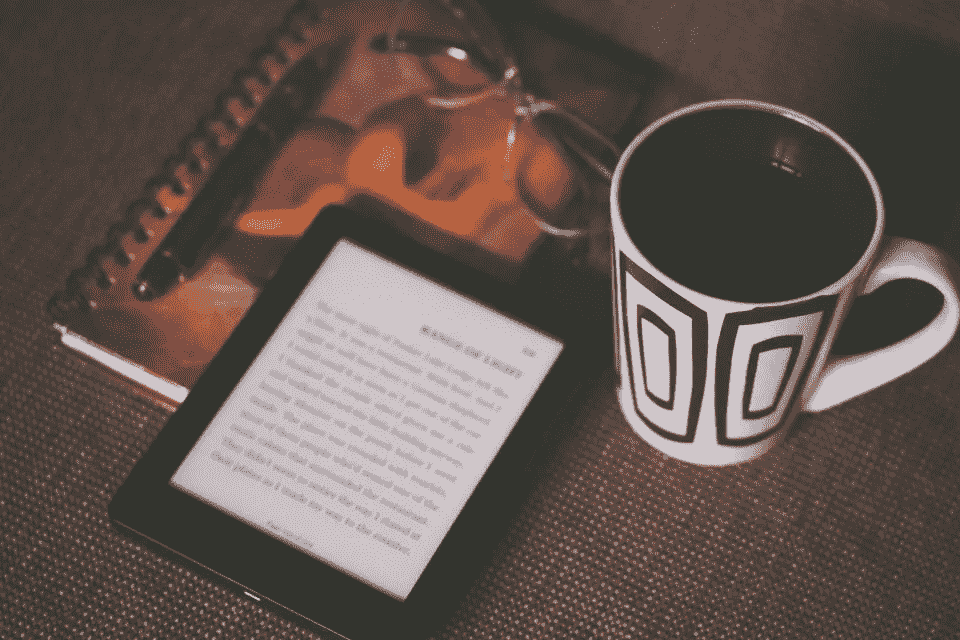

# 你应该拥有 Kindle 的 7 个理由

> 原文：<https://medium.datadriveninvestor.com/7-reasons-why-you-should-own-a-kindle-f004e57644e1?source=collection_archive---------26----------------------->

还在坚持电子阅读器吗？让我来分享一下这款设备如何一手重新定义了我的阅读生活，并让我的学习加速。

去年我妻子买了一台 Kindle。我不为所动——很大程度上是因为我一直很喜欢我的书的物理属性。无论是精装书的安静权威，还是我灵活的平装书的友好个性，还是我的钢笔和荧光笔将我与我如此欣赏的作品联系起来的方式，我都不打算用我与实体书的联系来换取数字屏幕上无情的灰色空白。不可能。

但当时另一个现实也在起作用——我的理想和我的阅读现实之间存在明显的不协调。即使作为一名英语专业的学生，一名教育工作者，一个为了乐趣而写作的人，一个真正对文字和散文的艺术性着迷的人，我也没有以我想要的方式阅读。

我是说，我认为自己是个读者。实际上，我不时地在这里和那里阅读。但是我实际上并没有持续不断地从一张封面到另一张封面的进步，我知道我想要并且在我的生活中需要这种进步。

时间使我疲惫不堪。慢慢地，但肯定地，我最初对妻子的电子阅读器的厌恶消退了。最后，在研究生课程的必读书目中，我屈服了，点击了购买。

我的阅读永远地改变了。这不是夸大其词。

以下是你也应该冒险进入数字黑暗面，享受 Kindle 体验的七个理由——我正看着你，你是纸质书的虔诚信徒和忠实捍卫者。

1.  **这是一个强大的睡前阅读程序。**Kindle 屏幕上的光线可以调得非常低和柔和，因此对眼睛很容易，不会像手机和平板电脑的蓝光那样人工刺激。这是难以置信的轻便和可操作性，所以是的——精装版*夏洛克·福尔摩斯*选集现在是就寝时间的一种可能。我甚至喜欢 Kindle 屏幕独特的轻微粗糙感——这是一种不同于我们手机和平板电脑玻璃表面的感官体验。因为它不需要灯，它不会让我的伴侣保持清醒。简而言之，舒适的睡前阅读习惯意味着我现在几乎每天都在阅读。
2.  它跟踪并存储我所有的精彩片段。我从大学时代就开始做荧光笔。我知道不是每个人都以这种方式接受内容，但我吸收了非小说类作品中的精华和伟大的思想，我可以回归、反思和重新组合。当我意识到我的每一个精彩片段都被自动同步并存储在我的 Goodreads 个人资料中时，我简直不敢相信我的好运。现在，每一句鼓舞人心的话，每一句令人难忘的话，每一个激励人心的概念都留给我去发微博，分享，发电子邮件，发帖子，并进一步思考。同样的便利也适用于任何基于书籍的学术研究。绝对的游戏改变者。
3.  **它让我轻装上阵。我这里有一个有趣的故事。几年前，我在另一个城市拜访了我的父母。和他们住在一起时，我逛了一家廉价书店，大赚了一笔。但是当我飞回家的时候，我在机场花了很多钱——我的行李箱超重了，我还付了一大笔附加费。现在，打包一箱书被公认是一个相当愚蠢的举动，我敢肯定这不是你的现实。但是我怀疑你已经感受到了在坐飞机的时候不得不将阅读范围缩小到 1-2 个标题的痛苦。有了 Kindle，你再也不用拒绝你的可爱之处了。**
4.  **它的实时进度报告有着奇怪的激励作用。**叫我统计呆子吧，但是没错——知道我在睡觉前多读了 2%的*原子习惯*或*像海盗一样平衡*，我睡得更香了。也许这只是我自己的书呆子习惯，但随着我每天阅读大大小小的书籍，这些百分比越来越高，这变得如此令人满意。有些晚上，我筋疲力尽地睡在干草上。但是我从来不会累到读完一本书的 2%。
5.  它提供了亚马逊的优势。加油——这是亚马逊！因为我在 Kindle 上一直登录我的亚马逊账户，所以我能够在不到一分钟的时间内添加市场上的任何一本书。当然，你可以指出这种权力促成的消费主义或冲动消费倾向。但是说实话，这是相当强大的力量。你已经接受了 iTunes 上的点播音乐和网飞上的点播视频。为什么不接受按需阅读呢？它就在你的指尖。
6.  **它的云访问扩展到各种设备。和你一样，我不太喜欢在手机或电脑上看书。但事实是，你有时会被发现没有 Kindle。你知道吗？与其坐在好市多(Costco)收银台前的六辆手推车里查看电子邮件或浏览社交媒体，你可能更喜欢阅读布伦·布朗(Brene Brown)的《敢于领导》(Dare to Lead)。承认吧——这是一个不错的选择。**
7.  一直以来都是你的书。归根结底，Kindle 外壳可以带来简单而深刻的体验，让你立刻拥有所有的书籍。无限、舒适、方便的阅读，无与伦比。就是这样。

是的，使用电子阅读器是一种范式转变。我花了一段时间选择屏幕而不是纸张。但多亏了我的 Kindle，我现在读得更多了，读完了更多的书，以我从未想象过的方式学习和成长。

我明白了——你喜欢你的平装书。但是我的建议是给这个强大的设备一个机会。它可能会重新点燃你内心的读者，点燃你从来不知道存在的学习和想象的热情。

*还不是 Kindle 皈依者？请在下面的评论中告诉我为什么！感谢阅读。*