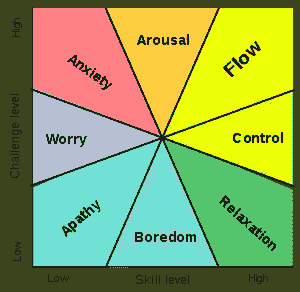

# 用这 7 个简单的技巧编写更好的代码来利用流状态

> 原文：<https://medium.datadriveninvestor.com/7-simple-ways-to-leverage-flow-state-to-write-better-code-4c61d3eba087?source=collection_archive---------15----------------------->

Photo by [Steve Halama](https://unsplash.com/@steve3p_0?utm_source=medium&utm_medium=referral) on [Unsplash](https://unsplash.com?utm_source=medium&utm_medium=referral)

Mihály Csíkszentmihály 推广了流动状态的思想。在他的研究中，他将“心流”描述为一种精神状态，在这种状态下，一个人在进行一项活动时会完全沉浸、专注并享受手头的任务。这是一种无重量的感觉，伴随着完美的生产力。在这种状态下，仅仅做工作本身就是内在的激励，不需要奖励或结果作为激励因素。这是一种“进入状态”的感觉

作为一名开发人员，您可能在编写代码或解决具有挑战性的问题时经历过这种禅宗般的状态。去年的[Code](https://adventofcode.com/)来临之际，我正在解决编程难题，这是一项编码挑战，在 12 月份每天都会发布一个新的难题。不幸的是，随着我们职业生涯的进展，我们会发现自己在平凡的任务上工作，一遍又一遍地解决同样的问题。正如我们将学到的，常规可能是心流状态的敌人。

当我们的工作变得例行公事时，可能会觉得获得心流是不可能的。达到和保持心流状态的困难包括冷漠、厌倦和焦虑的感觉，如果我们的技能与我们工作的挑战不一致，这些感觉就会突然出现。有一个有用的图表解释了我们的工作会给我们带来怎样的感受:

Challenge vs. skill, showing “flow” region.

当挑战较低，一个人的技能水平也较低时，这会导致冷漠——对手头的任务缺乏兴趣。如果挑战很低，但我们的技能水平很高，我们可能会很快变得无聊。当挑战高于一个人感知的技能和能力水平时，这可能会引起高度的焦虑感。

根据[维基百科](https://en.wikipedia.org/wiki/Flow_(psychology))，“一般来说，这些状态不同于心流状态，因为当挑战与一个人的技能水平相匹配时，心流就会出现。因此，csikszentmihályi 说，“如果挑战太低，我们可以通过增加挑战来恢复流动。如果挑战太大，你可以通过学习新技能回到心流状态。"

在具有挑战性的工作和高技能组合的交叉点上实现流动。我们需要做有挑战性的工作，同时感觉我们有能力完成它。不幸的是，大部分时间条件都不太适合心流。幸运的是，虽然我们不能强迫自己进入心流状态，但是我们可以改变我们的工作方式来增加进入状态的可能性。

为了帮助我们理解这一点，欧文·谢弗在 2013 年[白皮书](http://humanfactors.com/whitepapers/crafting_fun_ux.asp)中提出了七个心流条件:

1.  知道该做什么
2.  知道如何去做
3.  知道自己做得有多好
4.  知道去哪里(如果涉及导航)
5.  高感知挑战
6.  高感知技能
7.  不受干扰

那么，我们如何才能尝试将我们的工作推向一个能让我们实现心流的方向呢？让我们逐一分析:

## (1)知道该做什么

知道要做什么似乎是显而易见的，但我们都曾坐下来参加工作会议，却不清楚我们需要做什么。我们认为我们可以即兴发挥，但你的目标必须清晰且可实现，以最大化实现心流的机会。要做到这一点，在你开始之前，确定你的工作会议成功的样子。对你需要完成的事情有一个明确的想法。

## (2)知道如何去做

如果你没有足够的知识来完成手头的任务，你可能会陷入担心或焦虑的状态。如果你觉得自己没有足够的知识来完成手头的任务，暂停一下，重新组织。为了提高你的技能水平，你可以阅读和研究，直到你学到足够的知识来解决这个问题。成功实现心流包括让问题变得可实现。

## (3)知道自己做得有多好

关于你做得有多好的反馈需要清晰和直接。对我们开发人员来说幸运的是，在编写软件时，很容易设置环境来快速显示成功或失败。例如，作为一名前端开发人员，您可以以尽快拥有一个工作原型为目标。在你正在进行的工作上设置一个自动刷新，以实时观察你的项目进展。

另一个即时反馈的策略是实践[测试驱动开发](https://en.wikipedia.org/wiki/Test-driven_development)。即使你没有坚持 TDD 的每个方面，也要写几个单元测试，并经常运行它们。如果您的测试套件很快，您甚至可以在每次保存文件时运行您的测试。您将能够马上判断出您的代码是否工作正常。

无论您采用什么方法，都要以小的增量工作，并经常测试您的工作。

## (4)知道去哪里

当涉及导航时，知道去哪里有助于你实现流畅(例如，当进行体育运动时)，但我认为这对于编程任务也是至关重要的。经常停下来思考下一步该做什么会让人分心。通过将任务分解成小的、清晰的、具体的行动来帮助自己知道去哪里，并创建一个详细的待办事项列表。

## (5)高感知挑战

你正在做的工作需要有足够的挑战性来实现心流。如果你的技能很高，但任务没有挑战性，你可能会陷入厌倦甚至冷漠。对平凡的工作提出可感知的挑战可能很难，但是如果你能让你的工作更具挑战性，你就更有可能滑入那种难以捉摸的心流状态。

不要把事情弄得太复杂，而是问问你自己，在做这项工作的时候，你是否能教会自己一些新东西。有没有可能用一种新的范式或设计模式来解决这个问题？你能使用一种新的编程语言特性或者甚至学习一种新的编程语言来实现你的目标或者更优雅地编写你的代码吗？

## (6)高感知技能

你需要相信你的技能足以完成手头的任务。我们已经了解到，如果你的技能水平对于这项任务来说太高，你可能会感到厌烦。如果你的技能水平太低，你可能会变得焦虑。你的实际技能可能足以完成工作，但如果你不相信自己，你永远不会达到那种流畅的状态。

作为程序员，我们容易患上冒名顶替综合症。总会有比你更聪明、更优秀、更有口才的人。这并不意味着你不能完全胜任这项工作。如果你的技能很高，但你仍然觉得不能胜任手头的任务，看看这些关于战胜骗子综合症的资源。要达到心流状态，你需要有技能，你需要感觉自己有成功的潜力。

## (7)不受干扰

在今天这个充斥着争夺你注意力的通知的世界里，摆脱干扰可能感觉是一个不可能的目标。谢天谢地，有工具可以帮忙。首先也是最重要的一点，如果你想完成一次富有成效的工作会议，我建议你关掉手机，把它放在另一个房间里。

有免费的浏览器插件可以屏蔽分散注意力的网站，比如 Chrome 的 [StayFocused](https://chrome.google.com/webstore/detail/stayfocusd/laankejkbhbdhmipfmgcngdelahlfoji?hl=en) 和 Firefox 的 [Leechhblock](https://www.proginosko.com/leechblock/) 。有一款面向 iOS 和 Android 的手机应用叫做 [Forest](https://www.forestapp.cc/en/) ，可以帮助你训练注意力。如果所有这些都失败了，你甚至可以用[自控应用](https://selfcontrolapp.com/)在 Mac 上屏蔽令人分心的网站。

虽然没有万无一失的方法来强迫心流，上面的建议可以帮助你达到那种难以捉摸的状态。研究表明，心流工作会有巨大的好处！在工作区工作可以增加你的成就感和整体满意度。它可以让平凡的事情看起来更有趣，让你对解决挑战更加兴奋。

最后，如果你想对这个话题有更多的了解，一定要看看 Mihály Csíkszentmihályi 的开创性 TED 演讲:心流，快乐的秘密:

Mihaly Csikszentmihalyi at TED2004

*最初发表于*[*【the-pastry-box-project.net】*](https://the-pastry-box-project.net/nina-zakharenko/2018-february-14)*。*