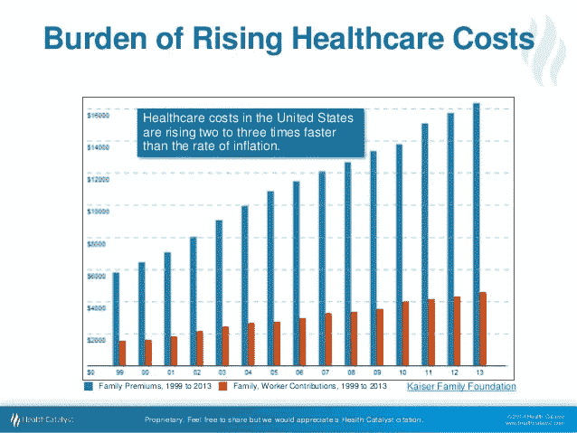
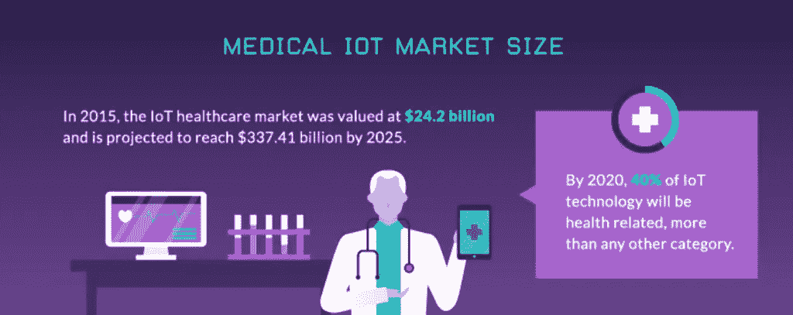
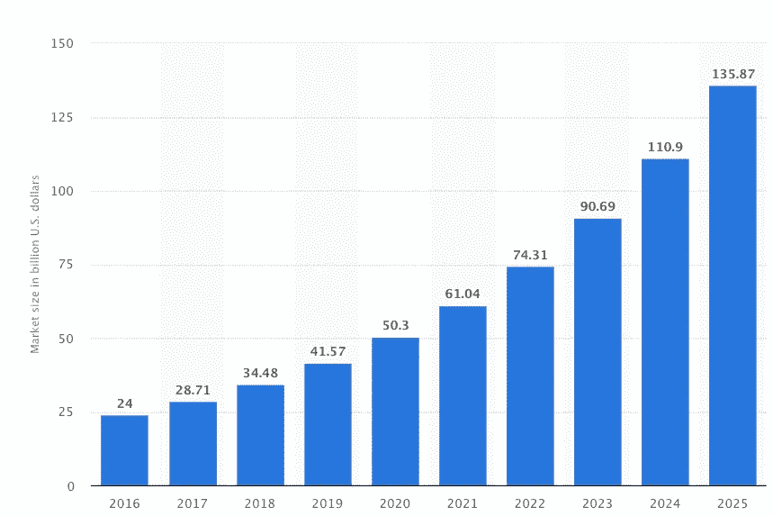
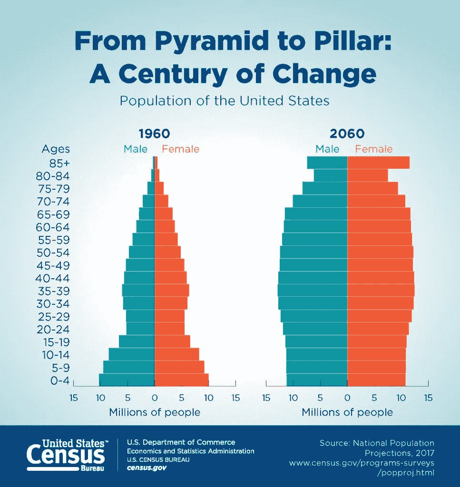

# 医疗保健物联网创新的 7 项惊人数据

> 原文：<https://medium.datadriveninvestor.com/7-staggering-stats-on-healthcare-iot-innovation-fe6b92774a5c?source=collection_archive---------2----------------------->

Adhere Tech Smart Pill Bottle

**物联网的发展正在推动改变生活的医疗物联网进步(IoMT)。以下是医疗保健物联网的 7 个快速事实。**

正如我们所知，不断上涨的医疗成本加上不断增长的消费者期望为医疗保健的广泛转型创造了完美的条件。物联网(IoT)的发展及其向医疗保健领域的延伸，即所谓的医疗物联网(IoMT ),在医疗保健行业引发了一场革命。 **IoMT 指的是医疗设备、软件应用、卫生系统和服务的互联基础设施**——它已经实现了从反应性到预防性的以病人为中心的护理的转变。在这个三角地带，我们拥有完美的基础，在医疗物联网方面,[放眼全球，立足本地](https://smashingboxes.com/blog/triangle-perfect-place-healthcare-iot-innovation/)。

 [## 大笔资金和尖端技术:人工智能/人工智能投资将如何革新医疗保健…

### 在过去几年人工智能(AI)和机器学习(ML)的显著发展中…

www.datadriveninvestor.com](https://www.datadriveninvestor.com/2018/03/22/big-money-and-cutting-edge-technology-how-investment-in-ai-ml-will-revolutionize-the-healthcare-industry/) 

以下是你需要知道的 7 个数据。

# 1.据估计，医疗物联网(IoMT)将为医疗保健行业节省 3000 亿美元。

Source: [https://www.slideshare.net/healthcatalyst1/rising-healthcare-costs-why-we-have-to-change](https://www.slideshare.net/healthcatalyst1/rising-healthcare-costs-why-we-have-to-change[/caption])

美国的医疗保健费用以惊人的速度增长。根据劳工统计局的数据，2017 年美国人平均在医疗保健上花费 4342 美元。其中，平均 3414 美元用于医疗保险。 **IoMT 设备可让非危重患者在家接受监护，从而减少住院人数并降低成本。**可穿戴和可植入设备在医疗保健领域的兴起为患者和医疗服务提供者提供了远程诊断工具，进一步减少了昂贵的办公室就诊需求。这是降低成本的众多因素之一，高盛估计 IoMT 将拯救医疗行业 3000 亿美元。

# 2.70%最畅销的可穿戴设备致力于健康和健身。

像 Fitbit Versa、Apple Watch Series 4 和三星 Galaxy Watch Active 这样的产品已经席卷了健康行业——甚至通过提醒佩戴者关键的、未诊断的健康状况来挽救生命。事实上，****70%的畅销可穿戴设备都致力于健身/健康。**这些设备能够收集和分析大量数据，并使用户能够了解自己的健康状况，做出明智的决策，甚至可以作为各种“第一响应者”,提醒用户注意异常情况，并建议他们去看医生。**

# **3.到 2020 年，40%的物联网设备将用于医疗保健行业。**

****

**医疗保健物联网设备已经在整个行业掀起了波澜，包括电子皮肤贴片、智能床垫、血糖监测仪、智能手表、联网吸入器等等。举个例子，最近 FDA 批准的(也是有争议的)“智能药丸”。**这些支持物联网的数字药丸通过药丸中嵌入的可摄取传感器**来记录服药情况，从而帮助确保服药依从性。该系统的工作原理是从药丸的传感器向可穿戴贴片发送信息，然后将信息传输到移动应用程序，以便患者和提供商可以跟踪药物的摄入。这只是有可能改变医疗保健面貌的数千项创新中的一项。**

# **4.到 2025 年，医疗保健相关的物联网收入预计将增长到 1350 亿美元以上**

****

****Projected size of the Internet of Things (IoT) in healthcare market worldwide from 2016 to 2025 (in billion U.S. dollars)** [https://www.statista.com/statistics/997959/worldwide-internet-of-things-in-healthcare-market-size/](https://www.statista.com/statistics/997959/worldwide-internet-of-things-in-healthcare-market-size/[/caption])**

**2016 年，全球医疗保健相关的物联网收入达到 240 亿美元，预计到 2025 年这一数字将超过 1350 亿美元。**目前有超过 260 亿台物联网设备处于活跃状态，预计到 2025 年全球将有 750 亿台设备投入使用。**企业家利用医疗技术增长的潜力令人难以置信——还有比三角地区更好的地方吗！**

# **5.35%的 IT 领导者认为安全性是物联网成功的最大障碍**

**正如我在 [7 成功整合 IoMT 需要克服的障碍](https://smashingboxes.com/blog/7-obstacles-overcome-successful-iomt-integration-part-2/)中提到的，由于医疗设备中存储着高度敏感的医疗和财务信息，**网络安全问题是广泛采用 IoMT 设备的一大障碍。在这方面，政府监管可以有所帮助。物联网(IoT)[2019 年网络安全改善法案](https://www.scribd.com/document/401616402/Internet-of-Things-IoT-Cybersecurity-Improvement-Act-of-2019)的出台旨在“利用联邦政府采购权力，鼓励增加物联网设备的网络安全。”该法案仍在众议院和参议院各自的委员会中讨论。但这种对话是在机构层面进行的，这一事实本身就是乐观的理由。****

# **6.预计美国的远程医疗市场总额将在 2022 年达到 220 亿美元**

****

****Total telemedicine market in the United States from 2014 to 2025 (in billion U.S. dollars)** Source: [https://www.statista.com/statistics/938551/telemedicine-market-size-forecast-united-states/](https://www.statista.com/statistics/938551/telemedicine-market-size-forecast-united-states/[/caption])**

**在 IoMT 技术的支持下，**远程医疗将患者从候诊室的痛苦中解放出来。**它改善了医生和患者之间的沟通，让医生有更多时间审查和咨询同事的个案，以提供明智的解决方案。正是由于其简单、方便和成本效益，这是当今医疗保健中增长最快的领域之一。预计 2022 年美国市场总额将达到 220 亿美元。**

# **7.截至 2010 年，美国老年人口约占 13%，但占医疗保健总支出的 34%。这个数字还在继续上升。**

****

**Source: [https://www.census.gov/library/visualizations/2018/comm/century-of-change.html](https://www.census.gov/library/visualizations/2018/comm/century-of-change.html[/caption])**

**IoMT 创新的另一个驱动力是预计未来 30 年老年人口增长和劳动年龄人口下降的结合。到 2025 年，全球 80 亿人口中有 12 亿将是老年人；这个数字几乎相当于印度的人口。老龄化通常伴随着健康问题，增加了患者的费用，并且经常需要家庭护理。IoMT 是解决这些棘手问题的完美方案。一个例子是医疗依从性，这是老年人的普遍问题。像家庭药物管理器这样的 IoMT 设备可以发出定时提醒、患者剂量，并记录何时/是否服药的数据。数据然后被传输到一个手机应用程序，在那里亲人和医疗服务提供者可以查看进展。像这样的设备可以最大限度地减少甚至消除对家庭助理的需求。**

**据估计，2020 年全球价值将达到 4570 亿美元，物联网解决方案的影响将是深远的。物联网的发展将继续影响医疗物联网领域改变生活的进步(IoMT)。医疗保健提供商和患者将通过降低医疗保健成本、改善患者体验和新的患者护理标准，继续从医疗保健技术创新中获益。**

**要了解更多关于 IoMT 的承诺，请查看以下文章:**

*   **[研究三角:医疗保健和物联网创新的最佳场所](https://smashingboxes.com/blog/triangle-perfect-place-healthcare-iot-innovation/)**
*   **[成功整合 IoMT 需要克服的 7 个障碍，第二部分](https://smashingboxes.com/blog/7-obstacles-overcome-successful-iomt-integration-part-2/)**

**在 [Twitter](https://twitter.com/nick_sb) 和 [LinkedIn 上与我联系。](https://www.linkedin.com/in/nickjordan1/)**

**[订阅博客更新](https://mailchi.mp/smashingboxes/subscribe)**