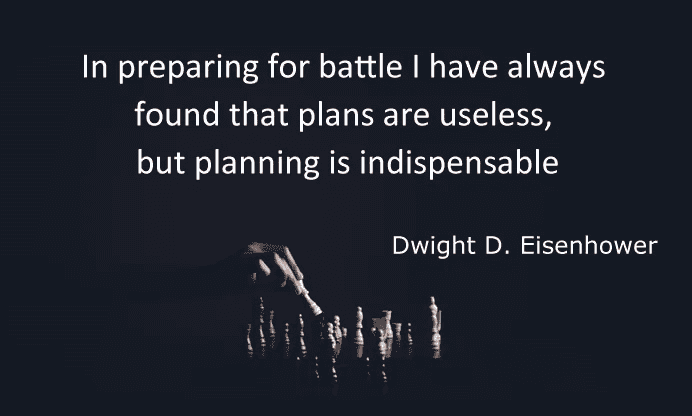

# 成功的 7 个步骤

> 原文：<https://medium.datadriveninvestor.com/7-steps-for-success-e4a479bc5b63?source=collection_archive---------5----------------------->

## 如何保证你达到目标

改变是每天的承诺。我们都是从最美好的愿望开始的，然而，很难将这些变成习惯。有些领域确实帮助我养成了成功实现目标所必需的习惯。

无论你是否已经[确定了你的价值观](https://medium.com/@WeRFreeweelin/what-are-your-values-7169fc82a13b?source=friends_link&sk=c31b5e54c5a347cc263e1edd5188dd26)和[设定了你的个人目标](https://medium.com/@WeRFreeweelin/steps-to-change-28a389cbdab4?source=friends_link&sk=66380824ee97c41d4470fca340021603)或者正在寻找提升工作目标的方法，思考这 7 件事应该可以帮助你完成它们。

# 1.解决你的心魔

我们实现抱负的最大障碍往往是我们自己。老生常谈，但却是事实。高绩效者经常经历冒名顶替综合症，我们所有人都有一个内心批评家告诉我们，我们永远不会成功。那个声音是一个自我实现的预言。当我们允许自己只听它的时候，那就是我们失败的时候。

养成一个习惯，当那个声音在你脑海深处低语时，你要识别出来。留意那些有相似观点的人，远离那些相同的观点。写下你做过的所有伟大的事情，以供日后参考。如果你只能想到你的弱点，那就把它们写下来。认识到弱点只是你优势的另一面，并在你的脑海中重新定义它们。

> **比如:**我很不擅长依赖别人。我不会本能地委托他人或寻求帮助。另一方面是我非常自我驱动和独立。

# 2.组建你的团队

当我想做一些雄心勃勃的事情时，我发现自己写下了我想经常见面的人的名字。这些人富有挑战性，鼓舞人心，最重要的是，积极向上。我后来才意识到，我在做什么，我在组建我的团队。

它可能是你最好的朋友，家庭成员，你爱的人或者和你一起工作的人。可以是一个人，也可以是很多人。也许他们和你有着相似的目标。可能是你加入的 MeetUp 群。重要的是，你可以和他们讨论你的目标，一起思考你对它们的感受。他们会帮助你克服障碍，并对你的进步充满热情。他们会把你举起来。与他们交谈后，你会对继续你的道路感到兴奋。

> **顶尖提示:**慎重选择。那些和你有相同消极想法的人可能会阻碍你实现目标。想想你真正需要的品质，以及谁最能体现这些品质。

# 3.有计划

你需要什么来实现你的目标？也许有一些实物，像一个记事本或一双跑鞋。你想什么时候把事情做完？有计划会增加成功的可能性，想想你需要什么，什么时候需要。

> 提示:根据需要而不是想要来思考。你需要一台新的笔记本电脑吗？或者你只是想要一个。你现在需要它，还是几个月后需要它？

在你的日记中划出时间。试着每周都这样做，以减少你不得不做的决定。如果需要改，那就改。不要放弃，因为你意识到那一周你突然有了承诺，这让你的计划泡汤了。你如何重新安排你的时间表来适应这个承诺？如果这次做不到，下次会有什么不同的做法？

# 4.揭露

> 每一个决定都会因为之前的决定而变得更容易。

当我去跑步时，我和自己有一个约定，我只需要“出现”。在这种情况下，这意味着我必须走到房子外面的人行道上。为了做到这一点，我必须早起，我必须穿上装备。在我走到人行道上之后，我可以做我想做的事情，包括回去睡觉。我一次都没进去过。

我做的就是给自己一个选择的假象，给自己提供一个小小的筹码。我绝对要做好每一件事，然后最后的决定是我的。我只是增加了我做出正确选择的可能性，把选择的因素从别处拿走了。

露面是我们任何人都能做的最强有力的事情之一。如果我们的目标之一是花更多的时间和家人在一起，那么出现在家里对这个目标有很大的帮助。如果我们想写更多的东西，那么拿着空白的拍纸簿和笔出现在咖啡馆就已经成功了一半。取消尽可能多的决定，让你只剩下一个，这是强大的。

# 5.让成功成为一种习惯

失败是成功不可避免的垫脚石。我们必须失败，这样我们才能成功。每个人都说。有时虽然失败在我们的控制之内。例如，因为我们在看电视而晚睡，然后不早起。因为我们用力过猛而受伤。虽然原谅自己很重要，但思考如何让这种行为不再成为习惯也很重要。相反，我们想让成功成为一种习惯。我们越是反思是什么阻碍了我们实现目标，我们就越有机会安排我们的生活，从而成功是不可避免的。

# 6.记住，你要这个！

你要实现这个目标，不管是什么！你非常想把它写下来，并全身心地投入其中。记得你有多兴奋，记得你会有多棒。当你情绪低落时，你甚至可以给自己写一张便条，一些鼓舞人心的话语，传达你的热情和希望。

当事情变得困难时，休息一下并记住“为什么”可以改变一切。如果你在挣扎，想象一下当你完成目标时你会有什么感觉。想象一下生活会是什么样子，在那一刻花点时间。

# 7.创造反思的空间

## **找个时间**

无论是周日早上的咖啡还是周一上班的第一件事，留出时间回顾你的目标是保持正轨的最简单的方法之一。没有创造空间来定期回顾它们和我们的动机，我们将不可避免地失败。

## 回顾

本周什么进展顺利？什么不顺利？为了成功，你需要做些什么改变？

检查我们对目标的兴奋感也很重要。解决内疚感和检查目标是否仍然是正确的都是回顾的一部分。尽可能对自己诚实。如果你在挣扎，试试 [5 个为什么练习](https://en.wikipedia.org/wiki/5_Whys)来了解你的感受。

> **让你的目标可见**
> 
> 把你的价值观和目标写在某个容易拿到的地方有助于这个过程。它可以是在线的，这样你就可以从任何地方访问它们，也可以是你随身携带的笔记本。你甚至可以把它们挂在镜子旁边的墙上，这样你每天早上都能看到它们。所有这些我都做了，我把它们放在谷歌文档里，写在我工作记事本的背面，把写有我目标的卡片贴在墙上。让自己被他们包围意味着我在潜意识里受到他们的影响，从而更有可能成功。

这是反思的七个方面，它们真正帮助我认识到不足的感觉，让我周围都是支持我的人，并最终让我反思我需要改变什么来实现我的个人目标。

真正帮助你实现目标的是什么？

*不知道什么目标会让你开心？在我下面的其他博文中，试着找出你的价值观和最适合你的目标。*

[What’s important to you? — A guide to discovering your values](https://medium.com/@WeRFreeweelin/what-are-your-values-7169fc82a13b?source=friends_link&sk=c31b5e54c5a347cc263e1edd5188dd26)

[Steps to Change — How to live by what’s important to you](https://medium.com/@WeRFreeweelin/steps-to-change-28a389cbdab4?source=friends_link&sk=66380824ee97c41d4470fca340021603)