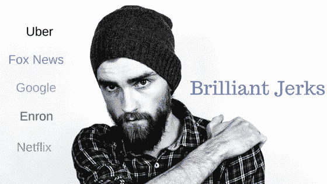

# 对付聪明混蛋的 7 个策略

> 原文：<https://medium.datadriveninvestor.com/7-strategies-to-deal-with-brilliant-jerks-d1ca5591a7a3?source=collection_archive---------0----------------------->

每个公司都有才华横溢的混蛋，他们可以取得巨大的成就，但却伤害了他们遇到的大多数人。

这些聪明的混蛋很有天赋。他们觉得碰不得，因为他们可能很有效率。****把这类员工比喻成推土机，因为他们决心把事情做好。尽管如此，他们缺乏软技能和对不成文规则的理解，这些规则使组织能够顺利运作。****

****聪明的混蛋聪明能干，但社交能力和道德品质却令人质疑。聪明的混蛋不尊重规则或政策，他们不公平竞争，他们唯一关心的是提升，而不是推动他们的公司前进。政策和规则是为了规范他们的行为而制定的，但他们却是规避规则的高手。****

****聪明的混蛋觉得他们不必表现得很好；他们认为自己是房间里最聪明的人。他们缺乏同理心。他们是以自我为中心的个人，认为组织以他们为中心。****

# ****福克斯新闻频道****

****组织很难与这些聪明的混蛋打交道，因为他们富有生产力、创新性和创造性，带来价值和利润。然而，他们缺乏对同事的尊重，威胁到公司文化，并导致士气低落。****

****比尔·奥雷利是一个众所周知的聪明的混蛋。他工作出色，获得了很高的评价，但他也缺乏谦逊，这让他成为一名理想的团队成员。相反，他认为他的明星影响力允许他违反法律和欺负其他人。****

****几年前，NYT 报道说 [**比尔·奥雷利**解决了许多性骚扰](https://www.nytimes.com/2017/04/01/business/media/bill-oreilly-sexual-harassment-fox-news.html)案件。结果，广告商暂停了有线新闻收视率最高的电视节目《奥赖利因素》的广告，迫使福克斯新闻频道终止了与他的合作。****

****福克斯新闻频道做出这个决定是基于经济还是道德基础？****

# ****安然（公司名）****

****围绕聪明的混蛋建立组织是非常危险的。****

****不幸的是，安然是这些公司中的一员，他们都是些才华横溢的混蛋；他们赚了很多钱，违反了每一条法律，越过了太多的道德底线。安然公司的问题开始于他们雇佣了许多超级明星，他们愿意违法去赚另一美元或者虐待他人来达到另一个目标。****

****聪明的混蛋组织成功了，但他们不会持续很久，他们的大多数高管最终都进了监狱。****

****安然有四个主要价值观:正直、沟通、尊重和卓越。我读过很多关于安然的书，我可以告诉你，他们只看重优秀。大多数安然公司的领导人都坐过牢，该公司宣布破产。****

****价值观不是写在积满灰尘的墙上的文字。相反，价值观是组织内部可以接受的行为。****

# ****优步****

****优步价值观比其他任何东西都重要。****

****[**苏珊·福勒**](https://www.susanjfowler.com/blog/2017/2/19/reflecting-on-one-very-strange-year-at-uber) 是一名工程师，今年初离开优步，接触了公司内部的文化。如果要我描述优步的文化，我会说它偏爱聪明的混蛋。做好你的工作，我们会忽略其他任何事情。福勒在她的博客上写道，优步的文化和人力资源部门如何忽视性骚扰案件和歧视事件，因为违法者是顶级的执行者。****

****不幸的是，苏珊·福勒的故事不是一个独特的故事，也不是一个孤立的事件。如今，优秀的混蛋文化是大多数科技公司的主导文化。****

****优步首席执行官**特拉维斯·卡兰尼克** 回应称，要求阿里安娜·赫芬顿调查性骚扰指控，并承诺会做得更好。阿里安娜·赫芬顿面临的挑战是，大多数与这位优步首席执行官打交道的人都称他是一个聪明的混蛋。****

****特拉维斯·卡兰尼克是一位伟大的商人，但他的个性开始影响公司的业绩。几个月前，他与一名优步司机就司机赔偿问题发生了激烈的争论，并且表现得很糟糕。****

****优步正试图修复他们的文化，但他们能从过去几个月收到的可怕宣传中恢复过来吗？我正在密切监视局势。****

# ****谷歌****

****优步的另一位软件工程师 Aimee Lucido 告诉我“60%的女性在硅谷遭到过性骚扰”，这让我震惊****

****她补充说，她也受到了骚扰。她详细讲述了她在谷歌职业生涯早期的一件令我恶心的性骚扰事件。公司需要停止把聪明的混蛋当成超级明星，他们需要让他们承担责任。再多的利润也不能成为骚扰他人的理由。目的不能证明手段是正当的。****

****谷歌现在是一家成熟的公司，我们没有听到他们办公室里性骚扰的故事。不过，我们需要认识到，聪明的混蛋文化在许多行业都很普遍。****

# ****如何解决这个问题:****

## ****1.模仿想要的行为****

****最高管理层可以通过**模仿他们希望在他人身上看到的行为**来改革一个组织的文化，让人们负起责任，并奖励适当的行为。****

## ****2.文化契合度雇佣****

****大多数公司雇佣拥有高超技术技能的员工，而不是文化契合的人。人力资源部门必须改变招聘新员工的方式。雇佣有合适技能的合适的人。重点应该是人，而不是技能。****

## ****3.新绩效指标****

****公司需要调整他们的薪酬方案，纳入非财务指标，如软技能和文化契合度。****

## ****4.重视诚实****

****最高管理层应该奖励强化公司价值观的行为。如果你想强化诚实，就奖励诚实。****

## ****5.实行零容忍政策****

****人力资源部门应该对违反人类尊严和公司文化的行为持零容忍态度，不管违反者是否是顶级员工。****

## ****6.提供安全的工作环境****

****人力资源部应该开发一个系统，让员工感到报告任何事故都是安全的。****

## ****7.没有混蛋政策****

****有一个“没有混蛋”的政策。****

> ****[**网飞 CEO**](https://www.inc.com/jim-schleckser/why-netflix-doesn-t-tolerate-brilliant-jerks.html) 认为，对付才华横溢的混蛋最好的方法就是解雇他们，“不要容忍才华横溢的混蛋。团队合作的成本太高了。” **—雷德·哈斯汀斯******

****很明显，在你的组织中有杰出的混蛋会伤害你的公司形象，破坏文化，并削弱你组织的道德人格。****

****安然**在它崩溃的时候学到了这一点，**谷歌**修正了这条船，以确保他们能够生存，而**优步**正在处理他们聪明的混蛋，但他们需要更强硬一点。******

**最高管理层应该模拟他们喜欢看到的行为，清楚地传达他们的价值观，并设计一个新的衡量定量和定性结果的绩效指标。**

**最后，我想以此结束:做一个善良的人，雇佣善良的人。**

> **获取我的免费指南，创建一个惊人的商业战略[www.leadwithintegritygroup.com/strategy](https://www.leadwithintegritygroup.com/strategy)**