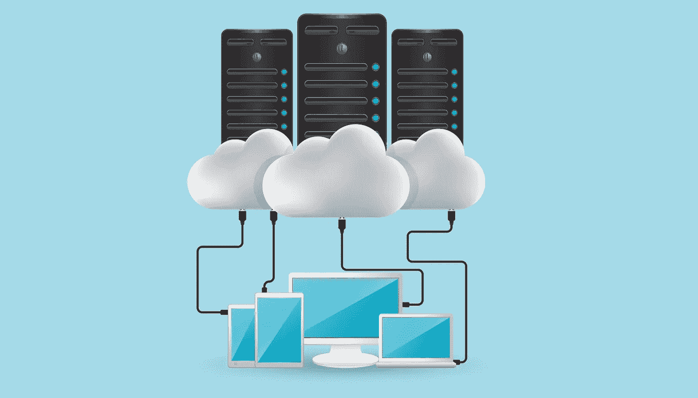
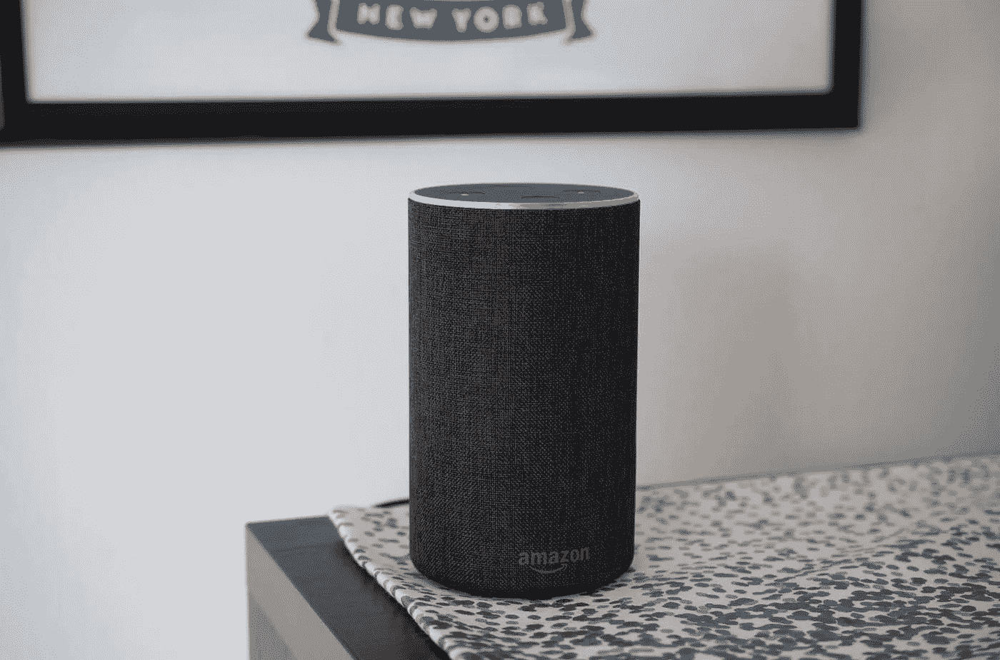
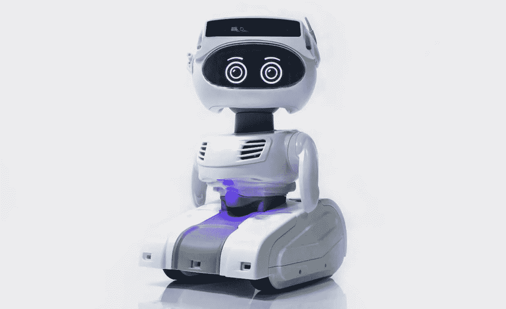

# 2019 年的 7 个技术预测

> 原文：<https://medium.datadriveninvestor.com/7-tech-predictions-for-2019-634fb349dc6?source=collection_archive---------13----------------------->

虽然距离十年的标志还有一年，但 2019 年看起来是科技行业在一段时间内最令人兴奋和最重要的一年。由于即将推出一些重要的新技术，包括 5G 和可折叠显示器，以及设备人工智能、个人机器人和其他令人兴奋的领域的重要增强，我们对新的一年有一种明显的期待感，这种期待感已经很久没有感受到了。

此外，2018 年对于几家大型科技公司来说是非常艰难的一年，所以也有很多人希望摆脱过去的一年，一头扎进令人兴奋的未来。本着这种精神，下面是我对 2019 年最大趋势和最重要发展的一些看法。

 [## 模式和机器人:一个复杂的现实数据驱动的投资者

### 哈耶克的名著《复杂现象理论》(哈耶克，1964)深入探讨了复杂性的话题，并断言…

www.datadriveninvestor.com](https://www.datadriveninvestor.com/2019/03/04/patterns-and-robotics-a-complex-reality/) 

# 预测 1:可折叠手机的销量将超过 5G 手机

至此，所有人都知道，2019 年将见证移动世界两项非常令人兴奋的技术发展的“正式”亮相:可折叠显示屏和配备 5G 调制解调器的智能手机。一些供应商和运营商已经宣布了这些设备，所以现在只是一个时间和数量的问题。

然而，并非所有人都意识到，这两种技术不一定会在今年携手出现:我们将看到支持 5G 的手机，我们将看到带有可折叠显示屏的智能手机。到目前为止，还不清楚我们是否会在 2019 年看到兼具这两种功能的设备。当然，最终我们会的，但将这些尖端技术推向大众市场的挑战表明，一些设备将包含其中的一种。(然而，需要明确的是，2019 年销售的绝大多数智能手机既没有集成 5G 调制解调器，也没有可折叠显示屏——这两种技术的高价格将限制它们在今年的影响。)

在短期内，我预测基于可折叠显示屏的手机将胜过 5G 手机，因为这些可弯曲屏幕对设备可用性和外形的影响如此引人注目，我相信消费者将愿意放弃潜在的 5G 速度提升。此外，鉴于对 5G 数据计划定价的担忧，有限的初始 5G 覆盖范围，以及一些美国运营商对其 5G“版本”的混淆(坦率地说，误导性)声明，我相信消费者将限制他们对 5G 的采用，直到更多这些问题变得清晰。另一方面，可折叠手机——虽然可能很贵——将提供非常明显的价值优势，我相信消费者会发现甚至更有吸引力。

# 预测 2:游戏流媒体服务成为主流

今年，视频流媒体市场的新进入者(苹果、迪士尼、时代华纳等)将受到极大关注。)，2019 年基于云的娱乐领域的意外突破赢家实际上可能是游戏流媒体服务，如微软的 Project xCloud(基于其 Xbox 游戏平台)和其他可能的进入者。

游戏流的想法是让人们能够在各种新旧 PC、智能手机和其他设备上玩顶级游戏。鉴于 PC 和移动游戏的巨大增长，以及电子竞技的普及，消费者市场已经准备好了一种(或两种)服务，允许游戏玩家在各种不同的设备类型和平台上玩流行的高质量游戏。

当然，游戏流并不是一个新概念，过去也有过几次失败的尝试。面临的挑战是在云驱动的连接这一经常不可预测的世界中提供及时、引人入胜的体验。这是一项非常困难的技术任务，需要无延迟的响应能力和高质量的视觉效果，并打包在一项易于使用的服务中，消费者愿意为此付费。

幸运的是，许多重要的技术进步正在汇集起来，使这一切成为可能，包括通过 WiFi(如 WiFi6)和广域蜂窝网络(5G 应该会改善更多)的整体连接性的改善。此外，GPU 在基于云的服务器中被广泛采用和优化。然而，最重要的是软件的进步，这些进步可以实现分割或协作渲染(一些工作在云上完成，一些在本地设备上完成)等技术，以及基于人工智能的对需要采取的行动或需要预加载的内容的预测。总的来说，这些技术和其他相关技术似乎有望实现一套引人注目的游戏服务，为成功部署这些服务的公司带来可观的收入水平。

还需要补充的是，虽然不太依赖硬件的游戏流媒体服务的强劲增长可能会对游戏专用 PC、GPU 和其他专注于游戏的硬件产生负面影响(因为人们可以使用旧的、功能较弱的设备来运行现代游戏)；事实上，情况可能恰恰相反。游戏流媒体服务可能会让更广泛的受众接触到最引人注目的游戏，进而可能会激励更多人购买针对游戏优化的个人电脑、智能手机和其他设备。游戏服务将给予他们在无法访问他们的主要游戏设备的情况或位置下玩(或继续玩)那些游戏的机会。

# 预测 3:云计算成为企业计算的标准

企业云计算的早期特点是预测公共云和私有云之间的赢家，甚至预测这些环境中的特定云平台。随着我们进入 2019 年，越来越明显的是，所有这些争论都是错误的，事实上，每个人都赢了，同时每个人都输了。毕竟，那些早期预言家中有谁会想到，在 2018 年，亚马逊将提供一个版本的亚马逊网络服务(称为 AWS Outpost)，公司可以在自己的数据中心/私有云内的亚马逊品牌硬件上运行该服务？

事实证明，正如许多现代技术发展一样，没有一个单一的云计算解决方案适用于所有人。公共、私有和混合组合都有自己的位置，在每个组中，不同的平台选项都有自己的角色。是的，亚马逊目前引领整个云计算，但根据工作负载的类型或其他要求，微软的 Azure、谷歌的 GCP(谷歌云平台)、IBM、甲骨文或 SAP 云产品可能都有意义。

真正的赢家是云计算模式，不管它在哪里或由谁托管。云计算不仅改变了人们对性能、可靠性和安全性的期望，它所激发的 DevOps 软件开发环境和它所支持的以容器为中心的应用程序架构也彻底改变了软件的编写、更新和部署方式。这就是为什么你会看到公司将他们的注意力从云计算的基于公共基础设施的方面转移到它所支持的灵活的软件环境。反过来，这也是为什么公司已经认识到利用多种云类型和云供应商并不是一个弱点或脱节的战略，而是一个可以在未来努力中利用的优势。随着云平台供应商预计在 2019 年致力于提高不同平台之间工作负载的互操作性(和可移植性)，很明显，多云世界将会继续存在。

# 预测 4:设备上的人工智能将开始改变关于数据隐私的对话

使用基于技术的设备、移动应用程序和其他基于云的服务时，最不为人所知的一个方面是，在这个过程中，我们有多少私人和个人数据被共享了——通常我们甚至不知道这一点。然而，在过去的一年里，我们都开始痛苦地意识到数据隐私问题有多严重(以及影响有多深远)。因此，科技公司所采用的数据处理实践受到了极大的关注。

与此同时，对于技术能够个性化这些应用和服务以满足我们特定兴趣、位置和环境的期望也在持续增长。人们希望并期待技术对他们来说“更智能”，因为它使使用这些设备和服务的过程更快、更有效、更有吸引力。

当然，难题在于，要实现这种定制，需要使用和访问某种级别的个人数据、使用模式等。到目前为止，这通常意味着你采取的几乎任何行动或分享的信息都被上传到某种类型的基于云的服务上，进行编译并与其他人的数据进行比较，然后用于生成某种回应，再发送回你。理论上，这给了你想要的定制和个性化的体验，但代价是你的数据被许多不同的公司共享。

从 2019 年开始，由于基于人工智能的软件和硬件功能在我们的个人设备上变得可用，更多的数据分析工作可以直接在设备上完成，而不需要在外部共享所有数据。具体来说，由于高通、Arm、英特尔、苹果等半导体相关公司的工作，在设备上进行人工智能推理(甚至一些基本的设备上训练)的想法正在成为现实。

这意味着——如果应用程序和云服务提供商支持它(这是一个很大的可能性)——你可以开始获得你已经习惯的相同级别的定制和个性化，但不必与云共享你的数据。当然，网络上的每个人都不太可能马上开始这么做(如果他们真的这么做的话)，所以不可避免的是，你的一些数据仍然会被共享。然而，如果一些最大的软件和云服务提供商(想想脸书、谷歌、推特、Yelp 等。)开始实现这一点，它可以开始有意义地解决过去一年左右提出的合法数据隐私问题。

值得称赞的是，苹果几年前就开始谈论这个概念了(还记得差别隐私吗？)并且已经只在个人设备上存储面部识别扫描和其他个人身份信息。在接下来的一年里，我希望看到更多的硬件和组件制造商将这一点提升到一个新的水平，不仅谈论他们的设备上数据安全功能，还谈论板载人工智能如何增强隐私。让我们希望更多的软件和云服务提供商也能支持它。

# 预测 5:美国科技行业监管成为现实

无论主要的社交媒体公司和科技公司是否启用这些板载人工智能功能，我很清楚，我们在美国的社会意识中已经达到了一个点，即管理所有这些个人数据的科技公司需要受到监管。虽然我会第一个承认缓慢的政府监管过程与快速发展的科技行业不匹配，但这仍然不是什么都不做的借口。因此，在 2019 年，我相信科技行业的第一批政府法规将会出台，特别是围绕数据隐私和披露规则。

从脸书等公司受到的强烈反对中可以明显看出，许多消费者非常关心收集了多少数据，不仅是关于他们的在线活动，还有他们的位置，以及他们生活中其他许多非常具体(和非常隐私)的方面。尽管这些公司声称我们自愿提供了几乎所有这些信息(由于令人困惑的措辞和从未阅读的许可协议)，但常识告诉我们，我们中的绝大多数人不理解或不知道这些数据是如何被分析和使用的。两党的立法者都认识到了这些担忧，尽管政治气候高度分化，但他们很可能会轻易同意对收集的数据类型、分析方式以及最终使用方式进行某种限制。

美国是否会建立在欧洲的 GDPR 法规、加州去年颁布的隐私法或完全不同的东西上还有待观察，但现在个人数据的价值和潜在影响已经明确，毫无疑问我们会看到控制有价值商品的法律。

# 预测 6:个人机器人将成为一个重要的新类别

几十年来,“社交”机器人——人们可以与之进行相对自然的互动——的想法一直是科幻小说中的传说。从《迷失太空》到《星球大战》,再到《瓦力》和《超越》,交互式机器人已经成为我们创造性想象的素材有一段时间了。然而，在 2019 年，我相信我们将开始看到一些主要技术供应商的个人机器人设备的更多实际实现。

例如，有传言称亚马逊正在开发某种基于个人助理的机器人，利用他们的 Alexa 语音数字助理技术。这种设备的具体形式和功能尚不清楚，但某种类型的移动设备(如，能够移动，不小且重量轻！)还提供机械功能(提升、搬运、清扫等)的可视智能显示器。)可能有道理。

虽然最近有许多公司试图将个人机器人纳入主流，但都失败了，我相信今年许多技术和概念正在汇集起来，使这一潜力变得更加可行。首先，从纯机械的角度来看，波士顿动力公司(Boston Dynamics)等公司现在展示的可怕的现实能力表明，移动、运动和环境意识能力在机器人世界中已经进步了多少。此外，越来越多的对话和移情人工智能功能现在被带到基于语音的数字助理，如 Alexa 和谷歌助理，表明我们与机器的交流正变得越来越自然。最后，像索尼最新的艾博机器狗这样的产品的吸引力也凸显了人们开始表现出以新的方式与机器互动的意愿。

此外，以机器人为中心的硬件和软件开发平台，如英伟达最新的 Jetson AGX Xavier 板和 Isaac 软件开发套件，计算机视觉的关键进展，以及围绕开源 ROS(机器人操作系统)的不断增长的生态系统，都强调了在 2019 年为实现机器人的商业和消费应用所做的越来越多的工作。

# 预测 7:基于云的服务将使操作系统变得无关紧要

多年来，人们一直错误地预测操作系统和独特平台的死亡(包括 2015 年 12 月的我)，但这一次真的是(很可能！)将要发生的事情。撇开玩笑不谈，随着我们进入 2019 年，越来越明显的是，基于云的服务正在使专有平台的价值与我们的日常使用越来越不相关。当然，设备的初始界面以及访问应用程序和数据的方式取决于每个技术供应商平台的独特变化，但我们在设备上做的真正工作(或真正的游戏)正越来越脱离操作系统用户界面的人工世界。

无论是在商业领域还是在消费者领域，无论使用什么样的平台，都可以更容易地获得我们想要做的事情。在商业方面，Citrix 和 VMWare 等公司的桌面和应用程序虚拟化工具的能力不断增强，以及微软从云中交付 Windows 桌面等举措，都表明在几乎任何设备上运行关键业务应用程序都变得非常简单。此外，私有(内部)、混合和公共云环境的增长正在推动独立于平台的应用程序的创建，这些应用程序只依赖于浏览器来运行。微软决定在其下一个版本的 Edge 浏览器中使用开源的 Chromium 浏览器渲染引擎，很明显，我们正在迅速走向一个最终真正以云为平台的世界。

在消费者方面，独立于平台的流媒体服务的快速增长也在促进专有操作系统的消失(或至少是升华)。从网飞到 Spotify，甚至是 Prediction 2 中提到的游戏流媒体服务，成功的基于云的服务正在将其大部分功能和智能构建到云中，并越来越少地依赖于特定于操作系统的应用程序。事实上，看看苹果如何开放和不依赖平台地开发其新的视频流媒体服务将会非常有趣。如果他们过于专注于基于苹果操作系统的设备用户，他们可能会产生非常小的影响(即使他们拥有庞大而富有的安装基础)，特别是考虑到竞争的强度。

像 Office 365 这样的交叉工作和消费产品也正在摆脱与特定操作系统的任何有意义的联系，而是专注于提供跨不同操作系统、屏幕尺寸和设备类型的一致体验。

抽象的概念远远超出了操作系统的层面。正在开发的新软件利用了来自高通、英特尔和 Arm 等供应商的各种不同的人工智能专用加速器(在他们的情况下是人工智能核心)，这些软件的编写水平足够高，允许他们在非常异构的计算环境中工作。虽然这可能对全部性能潜力有一定的影响，但这种方法带来的灵活性和广泛支持是非常值得的。事实上，一般来说，计算环境越是异构，操作系统和专有平台就变得越不重要。2019 年，这将是一个非常异构的计算世界，因此我相信这一预测的时刻终于到来了。