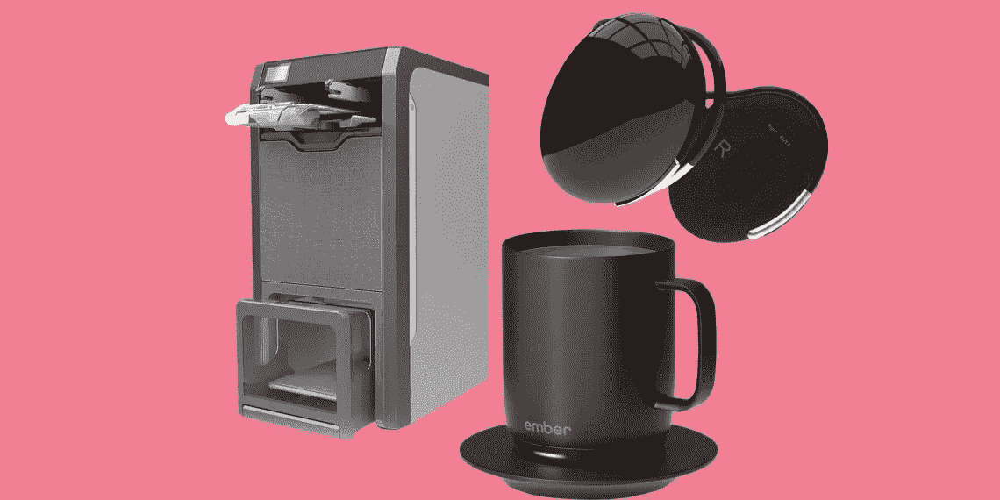

# 7 项我们过去只能梦想的技术创新

> 原文：<https://medium.datadriveninvestor.com/7-technological-innovations-we-used-to-only-dream-of-eb10606521fa?source=collection_archive---------10----------------------->

## 内置扬声器的眼镜，自动衣物折叠机和识别猫的智能喂食器。

# 1.带有内置翻译的耳机

Waverly Ambassador Translator 是一款内置翻译器的耳机，支持 20 种语言和 42 种方言。它是这样工作的。比如你说俄语，你朋友说英语。系统自动翻译复制品，翻译成耳机。

这个小工具不仅适用于一次谈话，也适用于集体对话:通过一个特殊的应用程序，可以连接多达四个翻译。耳机也意味着不同的人只能使用一次，所以它们有一个“卫生”的设计:设备不插入耳槽或弄脏。

# 2.加热杯

Ember 的一个陶瓷杯通过蓝牙连接到智能手机，并通过一个应用程序控制。它可以设定必要的温度——你可以为不同的饮料选择不同的温度。这个杯子可以保温一个小时。你可以在做其他事情的时候长时间喝咖啡，它不会变凉。

# 3.内置扬声器的眼镜

Bose 镜架看起来时尚可靠:镜片由优质玻璃制成，拱形固定金属环。但是他们的主要事情是在电子填充。有小扬声器和一个接听电话的按钮。使用该配件，您可以听音乐、打电话和使用语音助手。

# 4.混合现实眼镜

尼尔的观点看起来也是最常见的，但里面隐藏着《私人未来学》中的кое‑что。通过佩戴一个配件，你可以在现实中看到虚拟物体，并通过一个具有触觉反应的全职控制器，与它们进行互动。

 [## 2019 年即将改变世界的技术|数据驱动的投资者

### 很难想象一项技术会像去年的区块链一样受到如此多的关注，但是……

www.datadriveninvestor.com](https://www.datadriveninvestor.com/2019/01/17/the-technologies-poised-to-change-the-world-in-2019/) 

该设备计划于 2020 年开始销售。关于将向眼镜所有者提供什么内容的信息还不可用。然而，众所周知，在他们的帮助下，将有可能观看电影和电视剧，以及在多产的 Android 智能手机上玩专门设计的游戏。

# 5.电动摩托车

哈雷戴维森的摩托车在 3 秒内加速到 100 公里/小时，几乎没有沙沙声，既没有速度也没有耦合——首先，转动手柄相当简单。制造商声称，电动自行车一次充电可以行驶 225 公里，考虑到大量的停车、触摸和沿着公路行驶。

你用 LiveWire 在一个晚上从一个普通的房间插座给你的摩托车充电。为了更快地充电，你必须去一个特殊的充电站，在那里电池会在一个小时内恢复。

# 6.识别猫的自动喂食

当房子里住着几只宠物时，很容易喂养它们。可能会有真正的食物竞争，一切都会变得最暴力。Volta Mookie 的智能碗将有助于解决这个问题。它配备了一个摄像头，只有当它记录下熟悉的面孔靠近时才会打开。如果每种动物都有一个聪明的碗，就有可能不用担心ктото仍然饥饿。

该设备还可以向智能手机发送猫已经进食的通知，并为主机录制确认视频。

# 7.折叠衣服的机器

美国初创公司 Foldimate 创造了一种可以装载 t 恤、裤子、衬衫、亚麻制品和毛巾的机器。出去的时候，她会分发叠得整整齐齐的东西。

工作原型看起来像一台巨大的打印机，所以 Foldimate 筹集资金制造了一台新的。主要目标是使设备具有更小的尺寸。