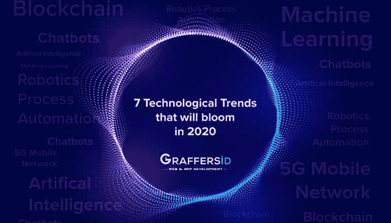
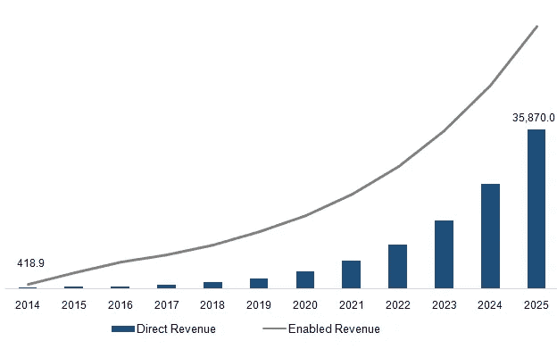
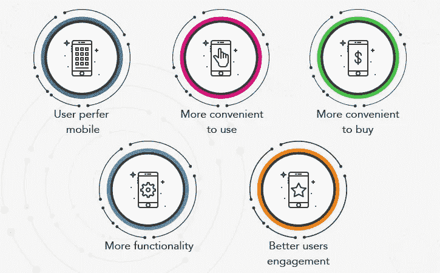
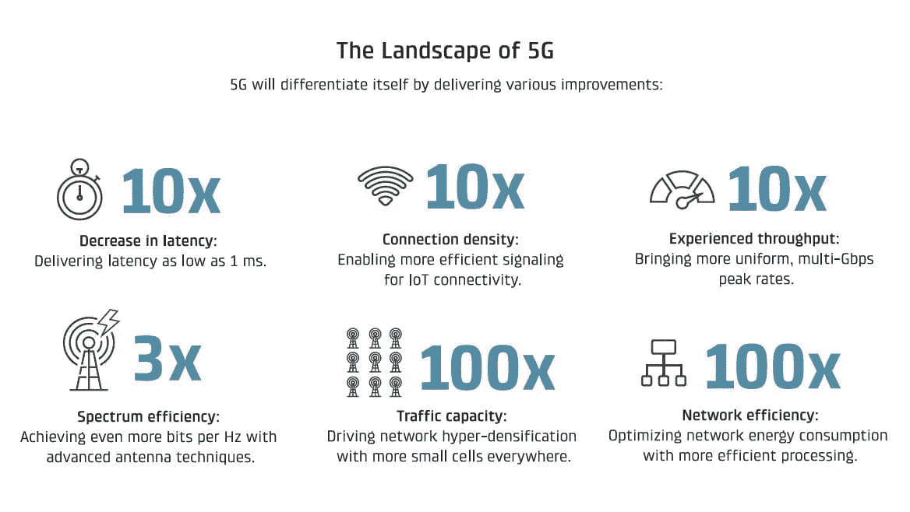
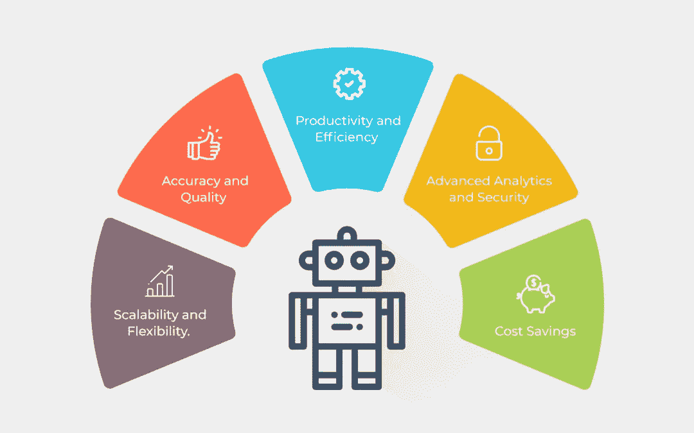
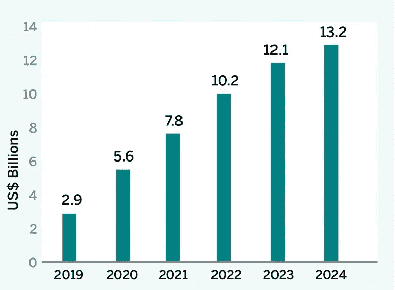
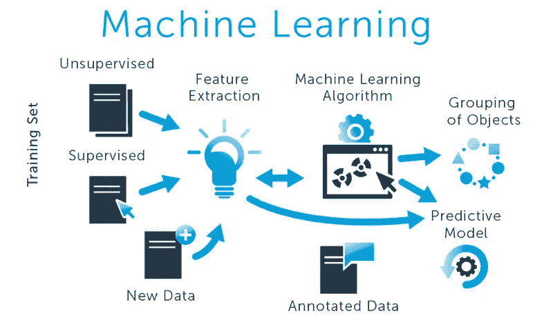
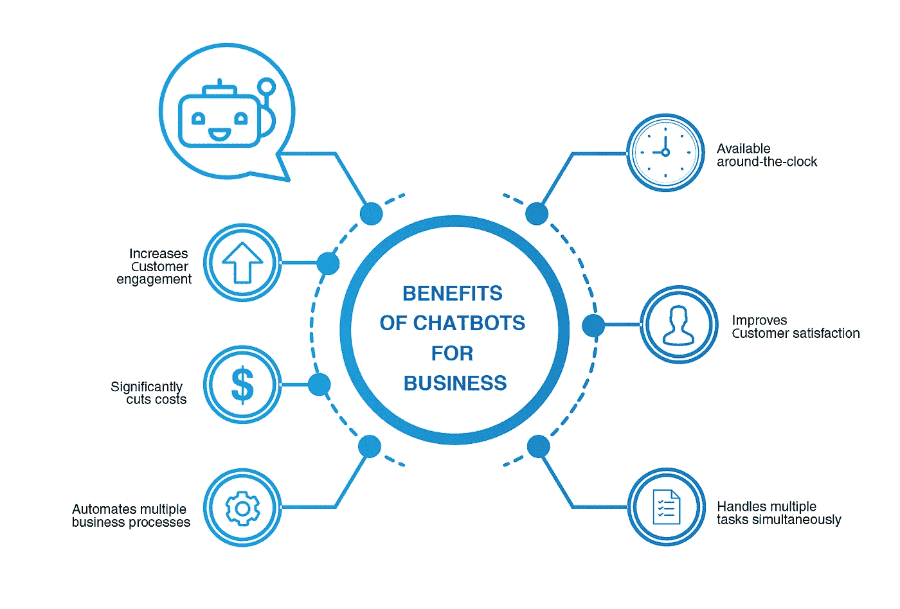

# 2020 年将开花结果的 7 项技术

> 原文：<https://medium.datadriveninvestor.com/7-technologies-that-will-bloom-in-2020-fdc0eea16d07?source=collection_archive---------5----------------------->

技术如何影响市场的各个领域，这难道不令人着迷吗？自从数字化出现以来，工业的基础开始变得更好。行业运作急剧变化背后的一个主要原因是用户需求和竞争力。

为了在当今竞争激烈的市场中生存，利用创新技术使其解决方案更加强大已经成为每个行业的精髓。甚至像脸书、亚马逊和谷歌这样的大公司也在大胆投资最新的技术趋势，如区块链技术、大数据和人工智能，以改善用户体验。

显而易见，技术不是在变化，而是在飞速变化。商业世界中有指数级的创新。据估计，2021 年将有超过 10 亿人使用 AR/VR，未来几年物联网的价值可能达到 20 万亿美元。这清楚地表明，普遍的数字化转型并不遥远。

以下是对未来一年和未来十年将带来重大创新的技术趋势的详细介绍。

# 1)人工智能:

人工智能或人工智能在过去几年中已经引起了很多关注，它肯定会成为一种趋势，因为它对我们日常生活的影响仍处于早期阶段。机器智能或 [**人工智能是一种现代的方法**](https://graffersid.com/blogs/artificial-intelligence-modern-approach/) ，可以定义为计算机系统对人类智能过程的模拟。这些过程包括获取信息和使用信息系统的规则、推理(即使用规则得出近似结论)和自我纠正。

 [## 幸福的算法？数据驱动的投资者

### 从一开始，我们就认为技术正在使我们的生活变得更好、更快、更容易和更实用。社交媒体…

www.datadriveninvestor.com](https://www.datadriveninvestor.com/2019/03/08/an-algorithm-for-happiness/) 

目前，人工智能服务正以这样或那样的方式用于导航应用程序、智能手机个人助理、流媒体服务、乘车共享应用程序、家庭个人助理、智能家居设备。除了消费者使用之外，人工智能还用于评估商业风险、预测维护、安排列车和提高能效。

**在最近的一项调查中，麦肯锡表示，到 2030 年，人工智能的采用可以使全球 GDP 增加多达 13 万亿美元**。此外，预计到 2020 年底，人工智能将创造 2300 万个就业机会。在开发、编程、测试、支持和维护等领域可能会创造就业机会。而且，在下一个十年，我们肯定会看到不需要任何人类干预的人工智能变得更聪明。

**Artificial Intelligence-Direct & Enabled Revenue-2014 to 2025 (USD Million)**

**图片来源:** [大观研究](https://www.grandviewresearch.com/static/img/research/artificial-Intelligence-market.png)

# 2)移动商务:

从大品牌到初创公司，移动商务正在兴起。事实上，全球每个人都在拥抱移动商务。自从智能手机推出以来，移动商务已经成为个人和职业生活中至关重要的一部分。简单地说，移动商务需要使用移动电话进行电子商务交易。移动商务利用电子商务背景和 WAP 技术。无线技术(WAP)被用于进行商品销售、支付、提供服务和执行其他金融交易。

Reasons Why Mobile Commerce is Rising at Rapid Rate

**图片来源:** [比划](https://www.peerbits.com/wp-content/uploads/2018/06/mobile-commerce-app-step-1.jpg)

**随着超过 80%的互联网用户拥有智能手机，预计到 2025 年，零售移动商务销售额将从 74.8%增长到 85.5%。**预计移动商务将在 2021 年超过非移动商务。毋庸置疑，移动商务是电商界的后起之秀，然而，电商行业**的创新少之又少，会让电商行业更具可持续性。**

**通过了解移动商务并跟踪它的发展方向，企业主将自己置于最佳位置，以利用所有移动商务所提供的优势。**

# **3) 5G 移动网络:**

**5G 技术是今年 CES 的话题，到 2020 年初，5G 将成为无线技术的驱动因素。它将给用户带来更低的延迟、更高的容量和更快的网速。有了 5G，城市和偏远地区的自动化和技术进步肯定会扩大。**

**随着 5G 移动网络的发展，将会有 WiFi 6 的开发和实施。这些技术通过提供实时数据，将使无人驾驶汽车的操作变得容易。此外，5G 系统将提供无人机送货上门等设施。**

**预计 5G 将在 2024 年覆盖全球 65%的人口。根据最近的统计数据，到 2024 年底，增强型移动宽带的 5G 用户可能会增加到 19 亿。在印度，5G 订阅预计将在 2022 年实现，并可能上升。在美国，服务提供商已经针对移动和固定无线接入推出了商用 5G 服务。**到 2024 年底，5G 用户预计将增至 2.7 亿，占移动用户的 60%以上。****

****

**Here are the improvements that 5G will bring**

****图片来源:** [数码趋势](https://icdn2.digitaltrends.com/image/how-5g-will-change-sports-visual-capitalist-graphic-21674-1200x9999.jpg)**

# **4)机器人过程自动化或 RPA:**

**像机器学习和人工智能一样，机器人流程自动化是另一种使工作自动化的技术。RPA 是使用软件来自动化业务流程，例如解释应用程序、处理数据、处理交易甚至回复电子邮件。**

****

**Features of Robotic Process Automation**

****图片来源:** [Digitals Fren](https://digitalfren.com/)**

**机器人过程自动化使人们过去做的重复性工作自动化。不仅低薪工人的琐碎工作，医生、财务经理和首席执行官的工作都可以使用 RPA 实现自动化。尽管研究人员估计 RPA 对全球 9%的工作场所的生计构成威胁。RPA 有可能在改变现有工作的同时创造新的工作。**

****电子商务行业的快速增长是推动机器人过程自动化市场增长的关键因素。到 2025 年，美国的网上销售额预计将翻一番，并可能占到整个零售行业的 30–35%。****

**对于希望与技术趋势保持一致的 IT 专业人员，RPA 提供了大量的职业机会，包括项目经理、业务分析师、解决方案架构师、开发人员和顾问。**

# **5)区块链:**

**尽管大多数人认为区块链技术是比特币等加密货币，但区块链也提供了在许多其他方面有用的安全性。简单来说，区块链可以被描述为你只能添加，不能更改或带走的数据。因此，术语“链”被使用，因为你正在制造一个数据链。区块链之所以安全，是因为以前的街区无法改变。此外，区块链是共识驱动的，这意味着没有一个实体可以控制数据。**

****

**Expected Increase in Enterprise Blockchain Market from 2019 to 2024**

****图像来源:** [文档介质](https://cms-static.wehaacdn.com/documentmedia-com/images/Blockchain-Growth.2177.jpg)**

**一些行业正在实施区块链，随着区块链技术的使用越来越多，对熟练专业人员的需求也将增加。据 Techcrunch.com 称，与区块链相关的工作是增长第二快的工作类别，因此创造了大量的就业机会。因此，如果你计划在快速增长的行业中发展事业，并对区块链感兴趣，那么你必须考虑学习区块链，为令人兴奋的未来做好准备。**

# **6)机器学习:**

**机器学习是计算机程序的一种应用，它能够在没有任何人类参与的情况下做出决策、制定算法并生成输出。机器学习被誉为近年来我们看到的重大和有影响力的技术发展之一，它已经帮助我们执行关键的现实世界计算。**

****

**Machine Learning Explained**

**供应链技术供应商正在将机器学习纳入他们的应用程序，帮助解决方案了解不断变化的环境。**

**以下是机器学习将如何帮助公司提高绩效:**

*   **机器学习将帮助公司开发能够理解自然人类语言的应用程序。**
*   **机器学习将提高物流和运输网络的效率**
*   **它帮助公司利用预防性护理来减少齿轮故障并提高利润。**
*   **通过机器学习，公司可以利用客户信息来促进销售，构建有用的客户并提高品牌忠诚度。**

**机器学习已经成为未来工作最关键的技术。人工智能驱动的应用程序，结合机器学习，将有助于企业提高效率，加强客户关系，增加收入。**

**研究人员估计，到 2020 年，机器学习有能力为广告和销售部门带来 2.6 万亿美元的价值。在 Univa 最近的报告中，它指出，机器学习预计将在未来 5 年内飙升，96%的公司预计将在生产项目中使用它。**

# **7)聊天机器人:**

**聊天机器人使企业能够在一天中的任何时间、任何地点，甚至在客户支持人员不在的节假日，回答所有类型的客户服务查询。前面我们已经讲过了 [**什么是聊天机器人**](https://graffersid.com/blogs/chatbot/) 和 [**聊天机器人**](https://graffersid.com/blogs/benefits-of-chatbots/) 有什么好处。今天，我们让你注意到聊天机器人在未来几年将会如何发展。**

**聊天机器人能够不带偏见地与客户互动。此外，聊天机器人合成元数据，基于人工智能的应用程序，因此可以轻松地个性化客户体验。**

****根据 Global Market Insights 最近的统计，到 2024 年，全球聊天机器人的整体市场规模将超过 13 亿美元。因此，说聊天机器人行业一定会成为商业交流的驱动力并不为过。随着技术的进步，机器人将变得更加智能，能够理解查询和对话的意图。****

****

**Benefits of Chatbots for Business**

****图片来源:** [Litslink](https://litslink.com/media/1/benefits-of-chatbots-for-business.png)**

**为了与客户的期望保持一致，企业现在专注于在机器学习、人工智能和自然语言处理(NLP)的帮助下创建聊天机器人。具有更多对话式人工智能的聊天机器人将:**

*   **通过用户品牌改善用户体验，从而帮助建立品牌形象。**
*   **提供个性化的客户体验，建立更好的关系。**
*   **积极影响客户的看法，帮助您建立满意的客户群。**

**这就是 2020 年的发展趋势**

**更多此类更新，敬请关注！**