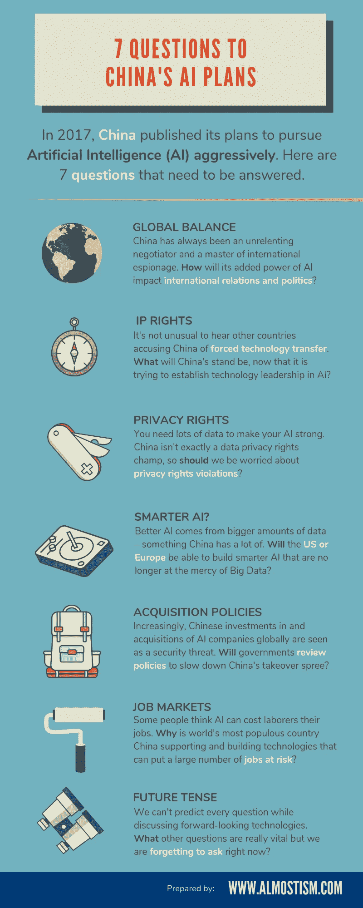

# 中国对人工智能的新宠让我们困惑的 7 件事(信息图)

> 原文：<https://medium.datadriveninvestor.com/7-things-that-puzzle-us-about-chinas-new-love-for-artificial-intelligence-4dc2f6087f45?source=collection_archive---------34----------------------->

2017 年，中国工业和信息化部(MIIT)公布了其积极拥抱人工智能(AI)的计划。

> 中国打算使用它的方式，中国的人工智能将是无所不包的，涵盖从指导和控制公民/企业行为到完善其信用体系再到主导全球商业的各个领域。

所有这些野心——考虑到中国处理事情的过往记录——带来了一些严重的问题。这里有一张信息图，展示了在讨论中国人工智能计划时要提出的 7 个主要问题:

# 全球平衡

中国一直是一个不屈不挠的谈判者和国际间谍大师。**它增加的人工智能力量将如何影响**国际关系和政治**？**

# 知识产权

听到其他国家指责中国**强迫技术转让**并不罕见。既然中国正试图在人工智能领域确立技术领先地位，它的立场会是什么？

# 隐私权

你需要大量的数据来让你的人工智能变得强大。中国不完全是数据隐私权冠军，所以**我们应该**担心**侵犯隐私权**？

# 更聪明的 AI？

更好的人工智能来自更大量的数据——中国有很多这样的数据。****美国或欧洲**能够建造不再受大数据支配的更智能的人工智能吗？**

# **采购政策**

**中国在全球范围内对人工智能公司的投资和收购越来越被视为一种安全威胁。政府会审查政策来减缓中国的收购狂潮吗？**

# **就业市场**

**有些人认为人工智能会让劳动者失去工作。**为什么**是世界上人口最多的国家，中国却在支持和建设那些会让大量工作岗位面临风险的技术**？****

# ****将来时****

****我们不可能在讨论前瞻性技术的同时预测每一个问题。还有哪些问题非常重要，但是我们现在忘记问了？****

***********

****如果你喜欢以上，请考虑鼓掌！记住，你最多可以鼓掌 50 次！****

****如果你有兴趣进一步阅读，我写了一篇关于中国对人工智能的追求的文章，你可以在这里阅读。****

## ****来自 DDI 的相关故事:****

**** [## 用 7 个步骤解释深度学习——数据驱动投资者

### 在深度学习的帮助下，自动驾驶汽车、Alexa、医学成像-小工具正在我们周围变得超级智能…

www.datadriveninvestor.com](https://www.datadriveninvestor.com/2019/01/23/deep-learning-explained-in-7-steps/)  [## 成为数据科学家所需的 8 项技能——数据驱动型投资者

### 数字吓不倒你？没有什么比一张漂亮的 excel 表更令人满意的了？你会说几种语言…

www.datadriveninvestor.com](https://www.datadriveninvestor.com/2019/02/07/8-skills-you-need-to-become-a-data-scientist/)****