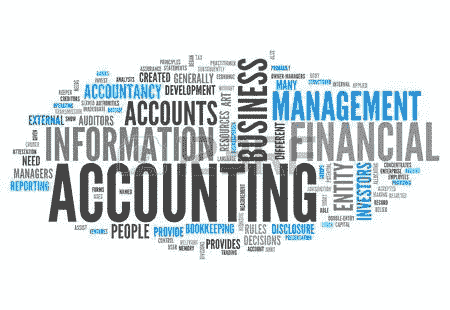

# 金融教育知识将教会你的 7 件事

> 原文：<https://medium.datadriveninvestor.com/7-things-the-knowledge-of-financial-education-will-teach-you-eab971fa8406?source=collection_archive---------13----------------------->

接受金融教育的人会成为金融知识分子。金融素养是理解金钱在世界上如何运作的能力。一个财务上聪明的人在钱的问题上有很多信息:如何赚取或制造钱，如何正确管理钱，以及如何通过投资使钱增值。在本帖中，我们将看看你将从金融教育中学到的 7 件事。

**理解金钱和金钱如何运作**

在纸币发明之前，在传统的易货贸易体系中，人们必须面对面地交换他们的商品。但是随着货币的创造，商品不再需要与商品交换，因为购买力(即购买某物的能力)转移到了纸币上。

尽管如今货币更多地以电子形式存在，但其工作原理仍然保持不变。自私的人不会被金钱所吸引。它被能解决问题的企业所吸引。它吸引那些满足需求并为社会增加价值的人。你生活中的金钱数量反映了你给予他人的价值数量。只要向世界提供价值，金钱就会对你产生吸引力。

**理解资产、现金流模式和商业风险的真正含义**

虽然有些资产可以直接从市场上购买，但在其他情况下，它们是从零开始创建或构建的。有形资产可以以固定的实物形式、投资、
产品、银行存款甚至现金存在。但最终，资产通过产生被动收入为企业主服务。

而在金钱的博弈中，现金流的方向非常重要。当费用以支付账单或购买商品/服务的形式出现时，钱从你的口袋流到另一个人的手里。这种现金流模式被称为负现金流。但在正现金流模式中，资金反向流动，要么作为固定收入获得，要么通过销售商品/服务获得被动收入。你赚的(正现金流)和你花的(负现金流)之间的显著差异是衡量你盈利能力的标准。

每一项商业冒险都包含着风险。所以，所有的企业主都是冒险者。风险是作为一种杠杆投入到一项业务中的资金总额，同时预期最终会有一个总体成功的结果。

**谁是企业家**

创业之路就像一次穿越荒野的长途跋涉。成为企业家的选择永远是个人的决定。考虑的是成为就业创造者而不是求职者。

企业家的思维集中在如何从零开始创建一个企业，并使其大幅增长。他/她总是想着扩张，甚至是未来要着手的下一个商业项目。

成功的企业家是财富的分配者，通过资产交换媒介从经济中创造财富，并回报他们的员工和政府。最终可能为自己和股东保留数万美元的利润。

**销售和营销的角色**

销售额等于收入。任何不能销售足够产品/服务的企业都不可能产生足够的收入来支付所有的运营费用并获得可观的利润。即使在雇员的情况下，收入总额也与工作时间相对应。

营销是吸引顾客到你的企业。你需要让外面的人知道你在那里，准备好并愿意为他们提供服务。流入你企业的现金量与流出的营销/沟通成正比。

**了解商业规律**

如果一个人真的下定决心要取得一些真正的成功，那么掌握商业世界的各种法则是非常重要的。因为企业为了让员工继续工作、维持与合作伙伴的合作以及实现客户满意，会产生一定的运营和管理成本；政府制定了几项法律，在许多方面保护他们。

通过遵循他们的经营行动计划，并了解税法和公司法，注册企业可以利用他们的费用栏致富。其他有利于企业的现行法律包括:

*   证券交易法
*   许可法
*   特许经营法
*   知识产权法(专利、商标、服务商标)

**财务会计**

财务会计是金融教育最重要的方面之一。财务知识能让你读懂数字，而数字会根据实际情况告诉你企业的故事。

根据财务报表经营公司的能力是小企业主和大企业主的主要区别之一。我把财商定义为能够正确计算毛利、营业利润和净利润的能力。

衡量公司财务状况的其他重要文件是比较资产和负债的资产负债表和现金流量表。

**商业领导力**

领导能力是将所有部分结合在一起的粘合剂。如果你是一个平庸、低能的领导者，它会流向你的员工、你的客户和你的利润。

一个组织的整体成功取决于它的领导和管理。伟大的商业领袖所共有的一些特质包括坚持、厚脸皮、无畏、坚韧、有天赋的眼光、强烈的激情、财务上的精明等等。

获得知识是非常重要的，但是在获得知识之后，必须通过实际的行动计划，为了一个明确的目标和目的，对知识进行组织和使用。