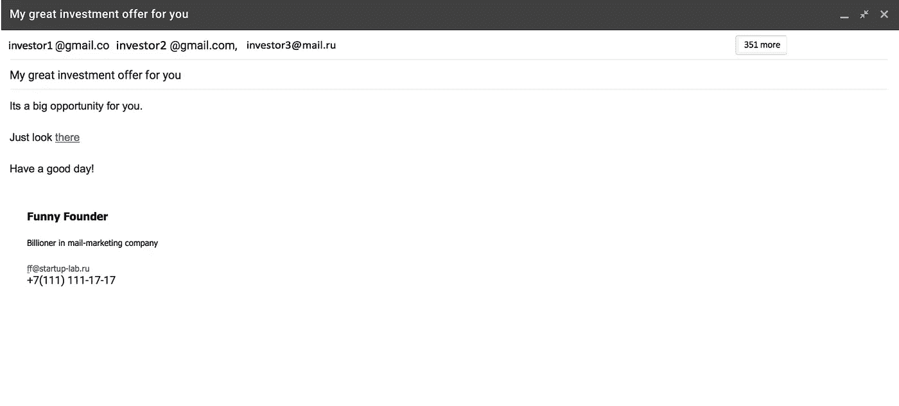
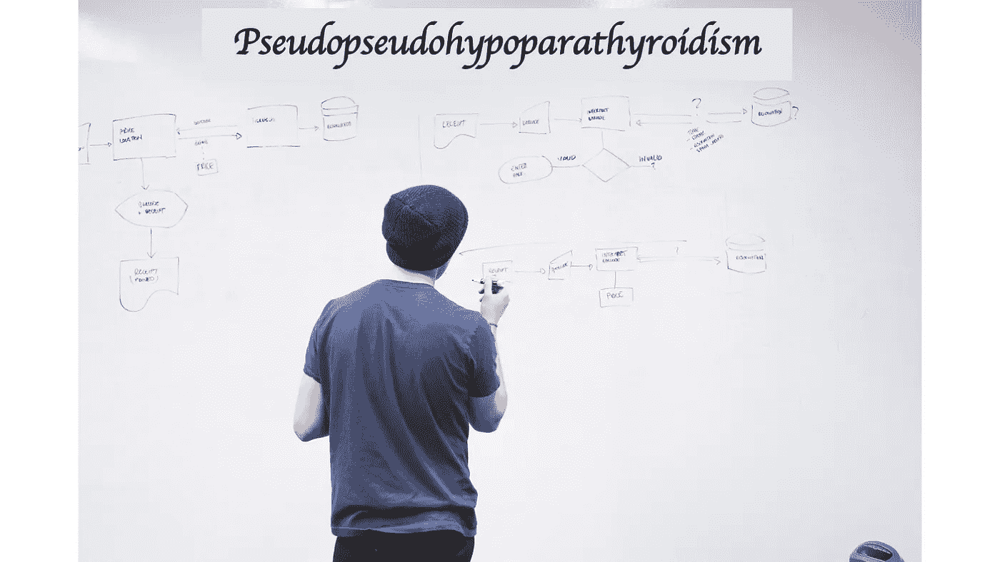
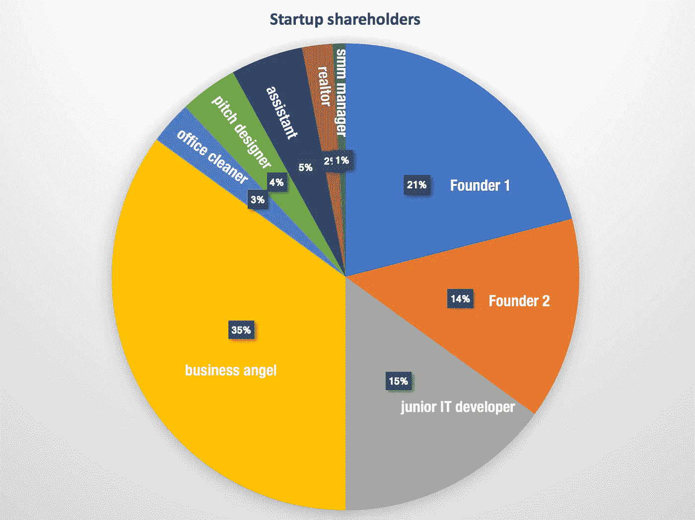

# 为了永远不接受投资，你应该做的 7 件事

> 原文：<https://medium.datadriveninvestor.com/7-things-which-you-should-do-in-order-to-never-receive-investments-db3b83200fda?source=collection_archive---------4----------------------->

## **在本文中，全球种子期风险投资基金普通合伙人阿列克谢·沙巴尔申(Alexey Shabarshin)将为你的初创公司提供一些无用的建议**

*这是我博客中最先出现的文章之一。将来我会写更深刻和广泛的材料，但现在我决定写一个轻松有趣的版本来表达我的想法。*

简单介绍一下我:
我是俄罗斯和独联体领先的风险投资、技术和创新教育公司的创始人，名为 EVA(欧亚风险学院)，我有 4 年的并购专业经验。这些天，我在 MSU 罗蒙诺索夫攻读博士学位，课题是“风险投资的自主创业评分模型和投资决策系统”，我是种子期风险投资的普通合伙人。

本文将考虑无用的建议，如果你想扩大你的创业规模，就不应该考虑这些建议。所有的观点都是从现实生活的案例中收集来的，所以，我们尽量不要犯同样的错误。

1.  向数百名投资者发出信件，并把他们全部放入盲稿中。没什么好隐瞒的，这些都是投资！

这是最常见也是最愚蠢的错误之一，会让你名誉扫地。在这种情况下，你立即违反了规则。

第一条规则是隐私政策。任何人在未经他同意的情况下分享他的个人资料或他公司的联系方式都会令人不快。第二条规则是关注特定类型的投资者，并创造有针对性的报价。

让我们来看看这是什么意思？

创造一个符合投资者需求的报价是非常必要的。在一个特定的阶段寻找有特定关注点的投资者将会帮助你缩短寻找时间，打造一个他们感兴趣的形象。这样做你也节省了投资者的时间。例如，如果你试图寻找种子资金，这意味着你需要准确地连接种子资金或商业天使。

**2。** **每天拜访所有可能的事件和会议！不要指导项目，去参加活动，每次都带着新的想法！**

早先这也是我的策略。当我从公司一头扎进创业世界时，它对我来说是如此具有挑战性。我参观了黑客马拉松、研讨会、有创业相关电影的活动等等……这真的非常有成效，尤其是前 15 次会议。它让我建立了一个强大的网络，并深深地投入到这个行业中。后来，我和我的队友开始在这个项目上非常努力地工作。

与 Vasiliy(我的熟人，两年前我们一起参加了黑客马拉松)相反，他仍然每次都带着新的想法参加活动。在我看来，瓦西里已经可以在黑客马拉松上赚钱了，因为他知道时机，这些场合的每一秒钟。但这对他没有任何好处。

总而言之，如果你想知道如何资助创业，而不是开展黑客马拉松，你需要记住这条规则，避免犯这些错误。

**3。在你对项目发表任何意见之前，而且在签署任何文件之前，你必须始终要求签署 NDA。小心，人们可能会抄袭你的想法，因为这是天才的想法，只在你脑海中闪过。请记住，你的创意价值数十亿美元，马克·扎克伯格可以随时购买！**

一句“NDA 第一！”允许投资者估计创业水平。有经验的企业家绝不会这样做，因为他知道拥有竞争优势(你已经做了让你安全的事情；如果投资者立即复制，后者将很难与你竞争)。此外，创始人应该事先考虑如何保护自己的知识产权。

**4。** **用你能想到的最复杂的词语来描述你的产品或技术。比如促肾上腺皮质激素吸附剂就是很好的选择。**

您的演示文稿(或摘要、执行摘要或其他文档)必须对所有投资者或合作伙伴清晰明了。投资者不应拥有生物技术领域的高等教育文凭。他们应该擅长项目规模和赚钱。这就是为什么你应该用尽可能简单的文字来创建演示文稿的原因。以防误解别以为投资人傻，换句话说就是了。试着用你祖母能理解的方式陈述你的信息(除非她不是生物技术博士)。

5.项目一有困难就扔了，开始新的。记住，只有双赢的项目才会引起投资者的兴趣。投的项目越多越酷。

永远不要放弃！当然，在合理的范围内。坚持不懈，以目标为导向。至高无上的人尝试了一百万次，没有一次失误，也没有第 n 次失败。

**6。** **不要试图在第一阶段投资时给公司少于 50%的股份。越多越好！**

如果你正在冒险，把它分开投资者，不要贪婪。另一个好处是给任何同意帮助你的人一个期权(或公司的股份),不管是设计师还是程序员。不要克扣公司的股份，把这些百分比给办公室清洁工或在电车上给你让座的人！

理想的情况是，当你从上到下拥有了公司。其他关键人员拥有期权。原因是这些法律文书与那些未来项目的特征和参数相联系，这些特征和参数取决于这个特定的人。由两个联合创始人(50 对 50)分割公司也不是一个好主意。它充斥着以下后果:在未来，没有你的合作伙伴，你无法在公司做出任何决定，因为你没有优势。

7 .**。** **只创造一种产品，原型，这将产生数十亿的收入。比如，推出你自己的社交网络，或者发明“优步的优步”。这些项目是成功的，所以，你也会成为一个聪明的金童。**

风险投资行业的核心是创新。不要忘记蓝海战略:让我们找到一个新的市场(甚至更好——自己创造)，而不是试图在竞争激烈的红海中生存。你不会收到像优步这样的抄袭产品的投资，因为你应该降低价格，花很多钱去和别人竞争，这将导致你破产。

我希望它对你有用并且有趣。

如同