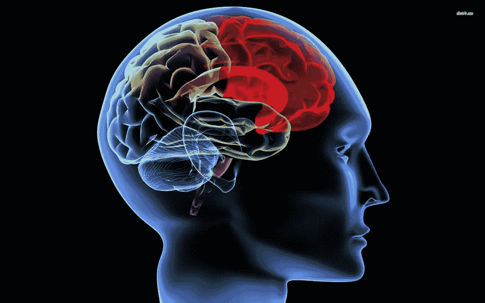
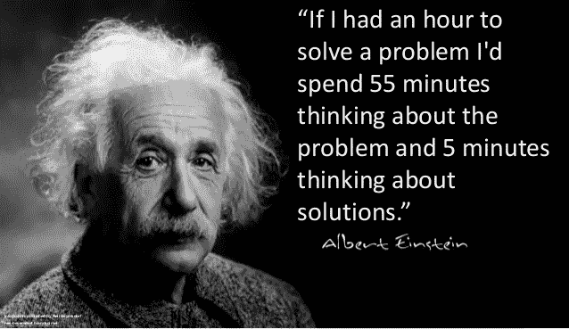
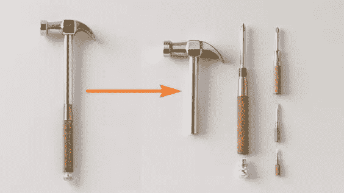
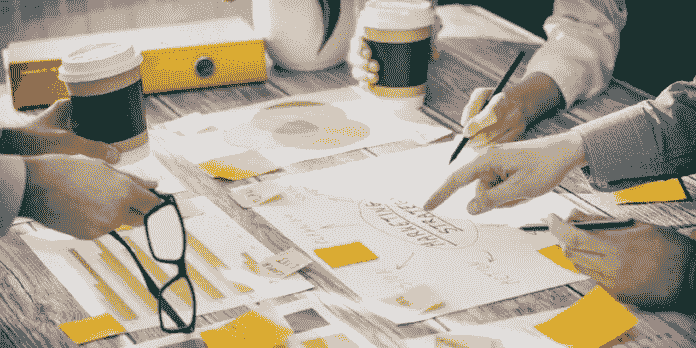
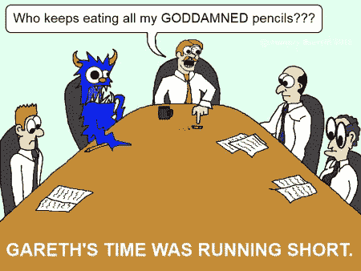

# 改善团队决策过程的 7 个技巧

> 原文：<https://medium.datadriveninvestor.com/7-tips-for-improving-decision-making-process-in-a-group-525c98fdeb43?source=collection_archive---------18----------------------->

[image source](http://www.free-management-ebooks.com/news/effective-group-decision-making/)

我们的生活包括做决定。我们都知道，有时候一个简单的选择可以在一瞬间改变我们的一生。有时很难做出决定，但在团队中做决定更具挑战性。在这篇文章中，你会发现在团队决策过程中的一些心理陷阱，以及科学实验的链接和一些关于如何避免这些陷阱并以正确的方式做出决定的建议。

# 心理陷阱

当你在讨论一些选择时，避免我们大脑和行为的心理陷阱是至关重要的。许多实验证实 ***考官的观点可能会影响学生的决定。*** 一个考官可以操纵一个学生，处理掉一个答案，这个答案可以不同于学生的原始答案。最明显的方法是在学生做出决定之前告诉他们“正确的”答案或主要观点。

另一个典型的例子是当一个人参加一个集体活动时，她得到的信息是她的观点和别人不一样。她的大脑激活了这个区域，这是在发送一个信号，表明她犯了一个 ***行为错误*** 。因此，她将来的答案会受到一个小组中其他人提供的答案的影响。这些和其他心理陷阱研究神经经济学，跨学科领域的研究在神经元水平上作出决定。

[image source](http://www.kcwics.org/2015/03/ten-tricks-your-brain-plays-on-you-during-grief/)

丹尼尔·卡内曼是诺贝尔经济学奖得主，他为启发式和偏见导致的常见人类错误建立了认知基础。丹尼尔在《思考，快与慢》一书中总结了做决定时的主要心理陷阱，其中一个陷阱就是 ***锚定效应*** 。这种效应意味着第一手数据(陈述、数字等等)会影响决策。

除了许多认知偏差，企业文化也可能影响决策。这种效果被称为 ***害怕惩罚*** 。如果公司实行权威的管理风格，员工很可能会避免做出冒险的决定，结果会忽视新的有趣的建议。

另一个心理陷阱是一个 ***问题定义*** 。一些实验证实，我们通常会选择一个更积极的背景，尽管在更消极和积极的背景下，结果是一样的。上下文意味着文本中的一致性，更多的正面词汇，如获取、保存、更高的数字等。

现在，让我们谈谈如何避免认知偏差的解决方案，并召开小组会议进行决策。

# 更好决策过程的七个技巧

[image source](https://www.slideshare.net/optimaltransformation/a-collection-of-quotes-from-albert-einstein)

## **1。准确定义问题**

你必须看到一个问题的两个方面，并试图从积极和消极的角度来定义这个问题。你可以使用“ [6 顶帽子思考”方法](https://www.toolshero.com/decision-making/six-thinking-hats-de-bono/)来达到卓越的效果。

## **2。在会议前制定决策的接受标准**

这一步有助于你更好地理解一个问题/任务，也避免了更有吸引力的参与者对某些想法的同情(如光环效应)。在选择标准定义时要精确，分析每一个可能出错的标准。根据[发明问题解决理论](https://en.wikipedia.org/wiki/TRIZ)，确定理想的最终结果是决策的首要步骤之一。这种方法盛行于飞机、软件行业，但也可以用在许多领域。

[image source](https://www.pinterest.ru/prozrus/)

## **3。在收集想法的第一阶段更加匿名**

在会议之前，在与会者中进行一次匿名调查是个好主意。调查应该简短，例如询问想法和威胁。你可以得到主要信息，也可以得到平均答案。Fransua Halton 进行了一项实验，该实验表明群众的平均意见优于专家的结果。这个实验也被称为[“群体的智慧”。](https://www.ft.com/content/bfb7e6b8-d57b-11e1-af40-00144feabdc0)

如果您没有足够的时间进行调查，您可以在会议上要求进行调查。要求在纸上写下想法和决定，然后留下所有匿名的笔记。

[image source](https://rb.ru/story/17-brainstorming-methods/)

## **4。“我们可能如何”问题**

HMW 是一种流行的头脑风暴技术，它专注于问问题“[我们怎么可能](https://toolkit.mozilla.org/method/how-might-we/)？”在讨论解决方案时。这种方法接近于问题定义和创造性的“理想最终结果”，但不同于为决策创造几种可能的解决方案。您也可以使用带有 HWM 标记的便利贴，让学员将带有想法的贴纸钉在一块板上。之后，团队讨论每一个问题并一起创造解决方案。这种方法的可见性接近思维或智力地图。

## **5。使用游戏化方法**

通过让参与者在会议中扮演特定的角色，可以给会议带来一些乐趣。例如，一个可以扮演**创造者角色**，另一个可以扮演**批评家角色**，还有一个是**驱动者/促进者**等等。

主要的想法是在会议中坚持你的角色。这位评论家总是试图寻找威胁，她问了一些刁钻的问题。创作者试图跳出框框思考，为积压的工作提供几十个想法。驾驶员/主持人通过主持讨论并保证讨论准时来支持决策过程。为了获得最佳效果，您可以在第一次会话后交换角色。

这种方法为什么有效？第一个论点是创造游戏氛围，创造一种兴奋感。下一个论点是参与者只扮演一个角色。参与者专注于一种方法:只产生想法或批评想法。这种方法在心理层面上免除了参与者的责任，因为参与者只是扮演一个角色，而不是在会议中扮演专家的角色。

## **6。不要忘记身体方面的问题**

尽量在午饭后安排一次会面。内盖夫本古里安大学的教授 Shai Danziger 分析了法官们一天的判决。他发现，囚犯成功假释的几率一开始相当高，约为 65%，几个小时后迅速下降到零。评委们休息回来后，赔率突然回升到 65%，然后继续下滑。一名囚犯的命运可能取决于他们的案子在哪天开庭审理。

[image source](https://hungrybunyip.files.wordpress.com/2010/06/282.png?w=450&h=337)

## **7。在会议中创造信任的气氛**

如果你在会议中创造一种信任的气氛，与会者将更倾向于合作而不是对抗。催产素是一种影响创造信任和良好关系的社会荷尔蒙。这种激素控制着我们，我们根据这种激素的水平来选择对某人的态度。我们血液中的催产素水平越高，我们就越诚实。但是如何提高这种激素的水平呢？最简单的方法之一是通过触摸。在商业领域，可以是握手。

创造良好的企业文化，其中公司关心员工是最好的方式，但这是一个漫长的过程。你可以展示你是如何关心与会者并为会议做准备的:

*   在每个地方放一些重要的东西，比如笔，笔记
*   积极(你可以在会议前使用积极的肯定)
*   在会议开始时互相问候以便参与
*   提醒大家这次会议的重要性以及房间里每个人的重要性
*   通过确定目标会议和跟进议程来保持透明度。

[image source](https://o.aolcdn.com/images/dims3/GLOB/legacy_thumbnail/630x315/format/jpg/quality/85/http%3A%2F%2Fi.huffpost.com%2Fgen%2F4926920%2Fimages%2Fn-BUSINESS-PARTNER-628x314.jpg)

底线是决策中最重要的事情是创造一个信任的氛围和关键的评估选项，这有助于避免认知偏差。

## **参考文献:**

1.  决策中隐藏的陷阱。约翰·s·哈蒙德，拉尔夫·l·基尼和霍华德·莱法。哈佛商业评论
2.  神经经济学导论:大脑如何决策？瓦西里·克鲁恰列夫创造的球场[https://www.coursera.org/learn/neuroeconomics](https://www.coursera.org/learn/neuroeconomics)
3.  思考，忽快忽慢。丹尼尔·卡内曼
4.  认知错觉:判断、思考和记忆中的有趣现象。编辑:吕迪格·波尔。
5.  [正义得到了伸张，但午饭后更是如此:用餐时间如何影响法官的决定。由 Ed Yong](http://blogs.discovermagazine.com/notrocketscience/2011/04/11/justice-is-served-but-more-so-after-lunch-how-food-breaks-sway-the-decisions-of-judges/#.XEO1Us8zZN0)