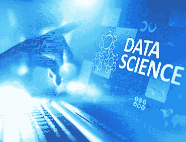

# 数据科学改变世界的 7 种令人难以置信的方式

> 原文：<https://medium.datadriveninvestor.com/7-unbelievable-ways-data-science-is-transforming-the-world-3e759d931747?source=collection_archive---------21----------------------->

数据分析正在以一种非常真实的方式接管世界。越来越多的千禧一代渴望从事数据工作，数据科学家是科技爱好者的首选职业。数据分析基本上是对数据的研究，使我们能够从中获取信息。数据科学基本上利用算法和科学方法从数据中提取信息。越来越多的年轻人渴望[学习数据科学](https://imarticus.org/data-science-prodegree/)并在专业上使用它，以便以此为职业。

但是谁是数据科学家呢？他或她做什么？一个数据科学家的技能主要涉及处理数据，从而善用数据。他们学习数据科学，但更重要的是，他们被训练处理大量混杂的数据，然后使用他们的教育和编程技能来评估这些数据，并从中提取信息。

它是如何塑造娱乐圈的？

你知道吗，数据科学正在帮助好莱坞看穿自己的缺陷，消除过去的错误，以获得更多利润？多年来一直在评估剧本的文尼·布鲁泽塞利用了他所能获得的关于过去好莱坞冒险的数据。数据科学家的技能包括浏览数据，这正是 Vinny 所做的。Vinny 和他的分析团队将剧本草稿及其情节与之前发布的电影进行比较，并告诉制片人需要做出哪些改变才能取得成功。

体育分析

当然，数据分析在体育领域也发挥着巨大的作用。统计已经成为美国体育产业的一部分，在基层也非常有用。但有了数据科学，运动队正在收集数据，以帮助他们的球员更好地了解他们的比赛。无论是棒球还是篮球，数据分析正在彻底改变每年带来数十亿美元收入的体育产业。事实上，大多数主要运动队都有他们的分析师团队来收集和比较数据。

数据科学如何帮助灾难管理？

数据科学改变世界的最佳方式之一是成为灾难管理的一个有效部分。可以预见的是，数据分析使用许多因素，如传感器、规划、资源等来了解灾难的影响。危机响应团队尤其需要数据科学来吸收与灾难相关的数据，更好地做好准备，并帮助当前的救援行动。

它正在改善医疗保健

如果你想知道数据科学在医疗保健中的作用，你必须知道数据分析在某种程度上拯救了医疗行业。在医疗保健领域，医生和科学家可以访问关于他们的患者、疾病史或其潜在后果的海量信息。在可穿戴设备数据和高效自学软件的帮助下，数据分析极大地改善了医疗保健。

数据分析是教育的推动力

数据科学和教育有着相互依存的关系。越来越多的学校正在提供一门课程，允许个人获得数据科学家技能，并实际获得该领域的学位，以便以此为职业。分析也有助于教育系统监控教育系统的发展方向，因为它可以积累个人数据和综合数据。

数据分析和政治

在过去的几年里，数据科学和政治之间的关系经历了很多。数据科学和数据收集如何塑造一个国家的历史是显而易见的，然而，它也可以帮助该国人民和政党做出更好、更明智的决定。尽管存在陷阱，但重要的是要记住，数据科学有助于普通人了解自己的经济和文化状况，这也让他们能够做出更明智的决策。

数据科学正致力于贫困的原因

理解第三世界国家贫困和资源不足背后的背景是非常重要的。只有对问题有了清晰的认识，我们才能找到解决问题的有效方法。非政府组织，当然还有政府组织，利用数据科学来更好地掌握一个国家的人口、医疗保健和经济状况，从而了解如何解决贫困问题。