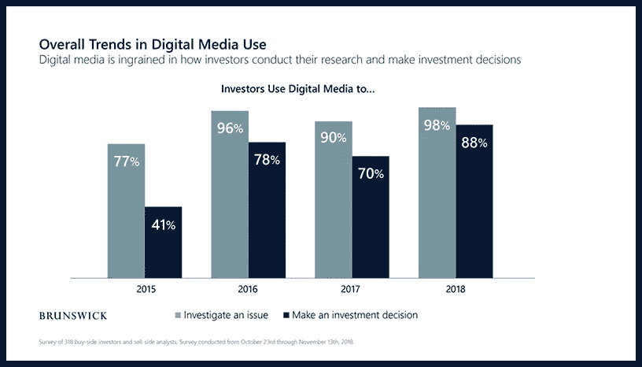
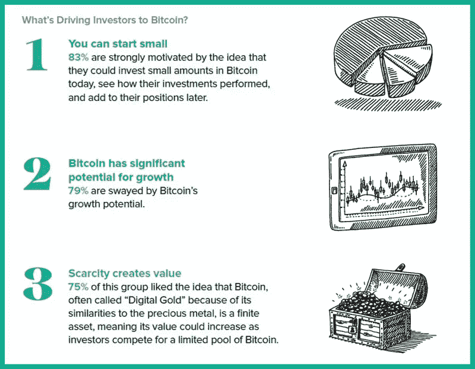

# 用数字吸引新投资者的 7 种有价值的方法

> 原文：<https://medium.datadriveninvestor.com/7-valuable-ways-to-attract-new-investors-with-digital-aeb0a12b5f0a?source=collection_archive---------6----------------------->

Many blockchain and traditional small caps are simply doing it wrong

## 所有客户都希望建立投资者名单

## 一半的投资者说他们使用数字平台

投资者名单的建立是所有客户希望从他们的顾问那里得到的。许多人认为这是消除市场波动、平息贸易战不确定性并推动他们获得巨额利润的圣杯。

这种想法的问题在于，建立名单和吸引投资者的本质已经发生了根本变化。

 [## 算法交易的机器学习|数据驱动的投资者

### 当你的一个朋友在脸书上传你的新海滩照，平台建议给你的脸加上标签，这是…

www.datadriveninvestor.com](https://www.datadriveninvestor.com/2019/01/30/machine-learning-for-stock-market-investing/) 

小型股、中型股和区块链公司面临着和 Etsy 店主一样的商业现实。在现代营销中，你的数字足迹很重要。

> 不伦瑞克的一项研究发现，一半的投资者现在使用数字平台来了解首席执行官们在说什么。

年轻的投资者和分析师不仅使用社交媒体进行研究，还使用社交媒体进行投资决策:在**20 至 29 岁的人群中，44%的人使用过 Twitter29%的人根据他们在 Whatsapp 上了解到的信息进行投资，20%的人根据他们在 Reddit 上了解到的信息采取行动。**

Digital media is ingrained in how investors conduct their research

事实是，投资者、分析师和交易员越来越希望看到一个强大且相关的在线业务。对于半数寻求扩大投资者名单的公司来说，这是个坏消息。

> 许多区块链和传统小盘股只是做错了。

我有机会查看了数百个小型股和区块链网站。高管们没有利用数字和社交媒体来接触和吸引投资者。网站上堆满了照片和照片。提供一个不可抗拒的报价以换取访问者的姓名和电子邮件地址的基本原则实际上是不存在的。

这些公司在利用数字资产建立关系并将在线流量转化为合格投资者方面挥舞着白旗。他们的游戏计划可能包括从名单经纪人那里租用电子邮件地址。

小型股是指市值低于 3 亿美元的上市公司。区块链公司提供数字证券和安全令牌产品(sto)的组合。投资者对参与这些类型的公司越来越感兴趣。

在**灰度年度比特币调查**中，超过三分之一(36%)的美国投资者会考虑投资比特币，这代表着普通人群中超过 2100 万投资者的潜在市场。

考虑比特币、小型股、区块链驱动的数字证券和股票的投资者将进行某种程度的在线研究。这些潜在客户中有一部分会根据他们的发现做出决定。

有许多可用的来源。检查论坛、聊天室、电报和不和谐群体中的情绪是产生嗡嗡声的一部分。如果某只股票或新密码在 Twitter、脸书和 LinkedIn 上传播开来，甚至机构投资者也会搬家。

那么，怎样做才能增加机会，把胜利从数字化的失败中拯救出来呢？专注于公司的定位。

存在市场和价格波动。有消极的场景和坏的演员。但也有机会和惊喜可以发现，吸引投资者。别等了。开始吧。

# 以下是用数字吸引新投资者的七个策略

**化身我**
1。知道你要接触的投资人的头像。他们活跃在哪些社交平台上？LinkedIn 是最受专业人士青睐的社交平台。拥有超过 5 亿的会员(每月有 3 亿人活跃)，你必须过滤才能建立联系。像一个品牌公司网页，确定员工和定期发布时间表是必不可少的。

**偷窥**中的
2。你的网站是了解你公司的窗口。最初的数字印象可能对你有利，也可能是一场灾难。我查看了数百个格式相同的小型网站。库存照片、样板文本和相同的菜单选项。展示一些创造力来提高你的转化率。

**Google 了你**
3。与你所在行业相关的关键词有哪些，你是如何为它们排名的？投资者通常关注宏观的行业信息、公告和趋势。如果你有专门的产品，那么你应该出现在谷歌和其他搜索引擎如必应甚至 YouTube 的首页。

A strategic approach is the key to winning

**加入你的网络**
4。首席执行官和创始人需要拥有强大的数字档案。除了公司网站，LinkedIn 也是一个很好的起点。优化内容，给人真实的感觉。推特账号是另一种选择(今天甚至连总统也发推特)。重点是个性化品牌。

**点击 IR**
5。新闻快讯。没有一个潜在的投资者会在你的投资者关系选项卡上梳理所有这些 pdf 文件。他们也不会读完你白皮书的全部 47 页。卖的是咝咝声，不是牛排。将这些内容重新组织成小块的美味信息。额外的好处是内容已经符合法规。

**了解你的分析学**
6。检查您的谷歌分析，看看哪些平台是指交通和链接到您的网站。此外，挖掘访问你网站的人的人口统计和兴趣。确定它们进入的页面和退出的位置。这将进一步验证你的头像，可以为广告提供依据。

钱在单子上
7。建立一个庞大的合格投资者名单是一桶金。但首先，你必须创建一个有效的漏斗。用不可抗拒的优惠吸引网站访客进入你的电子邮件列表。用后续的电子邮件和广播来培养他们。引导他们做出对你有利的投资决定。

# 摘要

如今，小型上市公司更难获得关注和筹集资金。社交媒体提供了一种行之有效的方式来创建社区，吸引和激活你的受众。直接与最关心你所做事情的人交谈。相对于在社交平台上更活跃的竞争对手，一个薄弱的数字档案会让你的公司处于劣势。

战略方法是取胜的关键。认识到传统路演、分析师电话会议和股东会议与数字营销的融合。一个可靠的数字营销策略是你的蓝图。使用它作为您的全球定位系统，引导尽可能多的流量到您的在线酒店。这种方法将增强您的网站，支持投资者关系，并将您的品牌定位为数字通信领域的领导者。

Traders work on the floor of at the closing bell of the Dow Industrial Average at the New York Stock Exchange on October 31, 2018 in New York. — Bryan R. Smith | AFP | Getty Images

# 后续步骤

许多区块链和小盘股公司发现，将这项工作外包给专业人士更划算。公司内部通常没有时间和人才来实现它。

作为一名高级管理人员，你有责任使用社交和数字手段来接触和吸引投资者。包括销售线索磁铁、视频、播客和特别报告在内的数字元素将推动潜在客户做出积极的投资决策。

你到底在等什么？社交媒体提供了一个将你的潜在投资者圈扩大到数百万人的机会。如果做得有效，你可以在短期内扩大你的清单，并在长期内创造价值。