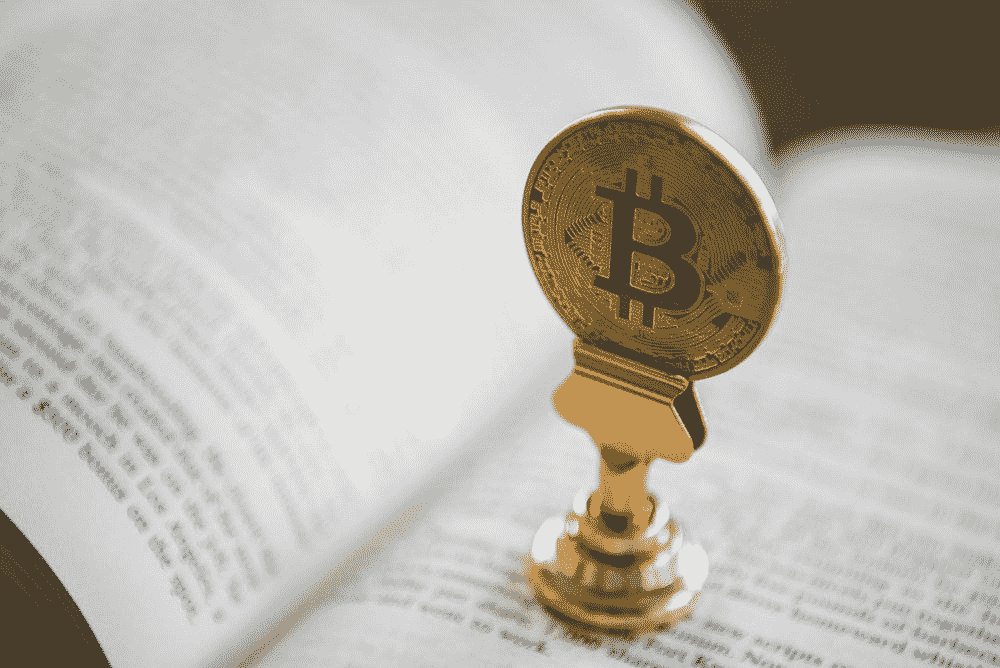
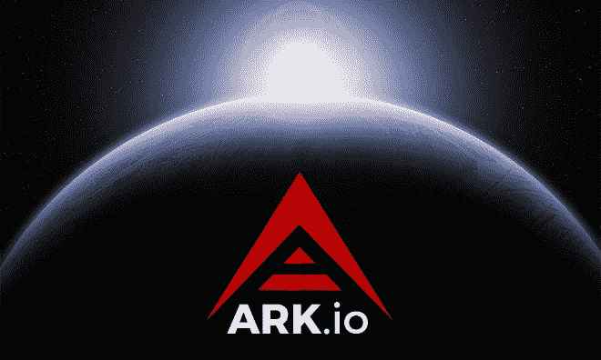
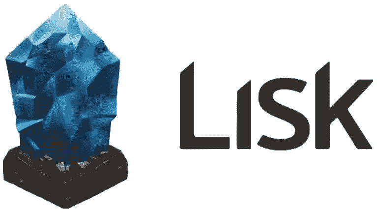
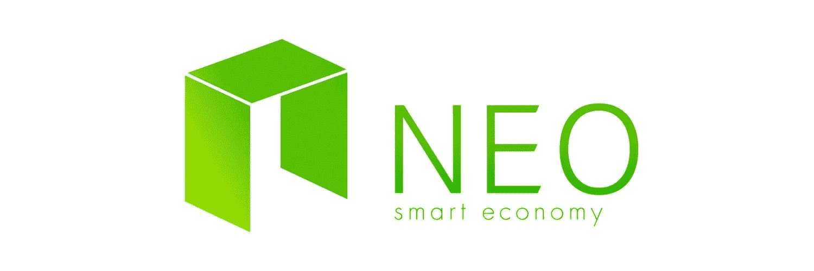
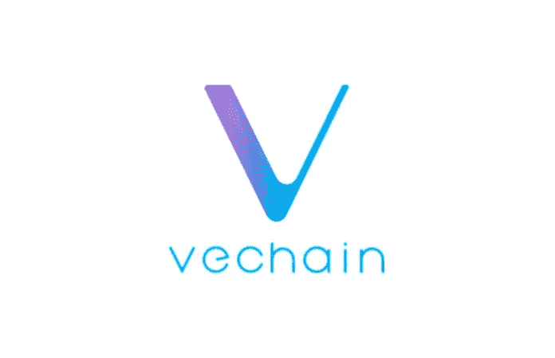
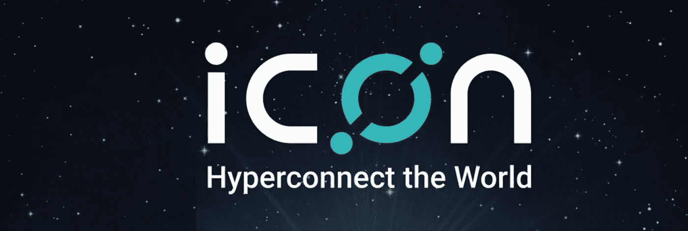
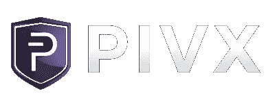
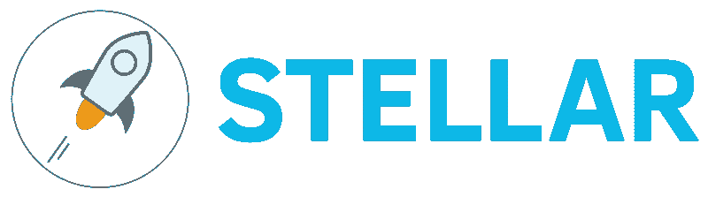

# 每天在 Crypto 中赚钱的 7 种方法

> 原文：<https://medium.datadriveninvestor.com/7-ways-to-make-money-every-day-in-crypto-85a9a8617790?source=collection_archive---------0----------------------->

> 你有没有想过如何从加密中赚钱？

大多数散户投资者采取 HODL 心态，即持有硬币以求长期增长的策略。虽然这是一个可靠的方法，但还有其他方式赚钱，每个投资者都应该探索。

把它想象成使你的赚钱机制多样化。

以过去几个月为例。

> 在比特币炒作和大众媒体关注的背景下，普通霍德勒在 12 月获得了巨大的收益。但随着比特币在 1 月初经历了一次重大调整，整个市场也随之下跌。霍德勒夫妇经历了 4 个月的熊市，他们持有的少量另类投资每天都在慢慢流失。

那么，我们如何在熊市中“赚钱”呢？怎样才能在横盘行情中赚钱？

**关键在于使我们的赚钱策略多样化。**

# **你怎么赚钱？**

花点时间分析一下你的投资组合。如何看待自己的持股？

*   **你会按市值分组吗？**(即。微型、小型、中型和大型)
*   你按类别分组吗？(即。平台、公用事业、货币、证券或指数)
*   **你是按投资期限分组的吗？**(即。短期、中期和长期)

假设你按照投资期限来组织你的投资组合。这可能是你如何分解你的投资组合:

*   **长期**:这些是你的 HODL 硬币，是你相信并继续持有的可靠项目，不管价格如何波动。你忽略了价格的短期波动，但在更长的时间框架内，这些项目的价值会翻两番、四番、十倍。
*   **中期**:这些是较新的、不太成熟的项目，你认为它们有很好的增长潜力。它们不像你长期持有的股票那样坚如磐石，但前景不错，或许有一天会成为长期持有的股票。更重要的是选择好你持有这些股票的时机，以避免在价格过高时买入。在牛市中，这些较小的替代货币将比传统的大型加密货币给你带来更好的回报。
*   **短线交易**:这是你用来做日内/摆动/动量交易的有趣的钱(随你喜欢！).你不必对这些项目进行深入的基本面分析，因为你更多的是在进行技术分析。这只应该是你投资组合的一小部分。

但是，还有一种投资者经常忽视的赚钱策略，这种策略适用于投资组合的任何组织。

**这就是我们每天在 crypto 中发现的 7 种赚钱方法。**

Never put your eggs all in one basket. If you really have to, at least make sure they’re all different colours.

# **被动收入**

> 被动收入是指定期收到的收入，只需很少或不需要努力就能维持

听起来是不是很棒？

投资物业的租金支付或持有大型蓝筹股的股息支付是传统形式的被动收入。但是你知道你也可以从加密中获得被动收入吗？

有几种不同的加密货币目前提供的“股息”或支出的年回报率在**5%到 10%之间**。这些支出都是加密货币，随着时间的推移，货币估值的任何增长都会使**变得复杂。**

想想看，10%的回报率肯定胜过你的银行提供的 2-3%的年利率。目前，它的年收益率在 3-4%之间，超过了大多数政府债券。你可能会说它甚至胜过某些国家的房地产市场(在澳大利亚，悉尼的房价自一月份以来已经下跌了 2%)。

有人会说 10%与股市回报持平，但你忘了这些“秘密红利”会因基础货币的未来增长而复利。

> 假设你今天在方舟投资了 400 美元。在写这篇文章的时候，ARK 的价格是 4 美元，所以你总共有 100 个 ARK。在这一年中，通过竞拍，你可以获得 10 个额外的绝对免费的方舟。所以你现在有 110 个方舟。让我们做一个猜测，假设 ARK 仅仅在一年的时间里达到它的最后一个 ATH 9 美元。你最初投资的 400 美元现在价值 990 美元，147%的收益。这是从你的“加密红利”中额外获得的 22%的收益。

这里有几个提供“秘密红利”或被动收入的项目。

# **方舟**

ARK 是第三代区块链平台，采用授权利益证明(DPoS)共识机制(DPoS)。ARK 拥有最好的桌面钱包之一，易于使用，并与 Ledger Nano S 完全兼容，使其成为设置赌注的一个有吸引力的选择。

要从方舟系统中获得红利，你只需要买一些方舟，把方舟放在你的钱包里，然后投票给一个代表。然后，该代表将为您提供一笔支出，作为为他们投票的奖励。

代表是希望帮助运行方舟网络的用户，很像工作证明机制中的比特币矿工。要成为代表，用户支付 25 方舟费并注册为代表。方舟持有者然后投票选出代表，前 51 名代表被选中验证网络上的交易并因此获得奖励。大多数代表创建利润分享计划，让用户为他们投票；方舟持有者就是这样获得‘方舟红利’的。

投票选举代表的方舟持有者的平均回报率为每年 10%。一些最受欢迎的代表包括 Biz classic、Dutch delegate、Jarunik、Sharkpool、Biolyn 和 arkpool。

不确定选择哪个代表？前往 [ArkDelegates subreddit](https://www.reddit.com/r/ArkDelegates/) 获取更多信息。

需要帮助设置您的投票吗？[看看这个教程](https://blog.ark.io/how-to-vote-or-un-vote-an-ark-delegate-and-how-does-it-all-work-819c5439da68)。

想买些方舟吗？你可以在币安、比特雷克斯和科斯购买方舟。

# **利斯克(LSK)**

LISK 是一个类似的区块链项目，利用 DPoS 机制和代表投票。在 LISK 中，前 100 名代表会投下硬币，LISK 持有者也可以根据他们提供的奖金为代表投票。

点击了解更多关于[设立 LSK 的信息。](https://earnlisk.com/)

想买些 LKS 吗？你可以在币安、霍比、比特雷克斯和科斯上购买 LSK。

# **尼奥**

NEO，以前被称为 AntShares，是一个区块链平台，利用了一种委托拜占庭容错(dBFT)算法。像 ARK 一样，NEO 也有一个非常用户友好的桌面钱包，由 City of Zion 开发，与 Ledger Nano S 完全兼容。

NEO 持有者以气体的形式获得红利。气体是近地天体区块链上用作燃料的加密货币，随着每一个新的近地天体区块的生成，所有近地天体持有者都会获得气体。在撰写本报告时，**持有 NEO 的股息每年在 4-5.5%之间**

NeonWallet 无疑是最容易使用的莱杰 Nano 兼容钱包，[在这里查看](https://neonwallet.com/)。

想知道你能赚多少钱吗？[看看这个气体计算器。](https://neotogas.com/)

想买些 NEO 吗？你可以在币安、Bitfinex、Huobi、Bittrex 和 Kucoin 上购买 NEO

# **VeChain Thor(兽医，前文)**

如果你最近在加密货币领域，你可能听说过 VeChain。它被如此欺骗，以至于在一个月内禁止在 subreddit r/cryptocurrency 中提及 VEN。

在 VEN(将更名为 VET)生态系统中使用了两种类型的令牌:

*   **VET** : VeChain 代币被用作智能支付货币。这为用户提供了使用 VeChain 区块链的权利和优先权
*   雷神:雷神能量是区块链飞船的燃料，类似于气体对于近地天体的作用。当智能合同被执行或当 VET 在不同地址之间转移时，THOR 被消耗或烧毁。

VeChain 网络将有 4 种类型的节点，由 VET 持有量和到期日决定。无需深究细节，早期持有更多 VET 的主节点将获得更高的百分比支付。

所有兽医持有者将被动产生雷神，但是那些经营主节点的将获得更高比例的支付。

要了解更多关于支付系统的信息[，请查看这篇文章](https://medium.com/@vechainofficial/vechain-apotheosis-part-ii-thor-power-forged-974111a93278)。

想知道你能赚多少雷神，看看这个[雷神计算器。](https://thorcalculator.com/)

想买一些 VET(目前 VEN)？你可以在币安、比通布、霍比、库科伊和利基购买兽医

# **图标(ICX)**

ICON 利用循环容错(LFT)共识机制，与使用 dpo 的支付系统相似。类似地，ICX 持有者投票给帮助运行图标区块链的代表，代表通过向他们支付部分收入来回报选民。

想买些 ICX 吗？你可以在币安、比森布、霍比和科斯购买 ICX

# **PIVX**

PIVX 是 DASH 的派生，利用了利益相关共识机制。像 VeChain 系统一样，在 PIVX 上运行 masternode 的用户比那些简单下注 PIVX 的用户获得更高的回报。要运行 Masternode，至少需要 10，000 个 PIVX。

没有 10,000 PIVX？不要害怕！**没有最低 PIVX 要求**，这意味着您可以在钱包中投入任意数量的 PIVX 并获得支付。**目前的股息大约是每年 5%**

[在此了解如何设置 PIVX 进行赌注。](https://pivx.org/knowledge-base/staking-setup-guide/)

想知道你能挣多少钱吗？[看看这个 PIVX 计算器。](http://pivx.cryptonode.co/)

想买些 PIVX 吗？您可以在币安和 Bittrex 上购买 PIVX

# **恒星(XLM)**

虽然从技术上讲，这不是一个支付红利的密码，但恒星流明的持有者可以通过加入 Lumenaut 社区池来获得通货膨胀支出。就支出而言，它可能没有 ARK 或 LISK 多，但它仍然是免费的！所以，如果你是 XLM 持有者，一定要设置好你的 Lumenaut！说明很容易理解。

# **结论**

在建立加密货币投资组合时，创造被动收入是一个需要考虑的重要策略。

通过包括支付“红利”的项目来分散你的投资，这样你就可以在下跌的市场中积累财富！