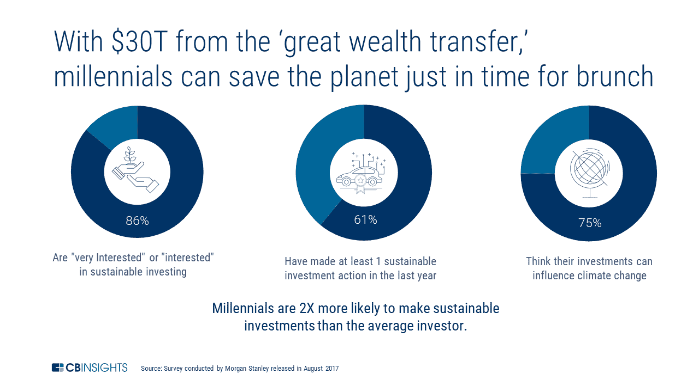
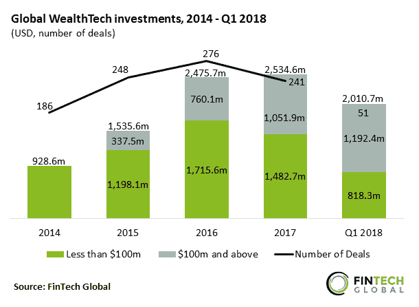

# 财富科技数字化财富管理的 7 种方式

> 原文：<https://medium.datadriveninvestor.com/7-ways-wealthtech-is-digitizing-wealth-management-57edc33a69fd?source=collection_archive---------21----------------------->

> “客户体验是传统金融机构欠缺的主要领域。70%的千禧一代更愿意去看牙医，而不是银行家。”高盛(Goldman Sachs)的马库斯主管哈里特塔尔瓦(Harit Talwar)。

不久前，财富管理被认为是一项几乎专属于富人的服务。有了数百万美元的资金，富有的投资者可以利用财富管理公司提供一系列量身定制的投资相关服务，而这些服务通常价格不菲。

但如今，这种对财富管理的看法已经过时，或者根本不准确。创新打破了这些排他性的障碍，使以前只有少数特权阶层才能获得的服务掌握在广大普通投资者手中。

而且不仅仅是普通投资者。年轻的投资者也是如此。有了**财富科技**，精通科技的年轻人正在推动财富管理方式发生翻天覆地的变化…

Wealthtech 隶属于 fintech，是一个专门关注旨在改变财富管理和零售投资的技术的细分市场。它涉及将数字化解决方案应用于财富管理，最终提供新的渠道，为客户提供更高效、更具成本效益和更高效的服务。

成本节约来自过程的更大自动化、资产分配的流线化和投资组合管理的更大集中化。

# 儿童——未来…

年轻的千禧一代似乎也将在很大程度上推动财富科技的进步。根据 CBInsights 最近的一项分析,“在未来几十年，千禧一代将从他们的父母，婴儿潮一代那里继承大约 30 亿美元…”这位研究专家还预测，到 2030 年，这个群体拥有的财富将是现在的 5 倍。

因此，大量的资本可能会被争夺，“新贵和顾问都在争夺一块馅饼。”但鉴于他们对传统、遗留机构的厌恶，很可能是“暴发户”赢得了这场特殊的战斗。

[*来源*](https://s3.amazonaws.com/cbi-research-portal-uploads/2018/03/14122256/30T-opportunity-millennials-2x-more-likely-to-invest-in-sustainability-Impact-Investing.png)

如果公司继续使用在婴儿潮时期出生的人身上可能奏效的同样过时的策略为千禧一代服务，它们似乎不太可能成功。

事实上，技术已经在帮助千禧一代做出更明智的投资决策，特别是通过最大和最明显的财富科技类别。

# 1.机器人顾问

迄今为止，机器人顾问在财富技术领域产生了最大的影响。这种非常受欢迎的数字财富管理形式比传统的资产管理自动化程度更高，利用机器学习算法——而不是人类顾问——来确定每个投资者的最佳投资组合分配。

事实上，大部分流程都是在线的，这意味着员工成本通常可以降低。也就是说，大多数研究表明，大多数机器人顾问客户更喜欢自动化和人工建议的结合，即混合模式，其中[先锋集团](https://about.vanguard.com/)、[改善](https://www.betterment.com/press/newsroom/betterment-raising-hybrid-game/)和[个人资本](https://www.personalcapital.com/blog/personal-capital-news/digital-wealth-management-vs-robo-advisors/)是一些领先的提供商。

我们之前已经讨论过机器人顾问如何改变这个行业。但其他类型的财富科技正在出现，以扩大这一特定领域的定义，重要的是，它们正在破坏价值链的几乎每个重要阶段。

# 2.机器人退休

作为在美国广受欢迎的机器人顾问的一个子集，机器人退休公司正在应用技术来管理退休储蓄账户，包括 401(k)、403(b)和 IRA。

退休人员机器人顾问的一个例子是联合收入公司，它专门处理为退休定制的服务。除了像典型的机器人顾问一样提供自动化投资平台，该公司还提供特定的退休人员相关服务，如“退休支票”，帮助客户以类似于他们获得定期收入时的方式规划他们的资金，一次性财务计划，以及社会保障和医疗保险援助。

因此，就像混合机器人顾问一样，大多数机器人退休服务都包含自动化和人工两部分。

# 3.小额投资

随着投资变得更加容易获得，它也必须变得更加灵活，以适应更广泛的投资者类型。因此，在众多市场上，通过各种机制，最低投资门槛正在被大幅削减。

小额投资就是这样一种机制。它意味着将小额资金存入投资账户，从而消除一些传统的投资障碍，如交易费和最低余额要求。这通常可以通过智能手机非常方便地完成。

到目前为止，有两家公司已经成为该领域的领导者——橡子公司和 T2 投资公司。两者都可以在 iOS 和 Android 上作为移动应用程序使用，并且每次只需很少的投资。事实上，Acorns 没有最低存款要求，而 Stash 的最低存款额是 5 美元。但 Stash 确实提供了更大范围的交易所交易基金(ETF)的投资渠道。

鉴于[众所周知的问题](https://www.ft.com/content/94e97eee-ce9a-11e5-831d-09f7778e7377)千禧一代面临为未来存足够的钱，小额投资提供了一个非常有用的渠道来帮助他们定期存少量的钱。因此，对于那些手头拮据的人来说，这很可能会让投资变得更加方便和易于管理。

# 4.数字经纪

现在交易比以往任何时候都更容易。这意味着任何人都可以获得以知情方式投资所需的工具。我们最近观察到 eToro 等社交交易平台的兴起，这是提高可访问性的主要方式之一。

Robinhood 等其他数字经纪商允许投资者参与市场和投资基金，而无需支付传统上过高的佣金。据该公司自己说，它“从头开始建造，以尽可能提高效率。通过削减脂肪——数百个店面位置、人工账户管理、昂贵的超级碗广告等。— Robinhood 能够保持一个精益的底线，并将节省的成本传递给客户。”

传统经纪商现在也在向这一领域进军，在他们的产品组合中加入了数字服务。通常情况下，这项新服务将比传统版本更便宜，一些服务被排除在外，以补偿节省的成本。

# 5.投资组合管理

这涉及到创新的工具，允许在单一平台上管理投资组合，对投资者和财务顾问都有利。这有助于双方监控、分析和更好地管理投资组合。

Grisbee 是一家提供此类工具的富裕科技公司。它为投资者提供了一个在线投资组合管理平台，将他们的各种账户整合在一起，以便更方便地进行监控，并获得量身定制的投资建议。

# 6.投资工具

投资者可以使用这些工具来获取有用的投资信息。

例如， [Nerdwallet](https://www.nerdwallet.com/) 提供了一个投资专家网络，它提供了市场上数字经纪人的比较，以及不同银行和保险公司提供的产品。 [Kensho](https://www.kensho.com/) 正在使用一个强大的人工智能平台来分析大量可能影响市场的数据，以发现世界事件及其对各种资产市场价格的影响之间的关系。

# 7.金融服务软件

企业现在向银行和金融科技初创企业等客户提供专门的软件，支持采用数字财富管理和投资策略。

例如，Plaid Technologies 构建 API 来连接消费者、传统金融机构和开发者。例如，应用程序用户可以使用 Plaids 软件连接到他们的银行账户。

随着新的、更繁重的监管要求最近生效，财富科技公司也非常重视向财富管理公司提供增强的风险管理软件。

# 值得观看的片段

许多这类公司的惊人成功，突显出财富科技向投资者、金融服务公司和金融科技初创企业证明了自己有多么受欢迎。它的效用进一步反映在它现在获得的急剧上升的投资上:

人们猜测，一旦财富科技发展到足够先进的自动化水平，人类投资经理是否会被边缘化。但让我们明确一点，机器人不会很快取代财富经理的工作。无论自动化服务变得多么智能，富人和超级富人(或富人和非富人)仍将需要金融顾问个人的、细致入微的投入。

《福布斯》最近引用了约翰·鲍文的话，他是 CEG 优势公司的创始人，也是《精英财富规划:超级富豪的教训》的作者，他进行了 30 多年的广泛实证研究:“财务顾问行业最重要的成功因素是人的因素。这是财富管理中个人和情感的组成部分。除了可能受到财富管理解决方案影响的一切和所有人之外，它还涉及对富裕个人或家庭重要的一切和所有人。”

*原载于 2018 年 10 月 24 日*[*【www.datadriveninvestor.com*](http://www.datadriveninvestor.com/2018/10/24/7-ways-wealthtech-is-digitizing-wealth-management/)*。*