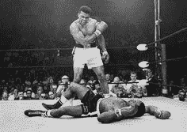
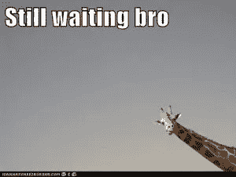

# 7500 美元到 50000 美元第 14 部分-加密

> 原文：<https://medium.datadriveninvestor.com/7500-to-50k-part-14-down-goes-crypto-4c71e5d7b5a4?source=collection_archive---------9----------------------->

subscribe-[iTunes](https://itunes.apple.com/us/podcast/bit-better-have-my-money/id1374764732)[Stitcher](http://www.stitcher.com/s?fid=183129&refid=stpr)[Google Play](https://playmusic.app.goo.gl/?ibi=com.google.PlayMusic&isi=691797987&ius=googleplaymusic&apn=com.google.android.music&link=https://play.google.com/music/m/Ikoddu7nd3g5ijjnhnedvdpgzo4?t%3DBit_Better_Have_My_Money!%26pcampaignid%3DMKT-na-all-co-pr-mu-pod-16)[iHeartRadio](https://www.iheart.com/podcast/269-Bit-Better-Have-My-29238100)

组合-[https://cointracking.info/portfolio/bitbetterhavemymoney](https://cointracking.info/portfolio/bitbetterhavemymoney)

是的，这就是现在的感觉。投资组合降到了 3400 美元。当我想到它高达$ 15，000 时，我有点难过。那是一次漫长的坠落。

最近，我被问了很多市场什么时候会回来的问题。所有在大涨时入场的人都期望赚大钱。**现在已经下去了，人家不耐烦了。**

我明白，我们大多数人都在赔钱，这并不好玩。我们需要想想那些在比特币 2 美元时购买比特币的人。他们等了很久，终于有了回报。

会涨，但可能需要一点时间。

我最近没有做任何交易。我必须投入更多现金或转移一些比特币才能做到这一点。我想把我的比特币留在原处，这样当它上涨时我就能获利。

我每周三都在买比特币和以太坊。通常每个 20 美元左右。不多，但日积月累。由于价格如此之低，我能够以很高的价格增持。

现在这是我的主要目标。在我可以的时候增加比特币和以太坊的持有量。它将回到历史高点。我不想去想，伙计，我希望我在 7500 美元的时候就买了，而不是 20000 美元。

耐心是困难的，但是现在它是游戏的名字。

这是另一张照片……..

我看得越多，就越嘲笑狼。