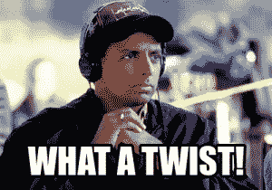

# 7500 美元到 50000 美元(第 15 部分)- 6 个月内

> 原文：<https://medium.datadriveninvestor.com/7500-to-50k-part-15-6-months-in-d1a061ce6f8f?source=collection_archive---------8----------------------->

subscribe-[iTunes](https://itunes.apple.com/us/podcast/bit-better-have-my-money/id1374764732)[Google Play](https://playmusic.app.goo.gl/?ibi=com.google.PlayMusic&isi=691797987&ius=googleplaymusic&apn=com.google.android.music&link=https://play.google.com/music/m/Ikoddu7nd3g5ijjnhnedvdpgzo4?t%3DBit_Better_Have_My_Money!%26pcampaignid%3DMKT-na-all-co-pr-mu-pod-16)[Stitcher](http://www.stitcher.com/s?fid=183129&refid=stpr)[iHeartRadio](https://www.iheart.com/podcast/269-Bit-Better-Have-My-29238100)

组合-[https://cointracking.info/portfolio/bitbetterhavemymoney](https://cointracking.info/portfolio/bitbetterhavemymoney)

所以我们在这里。从我开始定下拿 7500 美元到 50k 美元的目标到现在已经 6 个月了。在我写这篇文章的时候，我的交易组合是 2800 美元。不是我想要的地方。

比特币价格为 6300 美元。这一直是价格下跌的驱动力。随着比特币的发展，其价格也在上涨。

事情开始得很快。比特币接近历史高点，人们对此感兴趣，资金源源不断。我的投资组合涨到了 15500 美元。看起来我会比我原先想象的更快地达到目标。

但是上升的必然下降。

所有东西的价格都上涨得如此之快，以至于没有办法维持下去。它必须纠正和巩固。长期来看，这是一件好事，短期来看，这可能会带来一些伤害。

听起来我是不是很沮丧，真的很沮丧？如果是这样的话，那么问题就来了。

我对事情的现状很满意。事实上，我很兴奋，因为我可能会更糟。

以下是我有这种感觉的原因。

**我只跌了 0.22 比特币，只比我开始时跌了 34%。**

从市场的角度来看，我可能会跌得更多。许多硬币已经贬值一半或更多。仅比特币一项就下跌了 68%。34%这样看起来也没那么差。

我的主要目标是积累更多的比特币。我能获得的比特币越多，我就越接近 50k 美元的目标。当比特币的价格上涨时，我的投资组合的现金价值也会上涨。

看起来我花在$50k 上的时间比我最初想的要长。这是唯一让我有点沮丧的事情。我不能提高价格。我能做的就是继续努力。

尽我所能做交易，获得较小的收益，然后一点一点地达到目标。

如果容易的话，每个人都会去做。

所以继续跟着走。从我的经历中学习，无论是好的还是坏的。

当 5 万美元的目标达成时，我们可以一起庆祝。

*原载于*【http://bitbetterhavemymoney.com/】

**