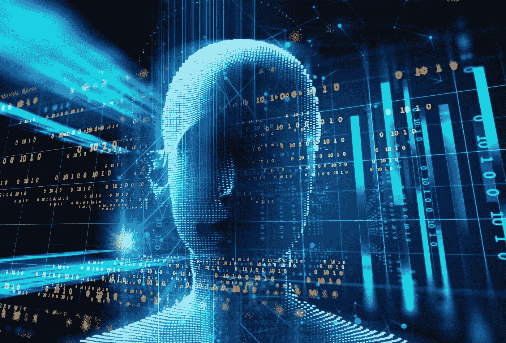
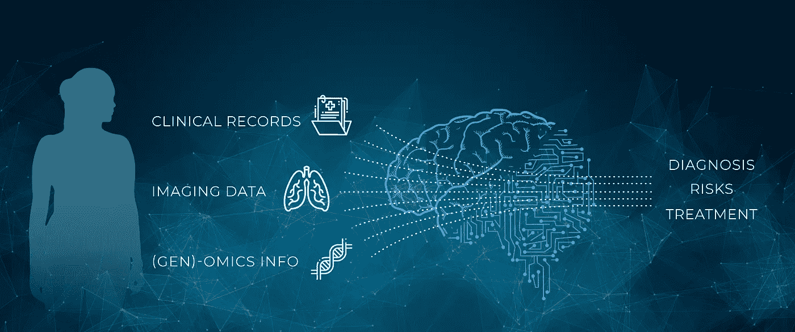

# 医疗保健领域排名第八的人工智能

> 原文：<https://medium.datadriveninvestor.com/8-ai-in-healthcare-987d22a23b4c?source=collection_archive---------12----------------------->

一听到人工智能或 AI 这个词，好奇心和兴趣就会被激发出来。根据人工智能的目的和能力，也可能出现令人担忧的迹象。人工智能有能力取代费力的任务，并在某种程度上复制人脑的一些认知功能。人工智能是医疗保健行业等许多企业和机构的关键驱动力。它有助于决策和改进流程。医疗保健提供商不打算创建一个依赖人工智能的医疗保健系统，而是利用它来获得更大的利益。一些有益的结果可能是以较低的成本向提供商和顾客引入更快、更有效的服务。

在企业界采用人工智能已被证明对消费者体验有积极影响。投资这种技术符合医疗服务提供者的利益。医疗系统的一个关键目标是投资于有助于预测和早期诊断的技术。早期检测可以增加治疗的成功率。尽早发现问题会挽救生命。

Corti 是帮助紧急调度员的机器学习算法的一个例子。它监听紧急电话，并实时分析对话。这种算法使用过去的呼叫来训练自己，在呼叫期间，它将使用呼叫者给出的描述、他们的声音和任何背景声音来进行预测。已经证明，它在诊断心脏骤停方面的准确率为 93%，而人类调度员的准确率为 73%，平均比人快半分钟。**【2】**

将人工智能与医疗保健产品和解决方案结合起来，对于改善医疗保健系统至关重要。医疗保健提供商需要建立一个人工智能集成战略。投资人工智能技术并不便宜，医疗保健提供商往往在有限的预算下运营。这可能是他们没有充分利用这些工具的原因之一。作为他们战略的一部分，他们需要识别人工智能带来的机会。机会可以是任何东西，从具有早期检测算法的 Corti，到帮助医生和护士完成行政任务。

# 那么，AI 真的能帮助文书工作吗？

预约病人是医生角色的重要组成部分。这是他们采访病人并了解问题所在的地方。尽管每次约会都有大量的文书工作和“繁文缛节”任务。这可能是任何事情，从更新病历到开药或订购测试结果。这看起来不像是一项耗费大量时间的冗长任务，但是如果每天可以在文书工作上节省 10 分钟，那么每年就可以为患者增加 40 小时的预约时间(基于 5 天工作周)。语音到文本的转录工具可以使一些管理工作自动化。人工智能可以帮助管理这方面，这可以减少医生或护士的文书工作。这让他们可以优先处理更紧急的事情。节省医生的时间有助于挽救病人的生命。

# 利用人工智能诊断疾病

目前诊断疾病的方法非常昂贵。那些显示潜在感染的疾病由专家使用高科技医疗设备如 CT 和 MRI 扫描仪进行检查。这通常是一个密集的操作，需要多个图像和多次转诊给多个医生来解释图像和诊断患者。据 BBC 新闻报道，心脏病专家预测某种形式的心脏病有 80%的准确率。**【3】**缺失的 20%是 AI 可以盛行的地方。它可能不会达到 100%的准确性，但它肯定有助于缩小差距。

Ultromics 是一个人工智能诊断系统，由英国开发。机器学习系统使用了来自 1000 名患者的心脏扫描，其中包含关于他们最终是否患有心脏问题的信息。在训练了算法之后，它经过了临床试验，并且胜过了人类心脏病专家。这项技术可以帮助确定心血管问题的早期诊断，有可能挽救更多的生命。长期成本的节省将为医院提供投资更多医生的机会，并为农村和欠发达社区提供更好的医疗服务。

人工智能越来越多地参与医疗保健行业是不可避免的。这可能会引起对患者数据隐私的关注。在实施人工智能时，保护数据隐私的挑战将是医疗保健战略的一部分，以便不妨碍患者的隐私权。这将包括不断更新安全系统和不断培训能够接触这些数据的个人。

# 建立信任

接受医生的建议是建立在信任的基础上的。相信他们已经正确地诊断了你，并且他们的方法会有成功的结果。这可能并不总是这样，他们给你开的方法往往只对一定比例的人群有效。这让你质疑全面了解人体的能力，你的身体。另一方面，亚马逊可以告诉你下一步想买什么，或者网飞可以告诉你下一步最有可能浏览什么。有传言说他们雇佣最好的算命师，使用沃特福德水晶球，但这些只是传言。我们知道人工智能和他们在技术上的进步是主要的罪魁祸首。公平地说，人体远比这些操作复杂，但这并不意味着医疗保健不会受益于人工智能。这些是科技公司利用人工智能改善客户体验的例子。想象一下，如果医疗保健提供商在他们的技术战略上投入巨资，会有什么样的可能性。

如上所述的进步可以改善医疗服务和消费者的信任，但潜在的危险需要由提供商来管理，以确保其成功。一个人的监督将需要存在，但这将随着时间的推移而改善。这将取决于收益是否会超过风险。我想会的，但是你呢？

丹尼尔，

团队将死

# 参考

1.  科尔蒂。(2018).*拯救生命的 Corti—AI*。[在线]可在 https://corti.ai/[的](https://corti.ai/)找到
2.  Khan，J. (2018)。*彭博——你是机器人吗？*。[在线]Bloomberg.com。可在:[https://www . Bloomberg . com/news/articles/2018-06-20/the-ai-that-spots-heart-strikes](https://www.bloomberg.com/news/articles/2018-06-20/the-ai-that-spots-heart-attacks)
3.  k . Leary(2018 年)。 *AI 可以比医生更准确地诊断心脏病和肺癌*。[在线]未来主义。可在:[https://futurism . com/ai-diagnose-heart-disease-lung-cancer-more-accurately-doctors/](https://futurism.com/ai-diagnose-heart-disease-lung-cancer-more-accurately-doctors/)