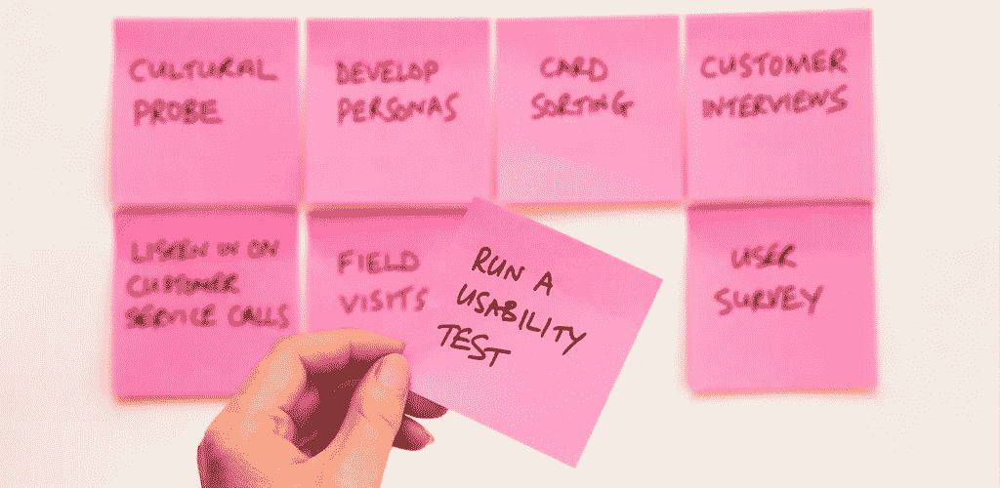

# 提高工作效率的 8 个最佳生产力系统

> 原文：<https://medium.datadriveninvestor.com/8-best-productivity-systems-to-get-more-done-6aed27d86406?source=collection_archive---------11----------------------->

觉得自己做得不够多？

然后，你可能会寻找合适的生产力系统。

今天，我们将看看 8 个生产力系统，它们将帮助你把你的生产力提高到一个新的水平。

准备好了吗？让我们开始吧。

# 你应该选择哪种生产力系统？

在下面，你会看到 8 个生产力系统。

但是:

你应该选哪一个？

事情是这样的:

看情况。

你看，这些不同的生产力系统为不同的目的工作。

其中一些会对你更有帮助。这一切都归结于测试和调整。

通读列表，从最吸引你的系统开始。

现在:

准备好了解不同的生产力系统了吗？

开始了。

# 1.艾森豪威尔矩阵:优先排序系统

德怀特·艾森豪威尔是美国第 34 任总统，第二次世界大战期间盟军最高司令，也是北约第一任最高司令。

这也是他的生产力系统格外有趣的原因。

毕竟他这辈子是怎么成就这么多事的？

方法如下:

艾森豪威尔矩阵。

到底是什么？

艾森豪威尔矩阵是一个任务优先化系统，确保你专注于正确的事情。

这是一个将任务分为四类的系统:

*   **紧急而重要。这些任务在你的优先列表中是最高的。他们应该立即被做。**
*   **重要但不紧急。重要的任务很少是紧急的……因此它们变得不重要——因为它们觉得不重要。仔细考虑你的任务。哪些任务对你的目标影响最大？那些是你想放在优先列表上的任务。**
*   **紧急但不重要。紧急任务感觉很重要——但事实未必如此。回复(大多数)电子邮件、旅行预订和(许多)会议。它们都很紧急，但并不重要。这些任务是在你完成了前两类任务后完成的。**
*   **不重要，不紧急。**最后一个任务类别根本不应该进行优先级排序。一旦你完成了所有其他的任务，这些任务可以被完全消除或者完成。这些任务包括浏览你的社交媒体订阅源、看电视、在办公室聊天或电子邮件中聊一些无聊的事情。

这就是艾森豪威尔矩阵。

如果你想要一个可靠的优先排序系统，这种技术适合你。

接下来:

番茄工作法。

# 2.番茄工作法:高效的工作日

你可能听说过番茄工作法。

这是一个通过短跑帮助你保持高效率的系统。

设置很简单:

你设置了一个 25 分钟的计时器。当计时器停止时，你休息 5 分钟。你在八次冲刺中工作——那是你能保持注意力集中的时间。

今天剩下的时间里，你可以做一些不需要太多注意力的工作。

为什么会这样？

因为你的大脑需要从专注的工作中休息一下。

离开屏幕五分钟，你每天的工作效率会更高。

接下来:

12 周的一年。

# 3.一年 12 周:实现你所有的目标

什么是 12 周的一年？

这是一个创造紧迫性(并因此产生行动)的系统。

这个系统是基于布莱恩·莫兰和迈克尔·伦宁顿的书《12 周的一年》。

这个想法是，我们的年化思维(一年有 12 个月)意味着我们失去了对目标紧迫性的跟踪。

一月、十二月似乎还很遥远，所以我们错误地认为我们有时间去实现我们的目标。

所以 11 月和 12 月是我们生产力最高的月份。

这就是为什么作者建议一年有 12 个 T2 周，而不是 12 个月。

12 周足够完成项目。这足以创造紧迫感…和行动。

但是这个系统是什么样子的呢？

*   每三个月，你决定几个目标。这些都是具体的，可以在 3 个月内实现。例如，如果你有一个更大的目标，那么你就把这个目标分解。你的“子目标”是你的 3 个月目标。
*   为了实现目标，你每周都要设定一些需要完成的任务。然后，您跟踪这些任务来迭代和改进您的系统。
*   在每周、每月和 3 个月的基础上，你回顾你的进步，看看有什么可以改进的。

一年 12 周是一个简单的系统…这就是它如此有效的原因。

使用这个生产力系统为你自己创建一个无与伦比的目标设定系统。

当然，这不是唯一的目标设定系统。

接下来，我们将看看一个可以和 12 周一起使用的一年。

# 4.聪明的方法:一个有效的目标设定系统

定义目标的最佳方式？

使用智能系统。

这是一个帮助你将目标分解成具体的行动项目的系统。

它代表什么？

这是什么:

**特定的。你的目标需要明确，这样你才能确定实现目标的步骤。**

**M——可测量。如果你的目标可以衡量，它就可以实现。确保你的目标是可追踪的。**

**A —可实现。设定一个让人感觉非常大的目标是很好的……但是在一天结束的时候，你的目标需要让人感觉你能实现它。否则，你会很快失去动力。**

**R —相关。**你的目标现实吗？合理吗？这就是相关性的意义所在。毕竟，如果因为缺乏资金、时间或其他资源而无法实现目标，那么制定目标就毫无意义。

**T —有时间限制。**你的目标应该是有时限的。否则，你可能会在一个永无止境的项目上浪费时间。此外，时间限制会产生紧迫感。

现在你知道了——通过组合所有这些首字母缩略词，你可以设定可实现的目标。

接下来:

把事情做好。

# 5.把事情做好:一个可靠的生产力系统

需要一个坚实的生产力系统？

这就是“把事情做好”的完美之处。

这个系统由大卫·艾伦创造，是一个五阶段的工作流程。

这五个不同的阶段是:

*   **捕获。**获取收件箱中的所有材料。一天一次或者至少一周几次。
*   **澄清。**你问自己关于每个项目的问题，以便为每个项目分配行动项目。
*   **整理。**将项目组织成行动项目块。有八个模块:在垃圾桶里，可能列表，参考文件系统，任务列表，立即完成，委派，添加到“下一个行动”列表和添加到你的日历。
*   **反映。反思是关于计划的。您为多步骤项目定义下一个操作和期望的结果。**
*   **接合。最后，你开始完成清单上的一项任务。**

就是这样——这就是“把事情做完”方法的工作原理。

接下来，我们将看看一个简单的习惯实现系统。

# 6.“宋飞正传”策略:创造新习惯

这个系统是关于实现习惯的。

你看:

喜剧演员杰瑞·宋飞有一个简单而有效的策略来培养新习惯。

这个系统是这样工作的:

每天，当你对自己的习惯采取了一致的行动时，你就在日历上标记一个“X”。

例如:

如果你的目标是每天花 30 分钟发邮件，那么每当你达到这个目标时，你就在日历上打个叉。

这样做是为了让你的过程游戏化。

所以你觉得你必须继续实现这些 X……否则链条就会断裂。

这就是你如何创造一个持久的习惯。

# 7.5 秒规则:成为一个立即行动的人

事情是这样的:

如果你曾经纠结于采取行动，5 秒规则适合你。

无论何时，当你有一个想法或一种冲动要对某事采取行动时，在五秒钟之内行动起来……否则你根本不会采取行动。

所以，当你想到一个你觉得应该付诸行动的想法时，从五开始倒数，在时间到之前采取行动。

很简单，是吧？

你打赌。

但同时，你确保每次都采取行动。

# 8.看板:组织和执行你的项目

想要一个能提供项目概览的生产力系统吗？*和*帮你执行任务？

这是:

看板。

你看，看板是一种项目管理系统，是由[丰田公司发明的，用来加快生产速度。](http://blog.toyota.co.uk/kanban-toyota-production-system)

这个想法是你写下所有与项目相关的任务。

然后，你根据你在板上使用的类别来组织它们。

不确定应该使用什么类别？

例如:

你可以使用一个简单的系统，比如“待办事项”、“进行中”和“完成”。

或者更复杂的类别——只要适合您的项目。

并且任务可以被分类

是的，就这么简单。

然而:

也很有效。

# 如何在工作中使用这些生产力系统

就这样——现在你有 8 个工作效率系统可以使用了。

接下来:

执行它们。

选择一两个，开始测试。

请记住:

你需要一些时间来养成新习惯。给它时间，你会看到你的生产力上升。

现在:

你最喜欢哪种生产力系统？

请在下面的评论中告诉我们。

*原载于 2018 年 10 月 18 日*[*【www.getminute.com*](https://www.getminute.com/productivity-systems/)*。*