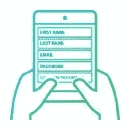
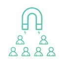
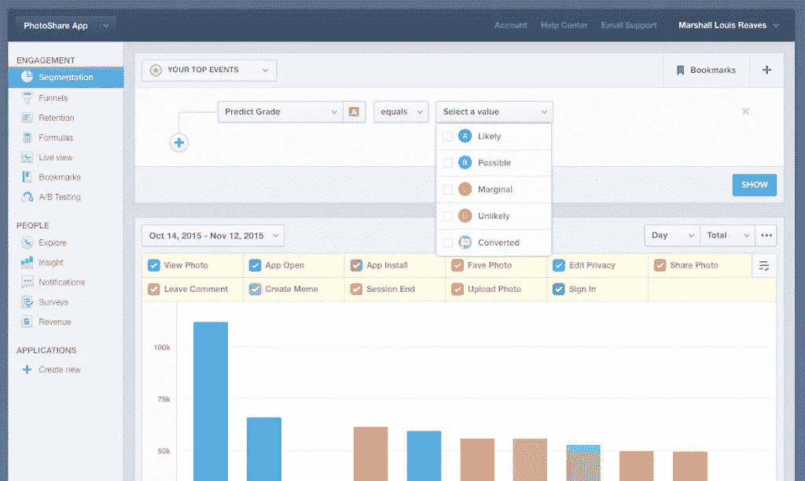
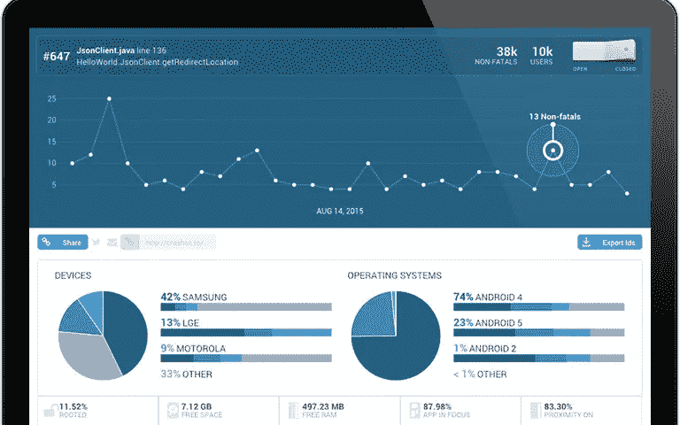
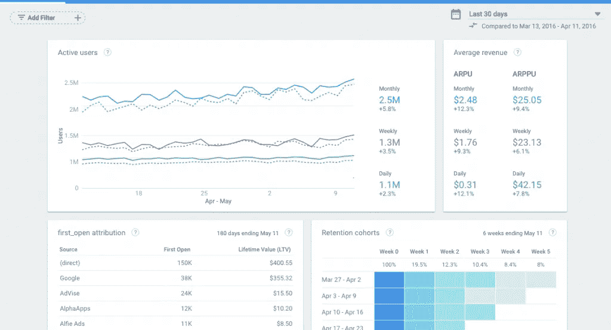
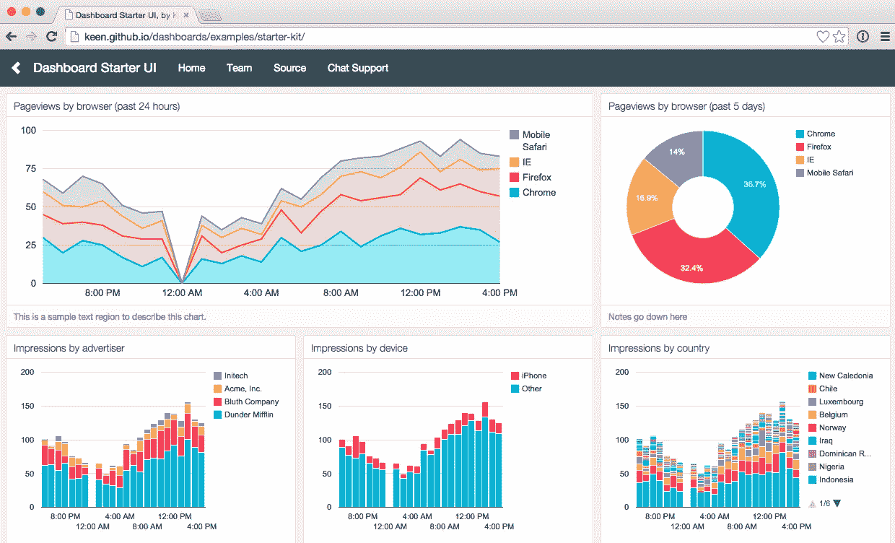

# 您的应用的 8 个关键 KPI 以及如何跟踪它们

> 原文：<https://medium.datadriveninvestor.com/8-critical-kpis-for-your-app-and-how-to-track-them-5a6d74ee7c9b?source=collection_archive---------0----------------------->

你的应用是你的宝贝。你溺爱它，你珍惜它，你是一流的直升机家长。在它诞生之前，你倾注了大量的数字、逻辑和实践，然后做出(你当时认为的)对应用的生存和最终繁荣最好的决定——这些决定将积极地影响你的生活和你的应用的生活。

在你的应用程序发布后，你意识到尽管你像永远崇拜的父母一样做了准备，但你最终永远无法为你和你的应用程序的未来做好充分准备。出现了如此多的新问题和事件，这些问题只有在你遇到障碍或受到应用程序行为的挑战时才会浮出水面。

当然，你的工具箱里有一些分析工具，但也许它们不够用。毫无疑问，您计划跟踪某些指标，但是可能其他指标已经出现了。怎么办？你很幸运，我们已经有答案了。

了解要跟踪哪些 KPI，以及如何跟踪，对于应用的成功至关重要。跟踪指标是你的策略。采用这些指标并使用移动分析工具就是“坚持到底”。正如彼得·德鲁克明智地指出的:

> *“被测量的[正确的方式]得到管理。”*

# 基本 KPI:“战略”

**崩溃会话:**了解你的应用程序何时以及为什么会崩溃，是保留和提高你的底线的关键。可以通过多种方式跟踪这个 KPI:导致崩溃的事件是什么？您的应用程序崩溃的频率如何？一天几次？应用程序中的哪个环节崩溃了？有多少用户受到了应用崩溃的影响？

**用户注册:**完成注册过程的用户更有可能回来，因为他们表现出了兴趣，并且已经完成了最难的部分:输入他们的详细信息。如果你的注册人数没有达到你的预期，你应该开始分析“为什么”。用户是否在努力同步他们的社交媒体账户？表格太长了吗？

**无反应手势:**无反应手势是应用可用性的重要组成部分。当用户在某个屏幕元素上做了一个手势，期望应用程序做出反应，但应用程序没有响应时，就会发生这种情况。如果某些屏幕上出现无响应的手势，这可能表明您的应用程序存在设计缺陷。这也将是用户沮丧或困惑的主要来源，并可能导致用户对你的应用程序的信任度下降。
*专业提示:*通过使用触摸热图追踪无反应手势，你可以了解这些手势发生的地点、时间和原因。

**杀死的会话:**用户会因为很多原因强制杀死一个 app。与普遍的看法相反，用户不会因为习惯或电池寿命的保护而关闭应用程序。用户也会因为性能问题或者挫败感而杀死应用。也许某个特定的屏幕没有响应，或者他们被一个表单弄糊涂了，用户终止了会话。通过在总用户和单个用户级别上密切跟踪这一 KPI，您可以了解用户在哪里/什么时候杀死应用程序，最重要的是，为什么？

**应用没有响应:**如果你的用户正试图完成一项购买，或者他们很着急，突然应用没有响应，这可能会损害你的应用的保留。跟踪用户经历应用程序不响应(ANR)会话的频率。此外，某些屏幕比其他屏幕经历更多的 ANR 会话吗？哪些操作导致了应用程序没有响应？

**每日活跃用户:**这个 KPI 简单地监控每天使用你的应用的用户数量。一天中是否有特定的时间比其他时间更活跃？或者一周中的某些日子更受欢迎？DAU 根据每天与你的应用程序互动的人数来显示你的应用程序受到的关注程度。

**月活跃用户:**与 DAU 类似，这个 KPI 衡量每月与你的应用程序交互的用户数量。跟踪 MAU 可以让你看到应用用户在更长时间内参与你的应用的一致性。

**留存率:**衡量用户返回你的应用的频率——每小时、每周或每月。对于那些不返回的人，这里要问的关键问题是为什么？
*专业提示:*通过使用首次会话的用户会话记录，您可以确切地了解用户为什么会频繁使用。

# 重要的分析工具:“跟进”

这些工具都提供了独特的创新方法来衡量您的 KPI。每个工具都非常有价值，并且有自己独特的 USP。它们都支持 Android、iOS 和混合操作系统。

# [混合面板](https://mixpanel.com/)

作为一个定量事件跟踪工具，Mixpanel 是移动专业人士处理一系列数据点和了解桌面、移动 web 和移动应用程序的整体用户旅程的绝佳选择。在广泛的事件跟踪方面，它是市场领导者之一，并被 Ticketmaster、Intel 和 Viber 等顶级品牌所采用。

**功能:**

*   A/B 测试
*   转换漏斗
*   保留群组
*   推送通知
*   自动洞察

**支持的平台:** Android、iOS、web、移动 web
**定价:**免费/付费(取决于公司的规模)

# [Appsee](https://www.appsee.com?cpnid=701b0000000Wd7c&utm_source=medium&utm_medium=link&utm_campaign=8_critical_kpis_how_to_track&utm_content=appsee_homepage_link)

Appsee 是市场首选的定性分析工具。它最著名的是其[用户记录](https://www.appsee.com/features/user-recordings?cpnid=701b0000000Wd7c&utm_source=medium&utm_medium=link&utm_campaign=8_critical_kpis_how_to_track&utm_content=user_recording_feature)和[触摸热图](https://www.appsee.com/features/touch-heatmaps?cpnid=701b0000000Wd7c&utm_source=medium&utm_medium=link&utm_campaign=8_critical_kpis_how_to_track&utm_content=touch_heatmaps_feature)。用户记录提供每个用户的应用内体验的实时记录，自动标记所有用户的事件和屏幕。触摸热图提供了基于屏幕手势集中的视觉“地图”。这种可视化让你可以准确地看到用户在每个屏幕上点击、滑动和挤压的位置，并了解用户在哪里遇到导航/可用性困难。像易贝、三星和 Tripsta 这样的顶级移动应用公司转向 Appsee 了解他们的用户体验。

**功能:**

*   转换漏斗
*   行动队列
*   碰撞象征
*   用户记录
*   触摸热图

**支持的平台:** Android/iOS
**定价:** 14 天免费试用/付费

# [防撞系统](http://try.crashlytics.com/)

Crashlytics 以其高度详细的碰撞报告而闻名，它考虑了广泛的因素，如:设备、电池状态、充电进行中、近程传感器和 wifi 连接。一个额外的好处是，如果任何崩溃在一段时间后没有解决，Crashlytics 会向其客户端发送友好的警报。

**功能:**

*   全面的事故报告
*   实时处理
*   实时警报
*   关于崩溃趋势和见解的智能图表

**支持的平台:** Android/iOS
**定价:**免费

# [谷歌 Firebase](https://firebase.google.com/)

Firebase 是谷歌面向移动开发者的应用套件，它提供了一个仪表盘，你可以查看用户行为和跨网络活动的表现。此外，Firebase 还为您提供了在 Firebase 平台上开发应用程序的各种工具。另外，您可以将所有原始数据导出到 BigQuery 进行定制查询。

**功能:**

*   崩溃报告
*   深度链接性能
*   应用内购买数据
*   属性
*   片段

**支持的平台:**Android/iOS
定价:免费/付费(取决于应用的大小)

# [Keen.io](https://keen.io/)

另一个高质量的事件跟踪工具 Keen.io 是一个基于云的平台，允许开发人员通过单个 API 对所有事件进行流式处理、计算和访问。借助 Keen.io，开发人员可以灵活地定制基础设施，同时为用户提供最佳的用户体验。

**功能:**

*   事件跟踪
*   实时分析
*   属性
*   全分辨率查询
*   智能图表

**支持的平台:** Android、iOS、web、移动应用、后端服务器、智能设备(任何物联网)
**定价:**免费/付费(取决于数据量/其他附加内容)

## 在 App Store 中发布您的应用

iOS 11 和 Swift 4 入门

报名参加我们的 iOS 开发课程*零到应用商店*，学习成熟的技术，通过在应用商店发布您的应用来创收。

[**了解更多**](https://learnappmaking.com/ios-development-course) [**免费开始**](https://learnappmaking.com/basics-publisher)

# 包起来

我们创建这个列表是为了让轮子转动起来，所以你可以在你的应用中寻找最关键问题的答案。当然，还有很多其他的 KPI 可以监控，但是我们选择了上面的八个 KPI，因为它们会带来影响和结果。

你和你的应用已经一起经历了一段漫长的旅程，但兴奋只会继续。你的应用程序值得所有可能的关注——毕竟，它是你的宝贝！

既然您已经有了工具箱，那么就由您来实施这些您认为合适的 KPI 和分析工具。追踪愉快！

想了解更多？查看这些资源:

*   [定量与定性分析:你需要知道的一切](https://blog.appsee.com/quantitative-vs-qualitative-analytics-everything-you-need-to-know/?cpnid=701b0000000Wd7c&utm_source=medium&utm_medium=link&utm_campaign=8_critical_kpis_how_to_track&utm_content=quantitative_vs_qualitative)
*   [苹果应用分析:是什么？](https://learnappmaking.com/app-analytics-what-is-it-and-how-does-it-change-the-playing-field/)
*   [2018 年 11 大 iOS 应用分析工具](https://blog.appsee.com/top-11-ios-app-analytics-tools-in-2018/?cpnid=701b0000000Wd7c&utm_source=medium&utm_medium=link&utm_campaign=8_critical_kpis_how_to_track&utm_content=top_11_ios_analytics_tools)
*   [如何用 9 个步骤制作一个 App](https://learnappmaking.com/how-to-make-an-app/)
*   被动与主动应用分析:它们对你的应用意味着什么
*   [App Store 优化的基础:标题、截图、关键词](https://learnappmaking.com/app-store-optimization-basics-title-screenshots-keywords/)

***本帖最早精选于***[***learnapming***](https://learnappmaking.com/8-critical-kpis-for-your-app-and-how-to-track-them/)***。***

