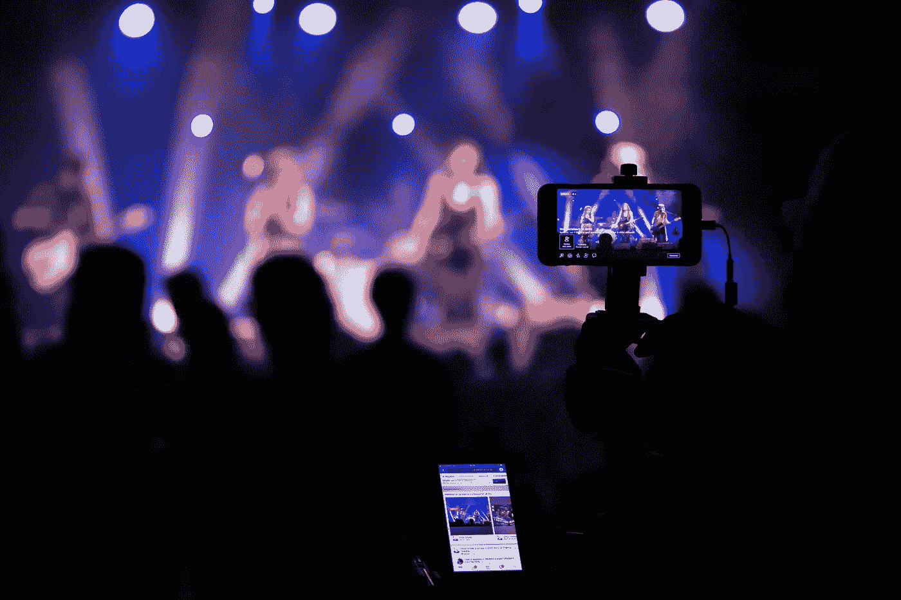

# 2019 年 8 大社交媒体营销预测

> 原文：<https://medium.datadriveninvestor.com/8-predictions-on-social-media-marketing-in-2019-7c227a78e6ce?source=collection_archive---------22----------------------->

社交媒体营销趋势每年都在发生深刻的变化。根据《2018 年全球数字报告》(Global Digital Report 2018)，全球有 31.96 亿社交媒体用户，每天都有大量新的社交媒体平台涌现，这并不奇怪，世界上平均每个人每天花 2 小时 15 分钟在社交媒体上，也就是说，每三分钟就有一分钟花在网上。

虽然 2018 年今天的用户的注意力持续时间下降到了 8 秒，但品牌在建立新一年的社交媒体营销计划/目标时，牢记这一点是至关重要的。

事不宜迟，以下是我对 2019 年社交媒体营销的预测:

1)人工智能:预计到 2023 年，社交媒体行业采用人工智能的复合年增长率将超过 30%。人工智能解决方案由多项技术组成，这些技术通过协作在庞大的数据集(同义称为大数据)中寻找联系。因为它涉及到社交媒体营销，所以当前的人工智能工具对于内容创作、战略规划和报告非常有价值。

聊天机器人和虚拟助手已经变得越来越普遍，但这只是开始。未来，聊天机器人将使用“口语化的 API”以更人性化的形式回应客户的询问。目前，自动化服务革命已经在电子商务网站和 Facebook Messenger 等消息平台上流行开来。

随着客户对个性化体验的需求不断增长，2019 年看好人工智能和机器学习工具的社交媒体营销人员肯定会拥有竞争优势。

2)地理位置视频:毫无疑问，位置对于视频如何被个人发现起着至关重要的作用。有趣的发展接管了这个行业，比如 Facebook Messenger 的实时定位功能，YouTube 的 Director Mix 品牌利用谷歌地图数据在一次活动中提供数千个本地化视频的空间令人兴奋。因此，凭借精确的位置和强大的元数据，营销人员将能够在 2019 年提供更多相关内容。

3)视觉正在占据主导地位:视频比文字或图片更能传达视觉、听觉和情感。近年来，社交媒体上的视频呈指数级增长。2016 年至 2017 年间，品牌视频内容在 YouTube 上的浏览量增长了 99%，在脸书上增长了 258%；视频推文被转发的可能性是照片推文的 6 倍。因此，2019 年的两个重要发展非常突出:

●视觉搜索:用 Pinterest 首席执行官本·希伯尔曼的话说，“搜索的未来将是图片，而不是关键词。”视觉搜索技术正在被集成到品牌应用和网站中，同时，Pinterest、Bing 和 Google 等频道也在构建增强的视觉搜索功能。这一趋势将持续到 2019 年，10 大平台中 27%的搜索是针对图像的。这项技术提供的时间效率和便利性让电子商务零售商特别兴奋。

●垂直视频:几十年来，“水平”或横向视频一直是常态。然而，垂直视频今天处于领先地位，因为它们已经被所有主要频道采用，特别是因为它们更适合移动观众。据《脸书商业》报道，65%的消费者认为用垂直视频做广告的品牌“更具创新性”，79%的“视频新手消费者”更喜欢垂直格式，认为它更有吸引力。我们看到更多的品牌在 2019 年使用这一功能来吸引用户的口味。

4)透明与安全:2018 年，世界见证了 GDPR 在欧盟的强制执行。由于社交媒体在数据泄露和错误信息方面的高安全风险，人们在保护隐私方面变得格外谨慎，这种敏感性不会在 2018 年或任何时候结束。为了赢得和维护用户的信任，必须采取措施保护他们的数据和隐私。在数据隐私和利用以及他们如何永久丢弃他们的信息的问题上，对用户开诚布公。

5)流媒体直播:根据 vimeo 与《纽约杂志》进行的一项调查，80%的受访者宁愿观看某个品牌的直播视频，也不愿阅读博客，82%的人更喜欢某个品牌的直播视频，而不是社交帖子。预计这将在 2019 年更广泛地用于社交媒体营销活动，因为在线观众对直播视频的嗡嗡声、联系和紧迫性感到兴奋。不可否认，由于他们的实时体验和真实性，他们创造了积极的参与。

6)增强现实(AR):随着脸书与 700 多个品牌合作实现公司的增强现实愿景，我们只能期待在 2019 年看到更多这种技术。这项合作需要开发一个由 AR 技术驱动的升级广告平台。社交媒体上基于 AR 的广告因其动态和多功能的特性而具有更好的吸引力和更广泛的覆盖范围。它鼓励品牌的互动 UX，并在他们的社交媒体渠道中成倍增长转化率。

7)影响者营销:影响者营销在早期阶段主要集中在连接品牌和影响者。然而，Business Insider Intelligence 的一份新报告估计，影响者营销在 2022 年将达到 50 亿至 100 亿美元。与品牌产生的内容相比，有影响力的人往往拥有更高的用户参与度，随着视频和故事的流行，这一比例将会进一步增长。然而，在新的一年，我们希望看到品牌在管理影响者方面走亚马逊的路线，不管服务前付费规则。

8)游戏化:将游戏的“迷人和不可抗拒”的特点融入非游戏背景将在 2019 年被广泛采用，以影响社交媒体活动的病毒式传播。这将对行业产生重大影响，因为它鼓励与用户的对话、品牌忠诚度和内容参与。我们预计，在游戏化的推动下，游戏混合应用和定制营销将进一步增长。

总之，2019 年将是个性化、改善客户体验、自动化和人工智能技术的时代。保持领先是很重要的。