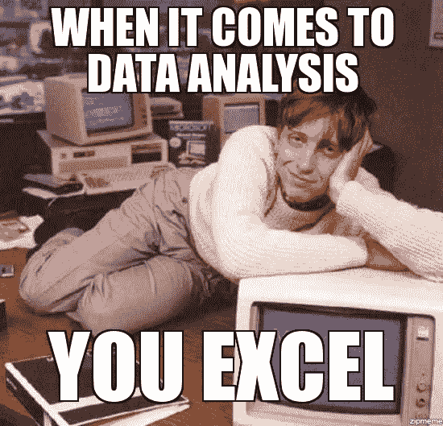
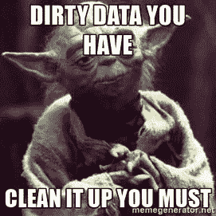

# 成为数据科学家所需的 8 项技能

> 原文：<https://medium.datadriveninvestor.com/8-skills-you-need-to-become-a-data-scientist-5eb776cd7e82?source=collection_archive---------7----------------------->

数字吓不倒你？没有什么比一张漂亮的 excel 表更令人满意的了？你会说几种语言，但只是用代码？

那么你可能是时候探索如何成为一名数据科学家了。

## 数据科学家在做什么？

2012 年，HBR 提名数据科学家为“本世纪最性感的工作”。理所当然，这个快速发展的领域帮助人们理解了我们现在可以收集的难以置信的大量数据，使人和机器都变得更聪明。

数据科学家深入事实，帮助公司做出更好的决策——从选择要使用的电子邮件营销模板，到 UX 的哪个部分需要改进。高管、设计师和产品经理求助于数据科学家，从海量信息中得出相关结论。

数据科学家是网飞、Spotify 和优步幕后的 MVP。他们是以复杂算法的形式对计算机耳语的人。数据科学家使用机器学习和人工智能来自动化和优化流程。

## 如何成为一名数据科学家？

以下是你需要的 8 大必备技能！

## 1.编程；编排

无论是 R、 [Python](http://www.datadriveninvestor.com/intro-to-python) 、SQL、Apache Spark 还是 Hadoop，你都需要知道交易的工具。r 和 Python 可以帮你做统计编程，SQL 是做数据库查询的，Apache Spark 和 Hadoop 是做大数据计算机框架编程的。

## 2.统计数字

统计数据对于理解数据和帮助决策至关重要。你需要深入研究相关性、分布、最大似然估计等等。了解统计数据将有助于您决定采用何种方法来解释数据以及您将观察到的相关指标。

## 3.数学

嗯，这是不可避免的。数学需要成为数据科学家的第二语言，特别是多变量微积分和线性代数。理解这些数学概念对编写成功的算法有很大帮助。

## 4.数据清理

尽管我们都喜欢结构良好的干净数据，但这通常是不可能的。人们常说，数据科学家花 80%的时间清理数据，只花 20%的时间分析数据。数据科学家需要能够理解数据中的缺陷。无论这是缺少信息还是不一致的字符串格式，您都需要能够发现并纠正不准确的地方。

## 5.数据可视化

一张图胜过千言万语:数据也是如此。能够可视化信息将有助于你以引人入胜和易于理解的方式展示你的发现。确保将可视化工具放在数据科学清单的 [matplotlib](http://www.datadriveninvestor.com/data-visualization-python) 、ggplot 或 Tableau 中。

## 6.沟通

一部优秀的经典传播学著作。数据科学家不仅需要能流利地与计算机交流，还需要能与人交流。你将在团队中工作，并经常与来自另一个业务部门的人接近。作为一名数据科学家，你需要清楚地表达你需要从别人那里得到什么，并向非技术人员解释你的发现。

## 7.解决问题

作为一名数据科学家，你需要具备数据驱动的思维模式，能够选择相关信息并提出正确的问题。有时候洞察力不会立刻显现出来，你需要找到解决难题的方法。

## 8.渴望学习

数据科学是一个不断发展的领域，新技术、人工智能、IOT 和机器学习都在快速发展。从长远来看，你需要渴望学习，并愿意不断成长，才能在这个职业中取得成功。

想要直接进入职业生涯，作为数据科学家震撼世界，但不知道从哪里开始？[这里的](http://www.datadriveninvestor.com/intro-to-python)是帮助你入门的简短指南！

【https://www.datadriveninvestor.com/】本文原载于:

## *来自 DDI 的相关故事:*

* [## 用 7 个步骤解释深度学习——数据驱动投资者

### 在深度学习的帮助下，自动驾驶汽车、Alexa、医学成像-小工具正在我们周围变得超级智能…

www.datadriveninvestor.com](https://www.datadriveninvestor.com/2019/01/23/deep-learning-explained-in-7-steps/)  [## 数据科学和软件工程哪个更有前途？-数据驱动型投资者

### 大约一个月前，当我坐在咖啡馆里为一个客户开发网站时，我发现了这个女人…

www.datadriveninvestor.com](https://www.datadriveninvestor.com/2019/01/23/which-is-more-promising-data-science-or-software-engineering/)*