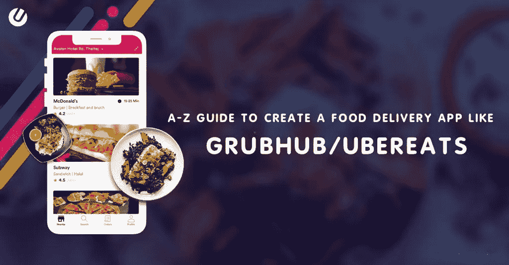
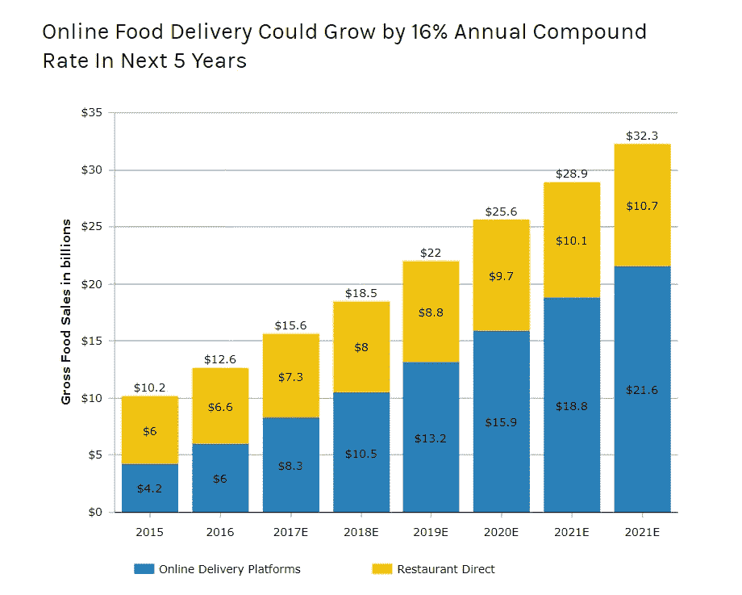
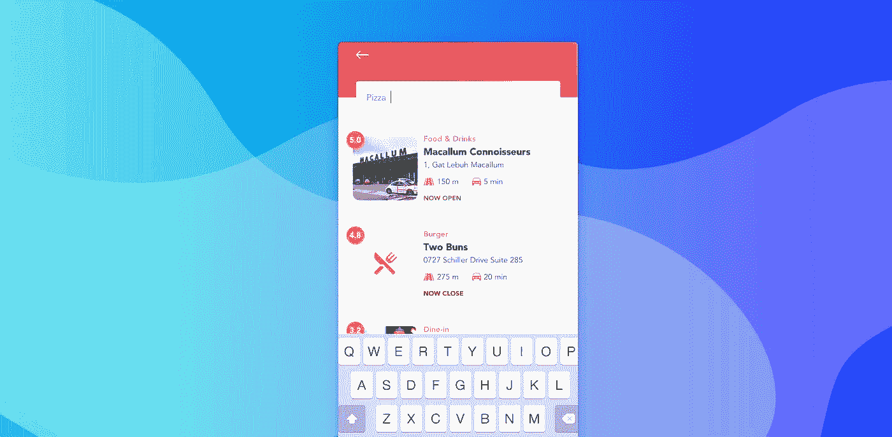
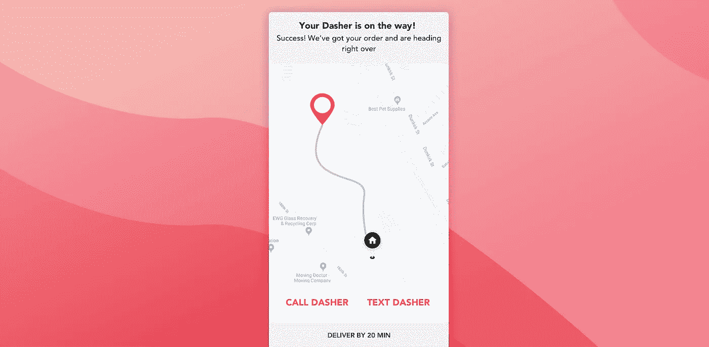
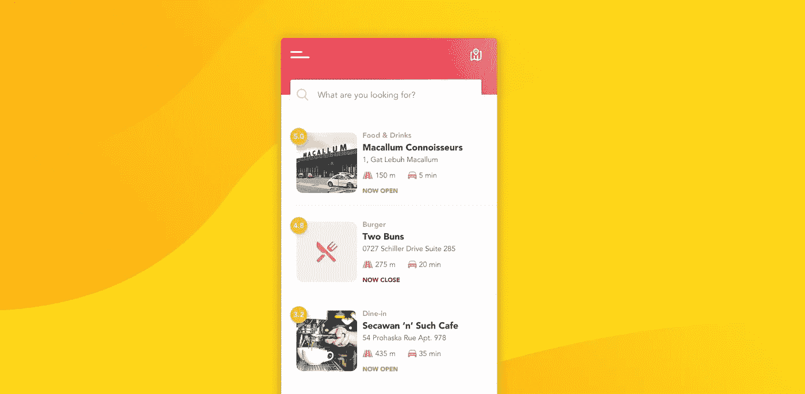
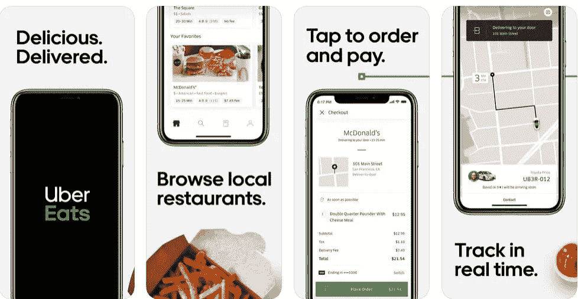

# 让您的送餐应用一步到位的 8 个步骤

> 原文：<https://medium.datadriveninvestor.com/8-steps-to-make-your-food-delivery-app-right-the-first-time-249f8095b0de?source=collection_archive---------0----------------------->

当饥饿感袭来时，你会点一份披萨。

或者汉堡。热狗怎么样？

 [## 2019 年移动应用开发之路|数据驱动的投资者

### 任何在移动应用程序开发行业工作的人，无论他们是专注于在伦敦开发 iOS 应用程序还是…

www.datadriveninvestor.com](https://www.datadriveninvestor.com/2019/01/15/the-path-of-mobile-app-development-in-2019/) 

不管是什么，像 [UberEats](https://www.ubereats.com/) 、 [GrubHub](https://www.grubhub.com/) 、 [Zomato](https://www.zomato.com/) 或 [Swiggy](https://www.swiggy.com/) 这样的应用都可以成为你的救星。

多亏了这些点播食物应用程序，让我们忙碌的生活变得更加轻松。当人们 24*7 忙碌的时候，他们发现很难在家做饭——每天都是如此。

难怪按需在线食品订购应用巨头们在那里看到了机会，并进入了市场，(通过制作一个应用程序)将热腾腾的喜爱的食物送到你的家门口。

但他们不是唯一的一群——许多初创公司正在尝试市场，并利用这种“需求”。

如果你也想知道如何制作一个送餐应用程序，这个指南是为你策划的。它将带你经历制作你的订餐应用程序所需的步骤、想法验证和其他一切——这是独一无二的，有市场需求，显然收入很高。

# 那么如何做一个送餐 App 呢？

让我们用简单的步骤来分解我们将要讨论的内容:

1.  验证你的送餐应用想法
2.  修复食品配送模式
3.  聚合器模型的要求
4.  最终确定主要功能
5.  技术堆栈到强大的应用基础
6.  UI UX 设计和要考虑的技术因素
7.  选择正确的发展伙伴
8.  确定食品交付应用程序开发的成本

您的按需美食应用程序开发指南现在开始！

# 1.为什么要创建一个送餐 App？你的想法值得吗？

在我们开始讨论如何创建像 Swiggy 或 UberEats 这样的送餐应用程序之前，让我们先来评估一下这个市场，以及为什么按需送餐应用程序如此受欢迎。

# 不断上涨的市场价值

全球食品配送市场约为 1080 亿美元，占食品市场的 1%，占通过餐馆及其市场销售的食品的 4%。市场专家还预计，到 2030 年，这个市场将达到惊人的 3000 亿美元。

随着智能手机技术的进步和市场上应用数量的增加，食品配送应用将在未来五年内增长约 16%。在你创建一个送餐应用之前，先看看这些受欢迎的原因。

# 它们为您的客户节省了时间

那么你知道做一个美味的披萨需要多长时间吗？

不是很多，但是，当你可以点它的时候，你为什么要去尝试呢？它们节省了你准备和烹饪的时间。在这段时间里，你可以做一些更好的事情，比如读一本书，或者看一部电影，或者小睡一会儿？

# 送餐应用是一种快速简单的点餐方式

假设你有客人要来，你决定为他们做一顿美味的晚餐，结果却把鸡肉烧焦了。

不过没什么好担心的，你可以通过应用程序快速点餐，化险为夷。你的客人不会介意的，因为，你确实试着做了那只鸡，对吗？

从低调的约会之夜到与姻亲共进晚餐，按需美食应用是解决所有问题的快速而简单的方法。

# 有利于扩展您的业务

通过这些应用交付食物的餐馆和小吃店从这些应用中受益匪浅。因为有了这些应用，你可以接触到更多的客户。更广泛的接触意味着更多的客户，更多的客户意味着更多的业务。更多的业务转化为更多的收入！

# 你得到更多的投资回报

随着你扩大你的市场基础，投资回报率也会增加。难怪 Swiggy，Ubereats，Zomato 每天都有很多竞争对手在成长。既然你已经很了解送餐 app 的市场和普及程度了，那我们就来了解一下如何制作自己的送餐 app，以及可以制作的送餐 app 类型有哪些。

# 2.你可以选择哪些类型的送餐应用？

我们来看看市场上存在的两大类点播美食 app 模式。

# a.第三方应用程序又称聚合器模型

聚合器模式，或第三方食品配送应用程序已经在市场上存在了十多年。他们是你和你最喜欢的餐馆之间的完美中间人。

这种模式使顾客能够浏览各种各样的餐馆及其菜单。用户首先创建一个帐户，浏览餐馆列表和其他顾客的评论，然后做出选择。

做出选择后，他们将下订单，订单信息将被处理以便交付。这个第三方 app 的主要功能是连接双方。像 Zomato 这样的应用就采用了这种模式。

由于订单的送货部分由餐厅负责，这对于大餐厅来说再合适不过了。但当涉及到更新更小的餐馆时，就很难在这些应用程序上出现了。这就是下一种类型出现的原因。

# b.物流/交付服务类型:

这是一种相当新的送货服务，仅在 2013 年左右出现。这是一个类似于聚合器模型的平台，只是增加了一个功能。

订单交付由应用程序本身处理。

与聚合器模式不同，这对于初创公司来说是非常有利可图的，因为他们不必为订单维护一个单独的交付系统。这大大降低了费用。

对于已经成立的餐馆来说，这只会增加利润，因为他们现在可以减少人力支出，更多地关注主要的加工部分。

前者只涉及两方——餐厅和用户，而对于后者，你需要开发一个额外的交付服务平台。像 UberEats 这样的应用就采用了这种模式。

# 3.订餐 App 模型及其需求

这里我们将详细讨论聚合器模型。

对于聚合器模型，你需要应用程序的三个不同方面。

*   客户应用程序
*   管理应用程序
*   送货人应用程序

下面就详细说说吧。

# 客户应用程序

客户应用程序显然是这一切的关键。这是将要安装到客户设备中的应用程序。他们将使用该应用程序从列出的餐厅点餐。

由于这个应用程序是关键的应用程序，你必须确保这是完美的。用户界面/UX 需要平稳，没有错误。该应用程序需要有功能，使用户订购体验更好。稍后我们将讨论该特性。

现在我们来谈谈管理应用程序。

# 管理应用程序

管理应用程序显然将由食品配送服务或餐厅的授权人员使用。这是一个应用程序，用于接受客户订单，分派订单，处理付款，跟踪订单，并跟上所有的物流。

你可以把它做成一个基于网络的软件，而不是把它做成一个移动应用。由于这将是整个操作的大脑，你需要非常注意这个应用程序的开发和维护。

任何问题或崩溃都可能意味着业务、收入和服务声誉的损失。

# 送货人应用程序

这个应用程序是为那些谁是交付。有了这个应用程序，他们可以知道是否有新订单，他们也可以接受和拒绝订单。除此之外，他们还可以找到订单的卸货地点，以及如何到达那里。简而言之，这个应用程序将在各个方面帮助他们顺利地将食物送到用户手中。

# 4.你的送餐 App 需要什么功能？

如果你想制作像 Postmates 这样的应用程序，在你的应用程序中拥有惊人的功能是很重要的，这有助于留住客户。但是你需要什么功能呢？

因此，当你研究如何制作一个送餐应用程序时，一定要为你的应用程序设计好功能。

一旦你想出了定制食品交付应用程序的功能，你就可以确保你的应用程序在与所有应用程序相比时显得不同和独特。

# A.登记

当你制作一个送餐应用程序时，确保它具有注册功能。

这样，用户可以在应用程序上创建个人资料。有了合适的个人资料，他们可以充分利用该应用程序及其提供的一切。不仅对于客户应用程序，而且对于管理员和送货人应用程序，您也需要此功能。您也可以在任何餐厅外卖应用构建器中获得该功能。

# B.档案管理

有了这个功能，**您的用户**可以用正确的信息优化他们的个人资料，这对于下订单和交付非常重要。

**对于管理 app 来说，**个人资料管理更加重要。餐馆需要有一个适当的配置文件，并能够更新它，使他们的生意最好。

至于**送货员应用**，他们需要用正确的凭证注册和管理他们的档案。作为送餐平台的员工，他们需要通过个人资料为你提供正确的详细信息。

# C.简易搜索选项

请确保在您的应用程序中实现轻松搜索的功能。因为没有人喜欢在饿的时候花几个小时寻找食物。

Source: Unified Infotech

通过简单搜索选项，用户可以在你的应用程序上轻松搜索合适的餐厅，轻松快捷地下单，节省用户的时间，也让他们免于饥饿。

# D.易于订购的简易清单

这将是一个漂亮的小功能，可以区分你的应用程序。

你可以根据心情、天气和菜肴，基本上所有不同的变量，创建一个餐馆列表。从而用户可以容易地找到适合他们渴望的餐馆列表。

# E.主页上的首选项

在主页上展示顾客喜欢的餐馆和美食是一个很好的功能，可以让用户对你的应用保持兴趣。这不仅会让他们更容易做出选择，还会节省他们的时间

# F.如何制作一个带订单跟踪的送餐 App

一旦下了订单，就只是等待的问题了。但是当然，顾客不应该等太久，尤其是当他们很饿的时候。

Source: Unified Infotech

任何定制美食 app 都有订单追踪功能的特点，这很正常。这样，客户将能够看到他们的订单何时被派送以及订单的进展情况。他们还可以获得订单交付的估计时间。

毕竟，在等待时跟踪食物比盲目等待要好。

# G.轻松的支付网关集成

这可以通过两种不同的方式来实现。除了货到付款或货到付款，您还可以选择信用卡/借记卡作为在线支付方式。这是最简单快捷的收款方式，也很安全。

如今，许多客户更喜欢在线支付方式，因此在开发送餐应用程序时，请确保您有多种在线支付选择。通过[布伦特里](https://www.braintreepayments.com/)、[条纹](https://stripe.com/)、[卡文](https://www.ccavenue.com/)等选项实现。这是一个重要的特性，所以不要跳过它。

# H.评级和评论

在你制作一个送餐应用程序之前，你需要知道客户评级和评论很重要，需要在应用程序上显示出来。

通过评级和评论功能，顾客可以对网站上列出的餐厅、他们点的不同食物和送货服务发表评论。这一功能不仅有助于其他用户选择获取食物的正确地点，也有助于餐馆和食品配送平台本身了解他们可以在哪些地方做出更多改进。

# I .优惠、优惠券、奖励和忠诚度优惠

谁不喜欢优惠和优惠券？尤其是食物方面？

确保你有足够的优惠和优惠券给用户。这些特别优惠会留住你的用户，并带来更多的用户。通过与餐厅的特殊合作，你可以向用户提供有吸引力的优惠，用户反过来会成为餐厅和你的应用程序的忠实客户。

# J.推送通知

当然，你做一个送餐 app 也不能跳过这个功能。推送通知是绝对重要的，因为没有它，用户怎么知道什么时候有特价活动，或者他们的食物快到了？

但是你必须确保不要总是用烦人的通知轰炸用户。让他们选择想要查看的通知以及想要查看的时间。这将为你的应用体验增加一层用户满意度。

你还需要考虑管理应用和送货员应用等其他应用模式的其他功能。例如，管理应用程序需要一个仪表板，就像 GrubHub dashboard 一样。

# 5.你想做的点播食物应用的技术栈

现在，我们已经告诉了您制作送餐应用程序所需的所有功能。现在，我们将向您介绍将这些功能构建到您的应用中所需的技术。

*   对于注册和授权过程，您可以使用 [Autho](https://auth0.com/) 。它们在各种授权过程中提供安全可靠的授权过程——短信授权、电子邮件授权、经典授权等。
*   要添加关于餐馆的详细信息，你可以使用[谷歌位置 API](https://developers.google.com/places/web-service/intro) 。
*   对于安全可靠的支付网关，可以使用 [Braintree](https://developers.braintreepayments.com/) 或 [Stripe](https://stripe.com/) SDK。
*   使用[routinic](https://routific.com/)API，您可以集成内置的路线优化。有了这个，送货人员将知道在送货时的最佳路线。

# 6.制作送餐应用程序前需要考虑的设计和技术因素

在我们开始讨论如何创建一个食品订购应用程序之前，我们要告诉你一些你需要考虑的重要因素。

这些因素可以决定你的应用是否成功。这些是市场上专业的食品交付应用开发公司使用的技术堆栈，所以请记笔记。

# A.确定正确的定位

人人都爱美食。因此，一旦你的送餐应用上市，每个人都会使用它。对吗？

现在，当你思考这个问题的时候，你并没有完全错。每个人都喜欢送餐应用程序，但在制作餐厅应用程序之前，您仍然需要考虑一个细微的偏好点。

要建立你的利基，你需要先确定你的客户。你在为谁做应用？学生还是工人？

他们喜欢快餐还是更好的餐馆菜肴？

他们是素食主义者还是铁杆肉食爱好者？

只有在分析了所有数据之后，你才能让你的应用程序比其他所有应用程序更有特色。

# B.实施正确的 UX

做送餐 app 不能忽视[右 UX 设计](https://www.unifiedinfotech.net/services/ui-ux-design/)的重要性。

你的送餐应用也不例外。一个好的 UX 设计是你的应用成功的驱动力。你需要确保你的应用程序易于用户浏览。他们还需要能够轻松找到他们需要的信息。

因此，当你在考虑如何创建一个送餐应用程序时，你需要知道界面需要同时做到详细和极简。保持简洁流畅，只在屏幕上显示重要信息。不要忘记以有组织的方式保存信息。

# C.使用机器学习来显示正确的餐馆类型

学生不会去米其林星级餐厅点餐。一个顶尖的银行家不会去当地的披萨店点餐。

Source: Unified Infotech

重要的是，客户可以在他们的主页上快速找到正确的位置。这就是为什么你可以使用机器学习来根据用户的偏好在主页上显示餐馆列表。

# D.提出合适的物流系统

当考虑如何开发一个送餐 app 时，你需要想出一个合适的物流系统。

计划你的物流时要记住这些事情。此外，你必须考虑城市路线，以及利用每条路线需要多长时间。在计划物流时，及时交付是你应该考虑的事情。不言而喻，有了正确的物流，当你制作一个食品配送应用程序时，你可以非常快速地扩展你的业务

# 7.如何创建送餐 App？通过选择正确的开发公司

选择合适的按需食品应用程序开发者是至关重要的，他们将帮助你制作一个食品配送应用程序。开发人员应该理解你的目标，并实现更新的软件和敏捷技术，以实现你的想法。

虽然有两大类开发人员:自由职业者和代理人，但我们总是建议你选择后者。代理公司拥有合适的专业知识和最新的开发工具，这是自由职业者所缺乏的。正确的食品订购应用程序开发公司将在规定的期限内交付应用程序，永远不会玩弄你的预算。

此外，获得一个由代理公司开发的应用程序需要适当的产品许可、保证和承诺，而这些是自由职业者通常无法提供的。因此，如果你想在最短的时间和最少的预算内获得高质量的服务，建议你去找代理。

# 8.一个送餐 App 开发要花多少钱？

在了解了如何开发一个送餐应用程序之后，你一定在想这要花多少钱？

无论你开发的是哪种类型的应用，它都有各自的价格标签。那么你的点播美食 app 要花多少钱呢？简单。你只需将小时数乘以小时工资率。

**【App 开发成本=总小时数*小时费率】**

一个食品开发应用程序的成本取决于你在其中包含的功能。当然，你拥有的[功能越多，你的应用就越贵](https://www.unifiedinfotech.net/blog/how-much-does-it-cost-to-make-an-app-breakdown/)。

如果你的用户不喜欢你的应用程序，你所有的花费都会付诸东流。他们的反馈将有助于迭代过程，并在每次用户评审时进行必要的改进。

当你做一个送餐 app 的时候，你还需要确定你的 app 的性质。无论是原生应用、网络应用还是混合应用，一切都将最终决定定价。是的，别忘了为你的应用选择合适的开发者。

# 看看你的竞争对手

既然我们已经讨论了按需美食应用的所有要素，那么让我们来看看市场，以及你的竞争对手在做什么。

食品配送市场的两个主要竞争对手是 GrubHub 和 Ubereats。让我们来看看这两个。

# 格鲁布布

GrubHub 成立于 2004 年，已经经营了很长时间。它已经与美国和英国超过 95，000 家餐厅建立了合作关系。

毫无疑问，这是纽约最受欢迎的送餐应用程序之一，他们的应用程序 UX 是无缝的，该应用程序充满了令人惊叹的功能，使其易于使用，令人惊叹。GrubHub 是一款日订单量超过 40 万的应用。

# 超级饮食

如果你想做一个送餐应用，那么你必须了解 Uber Eats。

这是食品配送市场上最受欢迎的应用程序之一。当它在 2015 年推出时，优步已经是一个知名品牌。它没有浪费时间，利用其庞大的司机基础，开始了食品配送业务。而且成功了。优步已经有了一个公认的品牌，顾客发现在新的食品配送业务中培养信任要容易得多。像 Grubhub 一样，它包含了所有的基本特性。因此，如果你想要像 Uber Eats 这样的应用，那么确保你已经熟悉了它们的功能。

# 如何制作一个送餐应用程序

市场上充斥着点播食品应用。你不是第一个想出这个主意的人。竞争是残酷的，但你可以用两种方法来应对。

你可以让竞争阻止你回头，完全放弃这个想法。

或者你可以继续前进，抓住你的机会。

如果你足够相信你的想法，那么用正确的技术和正确的策略，你可以创建一个食品订购应用程序，它将确保在任何时候都成为人群的最爱。或者，[告诉我们你对送餐 app](https://www.unifiedinfotech.net/about/contact/) 的想法。我们将首先通过安全的 NDA 确保它的安全，然后继续为您提供最佳的开发指导、人才和支持。

最初发表于[统一信息技术博客](https://www.unifiedinfotech.net/blog/how-to-make-a-food-delivery-app/)。