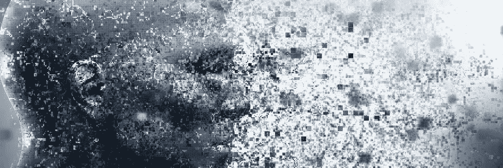

# 2019 年的 8 项技术预测

> 原文：<https://medium.datadriveninvestor.com/8-technology-predictions-for-2019-e6dcca65c709?source=collection_archive---------22----------------------->

如果你问专家，他们认为未来的科技会是什么样子，答案可能是令人困惑的预测组合，足以让你看过的最好或最怪异的科幻电影相形见绌。

坐下来想想你现在能接触到什么。

未来几年将会怎样？

尽情发挥你的想象力，尽可能看得更远。你很有可能成为尽可能富有想象力的未来学家。

阿尔文·托夫勒是世界上最著名的未来学家之一，也是《T2》、《第三次浪潮》、《T3》和《T4》等全球知名书籍的作者。

托夫勒先生永远也不会意识到他的预测会在多大程度上成为现实，甚至会超越他已经很强大的世界图景，这要归功于技术的崛起、无国界的世界、全球电子商务的统治以及当今世界每个人都可以获得的令人兴奋的机会。

当你读到这里的时候，你可以正常工作，也可以远程工作。各大洲通过不间断的旅行联系在一起。国与国之间的贸易更容易。

我们有幸拥有相对更稳定的经济。你可以用虚拟货币接受和支付。就在几年前，你的笔记本电脑比 70 年代末的超级计算机更强大，你的智能手机比普通计算机的处理能力更强。

技术的力量是不可阻挡的。因此，这里有一些我们在 2019 年(及以后)非常兴奋的技术预测:

**到处都是 AI**

人工智能是一个总括术语，包含其他类型的技术，如机器学习、数据分析、NLP(神经语言编程)和其他一些技术。人工智能的最大好处是它的适应能力和对几乎任何行业的适用性。

机器人、智能机器、适应性数据处理、数据分析等的使用。已经在制造、航运、金融服务、银行、医疗和教育领域有所作为。

人工智能的使用将改变客户服务、销售、市场营销、人力资源和其他一些商业职能。

我们预测人工智能的破坏对你的商业和个人生活来说是不可避免的。

**机器的崛起:自主进步**

没有人类，世界照样运转。“自主”被定义为“不受外部控制或影响而独立工作的能力”。

未来，自主机器人、计算机和机器可以使用独立的运动系统、导航算法、环境传感技术、传感器等等，在没有人类输入的情况下工作。

我们已经在自动驾驶的汽车和公交车上看到了这一点。这只是开始。

听听这个:

汽车可以自动驾驶。向谷歌的 Waymo 问好

无人机将把食品杂货和其他[物品送到你家门口](https://www.dailymail.co.uk/sciencetech/article-5491543/Regulators-soon-green-light-drone-deliveries.html)。

无人机可以帮助[发现非法捕鱼](https://blogs.nvidia.com/blog/2018/11/05/drones-illegal-fishing/)

随着物联网(物联网)的冲击，我们已经看到了使用密钥卡将车辆驶出困境的能力，辅助停车，辅助倒车，与手表和智能手机通信的家用电器等等。

自主技术、机器人和物联网——它将改变你使用机器和与机器互动的方式。

**区块链开始占据主导地位**

一些技术很有希望，但很难起飞。据 TechCrunch 的约翰·比格斯报道，数千个加密货币项目已经胎死腹中。

尽管如此，区块链——加密货币和其他几种用例及应用背后的主干技术——远未消亡。这只是开始。

据福布斯技术委员会称，区块链很可能成为本地或跨全球数据中心的数据模型和数据分发的支柱。

区块链驱动的分布式账本技术(DLT)将取代企业政府系统，最终将我们所有人从纸质系统推向数字化。

互操作性的标准化、协作的新标准、加密货币的新变体、医疗保健信息交换、跨行业的透明度、自主谈判、标准化和简单的贸易以及基于区块链的安全性只是区块链对我们所有人的承诺的一部分。

**网络安全**

我们已经看到机器学习如何更好地发现欺诈行为。我们已经通过我们使用的设备在互联网上体验了额外的网络安全层，等等。

银行、金融、软件、SaaS、移动应用等行业，以及你日常接触和使用的几乎所有东西，都具备网络安全的要素。

[例如，Paypal](http://www.informationweek.com/strategic-cio/executive-insights-and-innovation/11-cool-ways-to-use-machine-learning/d/d-id/1323375?image_number=5) 通过使用机器学习来打击洗钱，比较数百万笔全球交易，并精确区分合法和欺诈交易。

未来，您将会看到更多网络安全的实例和使用案例，如沙箱、加密、身份验证、网络安全和安全编码。

我们将看到稳健的内部控制和安全设计变得越来越重要。我们将受益于防御性计算、详尽的审计跟踪，数据中心将拥有更强的物理安全性、更好的安全基础设施、持续监控等等。

**脸书，数据泄露，&被曝光的“你”**

机器变得更加智能。计算机思考、分析、决策和执行。你需要的一切都可以在网上找到。有一款手机应用可以满足你的任何需求。企业受益于各种形式的智能技术。营销、招聘、销售、管理和运营现在都是数字化的。

随着我们越来越依赖于技术，没有什么事情是一帆风顺的。最近剑桥分析公司(Cambridge Analytica)的惨败，脸书等公司向出版商和广告商开放你的数据，以及谷歌追踪你去过的每个地方(只要你带着安卓设备)，都是对科技不良影响的严峻提醒。

[Twitter 自上市以来损失了大约 20 亿美元，但仍在努力维持运营。](https://www.recode.net/2018/2/8/16990530/facebook-twitter-profit-billion-public-91-million)

脸书正在遭受越来越多的关于缺乏数据隐私的指控，Pinterest 尚未停摆，甚至像 LinkedIn 这样的大公司也遭受数据泄露和攻击。

对于公司、政府和个人来说，我们只看到用户、企业、数据存储和信息处理之间复杂的动态网络。

**传统营销的死亡**

营销已经变了。以至于如果你仍然依赖海报、传单、名片、路边广告牌、报纸、杂志和电视，你就和死了一样。

营销已经完全数字化。新时代对企业的需求包括健全的内容营销战略、智能销售渠道、数字平台上的广告(如脸书和谷歌)、利用移动广告库存等形式的数十亿个机会。

然而，即便如此，也并非没有挑战。在我写这篇文章的时候，对你制作的每一个内容的竞争都在增加。

你在数字广告上的大部分广告支出都被浪费了:一部分是因为你做错了，一部分是因为机器人毁了我们的一切。

即使对于那些有坚实的市场营销战略和内容战略的人来说，也存在着“人们期望一切免费”和“货币化”之间的平衡问题。

[山姆·哈里斯](https://samharris.org/podcast/)是神经科学家、哲学家和畅销书作家。他有一个受欢迎的播客，已经在做所有企业应该做的事情。

但是也有问题。新的问题。

[例如，山姆·哈里斯的播客](https://observer.com/2017/03/sam-harriss-strategy-audience-free-content-creation-patreon/)号称下载量超过 100 万次，并且通过每周发布一到两集两小时的剧集来实现纯粹的有机增长。

山姆·哈里斯奉行“出版即社区”的原则，如果你不了解你的读者，你就完了。

尽管他用新的方法建立了一个社区，有所作为，定期制作内容，而且他已经建立了一个社区，但他觉得广告可能会毁掉他建立的一切。

他说:

*“我讨厌广告对数字媒体的影响”和*

*“广告模式几乎要为网络上的所有错误负责”*

所以，我们恳求问山姆:他要怎么赚钱？他仍然需要向他的播客听众寻求支持。

更多的内容创作者将面临这个问题，需要在赚钱的需求和同时提供价值的需求之间找到平衡点。与此同时，商家走内容营销、品牌战略、集客营销和付费广告的路线更是势在必行。

对企业家和企业来说，这不会变得更容易。尽管机会大幅增加，但这对企业来说是一个全新的方向。

**移动第一。总是移动的。**

想想工作机会，企业家的商业机会，你交流的方式，以及你如何被迫展示内容。想象一下，从拼凑一些 HTML 来制作一个网站，到使用最严格的标准和框架来构建“移动优先”的网站，事情发生了怎样的变化。

在我写这篇文章的时候，一切都已经移动化了。这包括地球上几乎所有的 60 多亿人口(不仅仅是美国、英国和其他发达国家)。

有了智能手机，你手里就有了纯粹的经济权力。除了手机，你什么也不用做就可以开始和经营一家企业，你可以交易全球货币，你还可以在海外进行商业交易。

因此，你做的大多数事情都将从手机开始和结束。如果你是一家企业，你的客户在移动设备上。如果你是个人，你可以通过手机与其他企业联系。

但是，这已经不是什么新鲜事了。接下来将会发生的是:如果手机的使用率和影响力是 80%，它将会慢慢接近 90%或更多。

你够灵活吗？

**大数据变大**

全球人口持续增长，越来越多的人开始上网。庞大的人口数量和以人为中心的一切——包括个人本身、企业、政府——只会显著增加我们提供和存储的数据量。

对于企业和政府来说，需要处理、存储和分析的数据要多得多。

大数据只会变得更大。

作为一个行业和一种现象，它能以指数级的速度增长是不可思议的。[思科报告](https://blog.panoply.io/big-data-is-getting-bigger)到 2020 年，全球数据中心存储容量将增长到 1.8 ZB(高于 2015 年的 382 EB)——这就是 5X 增长。

更多的人。更多的数据存储。更多数据分析。更多的数据处理。更大的基础设施来处理与数据有关的一切。更强的计算能力。

向数据驱动的未来问好。

我们知道有很多需要消化。但是我们能说什么呢？

在 FP 上，我们对未来等待我们的所有这些技术进步感到兴奋。考虑到我们作为企业家可以获得的机会，技术的兴起，以及与你的观众真正联系的日益增长的需求，将把你推向一种全新的做生意的方式。

拥抱技术，驾驭不断发展的创业浪潮，正直、诚实、一定程度的开放和换位思考将在你的创业成功中发挥巨大作用。