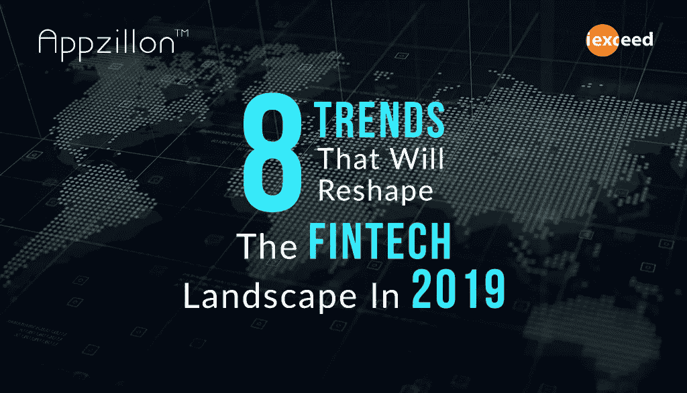

# 将重塑 2019 年金融科技格局的 8 大趋势

> 原文：<https://medium.datadriveninvestor.com/8-trends-that-will-reshape-the-fintech-landscape-in-2019-3f9fb99a5511?source=collection_archive---------5----------------------->

*金融科技解决方案在金融服务价值链中发挥着重要作用；让我们看看 2019 年有什么*

自从世界变成了一个巨大的市场，我们就看到了商业运作方式的不断变化。新技术和快速变化的客户期望进一步推动了这一趋势。即使是高度监管的银行和金融业，近年来也见证了其业务模式的不断变化，以在动荡时期保持领先地位。

因此，就金融服务生态系统而言，金融科技行业在决定该行业如何前进方面发挥着重要作用。如今，金融科技颠覆者正在改变一切的工作方式——贷款、支付、保险、信用结算等等。作为回应，银行和传统金融机构要么与金融科技公司合作，要么开发和部署自己的解决方案。普华永道(PwC)题为“2020 年及以后的金融服务技术:拥抱颠覆”的报告指出，自 2014 年以来，全球对金融科技的投资增加了两倍多，超过 120 亿美元。金融科技解决方案现在在金融服务价值链中发挥着重要作用；让我们看看 2019 年有什么:

**智能银行渠道**

为了向从事银行业务的用户提供更高层次的个性化服务，金融服务提供商正在对每个渠道进行定制，以智能地进行调整。通过研究客户模式和行为，银行可以个性化界面，以适应用户的特定使用偏好。这将转化为每个最终用户的独特使用之旅，由于提供的个性化和最终用户满意度水平，早期采用者银行将获得竞争优势。

**多体验银行**

银行已经开始提供多渠道的体验，而不仅仅是去分行或电话银行。用户现在可以通过多种渠道与银行互动，如应用程序、网络、智能扬声器、数字语音助理等。然而，为了确保愉快的用户旅程，银行必须确保所有渠道的无缝一致性。除了所有这些，展望未来，银行将发现需要包括增强现实、虚拟现实等，以脱颖而出，成为竞争领导者。

**语音辅助银行**

语音银行已经很受欢迎，很快我们就可以看到它也提供对地区和本地语言的支持。我们已经看到虚拟个人助理(Siri、Cortana 和谷歌助理)和智能扬声器(亚马逊 Echo、谷歌 Home 和苹果 HomePod)越来越受欢迎。随着 NLP(自然语言处理)变得越来越主流，虚拟助理和智能扬声器使用户能够执行银行交易成为最受欢迎的选择的日子不远了。

**银行业的狭义人工智能**

人工智能已经慢慢地把 in-roads 变成了许多不同的商业景观。在银行和金融服务行业，我们希望狭义人工智能(旨在处理特定任务)通过自动化重复和人力密集型任务来提高运营效率和准确性。这将释放银行资源，专注于更能创造价值的活动。

**开放银行的兴起**

开放银行是一种使用开放 API 的方法，使第三方开发者能够围绕金融机构构建应用和服务，从而为账户持有人带来更大的财务透明度，范围从开放数据到私有数据。例如，在印度，UPI 将多个银行账户整合到任何参与银行的单个移动应用程序中，在一个平台下融合了多种银行功能、无缝资金路由和商户支付。展望未来，我们可以看到开放银行业在更多的国家和经济地区获得更多的关注。

**企业入职**

传统上，企业客户的入职需要几周时间，而零售客户只需要几分钟。但如果考虑到企业银行家也是零售客户，那么在简化企业入职流程方面，他们可能会有相同的期望。迄今为止，企业银行应用一直很匮乏，但这一趋势正在改变。银行已经开始与金融科技公司合作，利用数字化的力量大幅缩短入职时间。

**互联云服务**

随着银行转向公共云、私有云和混合云的混合基础架构，基于云的银行业务变得越来越普遍。由于合规和安全风险，没有一家银行会将其所有敏感数据迁移到云中，但一种新发现的平衡正在决定不同云格式之间的选择。尽管向云计算的转变意义重大，但这才刚刚开始。许多银行和金融服务提供商选择将软件即服务(SaaS)应用程序用于非核心业务流程，如 CRM、人力资源和财务会计，以及用于安全分析和 KYC 验证的“单点解决方案”。然而，在 2019 年，银行的一些核心服务也将迁移到云上，这将包括支付、汇款、信用评分、账户账单等。

**数据隐私框架**

安全性和隐私是银行每一项活动中潜在的问题。银行如何处理敏感数据是一个将决定该行业未来几年走向的问题。因此，银行收集、使用和存储个人身份信息(PII)的方式将是关键。印度储备银行正致力于规范印度内外的这一领域，几个更新的法规将很快进入这一领域。银行应该为这些变化以及更多变化做好准备。所涉及的风险将继续围绕第三方供应商的使用、复杂技术、跨境数据传输、移动技术渗透和不断加剧的安全威胁。

根据普华永道(PwC)题为《数字银行消费者调查:移动用户设定议程》(Digital Banking Consumer Survey:Mobile users set the agenda)的报告，金融科技行业是一个建立在颠覆性思维基础上的行业。2019 年，这种颠覆将会浮出水面，改变银行和金融服务业。早期行动者和采纳者肯定会在未来看到重大收益，用户越来越清楚他们对基于技术的银行业务的偏好。

## 作者:[苏迪尔·巴布](https://www.linkedin.com/in/sudhir-babu-03259a/)

[i-exceed](https://i-exceed.com/) 副总裁兼产品工程负责人