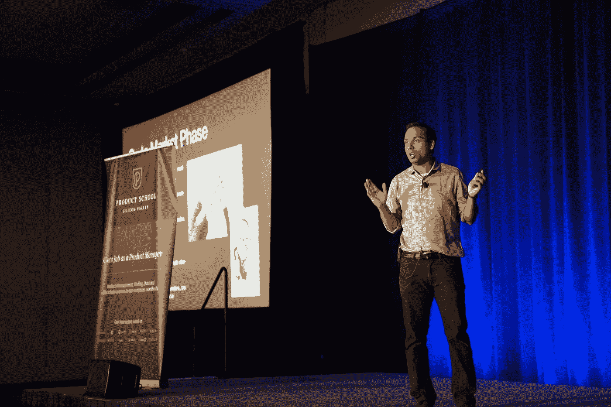

# 开始公开演讲的 8 种方法📣今天！当我还是个孩子的时候，我饱受缺乏自信和自卑情结的折磨…

> 原文：<https://medium.datadriveninvestor.com/8-ways-to-kick-start-public-speaking-today-4c09e43a4e73?source=collection_archive---------10----------------------->

Photo by [Product School](https://unsplash.com/@productschool?utm_source=medium&utm_medium=referral) on [Unsplash](https://unsplash.com?utm_source=medium&utm_medium=referral)

我记得第一次被要求站在舞台上面对一大群人做自我介绍时，我是多么的焦虑和恐惧，浑身发抖。🤢

🤢我目瞪口呆地站了一会儿，设法说出我的名字，并迅速冲出舞台，感觉很可怕。

那一刻我告诉自己，要不惜一切代价避免公开演讲！❌❌❌❌

🌟幸运的是，自从那件事之后，我克服了好奇和不满…🤔

我在床上辗转反侧，脑子里充满了许多“如果…会怎么样”的想法..
🎈如果我能解决这个问题呢？
🎈如果我能改进我的演讲呢？
🎈如果我获得了雄辩的演讲能力呢？
🎈如果我更有信心呢？

我对自己说，“如果那些家伙能做到，我相信我也能做得很好。”。️✔✔✔

怀着新的希望，我去了图书馆，开始研究与演讲相关的书籍📖第二天早上。

渐渐地，我发现自己沉迷于在舞台上演讲，面对观众。🕺

人群越多，我就越兴奋。
😻😻😻

这听起来很简单，但肯定不容易。😅

在每一次治疗中，我都犯了一大堆错误，但是我从来没有想过放弃。

公开演讲基本上需要三样东西:
❗a 大量的练习
❗loads 的耐心
❗be 非常乐于接受批评和反馈

我花了无数的时间写作、记忆和练习我的演讲。

在接下来的两年里，我做了数百次🗣🗣🗣演讲，很快我就不会感到自卑了。

我感到重生和力量。💪💪💪💪🆙️🆙️🆙️🆙️

我明白你在舞台上的第一次演讲总是最难的。😔不要烦恼！因为有一些快速的方法，我想给你指出来，让你开始成为一个更自信、更有效的公众演说家的旅程。

那就去♠️🆗️搞砸
对于那些第一次做这件事的人来说，接受你不会得到太好的分数。然而，即使你做了无数次，搞砸了也没关系！

不要自责。而是从中吸取教训。

告诉你自己，你不是来做一场完美的演出，而是来做一场更好的演出。👏👏

♠️IT 感到紧张是正常的，即使是极度外向的人也会神经过敏🤯时不时的。感到害羞和紧张是人类的常态。当我们发现自己处于让自己不舒服的情况时，我们都会面临这样的感觉。

多做几次，你会开始有不同的感觉。熟悉产生自信。😎

♠️KEEP 练习🔃
“做对了再练。练习到不会错为止。”💯💯💯

我经常会很兴奋地在镜子前练习，甚至在我的朋友面前练习。你不能对此感到害羞。羞怯无助于你的进步。提前大声练习你的演讲，这样你会对你说的话和它们从你嘴里发出的声音感到舒服。

♠️保持良好的体态🕴
良好的肢体语言的重要性不可低估。这不仅对观众的参与度非常重要，而且对你的整体信息如何被接受也非常重要。

➡️Face 尽可能多地面对观众，保持你的身体开放。
➡️Stand 挺直，双肩背，放松，双脚分开与肩同宽。
➡️Chest 出来了，不要没精打采！
➡️Prevent 交叉双臂或把手放在口袋里。
➡️Use 双手比划强调自己的话。通过改变你的手势，结合你的头、胳膊和手，这有助于保持观众的注意力🤗对你有利。

♠️保持目光接触👀👀👀
这是我最喜欢的一款！眼睛就像是“我们灵魂的窗户”。

与人群进行眼神交流是绝对必要的。

我们的眼睛也反映了我们的真诚、正直和与他人交流时的舒适。

这将真正训练你走出你的舒适区。它会吓得屁滚尿流💣但是一旦你在这方面变得更好，你的自信也会增加。

“眼睛是你内心的反映”这句老话在大多数情况下都是正确的。

这🌟欺骗🌟就是从一张脸走到另一张脸，说话的时候进行眼神交流。这将有助于确保观众参与进来。当回答观众的问题时，保持眼神交流，这传达出真诚和可信度。

♠️Structure 你的演讲
这是我熟记于心的东西，可能也是最容易运用的。我将把它分成 3 个基本步骤。

✏First，你的开场。这将是你演讲的介绍和你想要的主题。
✏Second，你的 3 个关键点。你可能有与这些关键点相关的故事。
✏Lastly，你的结案陈词。这将是你的最终总结，随后是针对听众的结束语，希望他们能带回家。

♠️Find 是你的参考还是偶像🤩
向最好的人学习👍来改善。
在社交媒体上关注你最喜欢的公共演讲者。你还会从 Ted 演讲中找到一些世界上最好的演讲者。

你也可以选择参加现场活动，观察和学习。在活动结束时，礼貌地接近演讲者，寻求他们的建议。

除了经常去图书馆阅读公开演讲，我还听了安东尼·罗宾斯和莱斯·布朗等大师的演讲。这对我的发展绝对有帮助。

♠️You 是你吗
有一段时间，我在“跟踪”我的偶像们，看他们如何发表演讲。不利方面📉-我收到反馈说我不“自然”。

反馈很棒，尤其是当你渴望改进的时候。

有一段时间我也感觉不太对劲，我的演讲缺乏“原创性”。因此，我继续努力做我自己。

做你自己，做你自己，享受生活。🎤🎤🎶🎶

敢于成为💫独一无二的💫用你自己的方式！

每个人都有自己的独特和古怪。允许你性格中古怪的一面成为你说话或表演风格的一部分。

我希望我分享的内容对你有用。

我将在下一篇文章中分享为什么公众演讲艺术如此重要。

😊敬请关注更多更新！😊