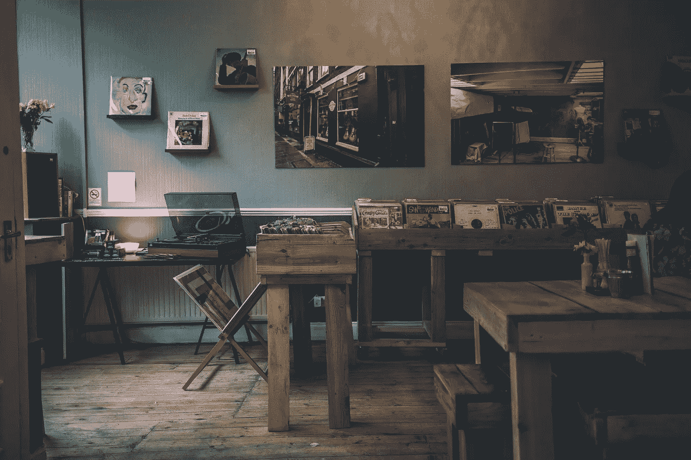
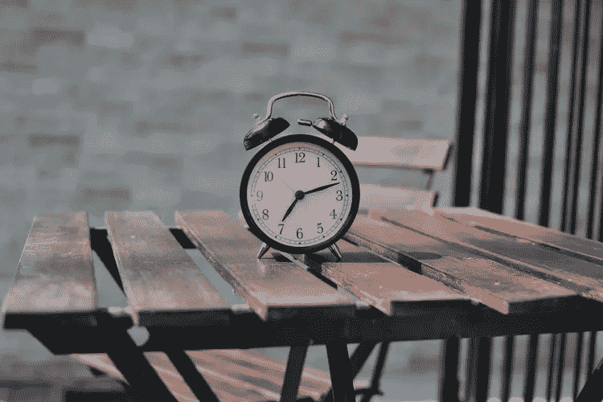
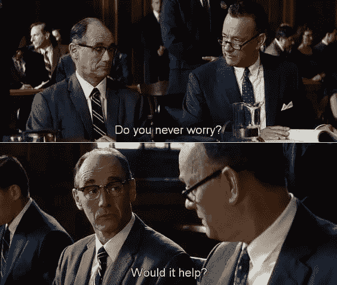
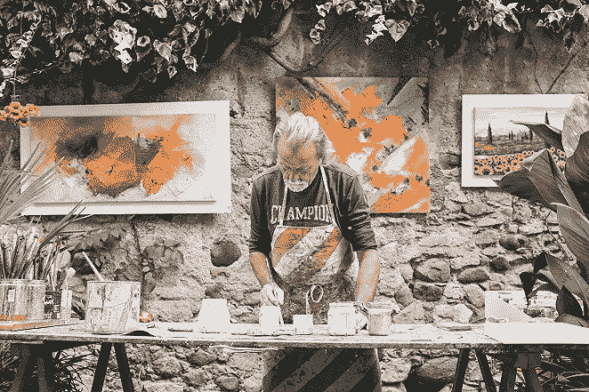
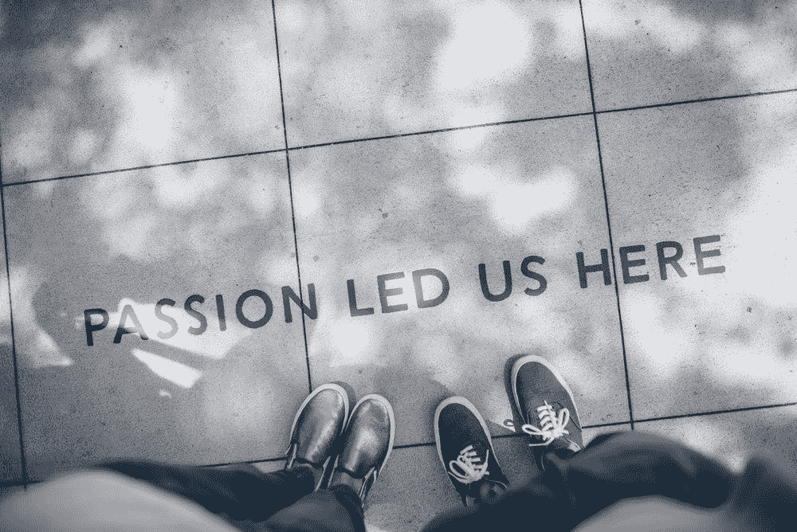

# 提高心态质量的 8 种方法

> 原文：<https://medium.datadriveninvestor.com/8-ways-you-can-improve-the-quality-of-your-mindset-13b8a2c7cd31?source=collection_archive---------1----------------------->

我们都经历过。你发现自己陷入了困境，回顾着自己的梦想，希望事情有所不同。然后你开始过度换气，你丑陋的朋友“过度思考”过来拜访。在这么混乱的情况下，一个人如何保持积极的态度？

答案很简单——一步一步来！

> 再多的过度思考也无法改变已经发生的事情，也无法预测未来会发生什么。最好的办法是专注于当下，并充分利用它。

# 1.不要担心，活在当下

在我最近读的一本名为《新地球》的书中，我读到了一句话，这句话深刻地改变了我对生活的看法，“时间会以任何方式流逝，所以你不妨为你的梦想而努力。”这句话彻底改变了我对未来的看法。

我是个焦虑大师。我是那种喜欢把所有事情都计划好的人，当事情没有按照计划进行时，我开始担心，最终几乎什么都没完成。当我过度思考时，我会让自己心情不好，一股消极的想法涌上心头。这伤害了我的生产力、心理健康和快乐。

这就是为什么我决定一步一步来。这并不意味着我不会一心多用。相反，我做的是学法律，给一家初创公司写 SEO 博客内容，还在一个流行/摇滚乐队唱歌(没错，最后一个是最酷的)。一心多用是我的天性。然而，阻止我发挥全部潜力的是令人担忧的事情。

我会有富有成效的一天吗？我会为考试做好准备吗？我会成为一名作家吗？当事情变得严重时，所有这些破坏性的想法都在表面上冒泡，此时此刻要求我充分意识到这一点。在那一刻，焦虑开始出现，我无助地看着时钟滴答作响，时间一小时一小时地过去，因为我只完成了我一开始设定的目标的一部分。所有这些都是因为我担心。

我们人类经常倾向于夸大事情，甚至把最简单和最微小的事情复杂化。在看电影《间谍之桥》时，这个场景让我印象深刻。那一刻，我从所有自我毁灭的想法中解脱出来。就在那时，我决定专注于引导我对现在的想法，而不是对过去或未来想太多，因为我意识到，我为未来担心和害怕的每一秒钟都是浪费的。

# 2.未来就是现在…字面上的意思

你一定听过无数次了。但是你知道为什么最成功的人会提到它吗？因为当你学会这句话的真正含义时，你将永远与另一个丑陋的习惯——拖延——分道扬镳。

“未来就是现在”，并不意味着一个更好的、未来的时间已经到来，或任何类似的内涵。这意味着，随着每一个流逝的时刻，你已经生活在你称之为“未来”的时间里这意味着当你在为未来做准备时，它已经在发生了。

你现在度过的每一刻，都是你未来度过的每一刻。 ***除了现在没有别的时间，现在的时间仅仅是未来，就像你的过去自己*** 所看到的那样。当你明白当你读这篇文章的时候，你已经在你的过去自我称之为“未来”的时间里，你就会明白这个定义实际上是多么有价值。

> 无论你在想什么未来时刻，它都只是存在于未来的另一个当下时刻。这将是你现在的自己，思考，呼吸，生活在你过去认为是未来的时代。事实上，没有未来，**只是另一个尚未经历的当下**。

认识到无论你现在做什么，都是你在为未来做什么，这实际上会改变你的整个心态。它会影响你的思维，你的行动，你的生产力；最终改变你的生活。这就是为什么人们说对明天最好的准备就是今天尽你所能。

## 3.改变你的日常生活！

> “我们就是我们反复做的事情。因此，优秀不是一种行为，而是一种习惯。”亚里士多德的这些话提醒我们，成功不是一朝一夕的事，而是坚持、毅力和纪律的产物。

无论你在日常生活中做什么，永远不要让自己成为它的奴隶。你的大脑喜欢新的挑战。事实上，每当你学习一项新技能时，大脑的结构都会发生变化。以一种熟悉和舒适的方式做事似乎更理想、更舒服。然而，不要屈服于舒适区的力量。如果你这样做，它会慢慢吞噬你的全部创造力，迫使你运行在自动驾驶模式。

例行公事是通过在特定的时间内一遍又一遍地做事情，直到这些事情成为习惯而形成的。即使像做冰沙或做瑜伽这样的好习惯受到鼓励，但像一口气看完整季《权力的游戏》这样的坏习惯是非常不明智的。

如果你认为你已经成为你日常事务的囚犯，你可以这样做:

尝试新事物:你的大脑喜欢挑战。正是这些大脑锻炼帮助你的大脑保持年轻、健康和警觉。鼓励自己去尝试那些你说过会做但从未做过的事情。爬山、跑马拉松、学习乐器、学习一门新语言……这些都是健康的活动，会给你的生活带来新的激情。

**制定微观配额和宏观目标**:“梦想远大”是伟大的，但如果梦想是你所做的一切，那么你不会完成很多事情。你需要找到一种方法将你的长期目标与你的日常活动结合起来。创建微观配额和宏观目标是规划时间的好方法。基本上，宏观目标代表着你有一天要努力完成的大目标，而微观配额是你每天必须完成的最小工作量，以使这些目标成为现实。

# 4.找到你内心的目标

不，你今天的 8 小时轮班不是你的人生目标。除非你做的是你喜欢的事情，在这种情况下，我会祝贺你(以一种完全不嫉妒的方式……)。然而，如果你像大多数人一样，对自己的目标感到不确定，比如你的工作或你的大学专业，那么你可能还没有找到你的目标。而且我说的不是创造你物质世界的目的。我说的是超越金钱、美貌或名声的目的。

与你内心一致的目标，给你的生活带来意义；这是许多人拼命寻找的目标，但很少有人找到。一旦你所做的事情与给你带来和平、快乐和幸福的事情一致，那么你就知道你走在正确的道路上。

> 当你找到你的目标时，你会想得更清楚，行动起来更有信心。如果你想提高你的生产力水平，并被激励去完成任何事情，找到你的目标是至关重要的。

如果你讨厌你现在做的事情，为什么你认为 5 年或 10 年后会改变呢？你可能不知道，但是如果你对自己的工作感到痛苦，你会让你周围的人也有同样的感觉。当你热爱你所做的事情时，压力会被激情所取代，而奋斗不会被金钱等物质上的成功所推动，而是仅仅被从事你热爱的事情所带来的满足感所推动。这就是为什么“热爱你所做的事情，你一生中一天也不会工作”这句话如此有意义。

## 5.积极主动，而不是被动反应

改变是可怕的。我们很难改变。最容易做的事情(也是我们大多数人做的事情)是对环境做出反应，而不是主动行动。我们没有承担责任，接受事实，而是选择对它们做出反应，抱怨生活中遇到的困难和障碍。

> 如果我们不是对生活中发生的事情吹毛求疵，而是接受它们本来的样子，并找到克服障碍的方法。花在寻找问题解决方案上的时间难道不比我们花在抱怨上的时间更有成效吗？

如果我们对生活中发生的每一件事都做出反应，我们就会把责任推到其他事情上来为自己的失败辩护，而不是为自己的错误负责。我们用自己的不安全感来掩饰我们的失败，害怕承认我们掌握着自己的未来。把责任推给别人总是比推给我们更容易。

下次当你生活中的某些事情不顺心时，试着接受它。对自己说，“好吧，这就是目前的情况，我能做些什么来改变它？”你越早平静地面对生活中的环境，你就越能更好地接近和处理给定的情况。

## 6.用充满激情的方式做事

当你更想完成你的目标，而不是做你正在做的事情时，你会变得有压力。然而，当你享受你正在做的事情，你也为你的目标感到高兴时，你就用激情取代了压力。

压力总是会降低你所做事情的质量和效率。你的创造力被削减了，你觉得把事情做好的唯一方法就是通过努力工作和磨砺。这是千真万确的。当然，有些短期任务你需要完成，你可能不喜欢做，比如换一个漏气的轮胎。但是永远不要让你讨厌做的事情成为你的长期目标。如果你的目标是建立你的财务状况，改变它！那不是目标，那是结果。只有在充满激情地建立你的财务状况的过程中，它才会实现。

> **激情可以简单地描述为对你所做的事情的享受，以及你为之努力的愿景。**

人们接受这样一个事实，他们必须向社会“支付他们的会费”，他们必须努力获得成功。那很好。但是有一个更大的目标有助于让那些漫长的时间变得平稳，让通往成功的旅程变得不那么痛苦。例如，如果你想成为一名出色的作家，但你离成功还差得很远，努力工作来支持这个梦想是可以的。大多数人都是从基层做起的，所以通过努力工作来提升自己基本上是交易的一部分。但是如果你被困在一份你讨厌的工作中，而且你看不到在不久的将来会有什么发展，那么你应该做点什么。我的建议是不要满足于你目前所拥有的。如果你这样做了，你就有可能偏离你内心的目标，而这正是快乐而富有成效的生活的关键。

## 7.达到接受的状态

你能做的最糟糕的事情就是让生活中的每一件小事困扰你。如果你的幸福不断地被每一件事情的结果所折磨，你怎么能期望幸福呢？你必须学会如何让事情顺其自然，平静地面对过去、现在和将来。你能做到的唯一方法就是接受。不管发生了什么好事还是坏事，接受它。不要让自己过于执着于某件事情的重要性。以现在的方式拥抱现在，并为即将到来的一切感到高兴。

# 8.不要等着开始生活

我们总是想象一个我们热爱的未来，一个我们最终达到我们想要的幸福状态的地方。这是我们都会出错的地方。你猜怎么着，五年前你想象你今天生活的未来是一段奇妙而虚幻的时光，那时一切都会好起来，你所有的问题都会消失。我很确定你现在也在做同样的事情——想象一个五年或十年后的世界，在那里你们都定居下来，生活变得更好。可悲的是，生活不是这样的。

> 时间不能解决问题，你能。这就是为什么拖延是高效快乐生活的大敌。头脑喜欢创造幻觉。对头脑来说，现在的时刻永远不够好，这就是为什么它总是想象未来的时刻总是比你唯一拥有的这个时刻更好。

问问你自己:你现在享受生活吗？你喜欢现在的生活吗？对许多人来说，世界上任何其他地方都比他们现在所在的地方好。抑郁就是这样形成的，不快乐就是这样形成的。永远记住，另一边的草不一定更绿。拥抱你的一切，你所有的烦恼、梦想和希望。明天无法保证，今天是你的全部。所以，不要等着开始生活。尽可能多地抓住生活中的美，让你的生活成为一次伟大的冒险。