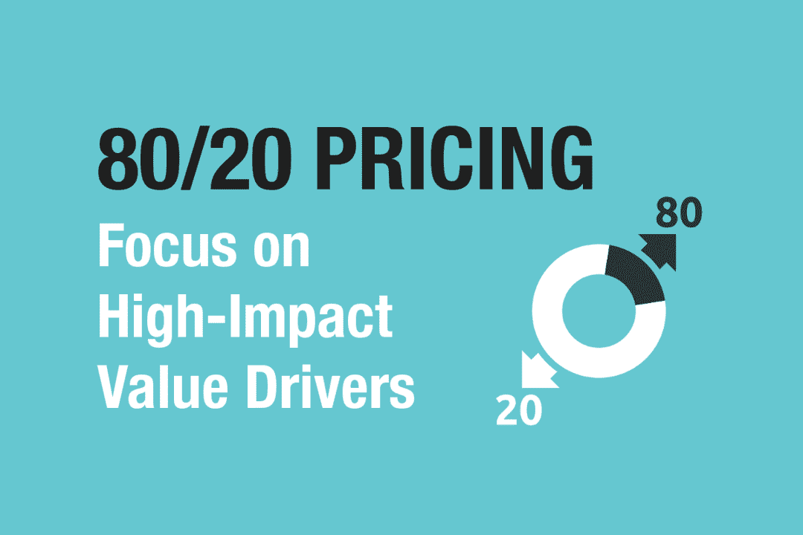
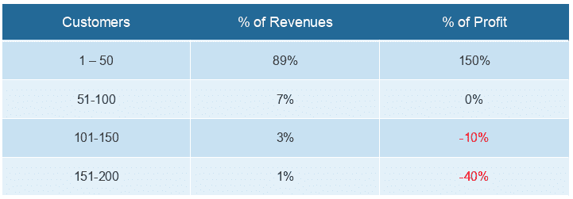
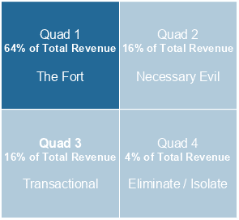
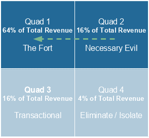
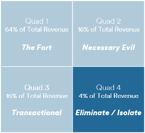
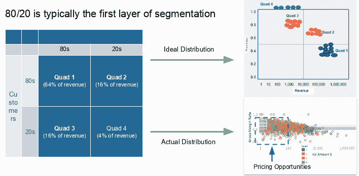
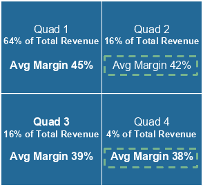

# 80/20 定价:通过关注高影响力价值驱动因素来增加利润

> 原文：<https://medium.datadriveninvestor.com/80-20-pricing-increasing-profits-by-focusing-on-high-impact-value-drivers-2cda09dddbd2?source=collection_archive---------1----------------------->

很多意味着一点点，一点点意味着很多。在商业中，有些事情至关重要，而大多数事情对成功几乎毫无意义。

帕累托原则——又名 80/20 法则或不平衡原则——认为几乎任何努力中 80%的产出都是由 20%的投入产生的。

 [## 一个企业在肚子上移动:如何照顾直觉|数据驱动的投资者

### 事实证明，直觉不仅仅是一种感觉。科学很清楚:你的直觉比你知道的更多…

www.datadriveninvestor.com](https://www.datadriveninvestor.com/2018/11/09/a-business-moves-on-its-stomach-how-to-make-allowances-for-gut-feelings/) 

维尔弗雷多·帕累托发现，1906 年，意大利 80%的土地被 20%的人口占有。

大众发现，大约 20%的汽车制造组合贡献了 80%的利润率。

微软发现 20%的软件错误导致了 80%的错误。

这些 80/20 的例子在商业中无处不在。这个原则延伸得更远。你也可以 80/20 这 20%，导致 90/10 甚至 99/1 的分裂。

**将 80/20 法则应用于商业定价**

在你的定价策略中实施 80/20 是商业中保守得最好的秘密之一。挑战在于，很少有组织想出如何有效地将帕累托原则应用于定价。

80/20 很难应用于定价有三个主要原因:

1.  企业不喜欢拒绝顾客或产品创意。因此，大多数企业沉迷于支持许多小客户和产品。这消耗了资源，导致资产和资本的非最佳利用。
2.  企业倾向于平等对待所有顾客。"市场不会容忍同一产品有多个价格点。"这导致了从大客户那里赚取利润，却反过来在小客户那里失去利润。
3.  在庞大的客户群中为大量的 SKU 进行最优定价是一件复杂的事情。大多数企业并不是为了分析和优化基于价值的定价而成立的。这使得对价格应用 80/20 成为一个相当大的挑战。

**ITW:80/20 定价成功案例研究**

伊利诺伊工具厂(ITW)是成功实施 80/20 的开创性例子。ITW 从 20 世纪 80 年代开始开发“80/20 从前到后流程”,将收入从 3 亿美元增长到 180 多亿美元。80/20 在过去 30 多年里提供了世界级的运营利润、强劲的自由现金流和高资本投资回报。

ITW 在 1980 年遇到了一个问题。他们的成本不断上升，但他们无法在更高的价格中收回资金。竞争和成本上升导致利润率持续下降。

当 ITW 开始试验 80/20 时，公司的利润正日益受到汽车行业低迷和来自高效日本制造商的竞争的挑战

那么 ITW 做了什么？他们启动了逐产品盈利能力分析。

Jim [Farrell]会说，“给我这部分业务的所有零件号。”他会把它们排好，然后说，“谁最大，谁最小，”然后他把数字输入电脑，你瞧，20%的产品给了你 80%的收入，20%的顾客给了你 80%的美元。有了一个又一个的产品数据库，它们都是一样的。"

有了这些信息，高级管理人员开始在 ITW 的所有业务部门推销 80/20 的概念。这种创新思维开始渗透，但随之而来的实际变化很少。

*“人们不想改变它，因为他们都非常关注短期激励计划。这意味着他们不会采纳我们试图教给他们的东西。所以我们改变了激励计划。”*

结果是几乎每个业务部门都发生了经济转型，释放出巨大的股东价值。80/20 让 ITW 提高了利润率，推动 19%的复合年回报率，并继续收购公司，收入超过 180 亿美元。

来源:[https://www . itw . com/WP content/uploads/2012/12/043012 _ itw 100 years _ nook tablet . pdf](https://www.itw.com/wp-content/uploads/2012/12/043012_ITW100Years_NookTablet.pdf)

**第一步:分析收入与盈利能力**

第一步是分析所有客户的收入和利润。此表显示了根据客户规模将客户分为四个象限的示例。

*来源:80/20 入门(Strategex，2018 . 7 . 10)*[*https://strategex.com/getting-started-with-8020/*](https://strategex.com/getting-started-with-8020/)

这里，前 50 名客户(象限 1)创造了 89%的收入和 150%的总利润。最底层的 50 家客户(象限 4)仅产生 1%的收入和-40%的总利润。一个重大的区别！

在这个阶段，您可能会开始听到反对意见，因为数据在讲述它的故事:

*   “我们摆脱不了那些小客户——那我们就孤注一掷了！”
*   “我们的大客户并不是一开始就很大。他们一开始是小客户，我们帮助他们成长。”

**第二步:应用象限分析推动 80/20 定价和盈利能力**

现在，您已经将客户划分为四个象限，让我们来看一看每个象限以及应该做些什么。这是 ITW 在其“剧本”(一份在整个组织中广泛使用的只有三页的文件)中使用的方法。

象限 1:堡垒

80/20 战略:为创造 80%收入的 20%的公司提供过度服务。应用大客户管理和提高销售佣金来激励这一关键细分市场的销售。这可以让您在 Quad 1 中降低价格，以获得更多的市场份额。

象限 2:必要的邪恶

80/20 战略:让客户从第二阶段转向第一阶段。用更高的佣金激励销售团队推动这一转变。您还可以用理想 SKU 组合的更优惠价格激励 Quad 2 客户升级到 Quad 1。

象限 3:交易

80/20 策略:将这些客户从直接外部销售转移到内部销售和分销商。确定最低订购量，并引入基于数量的定价，以激励大宗采购。

象限 4:消除/隔离

80/20 策略:这些低价值、高努力的客户通过“窃取”资源和利润为企业增加了负面价值。为此大幅提高这一区域的价格。因为在这个象限中订单量往往很小，所以即使价格大幅上涨也很可能被忽视。客户通常不会离开，但利润率会大幅提高。

*来源:通过四重分析发现隐藏利润(Strategex，2015 年 11 月 1 日)*[*https://Strategex . com/Finding-Hidden-Profit-Through-Quad-Analysis/*](https://strategex.com/finding-hidden-profit-through-quad-analysis/)

**第三步:按象限重新调整定价以提高 EBITDA**

第三步的目标是开发一个定价结构，让相似的客户为相似的产品支付相似的价格。通常每个象限的价格分布是混乱的。因此，从一个客户到另一个客户，利润无处不在。

当您从象限 1 向下移动到象限 2、3 和 4 时，您想要的是更高的利润。随着客户规模的下降，订单逐渐减少，因此每份订单的利润应该会更高。

下面的象限图显示了我们通常会发现的情况——象限间的边距错位。

在此阶段增加价值是通过根据客户价值(如规模、增长、组合等)对客户进行细分来实现的。).专注于每个细分市场，然后采取措施提高和调整利润率。

这个过程包括重要的分析和潜在的客户互动，以确定口袋的价值。问这些问题会有所帮助:

*   购买异常产品的顾客能承受价格上涨吗？
*   哪些产品——即使是高价产品——定价过低，应该提高价格？
*   定价能力在每个象限中处于什么位置？
*   我们如何根据定价能力给每个客户打分？

**将 80/20 法则应用于定价的结果**

当我们应用 80/20 来优化我们客户的定价时，我们通常会看到非常可观的 EBITDA 增长 3–4%。此外，所有客户的有效价格仅增加 1%，EBITDA 就会增加 10%到 25%。

使用这种方法的一个版本，ITW 在 25 年间实现了 19%的复合年股东回报率。此外，ITW 的每一笔收购都变得有利可图——令人难以置信的 100%命中率。