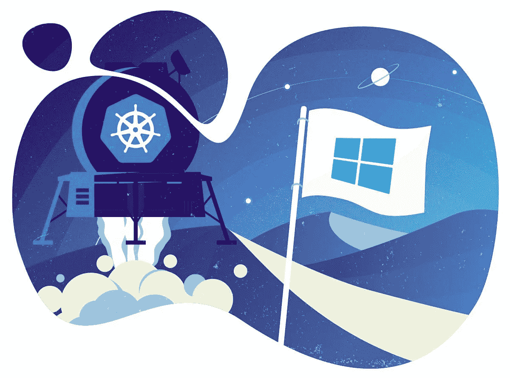

# 2020 年 Kubernetes 的 9 项最佳安全实践

> 原文：<https://medium.datadriveninvestor.com/9-best-security-practices-at-kubernetes-in-2020-dca26dc785b?source=collection_archive---------10----------------------->

2019 年 1 月，全球最受欢迎的容器编排系统 Kubernetes 发现了首个重创该项目的生态系统的重大安全漏洞。漏洞 CVE-2018–1002105 使得攻击者能够通过 Kubernetes API 服务器危害集群，从而允许执行恶意代码来安装恶意软件等。

当年早些时候，Kubernetes 控制面板的错误配置导致特斯拉资源上安装了加密货币挖掘软件。然后攻击者利用了 Kubernetes 面板之一没有密码保护的事实，这允许他们使用一个帐户访问其中一个 pod，以访问 AWS 中更大的特斯拉基础设施。

加快容器及其编排实现的组织也需要采取强制性措施来保护其基础设施的如此重要的部分。以下是 Kubernetes 基于客户数据的九个最佳安全实践。遵循这些原则可以更好地保护您的基础架构。

**1。更新至最新版本**

每个季度发布的[Kubernetes]不仅有错误修复，还有新的安全特性。为了利用它们，我们建议使用最新的稳定版本。
更新和支持可能比版本中提供的新功能更难，所以至少每个季度计划一次更新。显著简化更新可以使用托管 Kubernetes 解决方案的提供商。

**2。启用基于角色的访问控制(RBAC)**

使用 RBAC(基于角色的访问控制)来控制谁可以访问 Kubernetes API 以及他们拥有什么权限。通常，在 Kubernetes 版本 1.6 和更高版本(或某些提供商的更高版本)中，RBAC 是默认启用的，但如果您从那时起已经被更新并且没有更改配置，您应该仔细检查您的设置。

 [## 信息图:云之旅|数据驱动的投资者

### 聪明的企业领导者了解利用云的价值。随着数据存储需求的增长，他们已经…

www.datadriveninvestor.com](https://www.datadriveninvestor.com/2018/09/22/infographic-journey-to-the-clouds/) 

然而，支持 RBAC 是不够的——它仍然需要得到有效的利用。在一般情况下，应该避免对整个集群(集群范围)的权限，优先考虑某些名称空间中的权限。避免授予某人集群管理员权限，即使是调试权限——仅在必要时不时授予权限要安全得多。

如果应用程序需要访问 Kubernetes API，则创建单独的服务帐户。并给予他们每个用例所需的最小权限集。这种方法比给名称空间中的默认帐户太多特权要好得多。

**3。使用名称空间设置安全边界**

创建单独的名称空间作为组件隔离的第一级非常重要。当不同类型的工作负载部署在不同的命名空间中时，调整安全设置(例如网络策略)要容易得多。

**4。分离敏感工作负载**

限制潜在危害后果的一个良好做法是在一组专用机器上运行包含敏感数据的工作负载。这种方法降低了安全性较低的应用程序访问在同一容器可执行环境或同一主机上运行的带有敏感数据的应用程序的风险。例如，一个受损节点的 kubelet 通常只有在它们被安装在被安排在同一个节点上执行的 pod 上时才能访问机密的内容。如果可以在多个集群节点上发现重要的秘密，攻击者将有更多的机会获得它们。

可以使用节点池(在云中或内部)以及 Kubernetes 控制机制(如名称空间、污点、容忍等)来实现分离。

**5。保护对云服务元数据的访问**

敏感元数据——例如 kubelet 管理凭据，可能被窃取或恶意使用，以提升集群中的权限。例如，Shopify 的 bug bounty 中最近的一项发现详细显示了用户如何通过使用为某个微服务专门生成的数据从云提供商那里接收元数据来超越权限。

GKE 元数据隐藏功能以避免这种问题的方式改变了用于部署集群的机制。我们建议在永久解决方案实施之前使用它。

**6。创建和定义集群网络策略**

网络策略—允许您控制容器化应用程序进出网络的访问。要使用它们，您必须拥有支持此类资源的网络提供商。对于受管理的 Kubernetes 解决方案提供商，如谷歌 Kubernetes 引擎(GKE)，将需要启用支持。

一切准备就绪后，从简单的默认网络策略开始，例如，阻止(默认)来自其他名称空间的流量。

**7。为集群**设置 Pod 安全策略

Pod 安全策略设置用于在集群中启动工作负载的默认值。考虑定义一个策略并启用 Pod 安全策略准入控制器:这些步骤的说明根据所使用的云提供商或部署模型而有所不同。

一开始，您可能希望禁用容器中的 NET_RAW 功能，以保护自己免受某些类型的欺骗攻击。

**8。节点安全工作**

要提高主机安全性，您可以遵循以下步骤:

*   ***确保主机配置安全正确。***
    一种方式是顺基准；许多产品都有自动检查器，可以自动检查系统是否符合这些标准。
*   ***监控重要端口的网络可用性。***
    确保网络正在阻塞对 kubelet 使用的端口的访问，包括 10250 和 10255。考虑限制对 Kubernetes API 服务器的访问——可信网络除外。在 kubelet API 中不需要身份验证和授权的集群中，攻击者过去常常访问这样的端口来启动加密货币矿工。
*   ***尽量减少对 Kubernetes 主机的管理访问。***
    原则上应该限制对集群节点的访问:为了调试和解决其他问题，通常可以不直接访问节点。

**9。启用审计记录**

确保审计日志已启用，并且您正在监视日志中异常或不需要的 API 调用的发生，尤其是在任何授权失败的情况下—此类条目将有一条状态为“禁止”的消息。授权失败可能意味着攻击者试图利用获得的凭据。

托管解决方案提供商(包括 GKE)在其界面中提供对此数据的访问，并可帮助您在授权失败时设置通知。

**展望未来**

遵循这些指南，获得更安全的 Kubernetes 集群。请记住，即使安全地配置了集群，您也需要确保容器配置和操作的其他方面的安全性。为了提高技术堆栈的安全性，请研究一些工具，这些工具提供了一个中央系统来管理已部署的容器，持续监控和保护容器和云原生应用程序。

*原载于*【https://geniusee.com】**。**