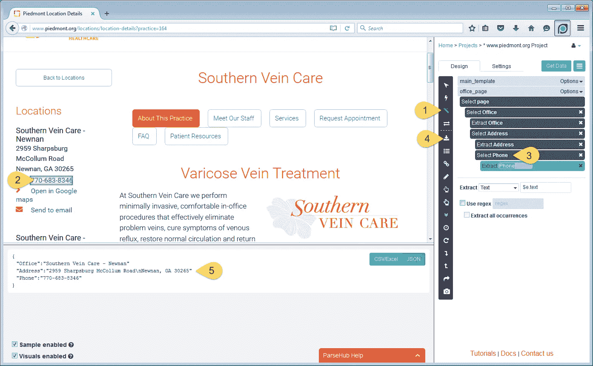
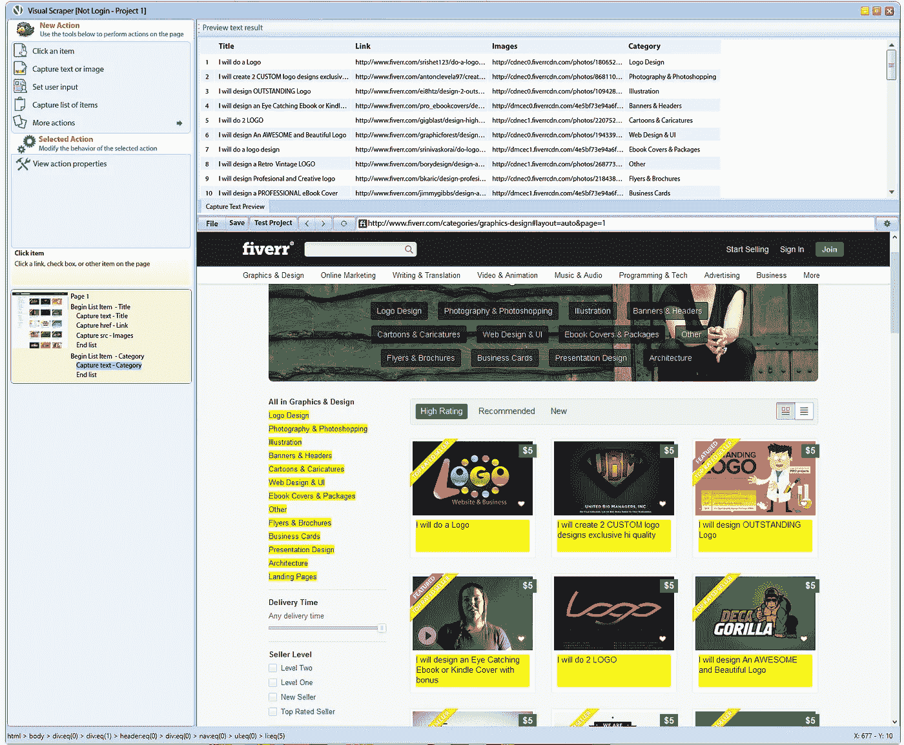
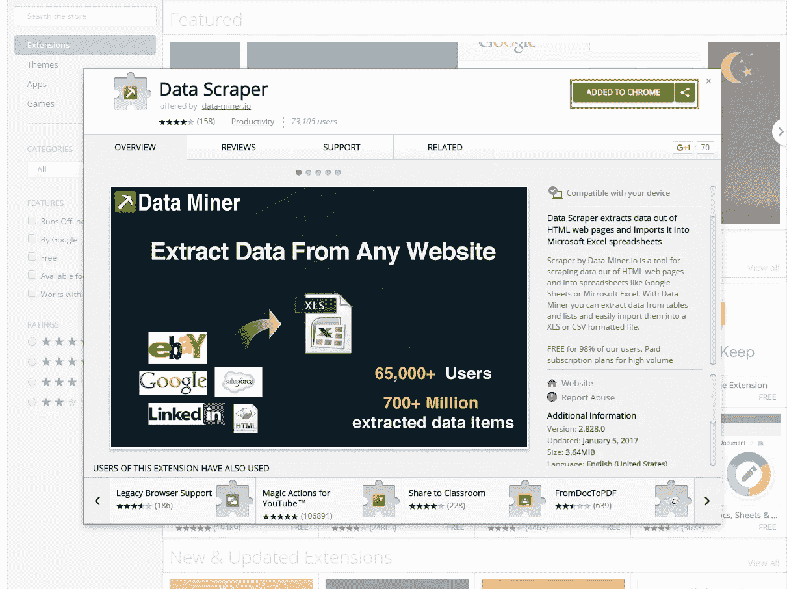
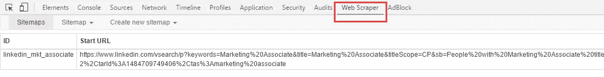
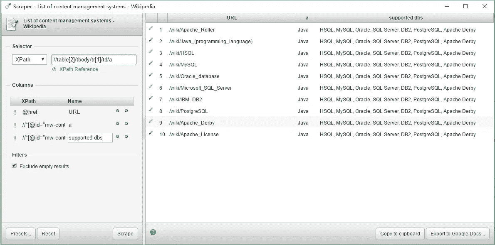
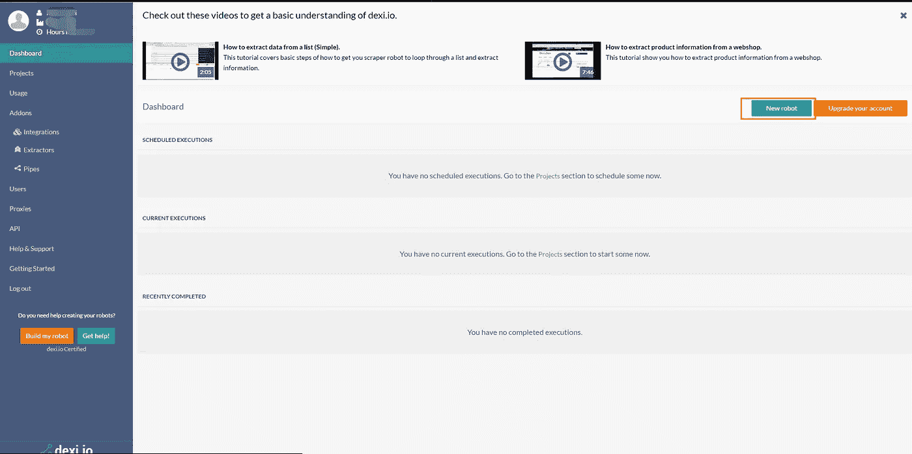
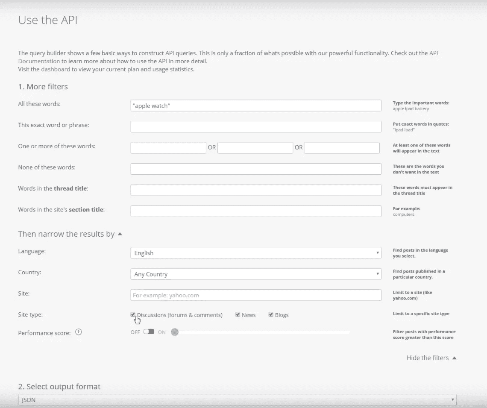

# 2019 年你不能错过的 9 款免费网页抓取工具

> 原文：<https://medium.datadriveninvestor.com/9-free-web-scrapers-that-you-cannot-miss-in-2019-63ec2078edd9?source=collection_archive---------5----------------------->

有很多免费的[网页抓取工具](https://www.octoparse.com/blog/top-30-free-web-scraping-software)。然而，并不是所有的网络抓取软件都是面向非程序员的。下面的列表是最好的网络抓取工具，不需要编码技能，成本低。下面列出的免费软件很容易拿起，并会满足合理的数据量要求的大多数刮需求。

**网络刮刀客户端**

Octoparse 是一个强大的网络抓取工具，也为企业所有者和企业提供网络抓取服务。数据提取包括但不限于社交媒体、电子商务、营销、房地产上市和许多其他领域。与其他只能抓取简单 HTML 结构内容的 web 抓取器不同，Octoparse 可以通过[、AJAX](https://helpcenter.octoparse.com/hc/en-us/articles/360018281591-Deal-with-AJAX) 、JavaScript、cookies 等处理静态和动态网站。您可以创建一个抓取任务，从复杂的网站(如需要登录和分页的网站)中提取数据。Octoparse 甚至可以通过解析源代码来处理网站上没有显示的信息。因此，您可以在 figure tips 中实现自动库存跟踪、价格监控和销售线索生成。

 [## 2019 年最值得学习的编码语言|数据驱动的投资者

### 在我读大学的那几年，我跳过了很多次夜游去学习 Java，希望有一天它能帮助我在…

www.datadriveninvestor.com](https://www.datadriveninvestor.com/2019/02/21/best-coding-languages-to-learn-in-2019/) 

Octoparse 还提供提取服务，可以帮助您定制抓取任务或为您抓取数据。云服务能够在短时间内提取大量数据，因为多个云服务器同时运行一个任务。除此之外，[云服务](https://helpcenter.octoparse.com/hc/en-us/articles/360018047092-What-is-Cloud-Extraction-)将允许你随时存储和检索数据。

Octoparse 有[任务模板模式](https://helpcenter.octoparse.com/hc/en-us/articles/360028582331-Introducing-Template-Mode-a-scraping-solution-for-muggles)、[向导模式](https://helpcenter.octoparse.com/hc/en-us/articles/360018281411-Wizard-Mode)和[高级模式](https://helpcenter.octoparse.com/hc/en-us/articles/360018281431-Advanced-Mode)供具备基础和高级抓取技能的用户使用。

*   具有基本抓取技能的用户将会采取明智的举措，使用这一全新的功能，他/她可以立即将网页转换为一些结构化数据。任务模板模式只需要大约 6.5 秒的时间来下拉一页后面的数据，并允许您将数据下载到 Excel。
*   向导模式适用于具有中级刮削技能的用户。它有一个屏幕上的互动指南，将带你通过简单的点击整个刮擦过程。
*   高级模式-与其他两种模式相比，它有更多的灵活性。这允许用户使用更多选项来配置和编辑工作流。高级模式用于抓取具有大量数据的更复杂的网站。

访问[http://www.octoparse.com/](http://www.octoparse.com/)了解更多关于如何获取数据的信息

Parsehub 是一个很棒的 web scraper，支持从使用 AJAX 技术、JavaScript、cookies 等的网站收集数据。Parsehub 利用机器学习技术，能够读取、分析 web 文档并将其转换为相关数据。

Parsehub 的桌面应用程序支持 Windows、Mac OS X 和 Linux 等系统，或者您可以使用浏览器扩展来实现即时抓取。它不是完全免费的，但你仍然可以设置五个免费的任务。付费订阅计划允许您设置至少 20 个私人项目。Parsehub 上有很多教程，你可以从主页上获得更多信息。

VisualScraper 是另一个伟大的免费网络刮刀。通过其点击式界面，没有或很少编程技能的用户能够通过设置自己的首选项来配置数据提取。其实时功能允许您立即测试和查看数据结果。

这款免费软件适用于 Windows，你可以从多达 50，000 个网页中抓取数据。你可以用它的收费计划抓取超过 100，000 个网页。详情请查看 http://www.visualscraper.com/pricing 的

Outwit hub 是 Firefox 的扩展，可以很容易地从 Firefox 附加组件商店下载。一旦安装并激活，你可以立即从网站上抓取内容。它有一个突出的“快速抓取”功能，可以从你输入的网址列表中快速抓取数据。使用 Outwit hub 从网站提取数据不需要编程技能。刮削过程相当容易掌握。你可以参考我们关于使用 Outwit hub 的指南来开始使用这个工具进行网络抓取。如果你需要从网站上即时提取少量信息，这是一个很好的替代网络抓取工具。

数据刮刀可以从单个网页的表格和列表类型数据中刮取数据。它的免费计划应该用少量数据满足最简单的抓取。付费计划有更多的功能，如 API 和许多匿名 IP 代理。您可以更快地实时获取大量数据。你每个月可以刮到 500 页，你需要升级到付费计划。

访问主页[https://data-miner.io/.](https://data-miner.io/.)了解更多关于 Data Scraper 的信息

Web scraper 有 chrome 扩展和 cloud 扩展。对于 chrome extension，你可以创建一个网站地图(计划),说明网站应该如何导航，应该丢弃哪些数据。云扩展可以抓取大量数据，并同时运行多个抓取任务。您可以将数据导出为 CSV 格式，或将数据存储到治疗床数据库中。

访问主页了解更多教程:【http://webscraper.io/. 

scraper 是另一个易于使用的 screen web scraper，可以轻松地从在线表格中提取数据，并将结果上传到 Google Docs。

只需在表格或列表中选择一些文本，右键单击所选文本，然后从浏览器菜单中选择“删除相似内容”。然后，您将通过使用 XPath 或 JQuery 添加新列来获取数据并提取其他内容。该工具面向知道如何编写 XPath 的中级到高级用户。可以在这里添加扩展[https://chrome . Google . com/web store/detail/scraper/mbigbapnjcgaffohmbkdlecaccepngjd？authuser=2](https://chrome.google.com/webstore/detail/scraper/mbigbapnjcgaffohmbkdlecaccepngjd?authuser=2)

Dexi.io 面向拥有熟练编程技能的高级用户。它有三种类型的机器人供您创建一个抓取任务——提取器、爬虫和管道。它提供了各种工具，允许您更精确地提取数据。凭借其现代化的功能，您将能够在任何网站上解决细节问题。对于没有编程技能的人来说，在创建一个网页抓取机器人之前，你可能需要花一段时间来适应它。查看他们的主页，了解更多关于知识库的信息。

免费软件提供匿名网络代理服务器进行网络抓取。提取的数据在存档之前将在 Dexi.io 的服务器上托管两周，或者您可以直接将提取的数据导出到 JSON 或 CSV 文件。它提供付费服务来满足你获取实时数据的需求。

Webhose.io 使您能够将来自世界各地的在线资源收集成各种干净的格式，从而获得实时数据。你甚至可以在黑暗的网络上搜集信息。这个 web scraper 允许您使用多种过滤器抓取多种不同语言的数据，并以 XML、JSON 和 RSS 格式导出抓取的数据。

免费软件提供了一个免费的订阅计划，让你每月进行 1000 次 HTTP 请求，并提供付费订阅计划，每月进行更多的 HTTP 请求，以满足你的网络抓取需求。

访问主页[https://webhose.io/](https://webhose.io/)了解更多关于他们的服务

*作者:阿什利·魏尔东*

*原载于 2019 年 9 月 5 日*[*https://www.octoparse.com*](https://www.octoparse.com/blog/9-free-web-scrapers-that-you-cannot-miss)*。*