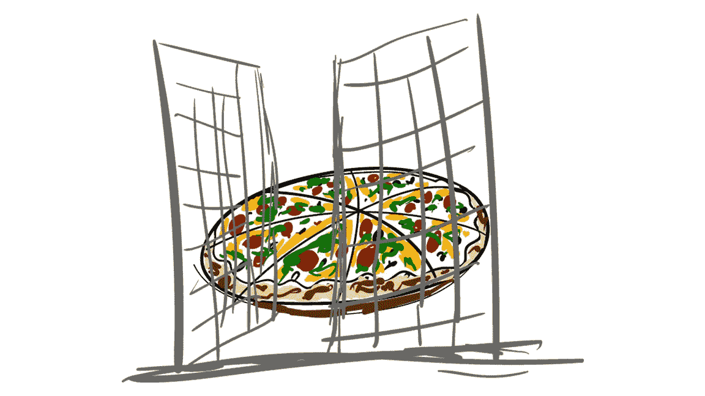
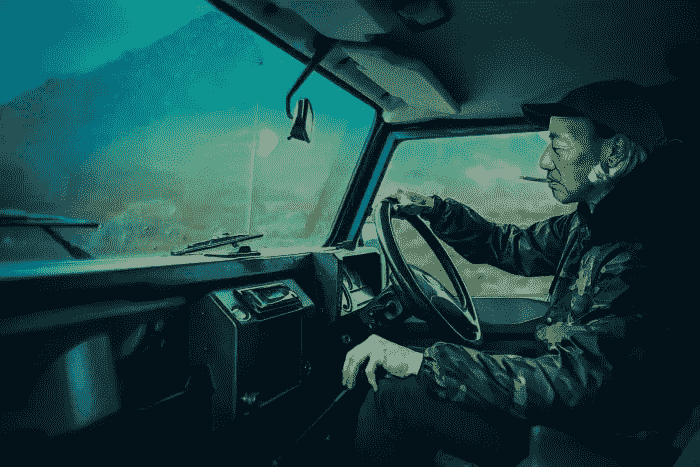

# 9 大 Reddit 社区让你重拾对互联网的信心

> 原文：<https://medium.datadriveninvestor.com/9-great-reddit-communities-to-restore-your-faith-in-the-internet-384c3302ccec?source=collection_archive---------4----------------------->

## Reddit 得到了一个坏消息，一个不公平的坏消息，如果你从未使用过它，那么你可能会有一个负面的印象。

多年来，它一直是憎恨女性的“Incels”的在线家园，2014 年名人照片黑客的分销商，以及无数回音室的主人，在这里，最离奇、超现实的阴谋论占据主导地位，并被视为事实；像群殴这样的理论，在上周的新闻报道[中讨论过](https://jamescrocket.us19.list-manage.com/track/click?u=96a22b3d26d922269da89799b&id=cb5f8a970e&e=a79c8ea15c)，还有[披萨](https://jamescrocket.us19.list-manage.com/track/click?u=96a22b3d26d922269da89799b&id=64c94a8a51&e=a79c8ea15c)，我觉得还没准备好去尝试准确的描述。

**Not that kind of pizza gate!**

但是，亲爱的读者，这个网站并不全是渴望性的年轻人和疯狂的阴谋论者。它的无政府社区也是洞察力、知识、快乐和灵感的巨大来源。我会证明的。

如果你不知道的话，Reddit 基本上是你在谷歌上搜索电脑问题解决方案时找到的那些旧论坛的一个升级版。有主持人 Reddit，有一个美学上类似于脸书的主页，然后是一堆 subreddits，或“社区”；基本上是在 Reddit 的巨大保护伞下独立存在的分论坛。如果你订阅了，新的帖子会出现在你的主页上。

上一次有人费心去数的时候，有 120 万子街道，都为自己的社区服务，都受自己特定的规则和笑话的约束，每个都致力于某件事；从直截了当的有益的，到有趣的，到极度令人不安的。

今天，我将讨论一些我最喜欢的——很快也会是你们最喜欢的——子主题。

[**r/ask histories**](http://WWW.REDDIT.COM/r/AskHistorians)为了证明某个地方有聪明的人，r/ask histories 是一个向专家询问一些事情的地方，比如 17 世纪引入智利之前印度美食的味道，以及 476 年西帝国衰落后罗马贵族发生了什么。社区鼓励回答以证据为基础，并有来源支持。还有一系列其他 ask 类型的社区，像 [r/IWantToLearn](https://jamescrocket.us19.list-manage.com/track/click?u=96a22b3d26d922269da89799b&id=db0eefbd3a&e=a79c8ea15c) 、 [r/AskPhotography](https://jamescrocket.us19.list-manage.com/track/click?u=96a22b3d26d922269da89799b&id=d5f9269a54&e=a79c8ea15c) 、 [r/](https://jamescrocket.us19.list-manage.com/track/click?u=96a22b3d26d922269da89799b&id=b5c2a36472&e=a79c8ea15c) [askscience](https://jamescrocket.us19.list-manage.com/track/click?u=96a22b3d26d922269da89799b&id=2d3cc3093d&e=a79c8ea15c) 、 [r/AskWomen](https://jamescrocket.us19.list-manage.com/track/click?u=96a22b3d26d922269da89799b&id=84abb170a6&e=a79c8ea15c) 和 [r/AskReddit](https://jamescrocket.us19.list-manage.com/track/click?u=96a22b3d26d922269da89799b&id=aadfc03908&e=a79c8ea15c) 都以类似的方式工作。

一个多年前的合作故事，讲述了一个名叫诺曼的虚构男人的日常生活，由卡梅隆·克莱恩在他坐在马桶上时开始。任何人都可以通过在 subreddit 上发帖来为这个故事做出贡献。诺曼倾向于过平静的生活——淋雨、为某人开门、写电子邮件……但其中有一种，嗯，我不知道，美。投稿人知道他们所写的人物，并想办法在不扰乱诺曼生活中本质上的无聊和沉默的情况下增加小插曲的深度。在克雷恩自己写的一篇新年文章中，诺曼注意到自己变胖了，发际线也在后退，但他提醒自己，至少他的猫健康状况良好，银行里还有钱。去年，克雷恩发行了一本取自 subreddit 的诺曼故事集，收益将捐给猫收容所。

***Gun Smuggler, by SecondCropCreative on r/PhotoshopBattles.*** [***Their Instagram here.***](https://jamescrocket.us19.list-manage.com/track/click?u=96a22b3d26d922269da89799b&id=fede77eda3&e=a79c8ea15c)

[**r/Photoshop battles**](http://www.reddit.com/r/PhotoshopBattles)另一个有创意的 subreddit，用户发布有趣的照片，并挑战那些擅长使用 Photoshop 的人用它们做出一些东西。例如，[这张新加坡副总理玩看守的照片](https://jamescrocket.us19.list-manage.com/track/click?u=96a22b3d26d922269da89799b&id=da6399a59e&e=a79c8ea15c)被变成了副总理穿过被雨水浸泡的风景走私枪支。

[**r/sixth world problems**](http://www.reddit.com/r/sixthworldproblems)在一个脱离正常现实而存在的世界里，人们会如何说话？像这样。看看[r/](https://jamescrocket.us19.list-manage.com/track/click?u=96a22b3d26d922269da89799b&id=ece0227c83&e=a79c8ea15c)[fifth world pics](https://jamescrocket.us19.list-manage.com/track/click?u=96a22b3d26d922269da89799b&id=0a3975b5a8&e=a79c8ea15c)的绝佳视觉效果。

Reddit 上最有趣的社区是基于一个非常简单的想法:拍摄好撒玛利亚人营救遇险动物的视频，并将它们反转，这样看起来就像他们在排水管里放鸟，在河里放狗，在树上放猫。然后标题就改成了“邪恶的人让狗淹死在洪水中”之类的东西。非常有趣，而且毫无罪恶感。

Reddit 上最奇怪的社区之一致力于讨论一名韩国女子，她认为自己的脚上有一个电子芯片，一个叫 P 的警察用它来控制她的思想。由于害怕 P 会进入她的家，她一天 24 小时在网上直播自己的生活——大概这样她就可以在他进入时证明这一点——并且大部分时间睡在椅子上，周围都是关于精神控制的潦草信息。尽管有一个有点种族歧视的绰号(“Chan”是中国人而不是韩国人，除此之外)，关注她的 redditors 的帖子主要涉及对她的健康状况的关注和对她如何走到今天这一步的猜测。这种情况已经持续了 10 多年。尽管如此，似乎没有人掌握具体的事实。她的生活仍然是个谜。

[**r/Books**](http://www.reddit.com/r/books)需要描述吗？关于书籍的有趣而热烈的讨论，从关于《堂吉诃德》最佳英译本的争论(约翰·菲利普斯的显然是“字面上的一坨屎”)到对斯蒂芬·金的《证人席上》的分析。

[**r/fearme**](http://www.reddit.com/r/fearme)惨不忍睹。

r/Homestead# 1 对于那些知道既照顾动物又屠杀动物的感受的人来说，这是对农业生活的温暖而又冷漠的描述，r/Homestead 是从威斯康星州到威尔特郡的农民和户外人士的帖子之家。如何建造鸡舍的教程，与 Tamworth 猪玩捉人游戏的视频，征求耕作方面的建议，关于前一天晚上家庭饲养的烤鸡或炖野驼鹿的幸灾乐祸的报告，拖拉机、农场猫、农场狗、怀孕的兔子、山羊站在它们不应该站的地方的照片，以及偶尔宁静、多雾的早晨。这个 subreddit 庆祝一种既美丽又艰难的生活方式。

## 还好，虽然这次不值得写:

[纪录片](https://jamescrocket.us19.list-manage.com/track/click?u=96a22b3d26d922269da89799b&id=51040e2c6e&e=a79c8ea15c)

[r/art](https://jamescrocket.us19.list-manage.com/track/click?u=96a22b3d26d922269da89799b&id=d13387321c&e=a79c8ea15c)

[r/DataIsBeautiful](https://jamescrocket.us19.list-manage.com/track/click?u=96a22b3d26d922269da89799b&id=962aa30335&e=a79c8ea15c)

[r/truefilm](https://jamescrocket.us19.list-manage.com/track/click?u=96a22b3d26d922269da89799b&id=0635d2ea61&e=a79c8ea15c)

我的计划(非常好，如果你想要一些小故事的想法)

[r/vexillology](https://jamescrocket.us19.list-manage.com/track/click?u=96a22b3d26d922269da89799b&id=5f238258cc&e=a79c8ea15c) (旗帜)

[r/](https://jamescrocket.us19.list-manage.com/track/click?u=96a22b3d26d922269da89799b&id=9d8cff0150&e=a79c8ea15c)显示想法

[*【怪异的西班牙】*](https://weirdspain.substack.com/) *是一份时事通讯，面向那些想要更深入了解他们的第二故乡及其人民的移民，以及世界各地想要更多了解这个神奇国家正在发生什么以及为什么会发生的西班牙爱好者。* [*在这里订阅，在你的收件箱里收到这些文章。*](https://weirdspain.substack.com/subscribe)