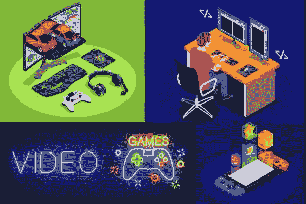
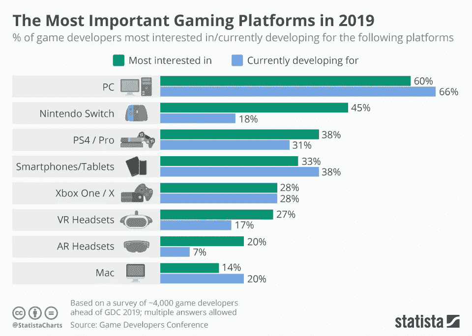

# 2021 年开发竞技手机游戏的 9 个关键要素

> 原文：<https://medium.datadriveninvestor.com/9-key-elements-for-developing-competitive-mobile-games-e2df2047d345?source=collection_archive---------2----------------------->

> 最重要的是，电子游戏只意味着一件事:好玩。每个人的乐趣。”——已故任天堂游戏前总裁岩田聪。

在 PUBG 和堡垒之夜的世界里，开发一款新的手机游戏就像屏住呼吸攀登珠穆朗玛峰。

移动游戏从未像今天这样竞争激烈。从整合虚拟智能到在一个在线游戏中处理数百名玩家，移动应用程序开发正在蓬勃发展。

为了保持竞争力，你必须跳出框框思考，因为用户有很多其他的选择。

在获得一个用户之前，不要让你的游戏迷失在选择的海洋中。相反，创造一些在其他领先的 iOS 和 Android 游戏应用中引人注目的东西。

因此，如果你正着手[开发你的新手机游戏](https://www.techawkers.com)，看看这些关键的灵感元素吧。

# 1.对你正在设计的东西有一个清晰的理解

确保你对你正在设计的东西有更好的理解。在设计任何东西之前做适当的研究。

关注创造终极手机游戏应用的主要决定因素。

看看你的竞争对手在策划一个完美的手机游戏开发中使用了什么，然后提供一些不同的服务。

# 2.了解你的用户

你的任务应该是在世界范围内获得尽可能多的观众。

了解你设计游戏的目标受众会对你的移动应用的成功产生巨大的影响。

你必须了解将使用你的应用的用户，以及它将如何帮助他们。

如果你符合用户的期望，你的智能手机游戏很可能会更受欢迎。

# 3.像游戏玩家一样思考

Image source: [https://www.psychologytoday.com/intl/articles/201508/it-s-time-think-gamer](https://www.psychologytoday.com/intl/articles/201508/it-s-time-think-gamer)

无论你是多么熟练的游戏开发者，如果你想取悦你的观众，你应该在内心是一个游戏玩家。

如果你在开发时像游戏玩家一样思考，你就能开发出一款非凡的手机游戏。

什么样的角色能让玩家开心，什么样的尺寸，效率，视觉图形有多吸引人等等。

作为一名游戏爱好者，每当我打开我的应用商店下载新游戏时，我都会先看看游戏的大小，然后通过下载应用程序来阅读我的手机是否会挂起的评论。

所以如果你想赢得人心，你必须从玩家的角度考虑。

# 4.选择强大的游戏平台

如果你想生意兴隆，你需要根据顾客的喜好来工作。

客户越满意，你获得的收入就越多。所以在开发手机游戏的时候，要谨慎选择操作系统。

你的游戏开发计划的中心应该是你的用户将要使用的平台。

无论是 Android，iOS，还是 Windows Phone，你都要明智的选择。

今天大部分人用的都是 Android 或者 iOS，所以你的目标平台应该在这两者之间。

你可以从 iOS 开始，如果它流行起来，你也可以使用 Android。

# 5.做一个壮观的设计

让我们回忆一下“第一印象是最后印象”这个术语，然后创建你的手机游戏。

吸引人的视觉效果总能给人留下持久的印象。创建一个游戏设计要考虑到所有的因素，比如角色、故事和最终的外观。

也许你游戏的新角色将会是下一个游戏明星，像“马里奥”、“萝拉·卡芙特”、“皮卡丘”、“肯”或“索尼克”。谁知道呢？

提示:无论你选择平面设计还是 3D 布局的漫画风格，保持设计元素的最短加载时间，以获得良好的用户体验。

# 6.快速创建，经常升级

如果你想在游戏行业取得成功，考虑两个关键点；全功能和快速启动。

随着时间的推移，你可以通过升级和添加来吸引用户，但是你必须要快。

不要冒险让你的用户等待。否则，你可能会让他们不高兴。

# 7.发射前测试

Image Source: [https://instabug.com/blog/technical-vs-marketing-beta-test/](https://instabug.com/blog/technical-vs-marketing-beta-test/)

在将游戏投放市场之前，不要忘记测试你的游戏。再次，在上市前测试应用程序时，要像游戏玩家一样思考。

用户如何看待它是非常重要的。你的游戏应该是娱乐性的，创造性的，引人入胜的，高性能的，并且容易玩的。

发布前的测试将帮助你在它到达观众面前消除任何裂缝。

在 alpha 测试之后，招募 beta 测试人员开始 beta 测试。

从测试人员那里获得反馈，尽可能多地学习，并根据观察结果即兴创作。

你可以借助市面上的 app 测试工具来组织 beta 测试。

# 8.构思一个吸引人的描述

每当我从我的 iTunes 应用商店下载游戏时，我总是会阅读它的描述。如果它引起了我的注意，我就会下载它。

同样，当你推出一款新游戏时，用户会先查看描述。

因为他们不知道你的游戏。使用 2 到 3 行的文字诱饵来吸引他们的注意力。

# 9.关注你的营销策略

为了获得压倒性的反响，在新游戏发布前制造轰动效应是非常重要的。

在适当的时候开始营销你的手机游戏，以有效地执行营销计划。

确保你在营销活动中接触到正确的受众。

# 最终注释

我知道在这个竞争激烈的时代创作一款手游不是一件容易的事情，但也不是遥不可及。

如果你记住这些关键因素，你的成功几率会增加，你的游戏会成为下一个最受欢迎的游戏。